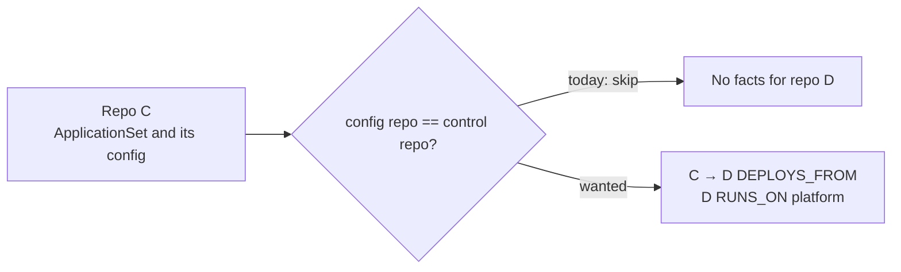

# Issue

Three readers use an issue: the owner skims it, an executor agent acts on it,
and a reviewer reads it a year later with no context. Write for all three.

## Order

1. **Lead.** One bold sentence: what is wrong, and for whom or what.
2. **Blocker or decision.** If the work cannot start until someone decides,
   say so here, with your recommendation.
3. `## Problem`. What happens, where, and how we know. Give counts with their
   source. Add a Mermaid diagram when the Pictures rule in `SKILL.md` applies.
4. `## Theory (not yet proven)`. Use it only when the cause is a guess. Say what
   would prove or disprove it. See the prove-the-theory-first rule in `AGENTS.md`.
5. `## Expected`. The behavior after the fix.
6. `## Acceptance criteria`. A task list. Each item is one imperative sentence
   that a test, command, or query can check.
7. `## Decisions for the arbiter`. Numbered questions. Name the options.
   Leave this out when there are none.
8. `<details>` named `Evidence and code pointers`. File paths, logs, queries,
   and the repro go here, verbatim.
9. A last line `Refs #N.` when the issue relates to another.

## Rules

- Do not put the mechanism in the lead. "Eshu finds no deployment evidence when
  an ApplicationSet reads its config from its own repository" beats a sentence
  that opens with two function names.
- Keep at most 3 identifiers in one sentence. Move the rest to the
  `<details>` block.
- Write acceptance criteria as checks, not goals. "Flip the G == C row" is a
  check. "Improve coverage" is a goal.
- Do not paste a log of more than 10 lines into `Problem`. Quote the one
  failing line and collapse the rest.
- Keep the `competitive-audit` issue form headings exactly as the form defines
  them. `audit-preflight` parses them.

## Example

Issue #7778 was one paragraph of 1,485 characters with no headings. This is the
same content in the new shape. The identifiers come from #7778 as filed. They
were not on `main` at the time of writing.

````markdown
**Eshu finds no deployment evidence when an ApplicationSet reads its config
from its own repository.**

## Problem

Repository C holds the ApplicationSet. Its git generator reads config files
from C too. Two functions skip the whole generator in that case:

- `discoverArgoCDDocumentEvidence`, guard `configRepo.RepoID == controlRepoID`
- `discoverStructuredArgoCDEvidence`, guard `configRepo.RepoID == sourceRepoID`

For every repository the template deploys, Eshu emits no `DISCOVERS_CONFIG_IN`,
deploy-source, template-source, or destination-platform fact. The counter
`eshu_dp_argocd_applicationset_template_source_total` does not count the skip
either, so an operator cannot see it.



## Expected

For a template source D that is a catalog repository other than C, emit:

- a `DEPLOYS_FROM` edge from the control repo to D
- the `RUNS_ON` edge for D, when the destination is a literal
- no self-loop
- a metric outcome, so the drop is visible until the fix lands

The D == G case already emits this shape under #7767.

## Acceptance criteria

- [ ] Flip the G == C row (`knownSilentSkip`) in `TestApplicationSetRelationInvariants`.
- [ ] Invariant 2 passes on all 16 rows.
- [ ] The corpus re-run reports exact before and after counts.
- [ ] No fact has `SourceRepoID == TargetRepoID`.

## Decisions for the arbiter

1. Reuse `ARGOCD_APPLICATIONSET_TEMPLATE_SOURCE`, or add a new kind?
2. Drop `DISCOVERS_CONFIG_IN` C → C as a self-loop, or record it another way?
3. What is the effect on the golden snapshot and the corpus counts?

<details>
<summary>Evidence and code pointers</summary>

- `go/internal/relationships/yaml_iac_evidence.go`
- `go/internal/relationships/structured_family_evidence.go`
- Repro and current pin: the G == C row (`knownSilentSkip`) of
  `TestApplicationSetRelationInvariants` in
  `go/internal/relationships/appset_relation_invariant_test.go`

</details>

Refs #7767.
````
