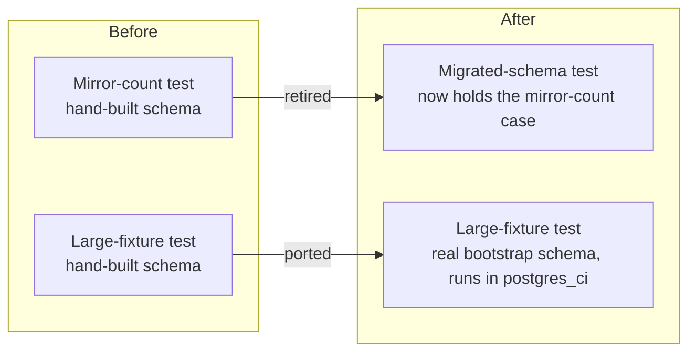

# Pull request

The title and body must describe the final diff. When review changes the work,
rewrite both. A body that describes your first attempt sends reviewers to code
that is not there.

## Title

Say what changed, in the repo's `type(scope): summary` form. Do not use a ticket
number alone. `stop stamping drift findings exact when the address came from a
guess` beats `fix #5572`.

## Order

1. `Fixes #N.` or `Refs #N.` as the first line. Use a closing keyword only when
   the issue must close on merge. `scripts/dev/pre-enqueue-check.sh` fails a
   body that has no `#N` reference.
2. **Lead.** One or two bold sentences: what was broken, what this PR does, and
   why it matters. A reader who stops here still knows the change.
3. A decision or blocker for the reviewer, when there is one.
4. `## Problem`. How it broke, not only that it broke. A table suits "test and
   failure". Say `sed exited 0 having replaced nothing`, not `the fixture did
   not land`.
5. A Mermaid diagram when the Pictures rule in `SKILL.md` applies. Use a file
   tree or `diff` block for a layout change.
6. `## What changed`. One bullet per change: the verb, the object, and the why.
   Name a rejected alternative only when it explains a tradeoff that is still in
   the diff.
7. `## Proof`. A table of check, before, after. Give the command, the exit code,
   and the number with its source. Put full gate output in `<details>`. For a
   runtime change, add the performance impact and the telemetry an operator
   can use, or write `none` and the reason. Name the docs you updated for a
   changed contract.
8. `## Review`. One line per finding: severity, what changed, the SHA. Put
   quoted reviewer or arbiter text in `<details>`.
9. `**NOT_CHECKED:**` One line. Name what you did not run, and why.

## Rules

- State what the evidence proves and its limits together. Label a theory as a
  theory.
- Compare performance only for the same events, corpus, profile, and topology.
  Give exact seconds with a human duration.
- Do not paste review verdicts into the main text. In the PRs that scored worst
  for readability, the long unbroken blocks were verbatim arbiter rulings and
  deferred findings. Collapse them.
- Keep at most 3 identifiers in one sentence.
- Omit a section that has nothing to say. A one-line docs PR needs a lead and
  a proof line, not nine headings.
- After you capture the `ci-gates review-attest` claims file, do not edit the
  title or body.

## Example

PR #7756 had a 2,212-character body with a mechanism-first opening. This is the
same content in the new shape. In your own PR, replace the issue number. Use
`Refs` unless the PR must close the issue.

````markdown
Fixes #7695.

**Two Postgres retention tests ran on a hand-built schema outside every CI
lane, and both rotted. This PR runs them on the real bootstrap schema. It
also deletes the one test that the other now covers.**

## Problem

| Test | Failure on clean `main` |
|---|---|
| Mirror-count proof | `column fact.scope_id does not exist` |
| Large-fixture proof | `key index unavailable` (key indexes required since #6809) |

The #6680 ruling says each proof must use the real bootstrap definitions, or
be retired with a reason. This PR adds no hand-written columns. It deletes
the shared hand-built schema and seed constants.



## What changed

- **Retired** `TestGenerationRetentionInfraMirrorCountLive`. Its one unique
  case moved into `TestGenerationRetentionPrunesMigratedSchemaLive` as
  entity-3. That case is a mirror row whose entity a retained generation still
  holds. The prune neither counts it nor deletes it. A note in the file names
  the new home.
- **Review follow-up:** the same test now has entity-2 (a gen-old content fact
  and a `content_entities` row, no infra row). This keeps the retired test's
  check for a row with no mirror.
- **Ported** `TestGenerationRetentionStoreLargeFixtureIntegration` to the
  migrated-schema opener and renamed it `...Live`. It now runs in the
  `postgres_ci` lane of the live-postgres-readiness runner. I did not use
  `scheduled`. It is a pinned legacy exemption (#7533) that new rows must
  not join.

## Proof

| Check | Before (clean `main`, local postgres:18) | After |
|---|---|---|
| Mirror-count proof | fails: `column fact.scope_id does not exist` | retired, case folded in |
| Large-fixture proof | fails: `key index unavailable` | passes: 100 generations, 50,000 facts pruned, active and gen-25 window intact, 3.4 s |
| Entity-2 check | want-bump RED (fact 2 vs 3, content 1 vs 2) | seed GREEN (content 2, infra 1, entity-2 pruned) |

<details>
<summary>Gate output</summary>

- `scripts/verify-live-tests-ledger.sh`: ok (650 rows, 650 files)
- Readiness `verify-ledger`: 45 files, 96 tests
- `test-run-live-postgres-readiness-tests.sh`: PASS
- `make pre-push`: all local gates pass
- Review: author self-review (test-only diff). P0=0, P1=0, P2-blocking=0.

</details>

**NOT_CHECKED:** hosted CI lanes. They run on this PR.
````
