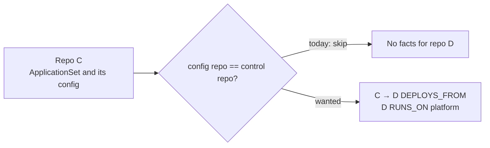

**Eshu finds no deployment evidence when an ApplicationSet reads its config
from its own repository.**

## Problem

Repository C holds the ApplicationSet. Its git generator reads config files
from C too. Two functions skip the whole generator in that case:

- `discoverArgoCDDocumentEvidence`, guard `configRepo.RepoID == controlRepoID`
- `discoverStructuredArgoCDEvidence`, guard `configRepo.RepoID == sourceRepoID`

For every repository the template deploys, Eshu emits no `DISCOVERS_CONFIG_IN`,
deploy-source, template-source, or destination-platform fact. The counter
`eshu_dp_argocd_applicationset_template_source_total` does not count the skip
either, so an operator cannot see it.

## Expected

For a template source D that is a catalog repository other than C, emit:

- a `DEPLOYS_FROM` edge from the control repo to D
- the `RUNS_ON` edge for D, when the destination is a literal
- no self-loop
- a metric outcome, so the drop is visible until the fix lands

The D == G case already emits this shape under #7767.

## Acceptance criteria

- [ ] Flip the G == C row (`knownSilentSkip`) in `TestApplicationSetRelationInvariants`.
- [ ] Invariant 2 passes on all 16 rows.
- [ ] The corpus re-run reports exact before and after counts.
- [ ] No fact has `SourceRepoID == TargetRepoID`.

## Decisions for the arbiter

1. Reuse `ARGOCD_APPLICATIONSET_TEMPLATE_SOURCE`, or add a new kind?
2. Drop `DISCOVERS_CONFIG_IN` C → C as a self-loop, or record it another way?
3. What is the effect on the golden snapshot and the corpus counts?

Evidence and code pointers

- `go/internal/relationships/yaml_iac_evidence.go`
- `go/internal/relationships/structured_family_evidence.go`
- Repro and current pin: the G == C row (`knownSilentSkip`) of
  `TestApplicationSetRelationInvariants` in
  `go/internal/relationships/appset_relation_invariant_test.go`

Refs #7767.
