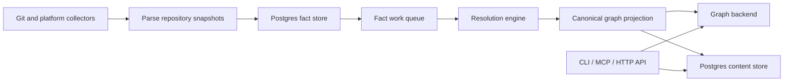

# Eshu

**A self-hosted code-to-cloud context graph for engineering teams and AI
assistants.**

<p align="center">
  <a href="LICENSE">
    
  </a>
  <a href="https://github.com/eshu-hq/eshu/actions/workflows/test.yml">
    
  </a>
  <a href="docs/">
    
  </a>
  
  
  
  
</p>

Eshu indexes source code, infrastructure, deployment config, runtime topology,
and documentation into one queryable graph. Use it when a question crosses
repository boundaries and normal code search stops being enough.

Ask things like:

- "Who calls this function across all indexed repos?"
- "What deploys this service to production?"
- "Which workloads share this database or queue?"
- "What breaks if I change this Terraform module?"
- "Show the evidence behind this service-to-infrastructure link."

## Pick Your First Path

| I want to... | Start here |
| --- | --- |
| Try the full API and MCP service stack on my laptop | [Docker Compose](docs/public/run-locally/docker-compose.md) |
| Develop Eshu or run one local workspace service | [Local binaries](docs/public/run-locally/local-binaries.md) |
| Connect Codex, Claude, Cursor, or VS Code | [Connect MCP](docs/public/mcp/index.md) |
| Deploy Eshu as a shared team service | [Kubernetes deployment](docs/public/deploy/kubernetes/index.md) |
| Understand the architecture | [How Eshu works](docs/public/concepts/how-it-works.md) |
| Contribute | [Contributing](CONTRIBUTING.md) |

## Quick Start

For the full local stack, use Docker Compose:

```bash
git clone https://github.com/eshu-hq/eshu.git
cd eshu

docker compose up --build
```

Compose starts Postgres, NornicDB, the HTTP API, MCP server, ingester,
resolution engine, and bootstrap indexer. The API listens on
`http://localhost:8080`, and the MCP service listens on `http://localhost:8081`.

For the local developer service, install the Eshu runtime binaries from a
checkout:

```bash
./scripts/install-local-binaries.sh
export PATH="$(go env GOPATH)/bin:$PATH"

eshu graph start --workspace-root "$PWD"
```

The installer does not install a separate NornicDB binary. The default local
graph backend is embedded into the `eshu` binary. The script builds the other
Eshu runtime binaries that the local service supervises, such as
`eshu-ingester`, `eshu-reducer`, and `eshu-mcp-server`.

## What Eshu Gives You

- **Company-wide AI context:** one MCP endpoint backed by shared indexed truth.
- **Code-to-cloud tracing:** follow code, services, workloads, deployments, and
  cloud resources across repositories.
- **Blast-radius analysis:** see likely callers, dependencies, and shared
  infrastructure before a change lands.
- **Operator visibility:** queues, status, metrics, traces, logs, and health
  checks for production use.
- **Backend choice:** NornicDB by default, Neo4j when your team already
  operates it.

## How It Works



The same indexed model is available through:

- CLI commands for local and operator workflows
- MCP for AI assistants and IDEs
- HTTP API routes for automation and internal platforms
- Kubernetes runtimes for continuous team-wide indexing

## Documentation

If you only read three pages first, read these:

1. [Start Here](docs/public/start-here.md)
2. [Run Locally](docs/public/run-locally/index.md)
3. [Connect MCP](docs/public/mcp/index.md)

The full documentation is organized by job:

- [Use Eshu](docs/public/use/index.md): index repositories and ask code or
  infrastructure questions.
- [Operate Eshu](docs/public/operate/index.md): health checks, telemetry, and
  troubleshooting.
- [Understand Eshu](docs/public/understand/index.md): architecture, graph model,
  and runtime modes.
- [Extend Eshu](docs/public/extend/index.md): collectors, components, language
  support, and plugin contracts.
- [Reference](docs/public/reference/cli-reference.md): CLI, API, MCP,
  configuration, telemetry, and backend details.

## Maturity At A Glance

| Area | Status |
| --- | --- |
| Local Docker Compose stack | Supported |
| Local Eshu service from checkout | Supported for development and workspace-local use |
| MCP server | Supported |
| Kubernetes deployment | Supported through Helm |
| NornicDB graph backend | Default supported backend |
| Neo4j graph backend | Supported compatibility backend |
| Optional collectors | Varies by collector; see [Collector And Reducer Readiness](docs/public/reference/collector-reducer-readiness.md) |

## Project

- [Contributing](CONTRIBUTING.md)
- [Security policy](SECURITY.md)
- [Testing guide](TESTING.md)
- [Developer guide](DEVELOPING.md)
- [License](LICENSE)

Eshu is self-hosted and does not require outbound vendor telemetry. When
observability is enabled, it uses your configured OTLP and Prometheus targets.
