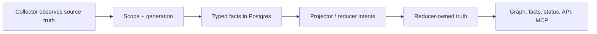

# Collector And Reducer Readiness

Last updated: 2026-05-15.

Use this page when deciding whether the next Eshu slice should add a collector,
add a reducer, update Helm, or run deployment proof. The platform rule is
facts first:

Collectors stop at source observation and typed facts. Reducers decide
cross-source truth. API and MCP surfaces read the reducer-owned result.

## Current Answer

The next blocker is not another design-only collector. The current blocker is
proving the implemented collector lane in deployment and closing reducer/read
model gaps for facts already emitted.

Helm already renders optional workloads for these implemented collectors:

- Confluence collector
- OCI registry collector
- Terraform-state collector
- AWS cloud collector
- package-registry collector
- webhook listener with AWS freshness intake

Do not add Helm values for design-only collectors until a binary exists. Empty
chart knobs create an operator promise the runtime cannot keep.

The public chart still keeps workflow-coordinator claim ownership dark:
`deploy/helm/eshu/templates/validate.yaml` rejects
`workflowCoordinator.claimsEnabled=true`. That is correct until the active
claim path has deployment evidence. Claim-driven collectors can be rendered, but
a full EKS collector proof needs a follow-up deployment slice that proves
coordinator-owned claims, collector work creation, reducer drain, and status
visibility together before relaxing that guard.

## Implemented Runtime Inventory

| Source family | Runtime state | Helm state | Reducer/read state | Remaining deployment or truth gap |
| --- | --- | --- | --- | --- |
| Git/repository | Implemented through ingester and collector-git paths. | Ingester `StatefulSet` is charted. | Workload, deployment, code-call, semantic entity, SQL relationship, inheritance, and package-source follow-up domains exist. | EKS proof must show repo sync, fact commit, queue drain, graph projection, and query completeness on the target cluster. |
| Terraform state | `go/cmd/collector-terraform-state` and `go/internal/collector/terraformstate` exist. | Optional `terraformStateCollector` deployment exists and requires collector instances plus redaction config. | `DomainConfigStateDrift` emits bounded counter/log truth; management-status read models remain in planner issues. | Live S3/local state proof in the target environment, plus #124, #130, and #131 for useful management status. |
| AWS cloud | `go/cmd/collector-aws-cloud` and service scanners exist for the current AWS slice. | Optional `awsCloudCollector` deployment and isolated service account/IRSA values exist. | `DomainCloudAssetResolution` and `DomainAWSCloudRuntimeDrift` exist; AWS runtime drift writes durable facts and exposes bounded API/MCP read-model rows. AWS workflow readiness is fact-backed until the cloud-resource graph projection and anchor publisher are implemented. | Live read-only AWS proof, #37 operator closeout, graph projection shape for drift findings, and active coordinator claim proof. |
| AWS freshness | Implemented through `go/cmd/webhook-listener` and `go/internal/collector/awscloud/freshness`. | Webhook listener and `awsFreshness` ingress path are charted. | Freshness creates targeted AWS collector work; scheduled scans remain authoritative. | #37 remains open for live AWS EventBridge/AWS Config sample, dashboard visibility, and security sign-off. |
| OCI registry | `go/cmd/collector-oci-registry` exists. | Optional `ociRegistryCollector` deployment exists. | No first-class container-image identity reducer is complete. | Add digest identity/read model joining Git image refs, AWS runtime refs, OCI manifests, and later SBOM/attestation. |
| Package registry | `go/cmd/collector-package-registry` exists. | Optional `packageRegistryCollector` deployment exists. | `DomainPackageSourceCorrelation` classifies source hints with counters only; it does not promote package ownership. Package-native dependency facts now project to bounded package dependency graph reads. | Expand package ownership/usage correlation after EKS collector proof and image identity. |
| Vulnerability intelligence | `go/cmd/collector-vulnerability-intelligence` and source clients exist for CISA KEV, FIRST EPSS, OSV, and NVD. | Remote E2E Compose runs the hosted collector; Helm enablement remains gated behind remote proof and EKS rollout discipline. | Source-truth `vulnerability.*` facts exist. Impact reducers remain separate and must not infer reachability from CVSS, EPSS, or KEV alone. | Remote Compose proof for live source collection, API/MCP fact visibility, then package/image/deployment impact joins after the upstream collectors are proven together. |
| Confluence documentation | `go/cmd/collector-confluence` exists. | Optional `confluenceCollector` deployment exists. | Documentation facts remain evidence, not operational truth. | Useful for documentation drift later; not required for the AWS/IaC EKS proof path. |

## Design-Only Or Incomplete Collector Families

These collectors should not receive Helm workloads until their fact contracts,
fixtures, reducer contracts, telemetry, and binary wiring exist.

| Source family | Current state | Needed before runtime |
| --- | --- | --- |
| Kubernetes live | ADR exists; no runtime package or charted workload. | Collector kind/workflow contract, API discovery, fixtures, reducer joins, and a service runbook. |
| SBOM and attestation | Fact contracts and the first reducer attachment read model exist; hosted collector runtime is not implemented. | Fixture parsers, OCI/referrer integration in a collector runtime, live verification policy, and vulnerability-impact join remain. |
| CI/CD runs | ADR exists; hosted runtime is not implemented. The first reducer slice writes `reducer_ci_cd_run_correlation` facts from fixture-backed run/artifact/environment evidence and exposes bounded API/MCP reads. The first collector implementation slice adds a GitHub Actions fixture normalizer that emits provider run, job, step, artifact, trigger, environment, and warning facts without hosted polling. | GitLab/Jenkins/Buildkite fixture normalizers, hosted GitHub Actions runtime, credentials/redaction proof, request-budget/status evidence, and live provider proof. |
| Service catalog | ADR exists, fact-kind contracts exist, and the first reducer writer now publishes `reducer_service_catalog_correlation` facts for exact, derived, ambiguous, unresolved, stale, and rejected repository-link outcomes. API/MCP reads are bounded by scope, entity, repository, service, workload, owner, outcome, and drift status. | Fixture-backed fact emitter, service-story integration, hosted runtime proof, and service/workload admission only after stronger deployment/runtime evidence exists. |
| Observability | ADR exists; no runtime package or reducer. | OTel/Prometheus/Grafana/Datadog fact fixtures, reducer coverage outcomes, then hosted runtime. |
| Incident/change | Research/design issue remains open. | ADR before implementation. |
| Secrets/IAM posture | Research/design issue remains open and needs security review. | ADR before implementation; no source credentials or secret values in facts. |
| GCP/Azure/multi-cloud | Research/design issues remain open. | Shared multi-cloud runtime contract first, then provider-specific collector ADRs. |

## Reducer And Read-Model Gaps

The implemented collectors already emit facts that need stronger reducer or read
surfaces.

1. Container image identity.
   Join Git image references, OCI registry digests, AWS ECR/ECS/EKS/Lambda
   runtime references, and later SBOM/attestation by digest. This should land
   before vulnerability impact work. Current reducer scope is digest-first:
   explicit digest references and single OCI tag observations become durable
   `reducer_container_image_identity` facts; ambiguous, unresolved, and stale
   runtime tag outcomes stay diagnostic counters.

   No-Regression Evidence: focused reducer coverage with
   `go test ./internal/reducer -run 'TestBuildContainerImageIdentity|TestContainerImageIdentity|TestPostgresContainerImageIdentity|TestImplementedDefaultDomainDefinitions.*ContainerImageIdentity' -count=1`,
   active OCI loader coverage with
   `go test ./internal/storage/postgres -run 'TestFactStoreListActiveContainerImageIdentityFacts' -count=1`,
   and package coverage with
   `go test ./internal/reducer ./internal/storage/postgres ./internal/telemetry ./cmd/reducer -count=1`
   cover exact digest, tag resolution, ambiguous tags, unresolved tags, stale
   runtime tags, active OCI fact loading, durable writer filtering, default
   domain wiring, telemetry registration, and reducer command wiring.

   Observability Evidence: `eshu_dp_container_image_identity_decisions_total`
   emits bounded `domain` and `outcome` dimensions for exact digest, tag
   resolved, ambiguous tag, unresolved, and stale tag decisions; durable facts
   include `identity_strength`, source layers, and evidence fact IDs for
   operator diagnosis.

   Performance Impact Declaration: container-image identity now affects the
   projector reducer-intent enqueue path and the Postgres active fact loader
   used by `DomainContainerImageIdentity`. Cardinality is bounded by one
   reducer intent per scope generation that contains OCI digest/tag facts,
   AWS image-reference facts, AWS container-image relationships, or Git
   `content_entity` rows with `container_images`, plus paged active reads over
   only those fact kinds. Known-normal baseline is the existing package-source
   and AWS-runtime-drift intent pattern. Proof ladder is focused projector,
   reducer, Postgres query-shape, schema mirror, package, performance-evidence,
   and remote Compose all-collector validation. Stop threshold: any unbounded
   active fact scan, missing active-reference index, duplicate intent fan-out
   per generation, or remote queue growth/dead-letter count blocks EKS rollout.

   No-Regression Evidence: after fixing OCI identity scheduling, focused tests
   cover one `container_image_identity` intent per OCI registry generation,
   active Git/AWS/OCI evidence loading through
   `fact_records_active_container_image_refs_idx`, and real
   `entity_metadata.container_images` parsing:
   `go test ./internal/projector -run 'TestBuildProjectionQueuesSingleContainerImageIdentityIntentForOCIRegistryFacts' -count=1`,
   `go test ./internal/storage/postgres -run 'TestFactStoreListActiveContainerImageIdentityFactsUsesActiveIdentityGenerations|TestBootstrapDefinitionsIncludeCICDRunCorrelationFactIndexes|TestBootstrapSQLFilesMirrorDefinitions' -count=1`, and
   `go test ./internal/reducer -run 'TestBuildContainerImageIdentityDecisionsReadsEntityMetadataContainerImages' -count=1`.
   Remote Compose proof with the branch-built all-collector stack then produced
   OCI facts `oci_registry.repository=11`, `oci_registry.image_manifest=154`,
   `oci_registry.image_tag_observation=154`,
   `oci_registry.image_descriptor=1353`, and
   `oci_registry.warning=154`; reducer domain
   `container_image_identity|succeeded=16`; durable
   `reducer_container_image_identity=125` facts with outcomes
   `exact_digest=70` and `tag_resolved=55`; API and MCP health probes returned
   `status=ok`; failed/retrying/dead-letter fact and workflow items were `0`.

   Observability Evidence: the projector already records
   `eshu_dp_reducer_intents_enqueued_total` and `stage=intent_enqueue`
   duration for the new scheduling path, while the reducer continues to emit
   `eshu_dp_container_image_identity_decisions_total` by bounded outcome after
   durable write success. The active fact loader runs through the existing
   Postgres instrumentation and the reducer result summary reports evaluated
   rows, outcome counts, and canonical writes.

   Read surface: standalone API/MCP reads for
   `reducer_container_image_identity` facts are exposed through
   `GET /api/v0/supply-chain/container-images/identities` and
   `list_container_image_identities`. The read model is bounded by digest,
   image reference, repository ID, or outcome plus `limit` and
   `after_identity_id` cursor pagination. It returns `identity_strength`,
   source layers, and evidence fact IDs directly while keeping weak,
   ambiguous, unresolved, and stale tag outcomes diagnostic rather than
   deployment or vulnerability impact truth.

   No-Regression Evidence: container image identity API/MCP coverage is
   focused on the bounded read contract and schema support:
   `go test ./internal/query -run 'TestSupplyChainListContainerImageIdentities|TestPostgresContainerImageIdentityStoreReportsPaginationLimit|TestContainerImageIdentityQueryUsesActiveFactReadModel|TestOpenAPISpecIncludesContainerImageIdentities' -count=1`,
   `go test ./internal/mcp -run 'TestResolveRouteMapsContainerImageIdentitiesToBoundedQuery|TestReadOnlyTools|TestMCPToolContractMatrixCoversReadOnlyTools' -count=1`,
   `go test ./cmd/api ./cmd/mcp-server -run 'TestNewRouterMountsPostgresBackedHandlers|TestNewMCPQueryRouterMountsMCPBackedHandlers' -count=1`,
   `go test ./internal/telemetry -run TestSpanNames -count=1`, and
   `go test ./internal/storage/postgres -run 'TestBootstrapDefinitionsIncludeCICDRunCorrelationFactIndexes|TestBootstrapSQLFilesMirrorDefinitions' -count=1`.

   Observability Evidence: the API and MCP route is wrapped by
   `query.container_image_identities` with stable `http.route` and
   `eshu.capability` span attributes. The storage path uses existing Postgres
   query-duration instrumentation, and responses expose `count`, `limit`,
   `truncated`, and `next_cursor` so operators can distinguish empty evidence,
   page truncation, and slow Postgres reads.

2. IaC management status.
   Use Terraform config, Terraform state, AWS cloud facts, and reducer drift
   findings to answer whether a resource is managed, unmanaged, orphaned, stale,
   ambiguous, or unknown. This maps to #124, #130, and #131 before import-plan
   generation in #125.

3. AWS runtime drift read surface.
   `DomainAWSCloudRuntimeDrift` writes durable reducer facts. The
   `POST /api/v0/aws/runtime-drift/findings` route and
   `list_aws_runtime_drift_findings` MCP tool expose bounded scope/account,
   region, ARN, finding-kind, limit, and offset filters with
   exact/derived/ambiguous/stale/unknown outcomes and rejected promotion status.
   Service/environment candidates and dependency paths remain evidence fields,
   not ownership truth. Graph nodes still need a frozen Cypher shape before
   projection lands.

   No-Regression Evidence: `go test ./internal/query ./internal/mcp -count=1`
   covers the bounded API route, MCP dispatch, OpenAPI contract, capability
   matrix parity, and existing IaC management behavior without changing the
   reducer or store query shape.

   Observability Evidence: `query.aws_runtime_drift_findings` spans wrap the
   route and the existing instrumented Postgres reader emits
   `eshu_dp_postgres_query_duration_seconds` for active-generation drift fact
   list/count queries.

4. Package ownership and consumption.
   Package source hints are currently classified without ownership promotion.
   Do not infer package ownership from weak registry metadata until exact,
   derived, ambiguous, unresolved, stale, and rejected cases are proven.
   Package-native dependency edges are safe to expose separately because they
   describe package metadata, not repository ownership or runtime consumption.
   The reducer now also writes provenance-only package-version publication rows
   from registry versions plus source hints, keeping publication evidence
   visible without promoting package ownership.

5. CI/CD run correlation.
   `DomainCICDRunCorrelation` writes durable reducer facts for provider runs,
   artifacts, environments, and rejected shell-only hints. Exact canonical
   writes require an artifact digest that joins to one reducer-owned
   container-image identity row; environment-only and CI-success evidence stays
   provenance. The `GET /api/v0/ci-cd/run-correlations` route and
   `list_ci_cd_run_correlations` MCP tool expose bounded scope, repository,
   commit, provider plus provider-run for run-only reads, artifact-digest,
   environment, outcome, limit, and cursor filters.

   No-Regression Evidence: focused reducer, query, MCP, storage, telemetry,
   API, and reducer command coverage with
   `go test ./internal/reducer -run 'TestBuildCICDRunCorrelationDecisions|TestCICDRunCorrelationHandler|TestPostgresCICDRunCorrelationWriter|TestImplementedDefaultDomainDefinitions|TestNewDefaultRegistry' -count=1`,
   `go test ./internal/query -run 'TestOpenAPISpecIncludesCICDRunCorrelations|TestCICDListRunCorrelations|TestCICDRunCorrelationQuery|TestCapabilityMatrixMatchesYAMLContract' -count=1`,
   `go test ./internal/mcp -run 'TestMCPToolContractMatrixCoversReadOnlyTools|TestResolveRouteMapsCICDRunCorrelationsToBoundedQuery|TestReadOnlyTools|TestHandleHTTPMessage_ToolsList|TestReadOnlyToolsDoNotUseTopLevelComposition' -count=1`,
   `go test ./internal/storage/postgres -run 'TestListActiveCICDRunCorrelationFactsQueryIsDigestBoundedAndPaged|TestBootstrapDefinitionsIncludeCICDRunCorrelationFactIndexes' -count=1`,
   `go test ./internal/telemetry -run 'TestSpanNames|TestMetricDimensionKeys' -count=1`,
   and `go test ./cmd/reducer ./cmd/api -count=1` covers exact,
   derived, ambiguous, unresolved, rejected, index, OpenAPI, MCP, and wiring
   contracts.

   Observability Evidence: `eshu_dp_ci_cd_run_correlations_total` exposes the
   reducer domain and bounded outcome for admission decisions; the
   `query.ci_cd_run_correlations` span plus existing Postgres query duration
   metrics expose the read path.

6. Service catalog correlations.
   The service-catalog slice defines the fact-kind contract for catalog entity,
   ownership, repository link, dependency, API, operational link, scorecard,
   and warning facts. The projector enqueues one
   `service_catalog_correlation` reducer intent per catalog scope/generation,
   rejecting unsupported schema versions instead of accepting stale collector
   payloads. `DomainServiceCatalogCorrelation` writes
   `reducer_service_catalog_correlation` facts for exact repository-id or URL
   matches, deterministic derived URL matches, ambiguous active matches,
   unresolved entities, stale tombstoned matches, and rejected name-only links.
   Catalog names do not create repositories, services, or workloads; they stay
   provenance until explicit repository evidence exists.

   No-Regression Evidence: focused reducer, projector, storage, telemetry, API,
   MCP, and reducer command coverage with
   `go test ./internal/reducer -run 'TestBuildServiceCatalog|TestServiceCatalogCorrelation|TestPostgresServiceCatalog|TestImplementedDefaultDomainDefinitions.*ServiceCatalogCorrelation' -count=1`,
   `go test ./internal/projector -run 'TestBuildProjection.*ServiceCatalog' -count=1`,
   `go test ./internal/storage/postgres -run 'TestBootstrapDefinitionsIncludeServiceCatalogCorrelationFactIndexes' -count=1`,
   `go test ./internal/query ./internal/mcp ./internal/telemetry ./cmd/api ./cmd/mcp-server ./cmd/reducer -count=1`
   covers positive, negative, ambiguous, stale, rejected, schema-version,
   index, OpenAPI, MCP, telemetry, API/MCP runtime, and reducer wiring
   contracts.

   Observability Evidence: `eshu_dp_service_catalog_correlations_total`
   exposes reducer decisions by domain and bounded outcome.
   `query.service_catalog_correlations` wraps API/MCP reads with stable
   `http.route` and `eshu.capability` span attributes. The read path uses
   existing Postgres query-duration instrumentation, indexed fact-record
   filters, and responses expose `count`, `limit`, `truncated`, and
   `next_cursor` so operators can distinguish empty evidence, page truncation,
   and slow Postgres reads.

7. SBOM and attestation attachment.
   `DomainSBOMAttestationAttachment` writes durable reducer facts for SBOM
   documents and attestation statements by explicit subject digest. The
   read model exposes `attached_verified`, `attached_unverified`,
   `attached_parse_only`, `subject_mismatch`, `ambiguous_subject`,
   `unknown_subject`, and `unparseable` without collapsing parse validity and
   verification trust into one boolean or attaching multi-subject attestations
   to an arbitrary digest. Component rows are evidence only; vulnerability
   priority and affected-by findings remain gated.

   No-Regression Evidence: focused reducer, query, MCP, storage, telemetry,
   API, and reducer command coverage with
   `go test ./internal/reducer -run 'TestBuildSBOMAttestationAttachmentDecisions|TestSBOMAttestationAttachmentHandler|TestPostgresSBOMAttestationAttachmentWriter' -count=1`,
   `go test ./internal/query -run 'TestSupplyChainListSBOMAttestationAttachments|TestSBOMAttestationAttachmentQuery|TestOpenAPISpecIncludesSBOMAttestationAttachments|TestCapabilityMatrixMatchesYAMLContract' -count=1`,
   `go test ./internal/mcp -run 'TestResolveRouteMapsSBOMAttestationAttachments|TestMCPToolContractMatrixCoversReadOnlyTools|TestReadOnlyTools|TestHandleHTTPMessage_ToolsList' -count=1`,
   `go test ./internal/storage/postgres -run 'TestListActiveSBOMAttestationAttachmentFactsQueryIsDigestBoundedAndPaged|TestBootstrapDefinitionsIncludeSBOMAttestationAttachmentFactIndexes|TestBootstrapSQLFilesMirrorDefinitions' -count=1`,
   `go test ./internal/telemetry -run 'TestSpanNames|TestInstruments' -count=1`,
   and `go test ./cmd/reducer ./cmd/api ./cmd/mcp-server -count=1` covers
   verified, failed-verification, parse-only, subject mismatch, ambiguous
   subject, unknown subject, unparseable, bounded active fact loading, Postgres
   indexes, OpenAPI, MCP, and runtime wiring contracts.

   Observability Evidence: `eshu_dp_sbom_attestation_attachments_total`
   exposes the reducer domain and bounded attachment outcome for admitted and
   suppressed decisions; the `query.sbom_attestation_attachments` span plus
   existing Postgres query duration metrics expose the read path. Attachment
   facts carry parse status, verification status, warning summaries, component
   count, source confidence, and evidence fact IDs for operator diagnosis.

8. Supply-chain impact.
   SBOM, attestation, vulnerability, package, OCI, cloud, and deployment facts
   now have the first reducer-owned confidence/read-model slice for fixture or
   preloaded facts. `DomainSupplyChainImpact` writes
   `reducer_supply_chain_impact_finding` facts with `affected_exact`,
   `affected_derived`, `possibly_affected`, `not_affected_known_fixed`, and
   `unknown_impact` statuses. The live vulnerability collector remains gated
   until the existing upstream collectors are proven together, but the impact
   reducer can explain explicit CVE/advisory -> package/component ->
   repository/image evidence paths without collapsing CVSS, EPSS, or KEV into
   reachability.

   Performance Impact Declaration: supply-chain impact affects the reducer fact
   load, durable fact write, and HTTP/MCP Postgres read path. Cardinality is
   bounded by the triggering vulnerability package/CVE set plus active package,
   SBOM, image, and package-consumption rows selected by package ID, PURL, CVE,
   or subject digest. Known-normal baseline is the existing SBOM attachment and
   package correlation read-model pattern. Proof ladder is focused reducer,
   Postgres query-shape, HTTP, MCP, telemetry, and command wiring tests, then
   package gates. Stop threshold: any unanchored fact scan, missing `limit+1`
   pagination, missing index for an advertised anchor, or package gate runtime
   materially above the adjacent SBOM/package read-model tests blocks merge.

   No-Regression Evidence: focused reducer, query, MCP, storage, telemetry, API,
   and command coverage with
   `go test ./internal/reducer -run 'TestBuildSupplyChainImpact|TestSupplyChainImpact|TestPostgresSupplyChainImpact' -count=1`,
   `go test ./internal/query -run 'TestSupplyChainListImpact|TestSupplyChainImpactFindingQuery|TestOpenAPISpecIncludesSupplyChainImpact' -count=1`,
   `go test ./internal/mcp -run 'TestResolveRouteMapsSupplyChainImpactFindingsToBoundedQuery|TestReadOnlyTools' -count=1`,
   `go test ./internal/storage/postgres -run 'TestListActiveSupplyChainImpact|TestBootstrapDefinitionsIncludeSupplyChainImpact' -count=1`,
   and `go test ./internal/reducer ./internal/query ./internal/mcp ./internal/storage/postgres ./internal/telemetry ./cmd/reducer ./cmd/api ./cmd/mcp-server -count=1`
   covers exact, derived, possible, known-fixed, and unknown statuses, bounded
   active evidence loading, active read-model predicates, OpenAPI, MCP route
   mapping, capability matrix wiring, telemetry registration, and runtime
   wiring.

   Observability Evidence: `eshu_dp_supply_chain_impact_findings_total` reports
   bounded `domain` and `outcome` dimensions for reducer decisions; the
   `query.supply_chain_impact_findings` span wraps API/MCP reads; existing
   instrumented Postgres query duration metrics expose the active fact read
   path. Finding facts carry CVE, package, status, reachability, missing
   evidence, evidence path, and evidence fact IDs for operator diagnosis.

## EKS Proof Ladder

Use this order before adding more collector families:

1. Render and deploy the existing chart in its current safe mode with API, MCP,
   ingester, reducer, workflow coordinator, and the collector workloads that do
   not require active coordinator claims.
2. Prove `/healthz`, `/readyz`, `/admin/status`, and `/metrics` for each
   enabled runtime.
3. In a follow-up proof branch, enable active workflow-coordinator claims and
   render the claim-driven AWS, Terraform-state, and package-registry paths
   together. The public chart should not loosen this guard until that branch
   records proof.
4. Confirm collector facts in Postgres by `collector_kind` and `fact_kind`.
5. Confirm reducer queues drain to zero without dead letters.
6. Confirm graph truth and API/MCP truth agree for one service with Git,
   Terraform state, AWS, OCI, and package evidence.
7. Run an AWS EventBridge or AWS Config freshness sample through the webhook
   path and verify it creates ordinary AWS collector work without widening
   authorization scope.
8. Record wall time, fact counts, queue counts, retry counts, dead letters,
   backend, chart values shape, image digest, and commit SHA.
9. Only after this proof should Helm loosen the active workflow-coordinator
   claim guard for supported deployments.

## Next Slices

Recommended order:

1. Deployment readiness PR: document and prove the EKS values shape for the
   implemented collectors, including the workflow-coordinator claim guard.
2. #37 closeout: live AWS freshness validation, dashboard/metric visibility,
   and security sign-off.
3. Container image identity reducer and read model.
4. #124, #130, and #131 for IaC management status before import-plan generation.
5. Package ownership/usage reducer expansion.
6. SBOM/attestation runtime fixture parsers and hosted collector wiring.
7. Vulnerability intelligence runtime and impact reducer.
8. Kubernetes live collector if cluster runtime truth is required.
9. #20, #21, and #22 for shared multi-cloud collector design.

## Issue Map

Open tracking issues that still matter for this path:

- #12 vulnerability intelligence collector: hosted source collection now has a
  bounded runtime path, but impact reducers stay gated until package, OCI,
  SBOM, AWS, Terraform state, and deployment facts are proven together.
- #20 multi-cloud runtime collectors beyond AWS.
- #21 GCP cloud collector.
- #22 Azure cloud collector.
- #23 incident and change collector.
- #25 secrets and IAM posture collector.
- #37 AWS freshness layer operator closeout.
- #51 AWS cloud scanner implementation epic.
- #123 IaC re-platforming planner epic.
- #124 management-status read model and evidence schema.
- #125 Terraform import-plan candidate generator.
- #129 safety, redaction, and security-review gates.
- #130 evidence matching across Git, Terraform state, and cloud resources.
- #131 read-only API and MCP surfaces for IaC management status.
