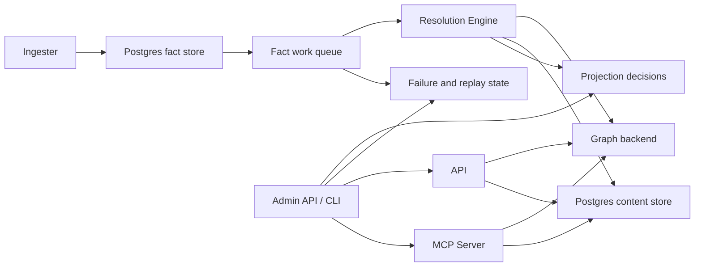

# Telemetry Overview

Eshu uses three signal types:

- **Metrics** for rate, latency, backlog, concurrency, and capacity trends
- **Traces** for request and pipeline timing across service boundaries
- **Logs** for high-context event breadcrumbs and incident forensics

Use this page to choose where to look first.

Operator/admin status is part of the telemetry contract, not a separate debug
path. If a service exposes `/admin/status`, treat that report as the fastest
way to understand what stage is running, how much work is queued, and whether
the reported state is live or inferred.

## Change Gate

Runtime-affecting PRs must say how the changed path is observable. CI enforces
this for hot-path Cypher, graph-write, queue, worker, lease, batching, and
concurrency changes through `scripts/verify-performance-evidence.sh`.

Use one of these markers in the tracked evidence note:

- `Observability Evidence:` when the PR adds or uses metrics, spans,
  structured logs, status output, pprof captures, or queue/domain counters that
  prove an operator can diagnose the path.
- `No-Observability-Change:` when the existing signal set is already enough.
  Name the existing metric, span, log key, status field, or profile output.

Example:

```text
Observability Evidence: the existing reducer run duration, queue wait
histogram, and shared-edge write summary logs expose domain, row count, route,
and failure class for this path; no new metric label was needed.
```

Do not write "logs exist" or "covered by telemetry" without naming the actual
signal. If a person cannot debug the path at 3 AM from the note, the evidence is
not concrete enough.

## Start Here

| If you are debugging | Start with | Then check |
| --- | --- | --- |
| API is slow or erroring | API metrics | API traces and logs |
| backlog is growing | queue depth and queue age metrics | resolution-engine traces and queue logs |
| shared follow-up looks stuck | shared-projection backlog metrics | resolution-engine traces and shared-projection logs |
| one repository is slow | ingester metrics | `collector snapshot stage completed` logs, ingester traces, and resolution-engine stage timings |
| graph writes are slow | resolution metrics | Neo4j traces and graph persistence logs |
| content reads are missing or slow | API metrics and content metrics | content traces and logs |
| provider webhooks are rejected or delayed | webhook listener metrics | webhook spans, store metrics, and listener logs |
| replay or dead-letter behavior looks wrong | recovery metrics | recovery traces and admin recovery logs |

## Health Versus Completeness

- `/health` or `/healthz` proves the process is alive and initialized.
- `GET /api/v0/status/index` and `GET /api/v0/index-status` prove the latest
  checkpointed completeness view exposed by the Go API.
- `/admin/status` proves the live stage, backlog, and failure view for a
  runtime.
- For code graph and dead-code readiness, `/admin/status` must show the fact
  queue drained and no shared projection domain backlog; otherwise reducer-owned
  edges may still be waiting to become graph-visible.
- `POST /admin/refinalize` and `POST /admin/replay` are the runtime recovery
  controls on the ingester runtime.
- A service can be healthy while indexing is incomplete. Use all three views
  when you are deciding whether to restart, reindex, or wait.

## Runtime And Control-Plane Flow



## How To Use The Signals

- Start with **metrics** when you need to detect regression, saturation, or
  backlog growth.
- Move to **traces** when you need to understand where time went across a
  request or projection.
- Use **logs** when you need exact repository, run, or work-item context.
- Use the shared admin/status report when you want a quick read on stage,
  backlog, live-versus-inferred state, and failure classification.
- Use `eshu index --discovery-report <file>` when you need path-level noisy-repo
  evidence. Discovery advisory reports may include repository paths and top
  files/directories, so they deliberately stay out of metric labels.
- Use `ESHU_PPROF_ADDR` to attach `net/http/pprof` to a runtime binary when
  metrics, traces, and logs have already named the stage but the cost shape
  inside that stage is unclear. See
  [local-testing.md → Process Profiling](../local-testing.md#process-profiling)
  for usage and the safety contract.

## Incremental Refresh And Reconciliation Signals

The current runtime uses incremental refresh and reconciliation, not
full re-indexing, as the normal freshness model.

Watch these signals together:

- scope and generation status for what changed
- work-queue depth and age for what still needs to be reconciled
- projection decisions for what has been accepted or deferred
- retry and dead-letter state for what needs operator attention

If a repository, scope, or collector appears stale, start with the admin/status
surface and queue/generation metrics before assuming a full rebuild is needed.

For shared-write debugging specifically:

- Start with `eshu_dp_shared_projection_cycles_total` and
  `eshu_dp_shared_projection_stale_intents_total` to confirm that shared-write
  partition cycles are still running and to see whether stale follow-up work is
  accumulating.
- Use `eshu_dp_queue_depth` and `eshu_dp_queue_oldest_age_seconds` alongside
  those shared-write counters rather than instead of them. Fact queue growth
  and shared follow-up behavior answer different questions.
- Pivot to traces when backlog exists but is not draining. Pivot to logs when
  you need the exact repository, run, generation, or partition owner involved.
- The runtime status surface does not currently embed
  `shared_projection_tuning`. Use
  `GET /api/v0/admin/shared-projection/tuning-report` when you need the
  operator guidance for partition and batch settings.
- The reducer also persists bounded graph-readiness state in Postgres between
  canonical-node, semantic-node, and shared-edge phases. There is not yet a
  dedicated public metric family for those per-slice phase rows, so operators
  should diagnose that path through reducer backlog, structured logs, and the
  targeted readiness tests rather than expecting a separate phase-state
  dashboard out of the box.

## By Runtime

### API

- Metrics answer request rate, latency, and error-rate questions.
- Traces show request and query timing.
- Logs carry correlation fields and failure details.

### Ingester

- Metrics answer repo queue wait, parse throughput, fact emission timing, and
  workspace pressure.
- Traces show parse, fact emission, inline projection timing, and parser
  selection.
- Logs explain discovery choices, slow files, parser snapshot collection, and
  per-repo progress. For a slow single repository, start with
  `collector snapshot stage completed` records for `discovery`, `pre_scan`,
  `parse`, and `materialize` before changing parser workers, NornicDB batch
  sizes, or graph-write timeouts. The `parse` record includes
  `language_parse_summary`, a bounded per-language file count and parse-duration
  summary for attributing repo-scale parse cost without logging file paths.

### Webhook Listener

- Metrics answer provider request rate, rejection reason, normalized decision
  volume, and trigger-store latency.
- `eshu_dp_webhook_requests_total` and
  `eshu_dp_webhook_request_duration_seconds` are labeled by provider, bounded
  outcome, and reason.
- `eshu_dp_webhook_trigger_decisions_total` is labeled by provider, event kind,
  decision, reason, and stored status.
- `eshu_dp_webhook_store_duration_seconds` shows whether intake latency is in
  request verification or durable trigger persistence.
- Traces use `webhook.handle` and `webhook.store` spans; repository names,
  delivery IDs, and commit SHAs stay out of metric labels.

### Facts Layer

- Metrics answer fact-store latency, queue backlog depth, queue age, retry
  churn, dead-letter pressure, and connection-pool saturation.
- Traces show individual fact-store and fact-queue operations.
- Logs capture snapshot emission, queue/retry behavior, recovery actions, and
  work-item lifecycle breadcrumbs as structured JSON. On the Go path,
  `event_name` is optional; phase-scoped `slog` fields such as
  `pipeline_phase`, `scope_id`, and `failure_class` are the stable filters.
- Ingestion commits also emit `ingestion commit stage completed` records for
  transaction begin, scope/generation upsert, repository-catalog load,
  streaming fact upsert, relationship backfill, projector enqueue, and
  transaction commit. Use `fact_count`, `batch_count`, and
  `duration_seconds` to distinguish slow fact persistence from queue or
  commit latency.

### AWS Cloud Collector

- Metrics answer AWS API call volume, throttling, scan duration, active
  per-account claim concurrency, credential failures, pagination checkpoint
  health, and emitted resource counts.
- `eshu_dp_aws_api_calls_total` is labeled by service, account, region,
  operation, and result.
- `eshu_dp_aws_throttle_total` is labeled by service, account, and region.
- `eshu_dp_aws_budget_exhausted_total` is labeled by service, account, and
  region and increments when a scan yields as partial because its configured
  API budget was exhausted.
- `eshu_dp_aws_pagination_checkpoint_events_total` is labeled by service,
  account, region, operation, event kind, and result. Page tokens, ARNs, and
  resource parents stay out of metric labels.
- `eshu_dp_aws_resources_emitted_total` is labeled by service, account, region,
  and resource type. Resource ARNs, tags, image digests, lifecycle policy JSON,
  and raw AWS error payloads stay out of metric labels.
- `aws.service.pagination.page` spans wrap AWS paginator pages and point reads
  such as ECR lifecycle policy lookups.

### Package Registry Collector

- Metrics answer metadata fetch success, rate limiting, parse failures, emitted
  fact volume, and source-observation lag for package feeds.
- `eshu_dp_package_registry_requests_total` is labeled by ecosystem and bounded
  status class.
- `eshu_dp_package_registry_facts_emitted_total` is labeled by ecosystem and
  fact kind. Package names, feed URLs, versions, artifact paths, and credential
  env names stay out of metric labels.
- `eshu_dp_package_source_correlations_total` is labeled by reducer `domain`
  and bounded `outcome` (`exact`, `derived`, `ambiguous`, `unresolved`,
  `stale`, `rejected`). Source URLs, package names, and repository names stay
  out of metric labels.
- `package_registry.observe` spans wrap one claimed target from metadata fetch
  through fact envelope construction. `package_registry.fetch` isolates the
  remote metadata request.
- Registry runtime failures persist bounded `failure_class` values:
  `registry_auth_denied`, `registry_not_found`, `registry_rate_limited`,
  `registry_retryable_failure`, `registry_canceled`, and
  `registry_terminal_failure`. Status messages and details include provider,
  ecosystem, operation, and HTTP status code when available, but not package
  names, feed URLs, paths, or credential environment names.
- `registry_canceled` is reserved for operator/shutdown cancellation. Request
  timeouts such as context deadlines remain `registry_retryable_failure` so
  they stay in the retryable incident bucket.

### Resolution Engine

- Metrics answer claim latency, worker activity, stage duration, stage output
  volume, stage failures, dead-letter pressure, and shared authoritative
  follow-up backlog.
- `eshu_dp_reducer_queue_wait_seconds` separates time spent visible in the
  reducer queue from `eshu_dp_reducer_run_duration_seconds`, which measures the
  handler execution window after a worker starts the work item.
- `/admin/status` includes `queue_blockages` when reducer work is eligible but
  held back by an in-flight conflict domain/key, so operators can distinguish
  conflict routing from graph backend slowness.
- The shared-edge bounded-group path also exposes
  `eshu_dp_shared_projection_intent_wait_seconds`,
  `eshu_dp_shared_projection_processing_seconds`,
  `eshu_dp_shared_projection_step_seconds`,
  `eshu_dp_shared_edge_write_groups_total`,
  `eshu_dp_shared_edge_write_group_duration_seconds`, and
  `eshu_dp_shared_edge_write_group_statement_count` with `domain` attributes so
  operators can distinguish selected-intent wait, readiness blocking, actual
  shared graph-write processing, retract/write/completion-mark substeps, and
  one monster grouped write from many bounded groups during reducer convergence.
- The dedicated `code_calls` projection runner emits the same shared
  projection wait and processing histograms, and its completed-cycle logs add
  `intent_wait_seconds`, `blocked_intent_wait_seconds`,
  `selection_duration_seconds`, `lease_claim_duration_seconds`, and
  `processing_duration_seconds`, split further into
  `retract_duration_seconds`, `write_duration_seconds`, and
  `mark_completed_duration_seconds`. Use these fields to separate
  canonical-node readiness delay, polling, graph mutation time, and Postgres
  completion marking.
- The dedicated `repo_dependency` projection runner logs the source-repo-owned
  cycle shape with `processed_intents`, `active_intents`, `stale_intents`,
  `acceptance_unit_rows`, `replay_requests`,
  `selection_duration_seconds`, `load_all_duration_seconds`,
  `acceptance_prefetch_duration_seconds`, `retract_duration_seconds`,
  `write_duration_seconds`, `replay_duration_seconds`, and
  `mark_completed_duration_seconds`. It also records
  `eshu_dp_shared_projection_step_seconds` with
  `write_phase=selection|load_all|acceptance_prefetch|retract|write|replay|mark_completed`
  so operators can separate Postgres scan/load, accepted-generation prefetch,
  graph backend mutation, replay enqueue, and completion marking before changing
  worker counts or partitioning.
- The `code_call` deadlock-elimination path also exposes
  `eshu_dp_code_call_edge_batches_total` and
  `eshu_dp_code_call_edge_batch_duration_seconds` so operators can measure the
  isolated Neo4j batch transactions directly instead of inferring their
  behavior from generic Neo4j timings. The code-call edge writer defaults
  `ESHU_CODE_CALL_EDGE_BATCH_SIZE` to `1000`; lowering that value increases the
  number of grouped graph-write transactions, while raising it should be proven
  with these metrics and the code-call completion log's `write_duration_seconds`.
- Traces show one projection attempt from claim to graph write.
- Logs capture work-item completion, retry, dead-letter, and per-stage failure
  context.
- Source-local projector runs emit `projector work stage completed` for fact
  loading versus projection execution and `projector runtime stage completed`
  for build, canonical graph write, content-store write, and reducer-intent
  enqueue. When content-store write is the hot stage, Postgres-backed content
  writers also emit `content writer stage completed` for file/entity
  preparation and upsert stages with row and batch counts. Use these before
  changing NornicDB row caps or worker counts.
- NornicDB canonical entity phases emit `nornicdb entity label summary` with
  `scope_id`, `generation_id`, label, rows, statements, grouped executions, and
  duration so large-corpus runs can attribute high-cardinality `Variable` or
  `Function` costs to the exact repository generation without relying on log
  adjacency.
- Neo4j grouped writes now record `eshu_dp_neo4j_batch_size` and
  `eshu_dp_neo4j_batches_executed_total` once per statement inside
  `ExecuteGroup`, including `write_phase` and `node_type` when canonical or
  semantic writers supplied that metadata. Use those metrics with
  `eshu_dp_neo4j_query_duration_seconds{operation="write_group"}` to see whether
  a slow Neo4j transaction is broad overall or concentrated in one phase or
  semantic label.

### Admin / CLI Status

- The admin/status report answers stage, backlog, health, and live-versus-
  inferred questions in one place.
- The `registry_collectors` section summarizes `oci_registry` and
  `package_registry` runtimes with configured instance count, active scope
  count, 24-hour recent completed generation count, last completed timestamp,
  retryable and terminal failure counts, and bounded failure-class counts. It
  intentionally omits registry hosts, repositories, packages, tags, digests,
  account IDs, metadata URLs, and credential references.
- When queue failures exist, the report includes the latest persisted
  `failure_class`, message, and details so operators can spot cases such as
  `graph_write_timeout` without adding repository- or work-item-level metric
  labels.
- It should mirror the service runtime shape so operators do not need a
  different mental model for collector, projector, reducer, or future Go
  services.
- Use the report before restarting a service or forcing a broader re-index.
- The normal runtime path runs end to end through the current platform
  services.
- Current observability expansion lanes are broader workflow/controller
  verification, broader IaC helper-built path-expression reduction, and the
  telemetry coverage that keeps those flows operable.

Shared-write-specific counters:

- `eshu_dp_shared_projection_cycles_total` reports shared projection partition
  cycles by domain and partition key.
- `eshu_dp_shared_projection_intent_wait_seconds` reports the maximum selected
  intent age for a partition cycle, including the dedicated `code_calls`
  projection runner, labeled by `outcome=processed` or
  `outcome=readiness_blocked`.
- `eshu_dp_shared_projection_processing_seconds` reports the graph-write and
  completion duration after partition selection. For `domain=code_calls`, this
  covers the code-call runner's retract, write, and completion-mark window.
- `eshu_dp_shared_projection_step_seconds` reports shared projection substeps.
  Generic partitioned runners and `code_calls` use
  `write_phase=retract|write|mark_completed`; `repo_dependency` also uses
  `write_phase=selection|load_all|acceptance_prefetch|replay`.
- `eshu_dp_shared_projection_stale_intents_total` reports stale shared
  projection intents filtered during reducer processing.

These counters are intentionally domain-scoped and do not carry repository
identity. Use traces and logs when you need repository-level detail.

## Rollout Validation For Shared-Write Changes

When validating shared-write runtime changes in staging or production:

1. Start with `eshu_dp_queue_depth`, `eshu_dp_queue_oldest_age_seconds`,
   `eshu_dp_shared_projection_cycles_total`,
   `eshu_dp_shared_projection_intent_wait_seconds`,
   `eshu_dp_shared_projection_processing_seconds`,
   `eshu_dp_shared_projection_stale_intents_total`,
   `eshu_dp_shared_edge_write_groups_total`,
   `eshu_dp_shared_edge_write_group_duration_seconds`,
   `eshu_dp_shared_edge_write_group_statement_count`,
   `eshu_dp_code_call_edge_batches_total`, and
   `eshu_dp_code_call_edge_batch_duration_seconds`.
2. Confirm backlog trends are flat-to-down, not simply that pods are up.
3. Confirm isolated `code_call` batches are still flowing and that duration
   stays within the expected staging envelope after tuning changes.
4. If shared backlog remains non-zero, inspect traces for the affected
   projection domain before assuming the fact queue is the bottleneck.
5. Use logs last to extract exact repository, source run, generation, or lease
   owner context for the stuck or slow path.

## Tuning Guidance For Shared-Write Backlog

The deterministic shared-write load harness currently shows this balanced
dependency scenario:

| Partition count | Batch limit | Drain rounds | Mean processed per round |
| --- | --- | --- | --- |
| 1 | 1 | 16 | 2.0 |
| 2 | 1 | 8 | 4.0 |
| 4 | 1 | 5 | 6.4 |
| 4 | 2 | 2 | 16.0 |

Interpretation:

- Increasing partition count produces the first major drain-round reduction by
  spreading stable lock domains across more workers.
- Once partitioning is already helping, a modest batch increase can remove the
  remaining tail rounds quickly.
- Batch increases should come after partition increases, not before them, so we
  avoid hiding a partitioning bottleneck behind larger per-round writes.

Recommended staging order:

1. Increase partition count and watch
   `eshu_dp_shared_projection_cycles_total` plus
   `eshu_dp_shared_projection_stale_intents_total`.
2. Confirm fact queue metrics stay flat-to-down at the same time:
   `eshu_dp_queue_depth` and `eshu_dp_queue_oldest_age_seconds`.
3. Only then try a modest batch-limit increase if backlog still drains in too
   many rounds after partitioning is healthy.

If partition count goes up but oldest pending age still rises, traces should be
the next stop before turning batch size further.

## Go Data Plane Telemetry Reference

The Go data plane emits OTEL metrics, traces, and structured JSON logs via the
`go/internal/telemetry` package. All OTEL metric names use the `eshu_dp_` prefix
to differentiate from the Python `eshu_` namespace. Hand-rolled `eshu_runtime_*`
status gauges are preserved alongside the new OTEL metrics on the same `/metrics`
endpoint via a composite handler.

The long-running Go entrypoints and the one-shot bootstrap-data-plane helper
all use the same JSON logger wiring. The service name and runtime role labels
are what operators should use to separate API, ingester, reducer, and bootstrap
log streams.

### Metrics

#### Counters

| Metric | Description | Dimensions |
| --- | --- | --- |
| `eshu_dp_facts_emitted_total` | Total facts emitted by collector | `scope_id`, `source_system`, `collector_kind` |
| `eshu_dp_facts_committed_total` | Total facts committed to store | `scope_id`, `source_system`, `collector_kind` |
| `eshu_dp_projections_completed_total` | Total projection cycles completed | `scope_id`, status (`succeeded`/`failed`) |
| `eshu_dp_reducer_intents_enqueued_total` | Total reducer intents enqueued | `domain` |
| `eshu_dp_reducer_executions_total` | Total reducer intent executions | `domain`, status (`succeeded`/`failed`) |
| `eshu_dp_canonical_writes_total` | Total canonical graph write batches | `domain` |
| `eshu_dp_shared_projection_cycles_total` | Total shared projection partition cycles | `domain`, `partition_key` |
| `eshu_dp_iac_reachability_rows_total` | Total IaC reachability rows materialized after source-local projection | `outcome` (`used`/`unused`/`ambiguous`) |
| `eshu_dp_documentation_entity_mentions_extracted_total` | Documentation entity mentions extracted from bounded sections | `source_system`, `outcome` (`exact`/`ambiguous`/`unmatched`) |
| `eshu_dp_documentation_claim_candidates_extracted_total` | Non-authoritative documentation claim candidates emitted after exact subject resolution | `source_system`, `outcome` |
| `eshu_dp_documentation_claim_candidates_suppressed_total` | Documentation claim candidates suppressed before exact finding emission | `source_system`, `outcome` |
| `eshu_dp_documentation_drift_findings_total` | Read-only documentation drift findings generated by outcome | `source_system`, `outcome` |
| `eshu_dp_tfstate_snapshots_observed_total` | Terraform-state snapshots observed by reader result | `backend_kind`, `result` |
| `eshu_dp_tfstate_resources_emitted_total` | Terraform-state resource facts emitted after parsing | `backend_kind` |
| `eshu_dp_tfstate_redactions_applied_total` | Terraform-state redactions or safe drops by policy reason | `reason` |
| `eshu_dp_tfstate_s3_conditional_get_not_modified_total` | S3 conditional Terraform-state reads that returned not modified | none |
| `eshu_dp_webhook_requests_total` | Webhook listener requests by provider and bounded outcome | `provider`, `outcome`, `reason` |
| `eshu_dp_webhook_trigger_decisions_total` | Normalized webhook trigger decisions after durable storage | `provider`, `event_kind`, `decision`, `reason`, `status` |
| `eshu_dp_webhook_store_operations_total` | Webhook trigger store operations by result | `provider`, `outcome`, `status` |
| `eshu_dp_oci_registry_api_calls_total` | OCI registry API calls by operation outcome | `provider`, `operation`, `result` |
| `eshu_dp_oci_registry_tags_observed_total` | OCI registry tags accepted into a bounded scan | `provider`, `result` |
| `eshu_dp_oci_registry_manifests_observed_total` | OCI registry manifests, indexes, and descriptors observed | `provider`, `media_family` |
| `eshu_dp_oci_registry_referrers_observed_total` | OCI registry referrer artifacts observed | `provider`, `artifact_family` |
| `eshu_dp_package_registry_requests_total` | Package registry metadata request attempts | `ecosystem`, `status_class` |
| `eshu_dp_package_registry_facts_emitted_total` | Package registry facts emitted by parser output | `ecosystem`, `fact_kind` |
| `eshu_dp_package_registry_rate_limited_total` | Package registry metadata requests rejected with HTTP 429 | `ecosystem` |
| `eshu_dp_package_registry_parse_failures_total` | Package registry metadata parse failures | `ecosystem`, `document_type` |
| `eshu_dp_package_source_correlations_total` | Package source-correlation decisions emitted by reducer outcome | `domain`, `outcome` |
| `eshu_dp_aws_api_calls_total` | AWS API calls by operation outcome | `service`, `account`, `region`, `operation`, `result` |
| `eshu_dp_aws_throttle_total` | AWS throttle-shaped service errors | `service`, `account`, `region` |
| `eshu_dp_aws_assumerole_failed_total` | AWS claim credential acquisition failures | `account` |
| `eshu_dp_aws_budget_exhausted_total` | AWS scans that yielded after exhausting the configured API budget | `service`, `account`, `region` |
| `eshu_dp_aws_pagination_checkpoint_events_total` | AWS pagination checkpoint load, save, resume, expiry, completion, and failure events | `service`, `account`, `region`, `operation`, `event_kind`, `result` |
| `eshu_dp_aws_resources_emitted_total` | AWS resource facts emitted by service scanner | `service`, `account`, `region`, `resource_type` |
| `eshu_dp_aws_relationships_emitted_total` | AWS relationship facts emitted by service scanner | `service`, `account`, `region` |
| `eshu_dp_aws_tag_observations_emitted_total` | AWS tag observation facts emitted by service scanner | `service`, `account`, `region` |
| `eshu_dp_aws_claim_concurrency` | Active AWS collector claims by account | `account` |
| `eshu_dp_repos_snapshotted_total` | Total repositories snapshotted | status (`succeeded`/`failed`/`skipped`) |
| `eshu_dp_files_parsed_total` | Total files parsed | status (`succeeded`/`failed`/`skipped`) |
| `eshu_dp_fact_batches_committed_total` | Total fact batches committed to Postgres during streaming ingestion | `scope_id`, `source_system` |

#### Histograms

| Metric | Description | Unit | Custom buckets |
| --- | --- | --- | --- |
| `eshu_dp_collector_observe_duration_seconds` | Collector observe cycle duration | s | 0.01 .. 60 |
| `eshu_dp_tfstate_claim_wait_seconds` | Terraform-state work item age when a claim starts | s | 0 .. 3600 |
| `eshu_dp_tfstate_snapshot_bytes` | Terraform-state source size after a successful parse | By | 1 KiB .. 100 MiB |
| `eshu_dp_tfstate_parse_duration_seconds` | Terraform-state streaming parse duration | s | 0.001 .. 10 |
| `eshu_dp_webhook_request_duration_seconds` | Webhook listener request duration | s | 0.001 .. 10 |
| `eshu_dp_webhook_store_duration_seconds` | Webhook trigger store duration | s | 0.001 .. 10 |
| `eshu_dp_oci_registry_scan_duration_seconds` | OCI registry repository scan duration before durable commit | s | 0.05 .. 120 |
| `eshu_dp_package_registry_observe_duration_seconds` | Package registry claimed target observation duration | s | 0.01 .. 60 |
| `eshu_dp_package_registry_generation_lag_seconds` | Package registry source observation lag | s | 0.01 .. 60 |
| `eshu_dp_aws_scan_duration_seconds` | AWS service claim scan duration before durable commit | s | 0.05 .. 300 |
| `eshu_dp_scope_assign_duration_seconds` | Scope assignment duration | s | default |
| `eshu_dp_fact_emit_duration_seconds` | Fact emission duration | s | default |
| `eshu_dp_projector_run_duration_seconds` | Projector run cycle duration | s | 0.1 .. 120 |
| `eshu_dp_projector_stage_duration_seconds` | Projector stage duration | s | default |
| `eshu_dp_reducer_run_duration_seconds` | Reducer intent execution duration | s | default |
| `eshu_dp_reducer_queue_wait_seconds` | Reducer time from queue visibility to handler start | s | 0.001 .. 21600 |
| `eshu_dp_shared_projection_intent_wait_seconds` | Shared projection intent age when a partition processes or blocks it | s | 0.001 .. 21600 |
| `eshu_dp_shared_projection_processing_seconds` | Shared projection graph-write and completion duration after partition selection | s | 0.001 .. 60 |
| `eshu_dp_shared_projection_step_seconds` | Shared projection substep duration | s | 0.001 .. 60 |
| `eshu_dp_documentation_drift_generation_duration_seconds` | Documentation drift finding generation duration | s | default |
| `eshu_dp_iac_reachability_materialization_duration_seconds` | Corpus-wide IaC reachability materialization duration after source-local projection drains | s | 0.1 .. 300 |
| `eshu_dp_canonical_write_duration_seconds` | Canonical graph write duration | s | default |
| `eshu_dp_queue_claim_duration_seconds` | Queue work item claim duration | s | default |
| `eshu_dp_postgres_query_duration_seconds` | Postgres query duration | s | 0.001 .. 2.5 |
| `eshu_dp_neo4j_query_duration_seconds` | Neo4j query duration | s | default |
| `eshu_dp_repo_snapshot_duration_seconds` | Per-repository snapshot duration | s | 0.1 .. 300 |
| `eshu_dp_file_parse_duration_seconds` | Per-file parse duration | s | 0.001 .. 2.5 |
| `eshu_dp_generation_fact_count` | Fact count per scope generation | count | 10, 50, 100, 500, 1k, 5k, 10k, 50k, 100k, 300k |

#### Observable Gauges

| Metric | Description | Unit | Dimensions |
| --- | --- | --- | --- |
| `eshu_dp_gomemlimit_bytes` | Configured GOMEMLIMIT in bytes, reported at startup | By | `service_name` |
| `eshu_dp_queue_depth` | Current queue depth by queue and status | count | `queue`, `status` |
| `eshu_dp_queue_oldest_age_seconds` | Age of oldest queue item | s | `queue` |
| `eshu_dp_worker_pool_active` | Current active worker count per pool | count | `pool` |

#### Projector Stage Dimensions

The `eshu_dp_projector_stage_duration_seconds` histogram carries a `stage` attribute:

| Stage | Description |
| --- | --- |
| `build_projection` | Fact-to-record transformation |
| `graph_write` | Neo4j canonical graph write |
| `content_write` | Postgres content store write |
| `intent_enqueue` | Reducer intent queue write |

### Metric Dimension Keys

| Key | Description |
| --- | --- |
| `scope_id` | Ingestion scope identifier |
| `scope_kind` | Scope type (e.g. repository) |
| `source_system` | Origin system (e.g. git) |
| `generation_id` | Scope generation identifier |
| `collector_kind` | Collector type (e.g. git) |
| `domain` | Reducer or projection domain |
| `partition_key` | Shared projection partition |
| `outcome` | Timing outcome such as processed, completed, or readiness_blocked |
| `provider` | Webhook provider (github, gitlab, bitbucket, unknown) |
| `event_kind` | Normalized webhook event kind |
| `decision` | Webhook refresh decision |
| `reason` | Bounded reason label for webhook, retry, or policy outcomes |
| `stage` | Projector stage (build_projection, graph_write, content_write, intent_enqueue) |
| `status` | Operation outcome (succeeded/failed) |
| `queue` | Queue name for claim duration (projector/reducer) |
| `worker_id` | Worker goroutine identifier (in structured logs) |

### Span Names

#### Pipeline spans

| Span | Where | Description |
| --- | --- | --- |
| `collector.observe` | Ingester collector loop | One collect + commit cycle |
| `scope.assign` | Collector repo discovery | Repository selection and scope assignment |
| `fact.emit` | Collector per-repo snapshot | File parse, snapshot, content extraction per repo |
| `projector.run` | Ingester projector loop | One claim + project + ack cycle |
| `reducer_intent.enqueue` | Projector runtime | Enqueuing reducer intents after projection |
| `reducer.run` | Reducer main loop | One claim + execute + ack cycle |
| `oci_registry.scan` | OCI registry collector | One configured registry repository scan |
| `oci_registry.api_call` | OCI registry collector | One ping, tag-list, manifest, or referrer API call |
| `package_registry.observe` | Package registry collector | One claimed package-registry target observation |
| `package_registry.fetch` | Package registry collector | One explicit metadata document request |
| `aws.collector.claim.process` | AWS cloud collector | One claimed `(account, region, service)` work item |
| `aws.credentials.assume_role` | AWS cloud collector | Claim-scoped credential acquisition |
| `aws.service.scan` | AWS cloud collector | One AWS service scan |
| `aws.service.pagination.page` | AWS cloud collector | One AWS SDK page request |
| `iac_reachability.materialize` | Bootstrap finalization | Corpus-wide active-generation IaC usage classification and Postgres row upsert |
| `canonical.write` | Projector runtime / Reducer shared projection | Graph and content writes to Neo4j |
| `webhook.handle` | Webhook listener route | Provider verification, normalization, and response handling |
| `webhook.store` | Webhook listener store call | Durable trigger upsert and status selection |

#### Query handler spans

| Span | Where | Description |
| --- | --- | --- |
| `query.relationship_evidence` | HTTP relationship evidence drilldown | Resolves compact `resolved_id` graph pointers to durable Postgres evidence |
| `query.documentation_findings` | HTTP documentation findings list | Reads durable documentation finding facts for updater consumers |
| `query.documentation_evidence_packet` | HTTP documentation evidence packet lookup | Reads the immutable packet an updater snapshots before planning a diff |
| `query.documentation_packet_freshness` | HTTP documentation packet freshness lookup | Checks whether a saved packet is still current before publish |
| `query.dead_iac` | HTTP dead-IaC read surface | Reads reducer-materialized IaC cleanup findings |
| `query.infra_resource_search` | HTTP infrastructure resource search | Searches graph-backed infrastructure resources |

#### Dependency service spans

| Span | Where | Description |
| --- | --- | --- |
| `postgres.exec` | Instrumented Postgres wrapper | Every `ExecContext` call (writes) |
| `postgres.query` | Instrumented Postgres wrapper | Every `QueryContext` call (reads) |
| `neo4j.execute` | Instrumented Neo4j wrapper | Every Cypher statement execution |

These dependency spans are child spans of the pipeline spans above, creating
end-to-end traces from collection through parsing through projection through
reduction, including every database call along the way.

### Structured Log Keys

All Go data plane services emit JSON logs via `log/slog` with a custom
`TraceHandler` that injects `trace_id` and `span_id` from the active OTEL span
context. Base attributes (`service_name`, `service_namespace`) are set at logger
creation. The following keys appear in structured log events:

| Key | Description |
| --- | --- |
| `scope_id` | Ingestion scope identifier |
| `scope_kind` | Scope type |
| `source_system` | Origin system |
| `generation_id` | Scope generation identifier |
| `collector_kind` | Collector type |
| `domain` | Reducer or projection domain |
| `partition_key` | Shared projection partition |
| `request_id` | Request correlation ID |
| `failure_class` | Failure classification (terminal/retryable) |
| `refresh_skipped` | Whether incremental refresh was skipped |
| `pipeline_phase` | Pipeline phase: discovery, parsing, emission, projection, reduction, shared |
| `trace_id` | OTEL trace ID (injected by TraceHandler) |
| `span_id` | OTEL span ID (injected by TraceHandler) |

The `pipeline_phase` key enables filtering logs by stage when tracing
end-to-end. Every structured log event from a service loop carries exactly
one phase value, so `jq 'select(.pipeline_phase == "projection")'` isolates
projector-specific events across all services.

### OTEL Provider Configuration

The Go data plane configures OTEL SDK providers at startup in each `cmd/`
entrypoint. Configuration is environment-driven:

| Env var | Effect |
| --- | --- |
| `OTEL_EXPORTER_OTLP_ENDPOINT` | When set, enables OTLP gRPC trace and metric export. When empty, uses noop exporters (safe for local dev). |
| `OTEL_SERVICE_NAME` | Overrides the service name resource attribute (defaults to the binary name). |

The Prometheus exporter is always active regardless of OTLP configuration,
serving on the existing `/metrics` endpoint alongside `eshu_runtime_*` gauges.

### Grafana Dashboards

Pre-built dashboard JSON definitions are in `docs/dashboards/`:

| Dashboard | File | Panels |
| --- | --- | --- |
| Ingester | `ingester.json` | Collection rate, projection P95, queue depth, claim latency |
| Reducer | `reducer.json` | Execution by domain, shared projection, canonical writes, errors |
| Overview | `overview.json` | End-to-end throughput, latency waterfall, queue depths |

Import into Grafana via **Dashboards > Import > Upload JSON**. All dashboards
use `$service` and `$namespace` template variables matching Helm ServiceMonitor
labels.

## Streaming Ingestion And Memory Telemetry

The Go data plane streams facts through buffered channels and commits them in
batched multi-row INSERTs to bound memory during large-scale indexing. The
following metrics exist specifically to give operators visibility into this
streaming persistence path and the memory management that supports it.

### Why These Metrics Exist

Without streaming telemetry, operators cannot distinguish between:

- a generation that is slow because it has 295k facts vs one that is stuck
- memory pressure caused by one outlier repo vs systemic GC misconfiguration
- a GOMEMLIMIT that is too low (thrashing GC) vs too high (OOM risk)

These metrics close those gaps.

### Fact Batch Commits (`eshu_dp_fact_batches_committed_total`)

**What it tells you:** How many 500-row INSERT batches have been committed to
Postgres. Each batch corresponds to one multi-row INSERT statement that wrote
up to 500 fact records.

**How to use it:**

- **Throughput monitoring**: Rate of batch commits shows how fast facts are
  flowing to Postgres. A drop indicates Postgres contention, slow I/O, or
  a blocked producer goroutine.
- **Correlation with snapshot duration**: Compare batch commit rate against
  `eshu_dp_repo_snapshot_duration_seconds` to identify whether the bottleneck
  is parsing (producer) or persistence (consumer).
- **Batch count per generation**: Divide total batches by total generations to
  understand average repo size. A sudden spike means a new large repo was
  added to the fleet.

### Generation Fact Count (`eshu_dp_generation_fact_count`)

**What it tells you:** The distribution of fact counts per scope generation.
Buckets range from 10 to 300,000 to capture the full range from tiny config
repos to monorepos.

**How to use it:**

- **Outlier detection**: Repos in the 100k+ buckets are memory-intensive
  outlier repos. If these appear unexpectedly, investigate whether a new repo
  was added or an existing repo grew significantly.
- **Capacity planning**: The histogram shape tells you whether the fleet is
  dominated by small repos (most facts in the 10-500 bucket) or has a long
  tail of large repos. This informs worker count and GOMEMLIMIT tuning.
- **Regression detection**: If the median fact count per repo shifts
  significantly between deployments, a parser change may be emitting
  duplicate or missing facts.

### GOMEMLIMIT Gauge (`eshu_dp_gomemlimit_bytes`)

**What it tells you:** The GOMEMLIMIT value that the binary configured at
startup, in bytes. This is the soft memory ceiling that triggers aggressive
GC before the OOM killer fires.

**How to use it:**

- **Correlate with RSS**: Compare `eshu_dp_gomemlimit_bytes` with container
  RSS from `container_memory_working_set_bytes` (cAdvisor) or `docker stats`.
  If RSS consistently approaches GOMEMLIMIT, the container needs more memory
  or fewer workers.
- **Verify cgroup detection**: If the gauge reads 0, the binary did not detect
  a container memory limit — either it is running on bare metal or the cgroup
  filesystem is not mounted. Check startup logs for the `source` field.
- **Cross-service comparison**: The gauge carries `service_name` so you can
  confirm that bootstrap-index, ingester, and other binaries all have
  appropriate limits for their workload profile.

### Operator Decision Tree

```text
Is it OOMing?
  YES -> Check eshu_dp_gomemlimit_bytes
         Is it 0? -> Binary didn't detect cgroup limit. Set GOMEMLIMIT env var.
         Is it close to container limit? -> Ratio is too high or container is too small.
         Is RSS much higher than GOMEMLIMIT? -> Non-heap memory (stacks, mmap). Increase container.

Is ingestion slow?
  YES -> Check eshu_dp_fact_batches_committed_total rate
         Dropping? -> Postgres contention. Check eshu_dp_postgres_query_duration_seconds.
         Steady but slow? -> Check eshu_dp_generation_fact_count for outlier repos.
         Zero? -> Producer goroutine may be stuck. Check eshu_dp_repo_snapshot_duration_seconds.

Are facts missing after ingestion?
  YES -> Check eshu_dp_generation_fact_count vs expected
         Lower than expected? -> Parser may be skipping files. Check eshu_dp_files_parsed_total.
         Higher than expected? -> Duplicate emission. Check deduplication in batch commits.
```

## Prometheus And ServiceMonitor

- In Docker Compose, validate runtime metrics by curling the direct `/metrics`
  endpoints.
- In Kubernetes, Helm can expose dedicated metrics ports and render
  `ServiceMonitor` resources for the API, ingester, and resolution-engine.
- Bootstrap indexing is a local or operator-run one-shot activity, not a
  steady-state `ServiceMonitor` target in the public chart.
- Incremental refresh and reconciliation should be observed through queue age,
  generation status, and the admin/status surface rather than through a
  platform-wide re-index trigger.

## Where To Go Next

- [Metrics](metrics.md) for exact metric names and how to use them
- [Traces](traces.md) for span names and latency debugging
- [Logs](logs.md) for event breadcrumbs and incident forensics
- [Cross-Service Correlation](cross-service-correlation.md) for stitching traces across the pipeline
- [Cloud Validation Runbook](../cloud-validation.md) for hosted proof and
  operator validation
