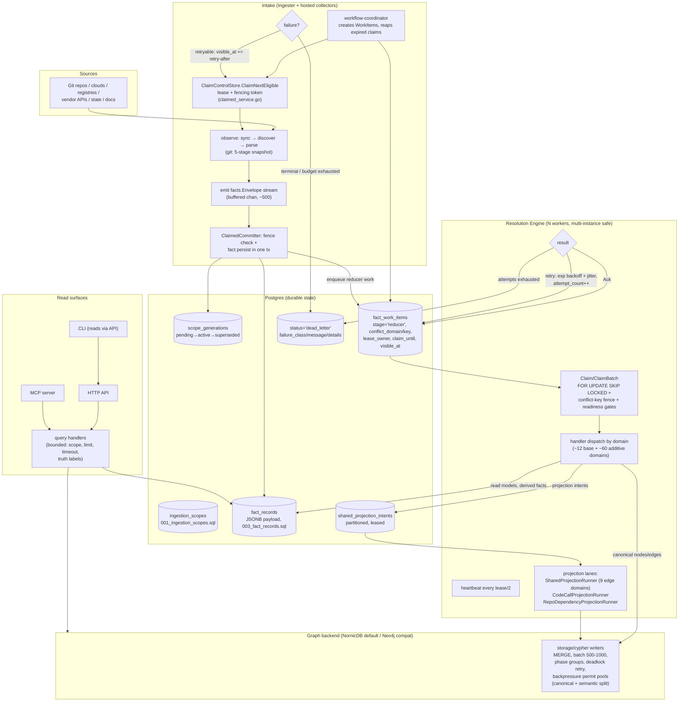
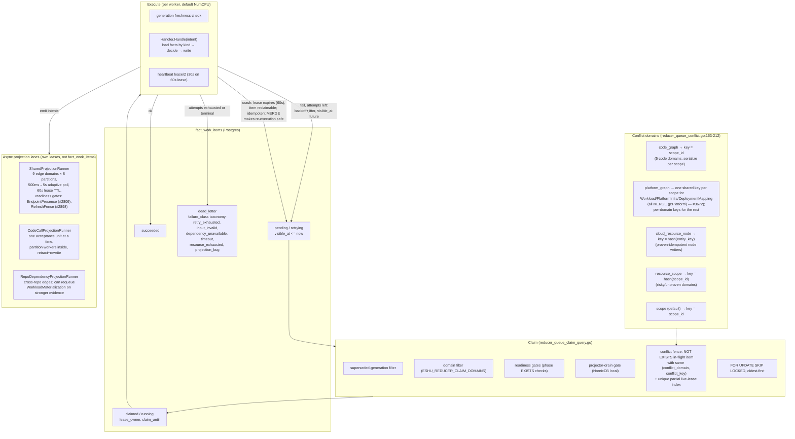

# Architecture Review 2026-07: Flow, Contracts, OSS Readiness, Scale

A point-in-time deep review of the whole pipeline (July 2026), produced from
direct reads of the docs and code. Every claim cites the file or doc it came
from; claims that are inference rather than a stated decision are marked
**(inferred)**. File-and-line citations are accurate as of commit `6191a5426`;
verify before relying on exact line numbers later.

This review motivated the
[Contract System v1 design](design/contract-system-v1.md); the contract
sections here (Part C) are superseded by that design where they differ.

## Corrections to common assumptions

Five things frequently assumed about this codebase that are wrong or stale:

1. **The reducer conflict key is not `(scope_id, generation_id,
   repository_id)`.** It is a per-domain `(conflict_domain, conflict_key)`
   tuple computed in
   `go/internal/storage/postgres/reducer_queue_conflict.go:163-212`, enforced
   by a `NOT EXISTS` predicate in the claim SQL
   (`reducer_queue_claim_query.go:83-91`) plus a unique partial index
   `fact_work_items_reducer_live_lease_uniq` on
   `(conflict_domain, conflict_key) WHERE status IN ('claimed','running')`
   (`reducer_queue_helpers.go:21-38`). `generation_id` is *not* part of the
   fence — generation freshness is a separate claim-time filter (superseded
   generations are excluded) and an execute-time check.
2. **"No explicit IDL" is not true.** `specs/fact-kind-registry.v1.yaml` is a
   machine-readable registry mapping every fact family to kinds, schema
   version, reducer domain, projection hook, admission hook, read surface,
   and truth profile, and it generates
   `go/internal/facts/fact_kind_registry.generated.go`. What is missing is
   one level down: payload field schemas (Part C, now the contract-system
   design).
3. **An SDK already exists.** `sdk/go/collector` is a separate public Go
   module (wire protocol `collector-sdk/v1alpha1`, JSON Schema at
   `sdk/go/collector/schema/collector-sdk-v1alpha1.schema.json`) with an
   out-of-tree-capable conformance library (`sdk/go/collector/conformance`),
   an extension host (`go/internal/collector/extensionhost`), a component
   package manager with Sigstore/Cosign trust modes, and a completed
   PagerDuty extraction boundary proof
   (`docs/public/reference/collector-extraction-policy.md`).
4. **Protobuf contract stubs exist but are unwired.**
   `proto/eshu/data_plane/*/v1/` (facts, queue, scope, projection, reducer)
   with `buf.yaml`/`buf.gen.yaml` — but `go/gen/proto` does not exist;
   nothing is generated or imported. Two competing IDL directions coexisted
   with no recorded decision; the contract-system design resolves this by
   demoting the proto tree.
5. **The reducer is already multi-instance-safe by design** — stateless
   workers, Postgres `FOR UPDATE SKIP LOCKED` claims, lease columns, the
   live-lease unique index, and `ESHU_REDUCER_CLAIM_DOMAINS` for domain
   sharding (`go/cmd/reducer/config.go`,
   `go/internal/storage/postgres/reducer_queue.go`). The HA gaps are
   elsewhere (Part E.3).

Scale calibration: `go/internal/collector` has 2,082 production Go files
across 45 subdirectories and 23 registered collector kinds
(`go/internal/scope/scope.go:130-155`); `go/internal/reducer` has 865 plus 53
in `go/cmd/reducer`.

---

## Part A — The real flow, in plain English

### A.1 Collector families

All collectors share one lifecycle: the workflow coordinator
(`go/cmd/workflow-coordinator`) creates durable work items in Postgres; a
collector claims one via `ClaimControlStore.ClaimNextEligible` (lease +
fencing token), observes its source, streams `facts.Envelope` records through
a `ClaimedCommitter` that verifies the fence in the same transaction as fact
persistence, then completes/releases/fails the claim
(`go/internal/collector/claimed_service.go:22-330`). Retryable failures honor
provider `Retry-After`; a MaxAttempts budget escalates runaway retries to
terminal with class `attempt_budget_exhausted` (claimed_service.go:247-249,
issue #612). Fairness across families is weighted round-robin
(`fair_claim_dispatcher.go:24-114`). With that shared skeleton, the families
group like this:

- **Git core (the big one).** Top-level `git_*.go` files (~200). Watches: the
  repository set (filesystem or remote). Triggered by bootstrap, schedule, or
  webhook (`workflow/types.go:34-52`). Runs a 5-stage snapshot — discovery
  (`.gitignore`/`.eshuignore`/vendor pruning), pre-scan, optional Go semantic
  pre-scan, byte-balanced parallel parse, materialize — and emits code,
  content, documentation, declared-observability,
  Terraform-backend-candidate, and service-catalog facts. Distinctive:
  largest-first repo scheduling with a dedicated large-repo lane (issues
  #3711, #3839), delta snapshots keyed on `source_commit_sha` that skip
  repo-wide reducer follow-ups, and SCIP indexing as an opt-in with
  native-parser fallback.
- **Document parsers are not collectors.** Markdown/DOCX/PPTX/XLSX/PDF/
  notebook parsing lives in `go/internal/parser` helpers invoked by the Git
  snapshot; what lives in `collector/` are the six **preflight** families
  (`archivepreflight`, `imagepreflight`, `mediapreflight`,
  `diagrampreflight`, `ooxmlpreflight`, `pdfpreflight`) — safety classifiers
  that emit metadata-only warnings *before* any extraction is allowed. Their
  distinctive failure mode is deliberate refusal: unsafe paths, nested
  archives, credential-looking members become warnings, never content.
- **Cloud inventory (`awscloud/`, `gcpcloud/`, `azurecloud/`).** Watch cloud
  control planes via claims sharded by account/region/service (AWS),
  project/folder (GCP), subscription (Azure). Emit resource, relationship,
  tag, DNS, IAM-permission, and posture facts — always metadata-only, with
  raw policy JSON, user-data content, and condition values explicitly never
  persisted (`docs/public/reference/fact-envelope-reference.md`).
  Distinctive: rate-limit errors classify as retryable with provider
  retry-after; GCP uses a per-asset-type extractor registry (146
  `extractor_*.go` files), AWS is an older constants-heavy monolith — see
  drift, Part B.
- **Registries (`ociregistry/`, `packageregistry/`).** Watch container and
  package registries. Emit manifest/tag/index/descriptor and
  package/version/dependency facts. Distinctive: tags are treated as mutable
  weak evidence, digests as strong identity anchors — the promotion rules
  encode that explicitly.
- **Live observability (`grafana/`, `loki/`, `prometheusmimir/`, `tempo/`).**
  Watch vendor APIs for dashboards, rules, targets, log/trace signals. Emit
  fingerprinted, bounded metadata only (no dashboard JSON, no PromQL, no log
  lines). The *declared* counterparts of these facts come from the Git
  collector parsing IaC. Distinctive failure mode: cardinality limits —
  bounded tag-value counts, fingerprints instead of values.
- **Tickets/docs/incidents (`jira/`, `confluence/`, `pagerduty/`).** Watch
  vendor APIs on their own cadence. Emit work-item, page, and incident
  evidence with aggressive redaction (URL fingerprints, presence booleans).
  PagerDuty is the extraction pilot (Part F). Distinctive: their facts are
  provenance-only until a reducer corroborates them with stronger evidence —
  a Jira link to a PR does not prove the PR.
- **CI/CD and runtime (`cicdrun/`, `kuberneteslive/`, `vaultlive/`).** GitHub
  Actions runs/jobs/steps/artifacts; read-only Kubernetes core resources;
  Vault metadata. All redacted to join keys and fingerprints.
- **Supply chain (`ospackagevulnerability/`, `vulnerabilityintelligence/`,
  `sbomruntime/`, `sbomdocument/`, `securityalerts/`).** OSV/KEV/NVD/EPSS
  snapshots, OS package inventories, SBOM/attestation documents, Dependabot
  alerts. Distinctive correctness rule: reducers must never compare a distro
  `installed_version_raw` against upstream advisory fixed versions (vendor
  backports), and provider alert state never directly becomes impact truth.
- **State (`terraformstate/`, `tfstateruntime/`).** Terraform state
  snapshots, redacted before emission; backend discovery from Git stays
  exact-only with opaque expression hashes for anything unresolved.
- **Extension/scanner infrastructure (`extensionhost/`, `scannerworker/`,
  `entrypoints/`, `contracttest/`, `parity/`, `sdk/`).** Not sources — the
  hosting, isolation, and test scaffolding that runs out-of-tree components
  and isolated analyzers under the same claim discipline.

### A.2 End-to-end flow

Where things sit: **Postgres** holds scopes, generations, facts, both queues
(`fact_work_items`, `shared_projection_intents`), status, and dead letters.
The **graph backend** holds only canonical projected truth — collectors never
touch it. Retries happen in two places: collector claims (provider-aware
retry-after, attempt budget) and reducer work items (exponential backoff with
jitter, #4450). Dead letters land as rows with `status='dead_letter'` plus a
durable `failure_class` taxonomy
(`go/internal/projector/dead_letter_triage.go:24-61`).

### A.3 Reducer internals

**Idempotency** is proven, not assumed: `idempotency_cases_test.go` replays
handlers with byte-identical input and asserts identical output rows;
Postgres writes are `ON CONFLICT (fact_id) DO UPDATE`, graph writes are
`MERGE` on deterministic UIDs. DeploymentMapping and WorkloadMaterialization
are exempted from the generic harness and proven in dedicated suites.

### A.4 What a generation and a scope actually are

- A **scope** is one shard of a source that can be observed and replaced as a
  unit: a repository, a cloud account/region slice, a registry target, a
  documentation source. Identity is `(source_system, scope_kind, source_key)`
  with a surrogate `scope_id` and a `partition_key` for sharding
  (`schema/data-plane/postgres/001_ingestion_scopes.sql`).
- A **generation** is one complete observation of a scope: a row in
  `scope_generations` with lifecycle `pending → active → superseded`, exactly
  one `active` per scope (unique partial constraint), plus delta metadata
  (`is_delta`, `source_commit_sha`) (`002_scope_generations.sql`). It is how
  consumers separate current evidence from stale rows, and how a crashed or
  re-run collection converges instead of double-counting: re-emitting a fact
  in the same generation hits the same deterministic
  `fact_id = hash(scope_id, generation_id, fact_kind, stable_fact_key)`.
- **Why the conflict fence is shaped the way it is**
  (`(conflict_domain, conflict_key)`): the fence exists to guarantee *at most
  one in-flight writer per graph target class*. Drop `conflict_domain` and
  unrelated domain classes serialize on the same scope — pre-#3672 behavior,
  where ~26k intents serialized instead of partitioning. Drop `conflict_key`
  and every scope in a domain serializes globally. Put `generation_id` *into*
  the key and two generations of the same scope could write the same Platform
  node concurrently — generation ordering is instead handled by claim-time
  supersession filtering plus execute-time freshness checks, which is the
  correct layer for it.

### A.5 How findings actually work today

There is **no first-class Finding/Issue concept anywhere** in the product: no
`Finding` or `Issue` node label among the 109 labels in
`go/internal/graph/schema_tables.go:119-219`. What exists is **four disjoint
domain finding models**: `SupplyChainImpactFinding`
(`go/internal/reducer/supply_chain_impact.go:54-137`),
`AWSCloudRuntimeDriftFindingWriter` (`aws_cloud_runtime_drift.go:35-45`),
`MultiCloudRuntimeDriftFindingWriter` (`multi_cloud_runtime_drift.go`), and
documentation `VerificationFinding`
(`go/internal/doctruth/verifier.go:234-280`). They persist as reducer-emitted
**facts** (kinds like `reducer_supply_chain_impact_finding`), not graph
nodes, and are read back through **four separate MCP tools** with zero shared
severity enum, status enum, or provenance shape. The closest shared shape is
the internal `correlation/model.Candidate`, which is never exposed.
(The `eshu-issue-driver` skill is GitHub process automation and unrelated.)

**Verdict: a unified finding concept is a real gap worth designing — as a
read contract, not a graph node.** Every new domain adds another bespoke
tuple of status/severity/evidence types and another MCP tool; a
security-facing consumer has to know all of them. The right first move is a
thin common **finding envelope** on the query/MCP surface — `finding_id,
domain, severity (normalized + native), status (normalized + native),
scope/repo refs, evidence fact IDs, truth label, suppression state` —
implemented as a union read-model over the existing per-domain stores,
registered per domain the same way fact kinds are registered. Do **not**
collapse the domain truth models themselves; the per-domain rigor is a
feature. **(Design recommendation, inferred from the four-model survey; no
ADR states a position either way.)**

---

## Part B — Where the codebase is actually headed

From ~300 recent commits and the design docs, the intentional direction is
clear and consistent: **provider breadth + contract hardening**. Roughly 50
commits are the GCP typed-depth extractor series; ~35 are the replay/cassette
epic (R-layers); ~20 each go to reducer domain-splitting/perf and CI contract
gates; Epic X (telemetry coverage discipline) and Epic V (API
versioning/deprecation headers) are in flight per `CHANGELOG.md` Unreleased.
The extraction policy, component package manager, trust model, and SDK are
all groundwork for out-of-tree collectors — deliberate, documented, and
partially proven (PagerDuty).

Three drifts looked **undecided rather than chosen** at review time:

1. **Three collector authoring patterns.** GCP has a per-asset-type extractor
   registry (146 `extractor_*.go` files, one file per asset type); AWS is a
   pre-registry constants-heavy monolith; Azure (39 files) matches neither.
   Every new AWS scanner deepens the divergence. **(inferred from structure
   comparison; no ADR found.)**
2. **Two IDL directions.** The YAML registry + generated Go + SDK JSON Schema
   is live and enforced; the `proto/eshu/data_plane/*/v1` tree is checked in,
   ungenerated, unimported. Resolved by the
   [Contract System v1 design](design/contract-system-v1.md), which demotes
   the proto tree.
3. **Finding-model fragmentation** (Part A.5) grows one bespoke model per new
   domain — this conflicts with a coherent public query surface and with
   third-party collectors that will want to contribute findings.

One conflict with the contract/OSS goals worth naming plainly: the codebase's
strongest habit — moving fast by keying reducer joins on raw payload map
lookups — is exactly the thing that cannot survive a public boundary
(Part C.5, addressed by the contract-system design).

---

## Part C — The contract that should exist

Superseded by the [Contract System v1 design](design/contract-system-v1.md);
kept here in summary for the record of what the review found.

**What exists and is good:** the envelope
(`go/internal/facts/models.go:28-42`, mirrored publicly in
`sdk/go/collector/types.go`) is stable and complete. Admission classifies
versions (`facts.ClassifySchemaVersion`) and the projector rejects
unsupported majors before projection
(`go/internal/projector/schema_version_admission.go:19-24`). The fact-kind
registry ties every kind to its consumers.

**The hole:** `Payload` is `map[string]any`, persisted as unvalidated JSONB,
and consumed by reducers through `payloadString(...)`-style lookups that
return `""` on a missing key (`go/internal/reducer/aws_relationship_join.go:64-84`).
Rename a payload key in a collector and the reducer silently builds malformed
graph identities — no error, no dead-letter, wrong graph. Six-plus reducer
files duplicate collector string constants specifically to avoid importing
the collector package (`ec2_uses_profile_edge_rows.go`,
`iam_can_assume_edge_rows.go`, `iam_can_perform_catalog.go`,
`iam_escalation.go`, `s3_logs_to_edge_rows.go`,
`secrets_iam_trust_chain_iam_role.go`).

**Resolution:** typed payload structs in a public contracts module, generated
JSON Schemas, a decode seam with version shims, a schema-diff CI gate, a
payload-usage manifest gate, consumer-driven fixture packs, and a written
guarantees doc. Go types + JSON Schema over protobuf/gRPC: the boundary is
store-and-forward through Postgres (no RPC hop), proto3's optional-everything
semantics would reproduce the silent-zero-value bug, and the whole
wire/storage/fixture ecosystem is JSON end to end. Details and the change
matrix live in the design doc.

---

## Part D — What "finalize for mainstream open source" requires

The repo is already public (MIT, SECURITY.md, CONTRIBUTING.md, strict-built
docs site), so this is a maturity question. Missing, in priority order:

1. **The payload contract** (now the contract-system design). Third-party
   collectors cannot be invited onto a boundary where a renamed key silently
   corrupts the graph.
2. **A released, tagged SDK.** `sdk/go/collector` is v0.1.x in-tree; no
   signals of tagged module releases external `go get` can pin were found
   (**inferred** — verify tag history). Needs semver tags, an SDK CHANGELOG,
   and a compatibility table (SDK version ↔ core release ↔ protocol version).
3. **Contributor-tier CI.** The gate floor is excellent and enormous. Define
   the contributor subset (`make pre-pr` is close) and document which gates a
   fork can run without credentials/remote proof.
4. **Human-first contributor docs.** One "write your first collector in an
   afternoon" path: scaffold (`eshu component init collector` exists) →
   fixture → conformance → PR. Most material exists in
   `community-extension-authoring.md`; it needs sequencing and a worked
   end-to-end example repo (the scorecard reference extension is the seed).
5. **The two gaps the performance map names itself:** a published
   SLO/performance contract (the scale-corpus spec defines metrics but no
   targets — `docs/internal/performance-map.md`) and a Postgres tuning doc.
6. **Security posture for third-party code:** trust model designed and mostly
   implemented, but strict Sigstore verification is not wired into default
   runtime activation and there is no live community index. Also needed: a
   vulnerability-response commitment for third-party packages.
7. **Governance basics:** CODEOWNERS/maintainer ladder, a public roadmap
   surface, issue/PR templates aligned with the actual gates.

Not missing (do not re-do): license hygiene, security reporting channel, docs
build gate, API versioning discipline (Epic V), release engineering,
telemetry contract (Epic X).

---

## Part E — Performance, HA, failure modes, scale

### E.1 Concrete bottlenecks (cited)

- **Giant-repo parse tail** — `git_source_processing.go:99-131`.
  Largest-first + byte-balanced partitions took the 896-repo parse stage from
  ~1586s to ~675s, but the single worst repo (16,659 files) still costs ~238s
  (#3711). *Measured.*
- **Per-handler fact loading** — handlers load full fact sets per (scope,
  generation) via `FactLoader.ListFacts`/`ListFactsByKind`
  (`fact_kind_loader.go:51-70`); budgets are enforced per handler
  (`reducer-claim-latency-gate.md`: AWS node materialization ≤16.1M ns/op,
  AWS relationship edges ≤37M, value-flow cold ≤30.6M). No cross-handler
  cache. *Measured (budgeted).*
- **Claim-query predicate growth** — every readiness-gated edge domain adds
  an `EXISTS` to the hot claim SQL (`reducer_queue_claim_query.go`),
  documented as linear-in-domain-count with a p95 ≤1.10× baseline gate.
  Polling only — no LISTEN/NOTIFY anywhere in the queue path. *Measured
  (gated).*
- **Shared projection lane overhead** — 8 partitions × 9 domains = 72
  lease/selection attempts per cycle at 500ms–5s adaptive poll
  (`shared_projection_runner.go:20-41,150-194`); two readiness gates
  (EndpointPresence #2809, RefreshFence #2898) can hold whole domains. The
  deferred relationship backfill was the historical monster — 20+ min serial,
  now 882s via 896-partition concurrency (#3710/#3725). *Measured.*
- **Graph write throughput** — `storage/cypher/writer.go` (batch 500 default,
  1000 for code-call edges), phase-group execution, deadlock retry delegated
  to the executor, and the backpressure permit pools
  (`go/internal/graphbackpressure/backpressure.go`;
  `ESHU_GRAPH_WRITE_{CANONICAL,SEMANTIC}_MAX_IN_FLIGHT`, split after
  #3560/#3652 head-of-line blocking). Bootstrap projection ≈1,245s for 3.5M
  facts ≈ 2,800 facts/s sustained into NornicDB. *Measured.*

Honesty note: the phase sums (675s parse + 1,245s projection + 882s backfill)
are per-stage measurements, not wall clock — stages pipeline. The <15-minute
896-repo end-to-end figure is the pipelined known-good baseline; the
per-stage numbers are the decomposition to optimize against.

### E.2 Scaling the reducer horizontally — real options

The reducer is **not architecturally single-instance**. Stateless workers,
SKIP LOCKED claims, 60s leases with 30s heartbeats, the live-lease unique
index, and proven idempotent replay mean N replicas are safe today
(`service-runtimes.md` says scale it when telemetry shows it is the
bottleneck). Options in ascending cost:

| Option | What you get | What breaks / costs |
| --- | --- | --- |
| 1. Add replicas (supported now) | More handler throughput; correctness holds via conflict fence + idempotent MERGE | Nothing correctness-wise. Claim-SQL load scales with replicas; conflict-fenced domains stay serial by design. Diminishing returns once claim p95 or graph permits saturate. |
| 2. Domain-sharded replicas (`ESHU_REDUCER_CLAIM_DOMAINS`, supported now) | Isolation: slow cloud materialization cannot starve code-graph domains | Ops complexity; possible idle shards; no code change. Cheapest meaningful step beyond #1. |
| 3. Split the three projection lanes into own deployments | Lanes already have independent lease managers and poll loops; extraction isolates the projection tail from claim/handler capacity | Wiring in `cmd/reducer` (`buildReducerService`, main.go:293-387); no ordering breaks — leases already assume multi-claimant. |
| 4. Scope-partition sharding (`ingestion_scopes.partition_key` exists) | True horizontal claim scaling; per-fleet Postgres read replicas later | Breaks cross-scope domains (DeploymentMapping, DeployableUnitCorrelation, RepoDependencyProjection) — they need a global lane or two-phase design. Do only when 1–3 headroom is spent. |
| 5. LISTEN/NOTIFY claim wake-up | Cuts idle claim latency and poll load | A scheduling win, not throughput. |
| 6. Backpressure into collectors | Bounds the queue instead of growing it | Coordinator must pace claim issuance on queue depth — designed nowhere today (gap, E.3). |

The ceiling behind all of these: every fleet funnels into one Postgres and
one NornicDB. At ~2,800 facts/s projection throughput, a 10× corpus means
either ~10× write throughput or a ~3.5-hour projection tail — the graph
backend, not the reducer fleet, is the terminal bottleneck. **(reasoned from
measured 1,245s / 3.5M facts.)**

### E.3 Where there is no HA story today

- **Ingester**: StatefulSet with a single workspace PVC — one instance, by
  documented design. Death = collection pauses until reschedule; claims
  expire and requeue; nothing corrupts, but there is no work-stealing or
  shard takeover. Sharding exists in env form (`ESHU_REPO_SHARD_COUNT/INDEX`)
  but not as an operated pattern.
- **Workflow coordinator**: Helm default 1 replica, no leader election found
  (**inferred** from chart + code absence). Two coordinators would
  double-issue eligibility scans — probably safe because claims are fenced,
  but unproven; either prove N-safe or add leader election.
- **Postgres and the graph backend**: single instances in the chart, no
  replication/failover documented. NornicDB death mid-materialization: phase
  writes are atomic per phase-group and the work item retries on lease
  expiry, so no partial-phase corruption; but there is no graph-level repair
  scan — recovery is queue-replay (`/admin/replay`, `/admin/refinalize`,
  `runtime/recovery_handler.go:14-35`). A restored-from-backup Postgres
  alongside a newer graph (or vice versa) has no reconciliation story.
  **(gap, reasoned.)**
- **Dead-letter visibility**: durable `failure_class` taxonomy,
  `/admin/status` promotion proofs, replay endpoints filterable by class —
  but no first-class operator listing surface (operators query
  `fact_work_items` by SQL). Cheap fix, high operator value.
- **No collector-side backpressure**: nothing slows intake when
  `fact_work_items` grows; enqueue is batched (250/insert,
  `workflow_control.go:111-136`) but unbounded. A weekend reducer outage
  under active webhooks balloons the queue and facts tables; recovery is then
  gated by claim-query performance over a huge backlog. **(reasoned.)**

### E.4 Scalability ceiling

**Measured**: 896 repos / ~3.5M facts; parse ~675s; bootstrap projection
~1,245s (~2,800 facts/s into NornicDB); deferred backfill 882s over 896
partitions (`collector-performance-envelope.md`,
`reducer-claim-latency-gate.md`, `specs/scale-lab-corpus.v1.yaml`).

**At 10× (≈9k repos, ≈35M facts), first breaks in order (reasoned):**

1. Postgres `fact_records` query behavior — the table carries 60+ indexes
   (63 `CREATE INDEX` statements in
   `schema/data-plane/postgres/003_fact_records.sql`, many on payload keys)
   plus hot claim predicates over a 10× table; per-handler fact loads blow
   their budgets first. No Postgres tuning doc exists to say what to watch.
2. Graph write throughput — 35M facts at ~2,800 facts/s ≈ 3.5h projection
   tail; permit pools then throttle everything upstream by design.
3. Claim-query p95 — linear domain growth × backlog depth × replica count.
4. Single-ingester I/O — 10× clone/checkout/read volume on one PVC.

---

## Part F — SDK and repo-split plan

### F.1 SDK public surface

v1 = what exists, hardened, plus the payload schema layer: keep the
`Claim`/`Result` types exactly; extend the validator with per-kind schema
validation; ship fixture packs and the guarantees doc; tag SDK releases with
a compatibility table. Deliberately deferred: push/streaming collection,
direct queue or graph access (never), reducer-side extension points,
non-Go SDKs (publish the JSON Schemas instead), OCI runner as default.

### F.2 Migration path for the first collector

PagerDuty is the designated reference
(`collector-extraction-policy.md`): packaging, trust, claim execution,
fact-shape parity, Compose proof, redaction, and operator evidence are
complete; classification is `extraction_candidate`; nothing is
`external_ready` yet. The caveat the policy itself states: the reference
component emits namespaced example kinds (`dev.eshu.examples.pagerduty.*`)
that the incident-routing readback does not consume — flipping the in-tree
collector off today would silently break incident routing.

Before the split is safe rather than early, in order:

1. Payload schemas for the `incident.*` / `incident_routing.*` kinds.
2. Kind-parity decision: the external collector emits the core fact kinds
   (registry marks lifecycle owner as the external package), or readback
   gains kind aliasing. Core kinds under the existing registry entry is
   simpler and matches the parity already proven.
3. Tagged SDK + fixture pack releases the external repo pins in CI.
4. Dual-run window: in-tree and external collectors side by side on distinct
   `CollectorInstanceID`s in a staging corpus; the `parity/` harness compares
   fact streams until byte-parity holds for N cycles.
5. Operational readiness: revocation drill executed once; dead-letter
   visibility through component diagnostics confirmed; Helm wiring
   default-off → opt-in → default flip as three separate releases.
6. Move the code, mark the family `external_ready`, delete the in-tree copy
   one release later.

### F.3 Governance once collectors have other maintainers

| Problem | Solved by the contract system? | Still needs a separate answer |
| --- | --- | --- |
| Schema drift | Yes — payload schemas + fail-closed conformance + schema-diff gate | Enforcement discipline only. |
| Version skew | Mostly — envelope semver + `compatibleCore` + at-least-once idempotent facts + `unsupported_minor` quarantine | A published support window (policy statement). |
| Malicious collector | Mostly designed — no handles by construction, digest pinning, allowlist/strict Sigstore+SLSA, revocation | Wire strict verification into default hosted activation; live signed index; egress/resource-limit enforcement (**inferred** to be per-deployment K8s config today). |
| Buggy collector flooding facts/queue | Partially — attempt budgets, fact-count statuses | Per-component quotas + coordinator pacing (same design as the E.3 backpressure gap). |
| Review/CI burden | Partially — conformance gives reviewers a machine verdict; extraction-readiness diagnostics encode policy | Maintainer ladder + tiered trust + contributor-tier CI. |
| Security response for third-party packages | No | Written policy: who revokes, SLA, notification channel. |

---

## Prioritized punch list

Ordered accuracy → performance → scale, and by how much each unlocks the
OSS/SDK goal:

1. **Close the payload contract hole** (now the
   [Contract System v1 design](design/contract-system-v1.md)). An accuracy
   bug class today and the prerequisite for every public-boundary ambition.
2. **Declare the IDL decision** — registry + Go types + JSON Schema
   normative; demote or delete `proto/`. (Resolved by the design doc.)
3. **Ship consumer-driven fixture packs + the guarantees doc.**
4. **Unified finding read contract** (A.5) — design it before GCP/Azure drift
   findings multiply the fragmentation.
5. **Publish the SLO/performance contract and the Postgres tuning doc.**
6. **PagerDuty to `external_ready`** via F.2, tagging SDK v0.2 on the way.
7. **HA hygiene**: dead-letter operator surface, coordinator
   leader-election-or-proof, backpressure/quota design.
8. **Then scale work in evidence order**: domain-sharded fleets and
   projection-lane extraction, LISTEN/NOTIFY as a scheduling win, and only
   after those are spent, scope-partition sharding — knowing the graph
   backend's ~2,800 facts/s is the ceiling that decides 10×.
9. **Collector pattern convergence**: GCP typed-depth registry as the
   documented standard; hold Azure to it now, migrate AWS opportunistically.

The single most important sentence in this review: **the seam about to become
public already exists and is better than assumed — but it is versioned only
down to the envelope, and the graph's correctness currently depends on
unwritten agreements about JSON keys.** Fix that first; everything else is
sequencing.
