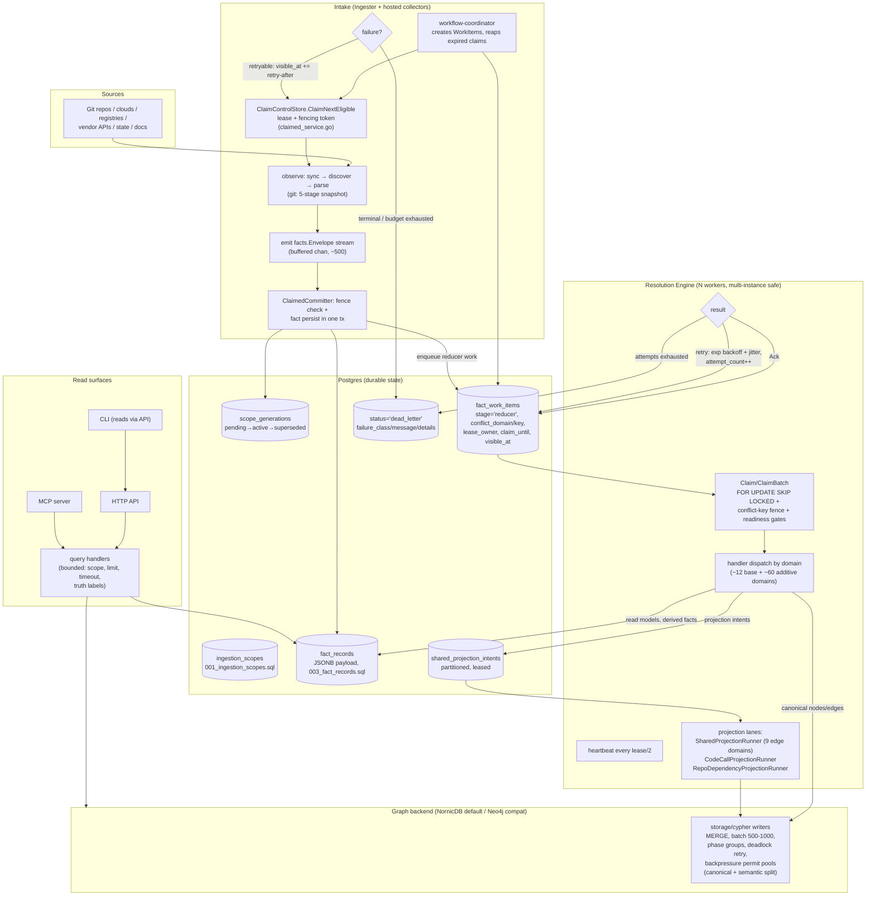
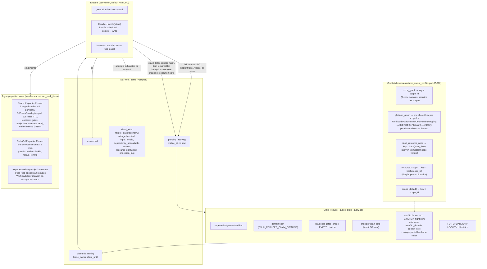

# Architecture Review 2026-07: Flow, Contracts, OSS Readiness, Scale

A point-in-time deep review of the whole pipeline (July 2026), produced from
direct reads of the docs and code. Every claim cites the file or doc it came
from; claims that are inference rather than a stated decision are marked
**(inferred)**. File-and-line citations are accurate as of commit `6191a5426`;
verify before relying on exact line numbers later.

This review motivated the
[Contract System v1 design](design/contract-system-v1.md); the contract
sections here (Part C) are superseded by that design where they differ.

**Review contents:**

- Part A (this file) — the real flow, in plain English.
- Parts B, C, D — [Direction, Contracts, OSS
  Readiness](architecture-review-2026-07-direction-contracts-oss.md).
- Parts E, F, and the prioritized punch list — [Performance and
  Scale](architecture-review-2026-07-performance-scale.md).

## Corrections to common assumptions

Five things frequently assumed about this codebase that are wrong or stale:

1. **The reducer conflict key is not `(scope_id, generation_id,
   repository_id)`.** It is a per-domain `(conflict_domain, conflict_key)`
   tuple computed in
   `go/internal/storage/postgres/reducer_queue_conflict.go:163-212`, enforced
   by a `NOT EXISTS` predicate in the claim SQL
   (`reducer_queue_claim_query.go:83-91`) plus a unique partial index
   `fact_work_items_reducer_live_lease_uniq` on
   `(conflict_domain, conflict_key) WHERE status IN ('claimed','running')`
   (`reducer_queue_helpers.go:21-38`). `generation_id` is *not* part of the
   fence — generation freshness is a separate claim-time filter (superseded
   generations are excluded) and an execute-time check.
2. **"No explicit IDL" is not true.** `specs/fact-kind-registry.v1.yaml` is a
   machine-readable registry mapping every fact family to kinds, schema
   version, reducer domain, projection hook, admission hook, read surface,
   and truth profile, and it generates
   `go/internal/facts/fact_kind_registry.generated.go`. What is missing is
   one level down: payload field schemas ([Part
   C](architecture-review-2026-07-direction-contracts-oss.md#part-c-the-contract-that-should-exist),
   now the contract-system design).
3. **An SDK already exists.** `sdk/go/collector` is a separate public Go
   module (wire protocol `collector-sdk/v1alpha1`, JSON Schema at
   `sdk/go/collector/schema/collector-sdk-v1alpha1.schema.json`) with an
   out-of-tree-capable conformance library (`sdk/go/collector/conformance`),
   an extension host (`go/internal/collector/extensionhost`), a component
   package manager with Sigstore/Cosign trust modes, and a completed
   PagerDuty extraction boundary proof
   (`docs/public/reference/collector-extraction-policy.md`).
4. **Protobuf contract stubs exist but are unwired.**
   `proto/eshu/data_plane/*/v1/` (facts, queue, scope, projection, reducer)
   with `buf.yaml`/`buf.gen.yaml` — but `go/gen/proto` does not exist;
   nothing is generated or imported. Two competing IDL directions coexisted
   with no recorded decision; the contract-system design resolves this by
   demoting the proto tree.
5. **The reducer is already multi-instance-safe by design** — stateless
   workers, Postgres `FOR UPDATE SKIP LOCKED` claims, lease columns, the
   live-lease unique index, and `ESHU_REDUCER_CLAIM_DOMAINS` for domain
   sharding (`go/cmd/reducer/config.go`,
   `go/internal/storage/postgres/reducer_queue.go`). The HA gaps are
   elsewhere ([Part
   E.3](architecture-review-2026-07-performance-scale.md#e3-where-there-is-no-ha-story-today)).

Scale calibration: `go/internal/collector` has 2,082 production Go files
across 45 subdirectories and 23 registered collector kinds
(`go/internal/scope/scope.go:130-155`); `go/internal/reducer` has 865 plus 53
in `go/cmd/reducer`.

---

## Part A — The real flow, in plain English

### A.1 Collector families

All collectors share one lifecycle: the workflow coordinator
(`go/cmd/workflow-coordinator`) creates durable work items in Postgres; a
collector claims one via `ClaimControlStore.ClaimNextEligible` (lease +
fencing token), observes its source, streams `facts.Envelope` records through
a `ClaimedCommitter` that verifies the fence in the same transaction as fact
persistence, then completes/releases/fails the claim
(`go/internal/collector/claimed_service.go:22-330`). Retryable failures honor
provider `Retry-After`; a MaxAttempts budget escalates runaway retries to
terminal with class `attempt_budget_exhausted` (claimed_service.go:247-249,
issue #612). Fairness across families is weighted round-robin
(`fair_claim_dispatcher.go:24-114`). With that shared skeleton, the families
group like this:

- **Git core (the big one).** Top-level `git_*.go` files (~200). Watches: the
  repository set (filesystem or remote). Triggered by bootstrap, schedule, or
  webhook (`workflow/types.go:34-52`). Runs a 5-stage snapshot — discovery
  (`.gitignore`/`.eshuignore`/vendor pruning), pre-scan, optional Go semantic
  pre-scan, byte-balanced parallel parse, materialize — and emits code,
  content, documentation, declared-observability,
  Terraform-backend-candidate, and service-catalog facts. Distinctive:
  largest-first repo scheduling with a dedicated large-repo lane (issues
  #3711, #3839), delta snapshots keyed on `source_commit_sha` that skip
  repo-wide reducer follow-ups, and SCIP indexing as an opt-in with
  native-parser fallback.
- **Document parsers are not collectors.** Markdown/DOCX/PPTX/XLSX/PDF/
  notebook parsing lives in `go/internal/parser` helpers invoked by the Git
  snapshot; what lives in `collector/` are the six **preflight** families
  (`archivepreflight`, `imagepreflight`, `mediapreflight`,
  `diagrampreflight`, `ooxmlpreflight`, `pdfpreflight`) — safety classifiers
  that emit metadata-only warnings *before* any extraction is allowed. Their
  distinctive failure mode is deliberate refusal: unsafe paths, nested
  archives, credential-looking members become warnings, never content.
- **Cloud inventory (`awscloud/`, `gcpcloud/`, `azurecloud/`).** Watch cloud
  control planes via claims sharded by account/region/service (AWS),
  project/folder (GCP), subscription (Azure). Emit resource, relationship,
  tag, DNS, IAM-permission, and posture facts — always metadata-only, with
  raw policy JSON, user-data content, and condition values explicitly never
  persisted (`docs/public/reference/fact-envelope-reference.md`).
  Distinctive: rate-limit errors classify as retryable with provider
  retry-after; GCP uses a per-asset-type extractor registry (146
  `extractor_*.go` files), AWS is an older constants-heavy monolith — see
  drift, [Part
  B](architecture-review-2026-07-direction-contracts-oss.md#part-b-where-the-codebase-is-actually-headed).
- **Registries (`ociregistry/`, `packageregistry/`).** Watch container and
  package registries. Emit manifest/tag/index/descriptor and
  package/version/dependency facts. Distinctive: tags are treated as mutable
  weak evidence, digests as strong identity anchors — the promotion rules
  encode that explicitly.
- **Live observability (`grafana/`, `loki/`, `prometheusmimir/`, `tempo/`).**
  Watch vendor APIs for dashboards, rules, targets, log/trace signals. Emit
  fingerprinted, bounded metadata only (no dashboard JSON, no PromQL, no log
  lines). The *declared* counterparts of these facts come from the Git
  collector parsing IaC. Distinctive failure mode: cardinality limits —
  bounded tag-value counts, fingerprints instead of values.
- **Tickets/docs/incidents (`jira/`, `confluence/`, `pagerduty/`).** Watch
  vendor APIs on their own cadence. Emit work-item, page, and incident
  evidence with aggressive redaction (URL fingerprints, presence booleans).
  PagerDuty is the extraction pilot ([Part
  F](architecture-review-2026-07-performance-scale.md#part-f-sdk-and-repo-split-plan)).
  Distinctive: their facts are
  provenance-only until a reducer corroborates them with stronger evidence —
  a Jira link to a PR does not prove the PR.
- **CI/CD and runtime (`cicdrun/`, `kuberneteslive/`, `vaultlive/`).** GitHub
  Actions runs/jobs/steps/artifacts; read-only Kubernetes core resources;
  Vault metadata. All redacted to join keys and fingerprints.
- **Supply chain (`ospackagevulnerability/`, `vulnerabilityintelligence/`,
  `sbomruntime/`, `sbomdocument/`, `securityalerts/`).** OSV/KEV/NVD/EPSS
  snapshots, OS package inventories, SBOM/attestation documents, Dependabot
  alerts. Distinctive correctness rule: reducers must never compare a distro
  `installed_version_raw` against upstream advisory fixed versions (vendor
  backports), and provider alert state never directly becomes impact truth.
- **State (`terraformstate/`, `tfstateruntime/`).** Terraform state
  snapshots, redacted before emission; backend discovery from Git stays
  exact-only with opaque expression hashes for anything unresolved.
- **Extension/scanner infrastructure (`extensionhost/`, `scannerworker/`,
  `entrypoints/`, `contracttest/`, `parity/`, `sdk/`).** Not sources — the
  hosting, isolation, and test scaffolding that runs out-of-tree components
  and isolated analyzers under the same claim discipline.

### A.2 End-to-end flow

Where things sit: **Postgres** holds scopes, generations, facts, both queues
(`fact_work_items`, `shared_projection_intents`), status, and dead letters.
The **graph backend** holds only canonical projected truth — collectors never
touch it. Retries happen in two places: collector claims (provider-aware
retry-after, attempt budget) and reducer work items (exponential backoff with
jitter, #4450). Dead letters land as rows with `status='dead_letter'` plus a
durable `failure_class` taxonomy
(`go/internal/projector/dead_letter_triage.go:24-61`).

### A.3 Reducer internals

**Idempotency** is proven, not assumed: `idempotency_cases_test.go` replays
handlers with byte-identical input and asserts identical output rows;
Postgres writes are `ON CONFLICT (fact_id) DO UPDATE`, graph writes are
`MERGE` on deterministic UIDs. DeploymentMapping and WorkloadMaterialization
are exempted from the generic harness and proven in dedicated suites.

### A.4 What a generation and a scope actually are

- A **scope** is one shard of a source that can be observed and replaced as a
  unit: a repository, a cloud account/region slice, a registry target, a
  documentation source. Identity is `(source_system, scope_kind, source_key)`
  with a surrogate `scope_id` and a `partition_key` for sharding
  (`schema/data-plane/postgres/001_ingestion_scopes.sql`).
- A **generation** is one complete observation of a scope: a row in
  `scope_generations` with lifecycle `pending → active → superseded`, exactly
  one `active` per scope (unique partial constraint), plus delta metadata
  (`is_delta`, `source_commit_sha`) (`002_scope_generations.sql`). It is how
  consumers separate current evidence from stale rows, and how a crashed or
  re-run collection converges instead of double-counting: re-emitting a fact
  in the same generation hits the same deterministic
  `fact_id = hash(scope_id, generation_id, fact_kind, stable_fact_key)`.
- **Why the conflict fence is shaped the way it is**
  (`(conflict_domain, conflict_key)`): the fence exists to guarantee *at most
  one in-flight writer per graph target class*. Drop `conflict_domain` and
  unrelated domain classes serialize on the same scope — pre-#3672 behavior,
  where ~26k intents serialized instead of partitioning. Drop `conflict_key`
  and every scope in a domain serializes globally. Put `generation_id` *into*
  the key and two generations of the same scope could write the same Platform
  node concurrently — generation ordering is instead handled by claim-time
  supersession filtering plus execute-time freshness checks, which is the
  correct layer for it.

### A.5 How findings actually work today

There is **no first-class Finding/Issue concept anywhere** in the product: no
`Finding` or `Issue` node label among the 109 labels in
`go/internal/graph/schema_tables.go:119-219`. What exists is **four disjoint
domain finding models**: `SupplyChainImpactFinding`
(`go/internal/reducer/supply_chain_impact.go:54-137`),
`AWSCloudRuntimeDriftFindingWriter` (`aws_cloud_runtime_drift.go:35-45`),
`MultiCloudRuntimeDriftFindingWriter` (`multi_cloud_runtime_drift.go`), and
documentation `VerificationFinding`
(`go/internal/doctruth/verifier.go:234-280`). They persist as reducer-emitted
**facts** (kinds like `reducer_supply_chain_impact_finding`), not graph
nodes, and are read back through **four separate MCP tools** with zero shared
severity enum, status enum, or provenance shape. The closest shared shape is
the internal `correlation/model.Candidate`, which is never exposed.
(The `eshu-issue-driver` skill is GitHub process automation and unrelated.)

**Verdict: a unified finding concept is a real gap worth designing — as a
read contract, not a graph node.** Every new domain adds another bespoke
tuple of status/severity/evidence types and another MCP tool; a
security-facing consumer has to know all of them. The right first move is a
thin common **finding envelope** on the query/MCP surface — `finding_id,
domain, severity (normalized + native), status (normalized + native),
scope/repo refs, evidence fact IDs, truth label, suppression state` —
implemented as a union read-model over the existing per-domain stores,
registered per domain the same way fact kinds are registered. Do **not**
collapse the domain truth models themselves; the per-domain rigor is a
feature. **(Design recommendation, inferred from the four-model survey; no
ADR states a position either way.)**
