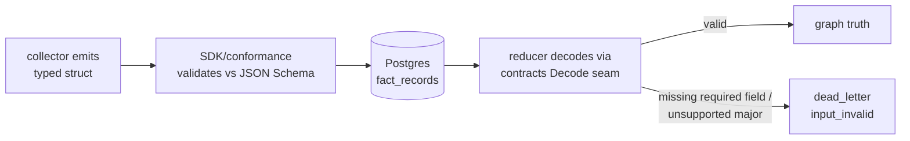

# Contract System — Contributor Summary

The five-minute version of
[Contract System v1](design/contract-system-v1.md), for anyone writing a
collector, touching a reducer handler, or reviewing a PR that changes fact
shapes.

## The one rule

> Every repository imports the contracts. No repository imports another
> repository.

Collectors and the reducer meet only in a versioned contracts module
(`sdk/go/factschema`, alongside the existing `sdk/go/collector`). If you find
yourself wanting the reducer to know a collector-internal name — or a
collector to know reducer internals — the answer is a typed payload struct in
the contracts module, never a duplicated string constant.

## What a fact is, contractually

A fact has two layers, both versioned:

1. **Envelope** (stable, frozen fields): `fact_kind`, `schema_version`,
   `stable_fact_key`, `scope_id`, `generation_id`, `collector_kind`,
   `source_confidence`, `observed_at`, `is_tombstone`, `source_ref`,
   `payload`. Envelope-major mismatches are rejected at admission — this
   already works today.
2. **Payload** (the new part): a typed Go struct per fact kind in
   `sdk/go/factschema/<family>/v1`, with a generated JSON Schema checked in
   next to it. Required fields are validated on decode. A missing required
   field is a classified `input_invalid` dead letter, never a silent empty
   string.

## Emitting facts (collector side)

- Build payloads from the typed structs in the contracts module. Do not build
  `map[string]any` by hand for a kind that has a struct.
- Declare every kind, schema version, and confidence in your manifest; run
  `conformance.Run` (or `eshu component conform`) in CI. It fails closed on
  undeclared kinds, unsupported versions, and schema-invalid payloads.
- Adding an **optional** field: add it to the struct in a contracts PR (minor
  bump), then emit it. The reducer needs no change and will ignore it until a
  handler opts in.
- Removing, renaming, or retyping a field is a **major** bump and needs a
  conversion shim in the same contracts PR. The schema-diff CI gate will not
  let you do this silently.

## Consuming facts (reducer side)

- Handlers call the contracts decode seam
  (for example `factschema.DecodeAWSResource(env)`) and receive the **latest**
  struct. Never read `env.Payload["some_key"]` directly for a typed kind.
- Version shims live in the contracts module, not in handlers. When a payload
  majors, your handler code does not change; the core just bumps its contracts
  dependency.
- If your handler starts requiring a field, it must already be a required
  field in the schema — the payload-usage manifest gate diffs what handlers
  read against what schemas declare.

## What the platform guarantees you

- **At-least-once** delivery; convergence through `stable_fact_key` within one
  (scope, generation). Design for duplicate delivery.
- **No ordering across fact kinds.** Do not encode sequencing assumptions in
  payloads.
- Generation supersession: your previous generation's facts stop being read;
  deletion happens later via retention.
- Unknown fact kinds are stored but unconsumed until a consumer contract
  exists in the registry — "provenance-only" is a legitimate declared state,
  not an error.
- Your dead letters and failure classes are visible through the component
  diagnostics surface; you do not need database access.

## Which repos does my change touch?

| Your change | Where the work lands |
| --- | --- |
| New collector for existing fact kinds | Your repo only. |
| New collector release | Your repo only. |
| Add optional payload field | Contracts (minor) + your repo. |
| Breaking payload change | Contracts (major + shim) + your repo. Core takes a dep bump. |
| New provenance-only fact kind | Your manifest (namespaced kind); optional contracts schema. |
| New fact kind that must become graph truth | Contracts schema + registry entry + a reducer handler. This is the one intentionally coupled case: collectors observe, the resolution engine decides truth. |

## Versioning cheat sheet

| Surface | Version | Break policy |
| --- | --- | --- |
| Wire protocol (`Claim`/`Result`) | `collector-sdk/v1` | Host dual-accepts N and N-1 during deprecation windows. |
| Payload schema | semver per fact kind (in the envelope) | Major = remove/rename/narrow/change meaning. Minor = additive optional. Reducer supports major N and N-1 via shims. |
| Core range | `spec.compatibleCore` in the manifest | Conformance-enforced; only excludes cores that dropped a protocol major. |

## Gates you will meet

1. **Schema-diff gate** (contracts CI) — blocks non-additive schema changes
   without a major bump.
2. **Conformance** (your CI) — validates manifest, kinds, versions, payloads.
3. **Payload-usage manifest** (core CI) — blocks handlers reading undeclared
   fields.
4. **Runtime decode validation** — malformed facts dead-letter as
   `input_invalid` instead of becoming wrong graph truth.

If all four are green, your repo and the core can release independently. That
is the point of the system.
