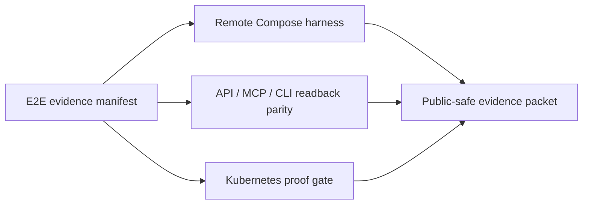

# Full E2E Integration Suite Design

Status: proposed design for issue #1225.

Issues:

- #1225 - parent design and coordination
- #1230 - E2E evidence manifest and representative corpus contract
- #1227 - remote Compose collector and reducer harness
- #1226 - API, MCP, and CLI readback parity gate
- #1229 - Kubernetes E2E proof gate before EKS rollout

Owners: runtime, collector, reducer, API, MCP, and release-gate maintainers.

## 1. Problem

Eshu has strong focused tests and several remote proof scripts, but the current
proof surface is still too easy to misread. A green unit test, a completed
Compose run, a healthy pod, or a merged collector PR does not prove the product
flow works end to end. The suite needs to prove the actual user path:

```text
collect -> facts -> queue -> reducer -> graph/read model -> API/MCP/CLI
```

The suite must validate every supported collector family, reducer-owned truth,
bounded read surfaces, restart behavior, telemetry, and public-safe evidence.
It must also fail closed when evidence is missing, stale, unsupported,
ambiguous, private, retrying, failed, or dead-lettered.

## 2. Goals

- Prove every supported hosted collector can claim work, collect bounded source
  truth, emit source facts, and expose freshness/status.
- Prove reducers consume those facts and project graph or read-model truth
  without hiding retries, blocked work, or dead letters.
- Prove HTTP API, MCP, and CLI readbacks agree on truth, readiness, missing
  evidence, unsupported capability, limits, and truncation.
- Prove clean-volume and preserved-volume runs separately.
- Prove Kubernetes rollout readiness separately from remote Compose.
- Produce one public-safe evidence packet that can be attached to release work.
- Keep the default proof ladder representative before full-corpus, so normal
  changes do not spend hours on broad scans.

## 3. Non-Goals

- This is not a new collector implementation.
- This is not a replacement for focused package tests.
- This is not a full-corpus-only workflow.
- This does not store private repository names, paths, provider URLs, package
  names, account ids, hostnames, tokens, or copied provider payloads in public
  docs, issues, PRs, or evidence.
- This does not make Kubernetes pod health equivalent to Eshu completion truth.

## 4. Proof Architecture

The suite is four layers:

1. **Evidence manifest.** Machine-readable contract for required runtimes,
   collectors, reducer domains, API routes, MCP tools, CLI commands, corpus
   coverage, resource signals, queue state, and privacy rules.
2. **Remote Compose harness.** Runs the representative stack on a remote or
   VPN-attached host and records clean-volume plus preserved-volume evidence.
3. **Readback parity gate.** Drives API, MCP, and CLI against the same scope set
   and writes aggregate parity counts.
4. **Kubernetes gate.** Captures Helm/Kubernetes shape, pprof, logs, resource
   snapshots, queue state, and readback parity before EKS rollout claims.



The manifest owns the common language. Harnesses may be implemented in shell,
Go, or both, but all of them must produce the same evidence envelope.

## 5. Representative Corpus

The default E2E mode is a 20-50 repository representative corpus. Full corpus is
reserved for release confidence, large performance changes, or suspected
scale-only bugs.

Required corpus families:

- JavaScript / TypeScript / npm
- Go modules
- Python / PyPI
- Java / Maven / Gradle
- PHP / Composer
- Ruby / Bundler
- Rust / Cargo
- .NET / NuGet
- Terraform and cloud IaC
- Kubernetes, Helm, and Kustomize
- Dockerfiles, image references, and image metadata
- SBOM or attestation fixtures
- Deployment, workload, service, and environment correlation evidence
- Vulnerability and provider security-alert evidence
- Observability declared or live-provider evidence
- Incident and work-item evidence when configured

The private corpus manifest may contain local paths and provider targets. The
public evidence may contain only aggregate coverage counts, synthetic run ids,
and public issue references.

## 6. Runtime Matrix

The suite must prove these runtimes when enabled:

| Runtime | Required checks |
| --- | --- |
| Schema bootstrap | applies once, restart safe, no degraded completed job semantics |
| API | health, readiness, admin/status, index-status, bounded read routes |
| MCP server | health, tool list, bounded tool readbacks, parity with API |
| Ingester | repository sync progress, facts emitted, no silent clone stalls |
| Resolution engine | queue drain, domain completion, retry/dead-letter proof |
| Workflow coordinator | claim creation, claim ownership, duplicate suppression |
| Webhook listener | optional freshness trigger health and configured scope match |
| Hosted collectors | claim, collect, fact, freshness, metrics, admin status |
| Scanner worker | target admission, resource limits, fact output, pprof |

## 7. Collector Matrix

Every collector must satisfy the same base contract:

- configuration validation fails closed;
- credentials are referenced by environment name or secret, not persisted;
- claim is created and claimed by the expected runtime;
- source fetch succeeds or emits explicit missing evidence;
- expected source facts are committed;
- sensitive fields are redacted or fingerprinted;
- metrics and admin status expose success, failure, rate limit, and freshness;
- reducer consumes the facts or records an explicit unsupported/missing state;
- API and MCP expose the resulting truth or missing evidence;
- restart does not duplicate facts, claims, or findings.

Collectors in scope:

- Git / ingester
- Terraform state
- AWS cloud
- OCI registry
- Package registry
- SBOM attestation
- Provider security alerts
- Vulnerability intelligence
- Scanner worker
- Confluence
- PagerDuty
- Jira
- Grafana
- Prometheus / Mimir
- Loki
- Tempo

## 8. Reducer Domains

The suite must prove reducer-owned truth for these domains when their evidence
exists:

- repository and package dependency projection;
- Terraform and IaC relationship projection;
- AWS cloud resource and relationship projection;
- OCI image identity and digest projection;
- SBOM component and subject attachment;
- vulnerability advisory and package matching;
- provider security-alert reconciliation;
- supply-chain impact findings;
- workload, deployment, service, and environment correlation;
- observability declared, applied, and observed correlation;
- incident and work-item correlation;
- log-derived materialization domains that are enabled in the target stack.

The reducer gate must fail on unexplained retries, failed work, dead letters,
blocked completeness, stale generation handoff, or non-idempotent restart
behavior.

## 9. API, MCP, And CLI Readback

Readback parity is not optional. Facts in storage are not proof that users can
ask for them.

For every required domain, the suite must check:

- summary or count route/tool;
- list route/tool with `limit`, deterministic ordering, and `truncated`;
- detail or explain route/tool where available;
- readiness or coverage state;
- missing evidence response;
- ambiguous selector response;
- empty-but-ready response;
- unsupported capability response;
- timeout and cancellation behavior for expensive reads.

The API, MCP, and CLI outputs must agree on:

- truth level and profile;
- freshness/readiness state;
- count and truncation;
- missing evidence reasons;
- unsupported capability reasons;
- ambiguity classification;
- error envelope shape.

## 10. Observability And Performance

Each run must capture:

- wall time split by collection, bootstrap, reducer drain, and queue-zero;
- queue counts: pending, in-flight, retrying, failed, dead-letter;
- workflow coordinator counts and blocked-completeness rows;
- fact counts by source family;
- reducer domain completion counts;
- Docker or Kubernetes CPU and memory snapshots;
- pprof reachability for heavy or runtime-owning services;
- logs scanned for panic, fatal, OOM, SQLSTATE, NornicDB failures, constraint
  failures, deadlocks, and repeated timeout-shaped errors;
- Eshu commit, image tag candidate, NornicDB tag or digest, schema/bootstrap
  state, corpus mode, and repository count.

Stop and profile if a same-shape representative run is slower than the known
normal band by more than ten percent or sixty seconds, if memory does not
return toward baseline after target completion, or if CPU/disk are idle while
queues remain blocked.

## 11. Evidence Packet

The output envelope should use schema version `1` and include:

- synthetic run id;
- commit and image candidate;
- backend image/digest;
- clean or preserved run kind;
- corpus mode and aggregate coverage;
- collector pass/fail summary;
- fact count summary;
- reducer domain summary;
- queue and workflow summary;
- API/MCP/CLI readback summary;
- pprof/log/resource summary;
- privacy validation status;
- follow-up issue references for missing or failed evidence.

Private values stay in operator-local raw transcripts. Public evidence carries
only aggregate counts, status enums, fingerprints where already accepted by
source-fact contracts, and public issue references.

## 12. Failure Policy

The suite fails closed for:

- missing required collector, reducer, API, MCP, CLI, pprof, logs, or resource
  evidence;
- retrying, failed, or dead-letter work without an accepted missing-evidence
  issue reference;
- ambiguous selectors;
- clean results without readiness proof;
- unsupported inputs reported as clean;
- stale provider or source generation reported as current;
- private-looking evidence in public packets;
- Kubernetes health used as a substitute for Eshu queue/readback truth.

## 13. Implementation Order

1. #1230 - evidence manifest and corpus contract.
2. #1227 - remote Compose collector and reducer harness.
3. #1226 - API, MCP, and CLI readback parity.
4. #1229 - Kubernetes proof gate.

The lanes are intentionally independent after #1230. Remote Compose and
readback parity can be developed in parallel once the manifest schema is stable.
Kubernetes should reuse both contracts rather than inventing a separate proof.

