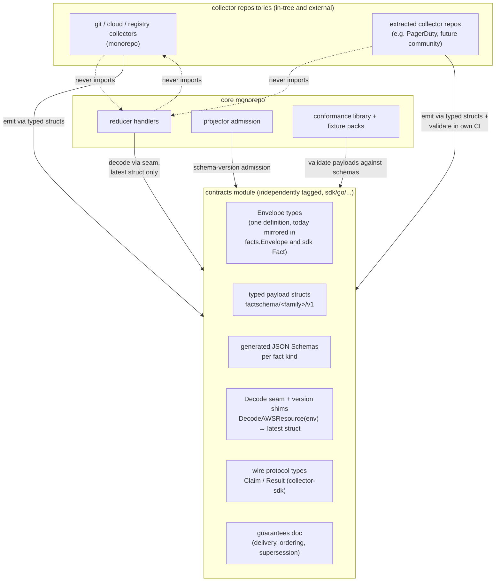
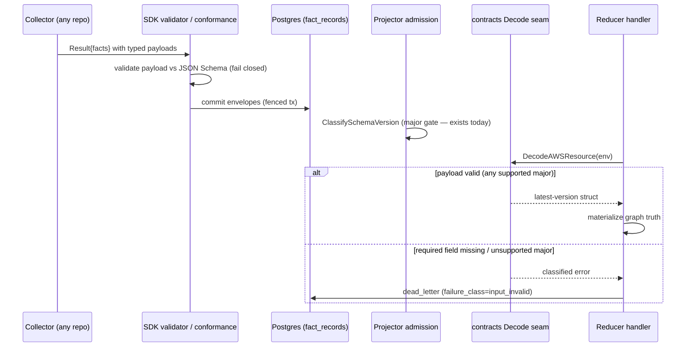
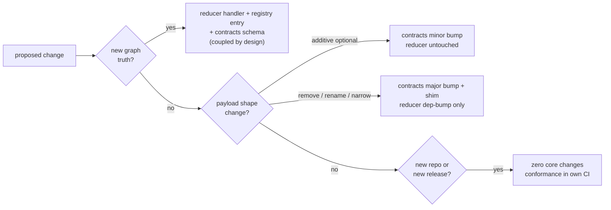

# Contract System v1: Versioned Collector ↔ Reducer Contracts

Status: proposed design, epic tracked on GitHub (`type:epic`,
`capability:extensions`, `risk:schema`).
Audience: maintainers and implementing agents.
Companion contributor summary:
[Contract System Contributor Summary](../contract-system-contributor-summary.md).
Background analysis: [Architecture Review 2026-07](../architecture-review-2026-07.md).

## 1. Problem

Eshu's collector ↔ reducer boundary is versioned down to the fact envelope and
no further. The envelope (`go/internal/facts/models.go`) carries a semver
`SchemaVersion`, admission classifies it
(`go/internal/projector/schema_version_admission.go`), and
`specs/fact-kind-registry.v1.yaml` maps every fact kind to its reducer domain
and read surface. But the **payload** — the part that actually carries the
data — is `map[string]any`, persisted as unvalidated JSONB
(`schema/data-plane/postgres/003_fact_records.sql`), and consumed through
helpers like `payloadString(env.Payload, "account_id")` that return `""` when
a key is missing (`go/internal/reducer/aws_relationship_join.go`).

Two consequences:

1. **Accuracy hole.** A collector that renames or drops a payload key does not
   produce an error, a retry, or a dead letter. It produces empty-string graph
   identities — silent wrong truth, which the Life Motto ranks as the worst
   possible failure.
2. **Multi-repo blocker.** We intend to move collector families out of the
   monorepo (see
   [Collector Extraction Policy](../../public/reference/collector-extraction-policy.md))
   and accept third-party collectors through the SDK. An implicit contract
   held together by string literals duplicated across packages (see the
   intentional duplication comments in
   `go/internal/reducer/iam_can_assume_edge_rows.go`,
   `ec2_uses_profile_edge_rows.go`, `s3_logs_to_edge_rows.go`, and siblings)
   cannot survive independent release cadences.

This design makes the payload the contract, so that a change in one repository
is either provably compatible or mechanically rejected — and so that adding
collector repositories does not require touching reducer surfaces except where
new graph truth is introduced.

## 2. Design principle

> Every repository imports the contracts. No repository imports another
> repository.

Collector repositories never import the reducer. The reducer never imports
collectors. Both meet only in a versioned, independently tagged contracts
module. The contracts module imports nothing from either side.



## 3. The five contract artifacts

### 3.1 The contracts module

One independently tagged Go module, following the existing
`sdk/go/collector` subdirectory-module precedent. Proposed layout:

```text
sdk/go/factschema/
  envelope.go            # the single envelope definition
  decode.go              # kind-keyed decode registry
  aws/v1/                # one package per family per major
    resource.go          # typed payload struct per fact kind
    ...
  incident/v1/
  schema/                # generated JSON Schemas, checked in
    aws_resource.v1.schema.json
    ...
```

Rules:

- Required payload fields are non-pointer struct fields validated on decode.
  Optional fields are pointers or `omitempty`.
- The module imports nothing under `go/internal/...`. This is the same
  constraint `sdk/go/collector` already satisfies.
- JSON Schemas are generated from the structs (for example with
  `invopop/jsonschema`) and checked in, so non-Go collectors and the
  conformance validator have a language-neutral contract.
- The `specs/fact-kind-registry.v1.yaml` registry gains a v2 field per kind:
  `payload_schema:` referencing the schema artifact, plus `deprecated_in:` /
  `removed_in:` markers per kind and per field.

### 3.2 The decode seam (version shims live in the contracts, not the reducer)

The reducer only ever codes against the **latest** struct. Version handling is
the contracts module's job:

```go
// contracts module — sketch
func DecodeAWSResource(env Envelope) (awsv1.Resource, error) {
    switch major(env.SchemaVersion) {
    case 1:
        return decodeAndValidate[awsv1.Resource](env.Payload)
    case 2:
        v2, err := decodeAndValidate[awsv2.Resource](env.Payload)
        if err != nil {
            return awsv1.Resource{}, err
        }
        return downgradeV2ToV1View(v2), nil // shim ships with the contracts release
    default:
        return awsv1.Resource{}, ErrUnsupportedMajor
    }
}
```

Decode failures are classified failures: a missing required field becomes an
`input_invalid` dead letter (the existing triage class in
`go/internal/projector/dead_letter_triage.go`), never an empty-string graph
identity.



### 3.3 The wire protocol

`collector-sdk/v1alpha1` (`sdk/go/collector/types.go`) promoted to `v1` with
its shape unchanged: bounded `Claim` in (scope, generation, fencing token,
attempt, deadline, config handle), `Result` out
(`complete | unchanged | partial | retryable | terminal`, facts, bounded
statuses). The host advertises accepted protocol versions in the `Contract`
it already sends; on a future breaking protocol change the host dual-accepts
N and N-1 for a stated window (two minor core releases minimum). It never
dual-emits.

This remains a JSON wire contract, deliberately not gRPC: the
collector→reducer boundary is store-and-forward through Postgres, so there is
no RPC hop where transport-level typing would help, and proto3's
optional-everything field semantics would reproduce the silent-zero-value
failure this design exists to eliminate. The unwired `proto/eshu/data_plane`
tree is demoted by this design: it may later be regenerated **from** the Go
schema package as a transport option, or deleted. It is not a source of truth.

### 3.4 The guarantees document

A public reference page stating what the reducer promises to any collector,
so collector authors never read reducer source to learn the rules:

- Delivery is **at-least-once**; never exactly-once. Idempotent convergence is
  via `stable_fact_key` within (scope, generation).
- **No ordering across fact kinds.** Within the write path, serialization is
  per `(conflict_domain, conflict_key)`, an internal detail collectors must
  not depend on.
- Generation supersession means old facts stop being read, not that they are
  deleted immediately (retention runner owns deletion).
- Unknown fact kinds are **stored but silently unconsumed** unless a consumer
  contract exists in the registry. Provenance-only is a valid, declared state.
- Dead letters and failure classes are visible to component authors through
  the component diagnostics surface without database access.

### 3.5 Fixture packs and conformance

The producer side exists: `sdk/go/collector/conformance` runs out-of-tree in a
collector repo's CI. Two additions close the loop:

1. **Payload validation in conformance.** `conformance.Run` validates fixture
   payloads against the checked-in JSON Schemas, not only kind, version, and
   confidence.
2. **Versioned fixture packs.** The fixtures the in-tree reducer tests and the
   golden-corpus gate consume are packaged and released in lockstep with the
   contracts module. An external collector pins a fixture-pack version and
   proves in its own CI that it emits exactly the shapes the target reducer
   release consumed.

## 4. The change matrix

The purpose of the whole design in one table: which repositories a given change
touches.

| Change | Collector repo | Contracts module | Reducer / core |
| --- | --- | --- | --- |
| New collector repo emitting existing kinds | new repo, manifest, conformance in own CI | — | **nothing** |
| New collector release (fixes, perf) | tag + release | — | **nothing** |
| Additive optional payload field | bump contracts dep, emit it | minor bump: struct field + schema regen | **nothing** until a handler wants the field |
| New provenance-only fact kind | declare namespaced kind in manifest | optional schema registration | **nothing** (stored, unconsumed — existing `unknown_kind` behavior) |
| Breaking payload change | emit new major | major bump + conversion shim | dep bump + recompile; handler code unchanged |
| Wire protocol revision | SDK dep bump on own schedule | protocol version added | host dual-accepts; no handler changes |
| New fact kind that must become graph truth | emit it | schema + registry entry | **a reducer handler — required, and correctly so** |

The last row is the deliberate coupling. Collectors observe; the resolution
engine decides truth. A new kind of truth means new reducer code by
architecture, not by accident. Everything above that row is decoupled by the
contracts module.



## 5. Versioning and compatibility policy

Three independently versioned surfaces:

| Surface | Scheme | Compatibility rule |
| --- | --- | --- |
| Wire protocol | `collector-sdk/v1`, `v2`, ... | Host dual-accepts N and N-1 for ≥2 minor core releases; extensions pin one. |
| Payload schema (per fact kind) | semver, already carried in the envelope | Reducer decodes major N and N-1 via contracts shims. `unsupported_minor` (collector ahead) stays quarantined-not-authoritative, as today. Major = remove/rename key, narrow a type, change stable-key derivation, change meaning. Minor = additive optional. Patch = docs. |
| Core range | `spec.compatibleCore` in the component manifest | Excludes cores that dropped a protocol major; already enforced by conformance. |

Deprecation mechanics: registry v2 `deprecated_in` / `removed_in` per kind and
field; conformance warns on deprecated usage; the schema-diff gate (below)
blocks silent breaks.

## 6. Enforcement gates

Contracts decouple repositories only if breaking them silently is mechanically
impossible:

1. **Schema-diff gate** (contracts CI): diff generated JSON Schemas against
   the last tag. Any removed, renamed, or narrowed field without a major bump
   fails the build. This is the `buf breaking` equivalent for this stack.
2. **Payload-usage manifest** (core CI): generated from the typed decode
   calls, listing which payload fields each reducer domain reads. A diff
   catches the reverse break — a reducer starting to require a field no
   schema declares — before an external collector discovers it in production.
3. **Conformance payload validation** (collector CI, in-tree and external):
   fail closed on undeclared kinds, unsupported versions, and now
   schema-invalid payloads.
4. **Typed decode with `input_invalid` dead-lettering** (runtime): the final
   backstop; malformed facts become visible operator events instead of wrong
   graph truth.

## 7. Migration plan

Incremental, family by family, accuracy first:

1. **Scaffold** the contracts module: envelope unification (generate or alias
   `facts.Envelope` and `sdk/go/collector.Fact` from one definition), the
   decode registry, validation helpers, schema generation.
2. **First family: AWS/IAM/security-group.** These reducer domains have the
   most raw `payloadString` lookups and the duplicated string constants. Move
   their payloads into typed structs, convert handlers to the decode seam,
   delete the duplicated constants. Each PR carries a regression test proving
   a missing required field now dead-letters as `input_invalid`.
3. **Gates**: land the schema-diff gate with the first schemas; land the
   payload-usage manifest once two families are typed.
4. **Registry v2** fields and the guarantees doc.
5. **Fixture packs** and conformance payload validation.
6. **Remaining families** migrate opportunistically; a family must be typed
   before its collectors are eligible for extraction
   (this becomes an additional row in the
   [Extraction Criteria](../../public/reference/collector-extraction-policy.md#extraction-criteria)).
7. **PagerDuty extraction** (already the reference proof) re-runs on the new
   contracts as the end-to-end dogfood: external repo, pinned contracts
   version, conformance + fixture pack in its own CI, dual-run parity window,
   then `external_ready`.

Per-stage verification follows repository rules: failing regression tests
first for behavior changes, focused package gates, docs build for doc
changes, and `eshu-code-review` before every PR.

## 8. Explicit non-goals

- **Not gRPC.** No RPC hop exists at this boundary; see 3.3.
- **Not exactly-once delivery.** At-least-once plus idempotent convergence is
  the model; the guarantees doc makes it explicit instead of implicit.
- **Not a reducer plugin system.** Truth synthesis stays core-owned. The
  contract governs evidence in, not truth out.
- **Not a big-bang payload migration.** JSONB storage, existing payload-key
  indexes, cassettes, and golden-corpus fixtures all keep working; typing is
  introduced at emit and decode, family by family.

## 9. Relationship to existing assets

| Asset | Disposition |
| --- | --- |
| `sdk/go/collector` (types, validator) | Kept; becomes the wire-protocol half of the contracts surface; validator extended with schema validation. |
| `sdk/go/collector/conformance` | Kept; extended per 3.5. |
| `specs/fact-kind-registry.v1.yaml` + generated Go | Kept; extended to v2 (`payload_schema`, deprecation markers). |
| `facts.ClassifySchemaVersion` / projector admission | Kept unchanged; it is the envelope-level gate this design builds beneath. |
| `proto/eshu/data_plane/*` | Demoted: future transport candidate generated from the Go schema package, or deleted. Not a source of truth. |
| Duplicated payload-key string constants in reducer files | Deleted as each family migrates to typed structs. |
