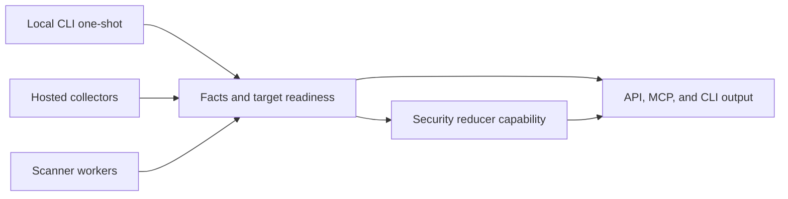

# Security Intelligence Implementation Plan

> **For agentic workers:** Implement this plan one chunk at a time. Use
> separate workers for independent chunks when available, keep each step tracked
> with checkbox (`- [ ]`) syntax, and record the verification evidence before
> marking a chunk complete.

**Goal:** Build Eshu security intelligence so vulnerability impact answers are
at least as complete as supported provider-hosted alerts when equivalent target
evidence exists, while adding code-to-cloud context and preserving explainable
readiness for zero-finding states.

**Architecture:** Keep collectors and scanner workers as fact emitters,
reducers as truth owners, API/MCP/CLI as bounded readers, and provider-alert
comparison as a private validation gate that records aggregate mismatch classes
only.

**Tech Stack:** Go CLI/services, Postgres facts/read models/queues, NornicDB
graph, workflow coordinator, reducer lanes, OTEL metrics/spans/logs, MkDocs,
remote Compose, and Kubernetes.

---

## Performance Impact Declaration

Stage: security target collection, package/advisory matching, reducer-owned
supply-chain impact, and future local one-shot vulnerability scanning.

Expected cardinality: one developer repository for local mode; hundreds to
thousands of repositories, package versions, advisories, image digests, and
workload references for hosted mode.

Known risk: SBOM generation, image unpacking, source analyzers, package metadata
expansion, and wide advisory joins can be CPU, memory, and I/O heavy.

Proof ladder: focused fixture tests, one-repository local scan proof,
multi-repository remote Compose proof, full-corpus remote proof, preserved-volume
restart, provider-alert parity comparison, then Kubernetes proof with pprof and
queue telemetry enabled.

Stop threshold: stop and profile if full-corpus timing regresses by more than
about ten percent, queue age rises while workers are busy, memory grows without
returning to baseline after target completion, retries/dead letters appear, or
provider-alert parity mismatches cannot be classified.

## Design Guardrails

- [ ] Do not commit private repository names, provider alert URLs, package names,
  tokens, account ids, or copied provider payloads.
- [ ] Do not publish a CLI command claim until the command exists in Cobra,
  tests, docs verifier truth, and runtime proof.
- [ ] Keep hosted and local vulnerability answers on the same finding envelope,
  readiness model, and reducer-owned matching rules.
- [ ] Treat zero findings as incomplete unless coverage/readiness proves the
  required target families were collected.
- [ ] Move CPU/RAM-heavy scan work to dedicated claim-driven scanner workers
  instead of loading the default reducer lane.
- [ ] Use reducer lanes for bounded matching and correlation when security work
  competes with normal projection.

## Execution Map

## Chunk 1: Architecture Contract

- [ ] Update public security-intelligence docs with target/capability,
  reducer/worker, readiness, provider-alert parity, and local one-shot CLI
  design.
- [ ] Link the contract from roadmap, collector readiness, API supply-chain, and
  MkDocs navigation.
- [ ] Add this internal implementation plan for future subagent execution.
- [ ] Update issue #599 with the design PR, remaining implementation chunks, and
  generic provider-alert parity wording.
- [ ] Run focused docs verification, broad docs verification, strict MkDocs, file
  size check, and diff whitespace check.

## Chunk 2: Target And Readiness Model

- [ ] Add tests for security target states: not configured, target incomplete,
  evidence incomplete, unsupported, ready zero findings, and ready with findings.
- [ ] Add a typed readiness package or extend the current supply-chain read
  model without duplicating vulnerability logic.
- [ ] Persist target coverage and freshness separately from findings.
- [ ] Expose bounded read methods that require repository, package, image digest,
  advisory, service, workload, environment, or status anchors.
- [ ] Add OTEL counters and spans for target readiness calculation if existing
  query and reducer signals do not diagnose it.

## Chunk 3: Provider Alert Ingestion And Parity

- [ ] Model provider-hosted alerts as source facts with advisory ids, manifest
  anchors, package identity, state, freshness, and provenance.
- [ ] Keep provider alerts separate from Eshu impact findings until reducer
  matching admits owned evidence.
- [ ] Build a private validation command or script that compares aggregate
  provider alert counts to Eshu findings without writing private data to the
  repo.
- [ ] Classify mismatches as target collection, advisory ingestion, version
  matching, unsupported ecosystem, provider-only behavior, or reducer bug.
- [ ] Add fixtures using synthetic provider-alert payloads only.

## Chunk 4: Advisory And Package Matching

- [x] Normalize CVE, GHSA, OSV, package ecosystem, affected range, fixed version,
  CVSS, EPSS, KEV, CWE, and withdrawn metadata into source facts.
- [x] Track package identity normalization in
  [#602](https://github.com/eshu-hq/eshu/issues/602): npm, PyPI, Go, Maven,
  Composer, RubyGems, Cargo, NuGet, OS, and generic identities now share
  canonical package ID, PURL, BOMRef, package manager, and source-debug fields
  across package-registry facts, OSV/GLAD affected-package facts, reducer
  joins, graph projection, and package-registry API/MCP reads.
- [ ] Add version-range regression tests for exact lockfile versions, manifest
  ranges, aliases, pre-releases, fixed versions, yanked or withdrawn advisories,
  and unsupported ecosystems.
- [ ] Keep package-registry metadata as source metadata unless repository,
  lockfile, image, or SBOM evidence proves use.
- [ ] Record missing evidence reasons when a source advisory cannot become a
  user-facing impact finding.
- [x] Track GitLab Advisory Database (Gemnasium) parser progress in
  [#607](https://github.com/eshu-hq/eshu/issues/607).
- [x] Add a GitLab/Gemnasium source adapter behind the shared advisory
  ingestion boundary that preserves `package_slug`, source ecosystem, package
  name, raw and parsed `affected_range`, human-readable
  `affected_versions`/`not_impacted`, multiple `fixed_versions` (including
  prerelease and `+build` branches), CVSS v2/v3/v4 vectors, CWE IDs, URLs,
  and source advisory UUID. Identifiers are normalized into CVE and GHSA
  payload anchors while keeping GLAD provenance via source-namespaced stable
  fact keys.
- [x] Add range parser tests for compact multi-branch ranges and prerelease
  fixed versions. Add conflict tests for cases where GLAD, OSV, and NVD
  disagree on range, severity, or fixed version. Reducers own the resolution;
  the adapter only preserves the disagreement.
- [x] Preserve advisory provenance in reducer admission (#601): consolidate
  multi-source CVE and affected_package observations per
  `(cve_id, package_id)`, select severity, fixed-version, and vulnerable-range
  using documented per-ecosystem source priority, keep alternate severities
  and per-source fixed-version branches, surface withdrawal timestamps, and
  expose the provenance block through the supply-chain impact API and MCP.
- [x] Expose source-only advisory evidence without implying impact (#589):
  `GET /api/v0/supply-chain/advisories/evidence` and MCP
  `list_advisory_evidence` group active GHSA/CVE/NVD, OSV, GLAD, EPSS, KEV,
  CWE, reference, affected package range/fixed-version, affected product/CPE,
  withdrawn, and source-disagreement evidence under a canonical advisory
  identity. The route requires a CVE, advisory, or package anchor plus `limit`
  and does not publish reducer impact truth.

Status 2026-05-24: `GitLabAdvisoryEnvelopes` plus `ParseGitLabAffectedRange`
land in `go/internal/collector/vulnerabilityintelligence` as a pure parser
behind the shared advisory ingestion boundary. The slice does not add an HTTP
client, cache, or freshness lifecycle so it can be wired by the shared source
interface in [#603](https://github.com/eshu-hq/eshu/issues/603) without
re-shaping the fact payload. GLAD facts use `source_confidence=reported` and
`source: "glad"` so they coexist with OSV/NVD/GHSA observations of the same
CVE.

No-Regression Evidence:
`go test ./internal/collector/vulnerabilityintelligence -count=1` keeps the
surrounding OSV/KEV/EPSS/NVD contract green and adds the GLAD coverage
listed in
[Security Intelligence — Advisory Source Coverage](../public/reference/security-intelligence.md#advisory-source-coverage).

No-Observability-Change: the GLAD adapter emits existing
`vulnerability.cve`, `vulnerability.affected_package`,
`vulnerability.reference`, and `vulnerability.source_snapshot` fact kinds. No
new metric, span, log key, queue, reducer lane, graph write, or runtime
worker is introduced.

Status 2026-05-24: supply-chain impact matching now keeps source-only advisory
intelligence out of user-facing findings until reducer evidence joins it to an
owned package manifest, lockfile, repository, image, or SBOM anchor. Exact
package-lock versions carry dependency path, depth, and direct/transitive
metadata through package-consumption and impact facts. Package-registry
collection uses abbreviated npm packuments for large metadata bodies, and
coordinator-derived package and OSV targets stay bounded to exact owned npm
versions.

No-Regression Evidence:

- `go test ./internal/reducer -run 'TestBuildSupplyChainImpactFindings(SkipsProductOnlyEvidenceWithoutOwnedSBOM|ClassifiesEvidencePaths|SkipsNonVulnerableNVDProductCriteria|DerivesProductImpactFromSBOMCPE|RequiresAffectedVersionForExactImpact)' -count=1`
- `go test ./internal/parser/json -run 'TestParsePackage(JSON|LockJSON)' -count=1`
- `go test ./internal/reducer -run 'TestBuildSupplyChainImpactFindings(UsesOwnedLockfileVersion|LeavesRangeDependencyPossiblyAffected|MarksOwnedFixedVersionKnownFixed)' -count=1`
- `go test ./internal/parser/json -run 'TestParsePackageLockJSON(PreservesDependencyChainRows|EmitsExactDependencyRows)' -count=1`
- `go test ./internal/reducer -run 'TestBuildPackageConsumptionDecisionsPreservesLockfileDependencyChain|TestPostgresPackageCorrelationWriterPersistsOwnershipAndConsumptionFacts|TestBuildSupplyChainImpactFindingsExposesDependencyChain' -count=1`
- `go test ./internal/collector/packageregistry/packageruntime -run TestHTTPMetadataProviderRequestsAbbreviatedNPMPackument -count=1 -v`
- `go test ./internal/coordinator ./internal/workflow ./internal/storage/postgres ./internal/collector/packageregistry/packageruntime ./internal/collector/vulnerabilityintelligence/vulnruntime ./cmd/workflow-coordinator ./cmd/collector-package-registry ./cmd/collector-vulnerability-intelligence -count=1`

Remote proof `pr573-anchored-impact-20260523T162055Z` completed a 45-repository
smoke corpus with `435/435` queue rows succeeded, zero pending, retrying,
failed, or dead-letter rows, and no unanchored supply-chain impact findings.
Remote proof `pr573-lockfile-impact` proved exact `ws@8.20.0` lockfile impact
truth through package-registry and OSV collection. Remote proof
`pr577-vite-packument` proved the abbreviated npm packument path for
`vite@5.4.21` with succeeded source-local, package-source-correlation, and
supply-chain-impact work. Remote hosted E2E run
`vulnerability-targets-20260524T050624Z` reached queue-zero with `9150/9150`
fact work items succeeded, then continued active hosted collector scheduling
with `9513` succeeded work items, `4` outstanding active collector items,
`214` package-registry packages, `21,420` package versions, `129` CVEs,
`201` affected packages, and `56` supply-chain impact facts.

Observability Evidence: existing supply-chain impact reducer counters, evidence
paths, missing-evidence payloads, `query.supply_chain_impact_findings` spans,
Postgres query duration metrics, workflow work-item status/failure columns,
package-registry request and fact-emission metrics, vulnerability-intelligence
observation and fetch metrics, API/MCP truth envelopes, and `/api/v0/index-status`
explain whether impact came from exact lockfile evidence, a manifest range, an
image/SBOM path, or source-only advisory intelligence. No package names,
versions, URLs, delivery IDs, or credential material were added to metric labels.

Status 2026-05-25: Cargo dependency coverage now parses `Cargo.toml` and
`Cargo.lock` through the Rust parser exact-name path. Manifest rows preserve
direct dependency ranges, dev/build/runtime scope, target-specific dependency
sections, workspace-inherited dependency rows, and renamed package identity.
Lockfile rows preserve exact crate versions and emit dependency path/depth
metadata only when the lockfile root graph proves reachability. Cargo exact
versions participate in the reducer-owned semver matcher with Cargo-specific
match reasons instead of falling through the unsupported-ecosystem path.

No-Regression Evidence:

- `go test ./internal/parser -run 'TestCargoDependencyCoverageMatrixMarksCargoFilesCovered|TestDefaultEngineParsePathCargo' -count=1`
- `go test ./internal/parser/json -run 'TestDependencyCoverageMatrixIsStableAndExhaustive|TestDependencyCoverageCoveredFilesEmitDependencyRows' -count=1`
- `go test ./internal/reducer -run 'TestBuildPackageConsumptionDecisions(MatchesCargoRenamedPackage|KeepsCargoLockfileWithoutProofUnchained)|TestBuildSupplyChainImpactFindings(UsesCargoLockfileVersion|MarksCargoLockfileVersionKnownFixed)' -count=1`

No-Observability-Change: Cargo coverage reuses existing parser payloads,
`content_entity` dependency rows, package-consumption facts,
`reducer_supply_chain_impact_finding`, `match_reason`, and the existing
`query.supply_chain_impact_findings` read span. It adds no metric instrument,
span, log key, queue, reducer lane, graph write, scanner worker, or runtime
configuration knob.

No-Regression Evidence: `go test ./internal/packageidentity ./internal/collector/packageregistry ./internal/collector/vulnerabilityintelligence ./internal/reducer ./internal/projector ./internal/storage/cypher ./internal/query -count=1`
proves #602 package identity fields normalize at the collector boundary,
survive graph projection, keep OSV/GLAD affected-package facts on canonical
package IDs, join manifest dependencies by normalized ecosystem aliases, and
return through package-registry API/MCP routes without unbounded query changes.

No-Observability-Change: #602 adds identity fields to existing facts, graph
nodes, and bounded read responses only. Existing package-registry collector
fact counters, reducer queue metrics, canonical phase spans, query spans, and
HTTP truth metadata still identify the running stage, row count, status, and
failure class.

## Chunk 5: Local One-Shot CLI

- [x] Track implementation in #613.
- [x] Design the local vulnerability scan command as an orchestration wrapper
  over local Eshu services, not a separate truth engine.
- [x] Reuse existing local workspace/root resolution.
- [x] Add local service attach or startup behavior when no API is already
  available.
- [x] Collect only the selected repository scope and fetch advisory/package
  evidence needed by observed owned packages unless a broader option is set.
- [x] Emit JSON and terminal summaries from the same finding/readiness envelope
  used by API and MCP.
- [x] Cache advisory source metadata locally with freshness markers and a
  fail-closed stale-data policy.
- [x] Add focused tests before registering the public command and docs claim.

Status 2026-05-24: `eshu vuln-scan repo [path]` exists as a thin orchestration
wrapper over the same local and hosted read paths. When a service URL is
configured, it uses that API. When no API is configured, it starts or attaches to
the workspace-local authoritative owner, launches a short-lived loopback API
reader attached to that owner, passes the owner-derived Postgres and graph env
to `eshu-bootstrap-index`, runs the existing local scan readiness contract,
resolves the scanned repository id, fetches bounded repository-scoped
supply-chain impact findings, emits JSON and terminal summaries, and fails
closed when target readiness is incomplete.

Status 2026-05-25: scoped target derivation and an explicit `--broad`
override are wired into the CLI. The default scoped mode derives observed
packages, advisory sources, package-registry coverage, per-source cache state,
worst freshness, and a stop threshold from the readiness envelope returned by
`/api/v0/supply-chain/impact/findings`, surfaces them as `data.scope_plan`,
and applies two additional CLI-side fail-closed guards: any required source
snapshot with `freshness == "stale"` downgrades the answer to
`evidence_incomplete`, and any required source snapshot with `complete:
false` downgrades the answer to `target_incomplete`. `--broad` skips those
guards, sets `data.scope_mode = "broad"`, attaches a warning that the wider
mode skipped the scoped checks, and returns the server's verdict unchanged.
`data.scan_performance` records started_at, completed_at, wall_time_ms,
repository_size_bytes, repository_file_count, observed_packages,
advisory_sources, package_registry_packages, cache_freshness, scope_mode, and
stop_threshold on every run.

No-Regression Evidence: `go test ./cmd/eshu -run
'TestVulnScanRepoCommandRegistersBroadFlag|TestRunVulnScanRepoDefaultScopedModeAttachesScopePlanAndPerformance|TestRunVulnScanRepoScopedModeFailsClosedOnStaleAdvisoryCache|TestRunVulnScanRepoScopedModeFailsClosedOnIncompleteAdvisoryCache|TestRunVulnScanRepoBroadModeSkipsScopeGuards|TestRunVulnScanRepoScopedModeSurfacesEvidenceIncompleteWhenNoOwnedDeps'
-count=1` covers the new contract: --broad flag registration, scoped scope
plan and performance attachment, scoped fail-closed for stale advisory
cache, scoped fail-closed for incomplete advisory snapshot, broad-mode
pass-through with explicit skipped-guard warning, and pass-through when the
server already classifies the response as `evidence_incomplete`. The
surrounding `go test ./cmd/eshu -count=1` suite continues to pass after the
findings-stub responses in existing tests were updated to include the
production readiness envelope shape.

Performance Evidence: the focused tests above run under 0.5s on Go 1.26.3
darwin/arm64 with the local authoritative-owner stubs and synthetic
readiness envelopes. The scope plan and `data.scan_performance` are computed
without additional HTTP, queue, or graph work; the only added measurement is
a bounded `filepath.WalkDir` over the scanned repository root to record
`repository_size_bytes` and `repository_file_count`, with read errors
treated as missing footprint rather than fatal so a transient filesystem
issue cannot block the report.

No-Regression Evidence: `go test ./cmd/eshu -run 'Test(PrepareVulnScanLocalRuntime(AttachesExistingAuthoritativeOwner|StartsOwnerWhenMissing)|RunVulnScanRepo(StartsLocalRuntimeWhenServiceURLUnconfigured|UsesConfiguredServiceURLWithoutLocalRuntime|IndexesResolvesRepoAndListsImpactFindings|ReportsReadyZeroFindings|FailsClosedWhenScanIsNotReady)|EvaluateScanReadiness(TreatsActiveGenerationAsCurrentWhenDrained|WaitsForPendingGeneration))' -count=1`
proved local owner attach, local owner startup, loopback API env wiring,
owner-derived bootstrap env, explicit service URL preservation, scoped
repository impact querying, JSON output, ready-zero/ready-with-findings states,
active authoritative generation readiness, pending generation waiting, and
fail-closed submitted-scan behavior. `go test ./cmd/eshu -count=1` keeps the
surrounding CLI contract green after the local runtime attach/start seam.

Performance Evidence: isolated fresh-repository proof with the Go fixture
started a local authoritative owner, ran `eshu-bootstrap-index`, drained the
pipeline, and returned `ready_zero_findings` in 5294 ms total
(`bootstrap_complete_ms=1232`, `readiness_wait_ms=4044`, queue
`succeeded=9`, dead letters `0`).

No-Observability-Change: the command reuses existing local owner logs, child
service logs under the workspace log directory, `eshu scan` readiness signals,
child bootstrap logs, status polling over `/api/v0/status/pipeline`, query
preflight over `/api/v0/repositories?limit=1`, and the API's
`query.supply_chain_impact_findings` span for the bounded read. No new runtime
worker, queue, reducer, graph write path, metric name, or span name is
introduced in this slice.

Status 2026-05-24: vulnerability-intelligence source collection supports
source-cache `refresh` and `offline` modes, configured fallback source mirrors,
retention cleanup, explicit cached fallback after live source failure, and
`RefreshOnly` update-only cache refresh for future CLI/admin orchestration.
Offline replay fails closed when an artifact is missing or stale and rebinds
cached facts to the current workflow generation and fencing token before commit.
The readiness envelope exposes source snapshot cache artifact version, digest,
last update time, freshness, completion state, and bounded warning fields.
Package metadata cache freshness remains a separate follow-up.

No-Regression Evidence:
`go test ./internal/collector/vulnerabilityintelligence/vulnruntime -run 'TestCachedSourceProvider|TestHTTPProviderFallsBackToConfiguredSourceMirror' -count=1`
proved refresh, offline replay, stale/missing fail-closed behavior, explicit
cached fallback after live source failure, update-only refresh, and source
mirror fallback. `go test ./cmd/collector-vulnerability-intelligence ./internal/workflow -run 'Test(LoadClaimedRuntimeConfig(SelectsVulnerabilityInstance|ParsesSourceCacheLifecycle)|VulnerabilityIntelligenceCollectorConfiguration(AcceptsBoundedTargets|AcceptsSourceCacheLifecycle|RejectsInvalidSourceCacheLifecycle|RejectsInvalidFallbackURL))' -count=1`
proved runtime config and workflow validation for cache and mirror settings.

Observability Evidence: cache state is surfaced through
`vulnerability.source_snapshot` payload fields (`cache_artifact_version`,
`cache_snapshot_digest`, `cache_updated_at`, `cache_expires_at`,
`cache_freshness`, and `cache_mode`) and through API/MCP
`readiness.source_snapshots[]`. No raw advisory payloads, package names, source
URLs, or credentials are added to metric labels.

## Chunk 6: SBOM, Image, And Runtime Joins

- [x] Join SBOM components to repository, image digest, service, workload, and
  environment evidence only through explicit subject or deployment evidence.
- [x] Keep tag-only image observations diagnostic until digest identity is proven.
- [x] Add image/runtime impact states without collapsing package-only and
  runtime-reachable findings.
- [ ] Reserve CPU/RAM-heavy SBOM or image extraction for claim-driven scanner
  workers with separate resource limits.

Status 2026-05-25: supply-chain impact reduction now carries repository,
image, workload, service, and environment anchors only through reducer-owned
package consumption, SBOM attachment, container-image identity, CI/CD
correlation, and service-catalog correlation facts. Ambiguous image identity,
stale deployment evidence, missing workload evidence, and missing
service/environment evidence stay in `missing_evidence`. The explain API/MCP
payload includes `impact_path` so callers see both present and missing hops.

No-Regression Evidence:
`go test ./internal/reducer ./internal/query ./internal/storage/postgres -count=1`
proves repo-only, image-only, workload-attached, environment-attached,
ambiguous image, stale deployment, and missing-evidence impact paths; API
explain shaping; active evidence loading; and bounded Postgres query/index
contracts.

Observability Evidence: the path reuses the
`SupplyChainImpactFindings` reducer counter,
`reducer_supply_chain_impact_finding` fact payload, `EvidencePath`,
`missing_evidence`, `runtime_reachability`, `query.supply_chain_impact_findings`
span, `query.supply_chain_impact_explanation` span, and Postgres query
instrumentation. Operators can diagnose which hop is absent from the finding
payload or explanation `impact_path` without a graph query or scanner worker.

## Chunk 7: Scanner Worker Boundary

- [ ] Track implementation in #614.
- [ ] Define a scanner worker contract for heavy analyzers: claim input, target
  scope, resource limits, fact output, retry behavior, and dead-letter payloads.
- [ ] Prove why each heavy analyzer cannot safely run in the default reducer
  lane before adding it.
- [ ] Add pprof, queue age, scan duration, memory, target count, and result count
  telemetry for scanner workers.
- [ ] Document Kubernetes resource guidance and local Compose knobs before
  enabling hosted deployment by default.

## Chunk 8: API, MCP, And Release Gates

- [x] Add readiness metadata to vulnerability impact API and MCP reads.
- [x] Keep list calls scoped, limit-bound, timeout-bound, ordered, and explicitly
  truncated.
- [x] Add MCP tool contract tests for zero findings with incomplete coverage and
  ready zero findings.
- [ ] Run remote clean-volume and preserved-volume proof before any image cut.
- [ ] Run Kubernetes proof with pprof, logs, queue telemetry, no dead letters,
  and resource snapshots before declaring release readiness.

Status 2026-05-24: `GET /api/v0/supply-chain/impact/findings` and the MCP
`list_supply_chain_impact_findings` tool now attach a `readiness` envelope to
every response. The envelope distinguishes `not_configured`,
`target_incomplete`, `evidence_incomplete`, `unsupported`,
`ready_zero_findings`, and `ready_with_findings` using existing source-fact and
reducer-fact counts only. No collector or reducer ownership boundaries were
changed.

No-Regression Evidence:
`go test ./internal/query ./internal/mcp ./cmd/api -count=1` proves the
classification function, the API handler envelope payload, the OpenAPI schema,
the Postgres readiness query shape, the MCP dispatch envelope pass-through,
and the wiring contract.

No-Observability-Change: the readiness path reuses the existing
`query.supply_chain_impact_findings` span and the truth envelope contract; no
new collector, queue consumer, reducer lane, or graph write was introduced.
See [Security Intelligence](../public/reference/security-intelligence.md#vulnerability-impact-readiness-envelope)
for the envelope contract and proven states.
