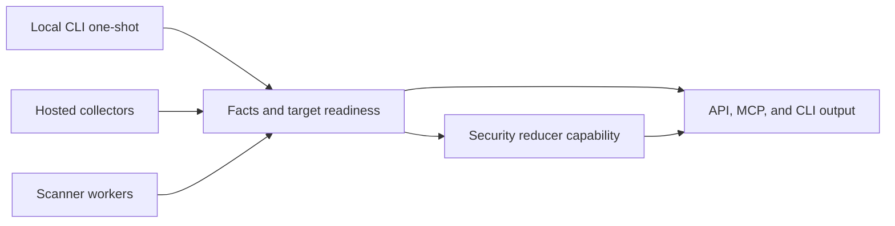

# Security Intelligence Implementation Plan

> **For agentic workers:** REQUIRED: Use superpowers:subagent-driven-development (if subagents available) or superpowers:executing-plans to implement this plan. Steps use checkbox (`- [ ]`) syntax for tracking.

**Goal:** Build Eshu security intelligence so vulnerability impact answers are
at least as complete as supported provider-hosted alerts when equivalent target
evidence exists, while adding code-to-cloud context and preserving explainable
readiness for zero-finding states.

**Architecture:** Keep collectors and scanner workers as fact emitters,
reducers as truth owners, API/MCP/CLI as bounded readers, and provider-alert
comparison as a private validation gate that records aggregate mismatch classes
only.

**Tech Stack:** Go CLI/services, Postgres facts/read models/queues, NornicDB
graph, workflow coordinator, reducer lanes, OTEL metrics/spans/logs, MkDocs,
remote Compose, and Kubernetes.

---

## Performance Impact Declaration

Stage: security target collection, package/advisory matching, reducer-owned
supply-chain impact, and future local one-shot vulnerability scanning.

Expected cardinality: one developer repository for local mode; hundreds to
thousands of repositories, package versions, advisories, image digests, and
workload references for hosted mode.

Known risk: SBOM generation, image unpacking, source analyzers, package metadata
expansion, and wide advisory joins can be CPU, memory, and I/O heavy.

Proof ladder: focused fixture tests, one-repository local scan proof,
multi-repository remote Compose proof, full-corpus remote proof, preserved-volume
restart, provider-alert parity comparison, then Kubernetes proof with pprof and
queue telemetry enabled.

Stop threshold: stop and profile if full-corpus timing regresses by more than
about ten percent, queue age rises while workers are busy, memory grows without
returning to baseline after target completion, retries/dead letters appear, or
provider-alert parity mismatches cannot be classified.

## Design Guardrails

- [ ] Do not commit private repository names, provider alert URLs, package names,
  tokens, account ids, or copied provider payloads.
- [ ] Do not publish a CLI command claim until the command exists in Cobra,
  tests, docs verifier truth, and runtime proof.
- [ ] Keep hosted and local vulnerability answers on the same finding envelope,
  readiness model, and reducer-owned matching rules.
- [ ] Treat zero findings as incomplete unless coverage/readiness proves the
  required target families were collected.
- [ ] Move CPU/RAM-heavy scan work to dedicated claim-driven scanner workers
  instead of loading the default reducer lane.
- [ ] Use reducer lanes for bounded matching and correlation when security work
  competes with normal projection.

## Execution Map

## Chunk 1: Architecture Contract

- [ ] Update public security-intelligence docs with target/capability,
  reducer/worker, readiness, provider-alert parity, and local one-shot CLI
  design.
- [ ] Link the contract from roadmap, collector readiness, API supply-chain, and
  MkDocs navigation.
- [ ] Add this internal implementation plan for future subagent execution.
- [ ] Update issue #599 with the design PR, remaining implementation chunks, and
  generic provider-alert parity wording.
- [ ] Run focused docs verification, broad docs verification, strict MkDocs, file
  size check, and diff whitespace check.

## Chunk 2: Target And Readiness Model

- [ ] Add tests for security target states: not configured, target incomplete,
  evidence incomplete, unsupported, ready zero findings, and ready with findings.
- [ ] Add a typed readiness package or extend the current supply-chain read
  model without duplicating vulnerability logic.
- [ ] Persist target coverage and freshness separately from findings.
- [ ] Expose bounded read methods that require repository, package, image digest,
  advisory, service, workload, environment, or status anchors.
- [ ] Add OTEL counters and spans for target readiness calculation if existing
  query and reducer signals do not diagnose it.

## Chunk 3: Provider Alert Ingestion And Parity

- [ ] Model provider-hosted alerts as source facts with advisory ids, manifest
  anchors, package identity, state, freshness, and provenance.
- [ ] Keep provider alerts separate from Eshu impact findings until reducer
  matching admits owned evidence.
- [ ] Build a private validation command or script that compares aggregate
  provider alert counts to Eshu findings without writing private data to the
  repo.
- [ ] Classify mismatches as target collection, advisory ingestion, version
  matching, unsupported ecosystem, provider-only behavior, or reducer bug.
- [ ] Add fixtures using synthetic provider-alert payloads only.

## Chunk 4: Advisory And Package Matching

- [ ] Normalize CVE, GHSA, OSV, package ecosystem, affected range, fixed version,
  CVSS, EPSS, KEV, CWE, and withdrawn metadata into source facts.
- [ ] Add version-range regression tests for exact lockfile versions, manifest
  ranges, aliases, pre-releases, fixed versions, yanked or withdrawn advisories,
  and unsupported ecosystems.
- [ ] Keep package-registry metadata as source metadata unless repository,
  lockfile, image, or SBOM evidence proves use.
- [ ] Record missing evidence reasons when a source advisory cannot become a
  user-facing impact finding.

## Chunk 5: Local One-Shot CLI

- [ ] Track implementation in #613.
- [ ] Design the local vulnerability scan command as an orchestration wrapper
  over local Eshu services, not a separate truth engine.
- [ ] Reuse existing local workspace/root resolution and local service attach or
  startup behavior.
- [ ] Collect only the selected repository scope and fetch advisory/package
  evidence needed by observed owned packages unless a broader option is set.
- [ ] Emit JSON and terminal summaries from the same finding/readiness envelope
  used by API and MCP.
- [ ] Cache advisory and package metadata locally with freshness markers and a
  fail-closed stale-data policy.
- [ ] Add focused tests before registering the public command and docs claim.

## Chunk 6: SBOM, Image, And Runtime Joins

- [ ] Join SBOM components to repository, image digest, service, workload, and
  environment evidence only through explicit subject or deployment evidence.
- [ ] Keep tag-only image observations diagnostic until digest identity is proven.
- [ ] Add image/runtime impact states without collapsing package-only and
  runtime-reachable findings.
- [ ] Reserve CPU/RAM-heavy SBOM or image extraction for claim-driven scanner
  workers with separate resource limits.

## Chunk 7: Scanner Worker Boundary

- [ ] Track implementation in #614.
- [ ] Define a scanner worker contract for heavy analyzers: claim input, target
  scope, resource limits, fact output, retry behavior, and dead-letter payloads.
- [ ] Prove why each heavy analyzer cannot safely run in the default reducer
  lane before adding it.
- [ ] Add pprof, queue age, scan duration, memory, target count, and result count
  telemetry for scanner workers.
- [ ] Document Kubernetes resource guidance and local Compose knobs before
  enabling hosted deployment by default.

## Chunk 8: API, MCP, And Release Gates

- [ ] Add readiness metadata to vulnerability impact API and MCP reads.
- [ ] Keep list calls scoped, limit-bound, timeout-bound, ordered, and explicitly
  truncated.
- [ ] Add MCP tool contract tests for zero findings with incomplete coverage and
  ready zero findings.
- [ ] Run remote clean-volume and preserved-volume proof before any image cut.
- [ ] Run Kubernetes proof with pprof, logs, queue telemetry, no dead letters,
  and resource snapshots before declaring release readiness.
