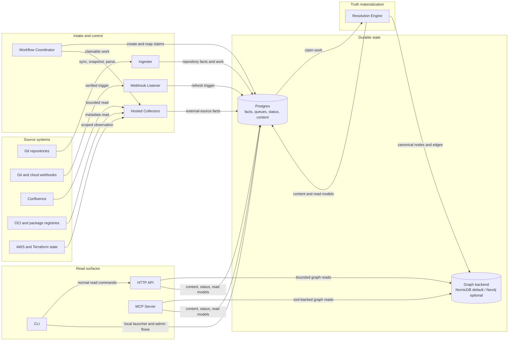
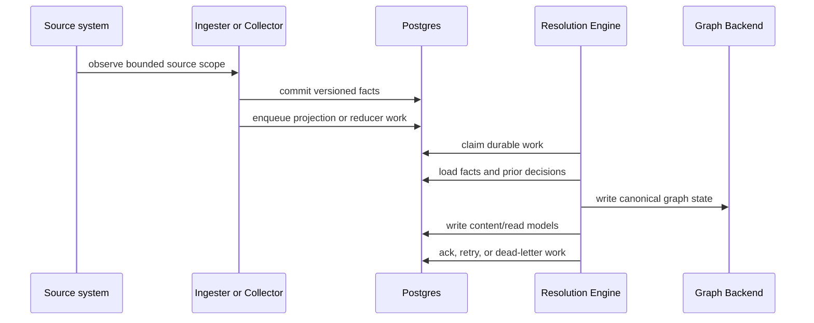
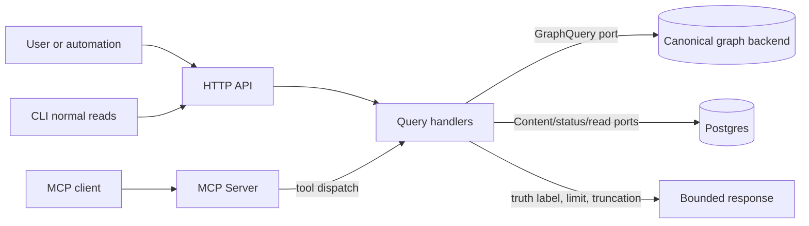

# System Architecture

Eshu turns repository content, infrastructure definitions, deployment metadata,
registry metadata, cloud observations, and runtime evidence into one queryable
graph.

Use this page for the current runtime boundaries, write/read paths, backend
seam, and links to the deeper contracts.

For the shorter concept path, start with [Understand Eshu](understand/index.md).
For operations, start with [Operate Eshu](operate/index.md). For collectors,
facts, or language support, start with [Extend Eshu](extend/index.md).

## Core Model

Eshu is facts-first:

1. Intake runtimes observe source systems and commit versioned facts.
2. Durable queues make projection work claimable, retryable, and recoverable.
3. The resolution engine materializes graph and read-model truth.
4. HTTP API and MCP surfaces read canonical graph/content state; normal CLI
   reads call the HTTP API instead of opening storage directly.

The main correctness boundary is simple: collectors and webhooks observe source
truth; the resolution engine decides graph truth. Intake services do not write
canonical graph state directly.

## Runtime Topology

## Runtime Boundaries

Runtime ownership has three rules:

- Intake runtimes observe bounded source scopes and commit facts.
- The resolution engine owns canonical graph projection, shared
  materialization, retry, replay, and repair.
- API and MCP serve bounded reads from graph, content, status, and read-model
  stores. Normal CLI read commands call the API surface.

Runtime commands, Compose services, Helm templates, ports, and scrape targets
live in [Service Runtimes](deployment/service-runtimes.md).

## Package Ownership

The repository layout follows service boundaries: collection belongs in
collector/parser packages, fact and queue state in storage packages, graph write
contracts in the Cypher storage layer, materialization in projector/reducer
packages, reads in query packages, and operator signals in
runtime/status/telemetry packages.

For the directory-by-directory map, use
[Source Layout](reference/source-layout.md). This architecture page should stay
focused on ownership rules, not repeat the source tree.

## Write Path

This path is replayable because service boundaries cross through durable facts,
queues, claims, status rows, and graph-write telemetry. Diagnose failed graph
writes from queue state and telemetry; do not move graph writes into intake
services.

## Read Path

Read handlers are bounded before execution. List-style reads need scope, limit,
timeout, and deterministic ordering. If a surface cannot answer accurately from
the active profile, it returns `unsupported_capability` or a truth-labeled
response instead of silently downgrading.

## Contract Links

Focused references own the details:

| Contract | Current source |
| --- | --- |
| Runtime commands, deployment shapes, health/status, ServiceMonitor coverage | [Service Runtimes](deployment/service-runtimes.md) |
| End-to-end service workflows and operator checkpoints | [Service Workflows](reference/service-workflows.md) |
| Admin/status HTTP shape | [Runtime Admin API](reference/runtime-admin-api.md) |
| Metrics, traces, logs, and cross-service correlation | [Telemetry Overview](reference/telemetry/index.md) |
| Graph backend selection, operations, and evidence | [Graph Backend Operations](reference/graph-backend-operations.md) |
| Backend conformance gate | [Backend Conformance](reference/backend-conformance.md) |
| Capability profiles and truth levels | [Capability Conformance Spec](reference/capability-conformance-spec.md) |
| Truth labels | [Truth Label Protocol](reference/truth-label-protocol.md) |
| Collector and reducer readiness | [Collector And Reducer Readiness](reference/collector-reducer-readiness.md) |
| Supply-chain CVE-to-impact chain and launch surfaces | [Supply-Chain Traceability](supply-chain-traceability.md) |
| Deployable-unit edge admission | [Deployable-Unit Correlation](reference/deployable-unit-correlation.md) |
| Component packages and activation | [Component Package Manager](reference/component-package-manager.md) |
| Fact schema and plugin trust | [Fact Schema Versioning](reference/fact-schema-versioning.md), [Plugin Trust Model](reference/plugin-trust-model.md) |
| Optional hosted semantic enrichment posture | [Semantic Enrichment Posture](reference/semantic-enrichment-posture.md) |
| Conformance, determinism, load, and fault-injection proof (Ifá) | [How Eshu Proves Itself](concepts/how-eshu-proves-itself.md), [The Ifá Conformance Platform](concepts/ifa-conformance-platform.md) |

## Backend Seam

Query handlers depend on capability ports, not concrete database drivers.
`GraphQuery` serves read-only graph traversal. `ContentStore` serves relational
content and coverage reads. Graph writes go through the backend-neutral Cypher
storage layer.

The active graph backend is selected with `ESHU_GRAPH_BACKEND`. Empty values
default to `nornicdb`; invalid values fail startup. NornicDB is the default
backend. Neo4j is the official compatibility backend when it passes the shared
Cypher/Bolt contract and conformance evidence.

Backend-specific behavior belongs in narrow seams: schema DDL translation,
connection/runtime settings, retry classification, query builders, and measured
adapter differences. Handler and reducer logic should not branch on graph
brand.

## Local And Deployed Shapes

The same contracts run in local and deployed shapes:

- Normal local CLI reads go through the API surface. The `eshu graph` and
  related local commands are launcher/admin flows for the local owner process,
  embedded local services, or Compose-backed stores.
- Production uses split Kubernetes/Helm runtimes with shared Postgres and a
  configured graph backend.

The capability matrix defines each profile's supported capabilities and truth
levels. Lightweight local mode refuses graph-authoritative questions that need a
graph backend instead of silently returning low-authority answers.

## What Belongs Elsewhere

This page is intentionally not a change diary, ADR index, backlog, or incident
archive. Durable lessons should live in current architecture, workflow,
deployment, testing, telemetry, backend, MCP, collector, or package-local docs.
Historical plans should not be the primary way engineers or operators learn how
Eshu works.
