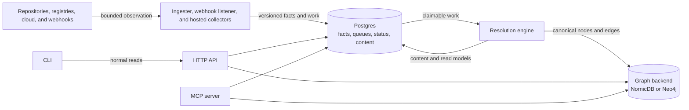
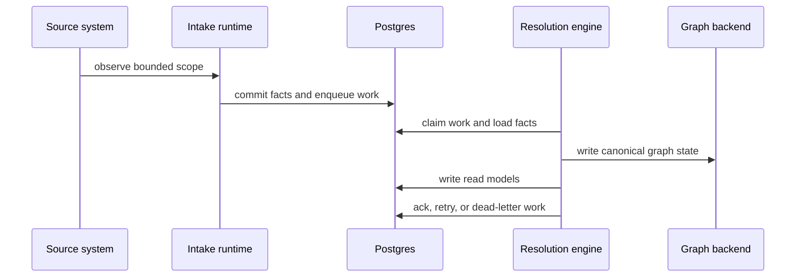
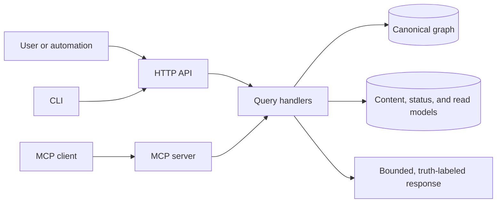

<!-- docs-catalog
title: System Architecture
description: Explains Eshu's runtime boundaries, durable write path, bounded read path, and graph backend seam.
type: concept
audience: practitioner, operator, contributor
entrypoint: true
landing: false
-->

# Understand Eshu's system architecture

Eshu turns source, infrastructure, deployment, supply-chain, cloud, and runtime
observations into an evidence-backed graph. This page explains which runtime
owns each stage and where correctness boundaries sit.

Start with [Understand Eshu](understand/index.md) for the shorter concept path.
Use [Service runtimes](deployment/service-runtimes.md) for commands, ports, and
deployment shapes.

## Follow the facts-first model

Eshu moves observations through four boundaries:

1. Intake runtimes observe bounded source scopes and commit versioned facts.
2. Durable queues make projection work claimable, retryable, and recoverable.
3. The resolution engine materializes canonical graph and read-model truth.
4. HTTP API and MCP surfaces return bounded, truth-labeled reads.

Collectors and webhooks record source truth. They do not write canonical graph
state directly. The resolution engine owns that decision so replay and repair
follow the same contract as the initial projection.

## See the runtime boundaries

```mermaid
flowchart LR
  Sources["Repositories, registries, cloud, and webhooks"]
  Intake["Ingester, webhook listener, and hosted collectors"]
  Pg[("Postgres\nfacts, queues, status, content")]
  Reducer["Resolution engine"]
  Graph[("Graph backend\nNornicDB or Neo4j")]
  API["HTTP API"]
  MCP["MCP server"]
  CLI["CLI"]

  Sources -->|"bounded observation"| Intake
  Intake -->|"versioned facts and work"| Pg
  Pg -->|"claimable work"| Reducer
  Reducer -->|"canonical nodes and edges"| Graph
  Reducer -->|"content and read models"| Pg
  API --> Graph
  API --> Pg
  MCP --> Graph
  MCP --> Pg
  CLI -->|"normal reads"| API
```

The main ownership rules are:

- Intake owns source observation and immutable fact generations.
- Postgres owns facts, queues, claims, status, content, and read models.
- The resolution engine owns graph projection, retry, replay, and repair.
- API and MCP own bounded reads from canonical graph and relational state.
- Normal CLI read commands call the API. Local launcher and admin commands may
  own embedded services or Compose-backed stores.

The API has one data-plane mutation: the all-scopes vulnerability-suppression
policy endpoint. It commits an immutable fact generation and projector intent
in one Postgres transaction; it does not write canonical graph truth directly.

## Trace the durable write path

```mermaid
sequenceDiagram
  participant Source as Source system
  participant Intake as Intake runtime
  participant Pg as Postgres
  participant Reducer as Resolution engine
  participant Graph as Graph backend

  Source->>Intake: observe bounded scope
  Intake->>Pg: commit facts and enqueue work
  Reducer->>Pg: claim work and load facts
  Reducer->>Graph: write canonical graph state
  Reducer->>Pg: write read models
  Reducer->>Pg: ack, retry, or dead-letter work
```

Facts, queues, claims, status rows, and graph-write telemetry make this path
diagnosable and replayable. A failed graph write stays a resolution concern;
moving it into intake would split the truth owner.

## Trace the bounded read path

```mermaid
flowchart LR
  User["User or automation"] --> API["HTTP API"]
  Client["MCP client"] --> MCP["MCP server"]
  CLI["CLI"] --> API
  API --> Query["Query handlers"]
  MCP --> Query
  Query --> Graph[("Canonical graph")]
  Query --> Pg[("Content, status, and read models")]
  Query --> Response["Bounded, truth-labeled response"]
```

List-style reads set scope, limit, timeout, and deterministic ordering before
execution. When the active profile cannot answer accurately, the surface
returns `unsupported_capability` or an explicit truth label instead of silently
downgrading the answer.

## Keep backend differences behind the seam

Query handlers depend on capability ports rather than database drivers.
`GraphQuery` serves read-only traversal, `ContentStore` serves relational reads,
and graph writes use the backend-neutral Cypher storage layer.

`ESHU_GRAPH_BACKEND` selects the backend. An empty value defaults to NornicDB;
an invalid value fails startup. Neo4j is supported when it passes the shared
Cypher, Bolt, and conformance contract. Backend-specific DDL, runtime settings,
retry classification, and measured adapter differences stay in narrow seams;
handler and reducer logic do not branch on graph brand.

The same contracts run locally and in deployed Kubernetes services. A profile
that lacks graph-authoritative data refuses graph-authoritative questions
instead of returning a lower-authority answer without saying so.

## Go deeper by contract

| Concern | Authoritative page |
| --- | --- |
| Service workflows and operator checkpoints | [Service workflows](reference/service-workflows.md) |
| Status, readiness, and failure surfaces | [Runtime admin API](reference/runtime-admin-api.md) |
| Metrics, traces, logs, and correlation | [Telemetry](reference/telemetry/index.md) |
| Backend operation and compatibility | [Graph backend operations](reference/graph-backend-operations.md) and [backend conformance](reference/backend-conformance.md) |
| Profile capabilities and truth levels | [Capability conformance](reference/capability-conformance-spec.md) and [truth labels](reference/truth-label-protocol.md) |
| Collector and reducer readiness | [Collector and reducer readiness](reference/collector-reducer-readiness.md) |
| Fact and plugin contracts | [Fact schema versioning](reference/fact-schema-versioning.md) and [plugin trust](reference/plugin-trust-model.md) |
| Source package ownership | [Source layout](reference/source-layout.md) |
| Conformance and fault proof | [How Eshu proves itself](concepts/how-eshu-proves-itself.md) and [Ifá](concepts/ifa-conformance-platform.md) |

Historical plans and incident notes are not architecture contracts. Put durable
lessons in the current workflow, deployment, telemetry, backend, or package
documentation that owns the behavior.
