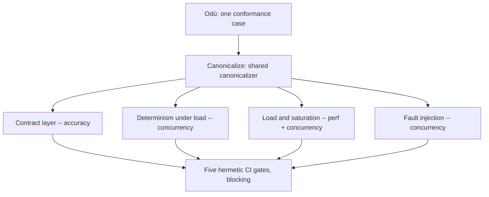

<!-- docs-catalog
title: The Ifá Conformance Platform
description: Explains what an Odù is, the four proof layers Ifá runs over it, and which scale slots are hermetic versus operator-gated.
type: concept
audience: practitioner, maintainer
entrypoint: true
landing: false
-->

# The Ifá conformance platform

Ifá is Eshu's conformance platform: one recorded or synthetic scenario, pushed
through four layers of proof, using machinery the repo already had. It does
not replace the golden-corpus gate, perfcontract, or record/replay — it binds
them into one contract surface and extends what they cover.

## Odù: one scenario, expectations derived

An *Odù* is one conformance case: a set of `facts.Envelope` inputs, either
loaded from a recorded v1 cassette or produced by a synthetic generator.
Nothing about what an Odù is expected to prove is hand-written. Expectations
are *derived*:

- from the fact-kind registry (`specs/fact-kind-registry.v1.yaml`), which
  fact kinds carry a payload schema and a query-truth binding;
- from the B-12 golden snapshot, which required correlations carry an
  evidence-kind filter narrow enough to be a distinct Ifá surface;
- from the replay-coverage manifest, which read surfaces already have a
  proof.

A contributor never writes "this Odù should produce these three nodes." The
platform computes what an Odù touches and checks whether that surface is
covered, the same discipline the golden-corpus gate already applies to its
own snapshot.

The same fixture flows through every layer below unchanged: the contract
layer validates its payloads and graph evidence, the determinism layer
replays it at different worker counts, the load layer amplifies it across
synthetic scopes, and the fault layer injects failures into its own drive.
One input, four kinds of pressure.

## The four layers

**Contract layer** validates an Odù against the payload schema, the round-trip
of its typed struct, and the graph evidence the production correlation
extractor actually discovers from its facts — never a hand-authored
classifier. This is the accuracy axis: does this input produce the graph
truth the registry and the snapshot say it should.

**Determinism under load** replays the same Odù through the real reducer and
graph pipeline at worker counts N ∈ {1, 2, 4}, each against a fresh Postgres
and graph backend, and asserts the canonicalized graph is byte-identical
across every N. A single scope gives the driver one work unit regardless of
worker count, so this layer also drives a disjoint multi-scope synthetic
cassette specifically to make the matrix worker-sensitive — proven by a
build-tag-gated counter that is measured inert on the single-scope fixture and
measured divergent on the multi-scope one. The failure path gets the same
treatment: a schema-major-mutated Odù must dead-letter the identical durable
set across every N.

**Load and saturation** amplifies one Odù across a named scale-lab corpus slot
— disjoint synthetic scopes generated so they can never collide on the same
graph node — and asserts perfcontract thresholds for that slot's class. The
saturation half deliberately drives more writes than the graph-write permit
pool admits and asserts the failure *shape*: backpressure engages, work
retries, nothing dead-letters spuriously, and the queue drains once pressure
releases. This is the permanent regression proof for issue #3560, where an
oversubscribed backend used to dead-letter perfectly recoverable work.

**Fault injection** proves the platform's three recovery mechanisms —
lease-expiry reclaim, retry with backoff, and idempotent replay — actually
converge together, not just in isolation. Five scripted fault classes (killing
a worker mid-claim, forcing a lease expiry, failing one graph write then
succeeding, restarting the backend mid-drain) each run against a live reducer
and must reach the identical fault-free canonical graph with zero durable
dead letters.

## Odù and cassettes

An Odù's facts are usually cassette-backed: a recorded or synthetically
generated cassette loaded through the production `cassette.Source` seam,
the same seam a live collector feeds. Ifá reuses this deliberately instead
of inventing a second fixture format.

- The determinism driver replays a cassette source at worker counts
  N ∈ {1, 2, 4} through the real reducer and graph pipeline — the cassette
  itself never changes between cells, only the worker count does.
- `ifa mutate-cassette` deterministically corrupts one or more facts of a
  chosen kind (a missing required field, or an unsupported schema major) to
  produce the failure-path matrix's input, always returning a clone and
  never touching the source cassette.
- The typed round-trip Odù (`odu:demo-org-roundtrip`) is seeded entirely from
  a synthetic GCP cassette (`go/internal/synth/gcp`), not a hand-authored
  fixture.

Cassette privacy follows a deliberate split, decided in the platform's design
(`docs/internal/design/4389-ifa-conformance-platform.md`, "Public corpora
without provider access"): a recorded cassette can carry real provider shapes
that key-name-only redaction cannot fully sanitize, so recorded cassettes
stay maintainer-private, used only for parity checks against real providers.
The shareable, public path is synthetic generation — a seeded generator like
`synth/gcp` that emits schema-valid payloads with nothing sensitive to redact
in the first place, byte-identical for the same seed.

## Honesty about scale

Only the smoke and small scale-lab slots are hermetic and run in every CI pass.
Medium, large, and pathological slots are `operator_gated`: they need
consistent hardware and a controlled environment, not a laptop, so they are
not exercised by hermetic CI today. The mechanism that would run them exists;
the calibrated thresholds for running them as a blocking gate do not yet.
[Scale slots and the perf contract](../reference/scale-slots-and-perf-contract.md)
says exactly which slots run where.

## Why "Ifá"

The name follows the repository's Yoruba naming convention. In Ifá divination,
an *Odù* is one of the sacred verses a diviner reads to answer a question —
the unit the whole system is built from. Naming the conformance platform after
Ifá rather than after the diviner (Orunmila, who reads the Odù) keeps the
naming lore-correct: the Odù are the units, and the platform is the system
that holds them. Orunmila is deliberately reserved — if the verdict-rendering
report ever becomes its own named component, that is the name it gets.

## Where to go next

- [How Eshu proves itself](how-eshu-proves-itself.md) — the umbrella story:
  where Ifá fits next to the golden-corpus gate, perfcontract, and telemetry
  coverage.
- [Run the proof suite](../guides/run-the-proof-suite.md) — `make prove` and
  `make pre-pr`, what each selects, and how to read the output.
- [Add an Odù](../guides/add-an-odu.md) — the seven-step checklist for
  contributing a new conformance case.
- [Debug a failing gate](../guides/debug-a-failing-gate.md) — per-gate triage
  for all five Ifá CI gates.
- [CI gates reference](../reference/ci-gates.md) — every registered gate,
  generated from `specs/ci-gates.v1.yaml`.
- [Ifá CLI reference](../reference/ifa-cli.md) — the seven `ifa` verbs, their
  flags, and one real invocation each.
- [Scale slots and the perf contract](../reference/scale-slots-and-perf-contract.md)
  — the scale-lab taxonomy Ifá adopts and which slots are hermetic.
- [Prove a change](../tutorials/prove-a-change.md) — a real edit that turns a
  hermetic Ifá gate red, then green.
