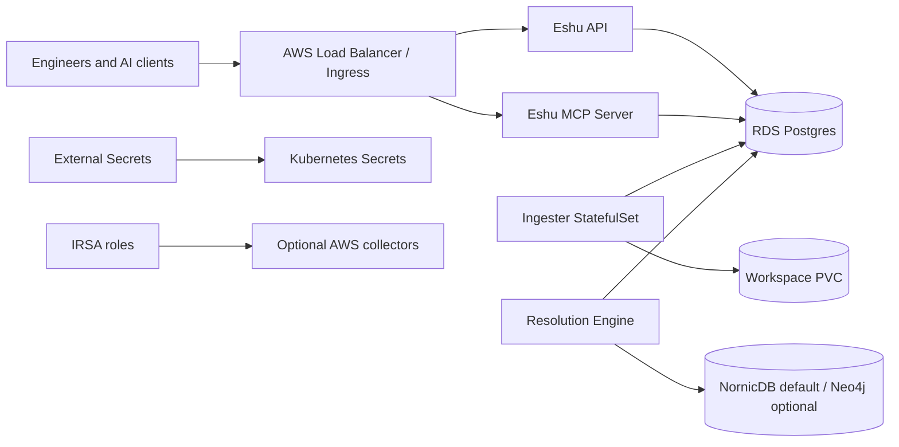

# Deploy To EKS

Use this guide when Eshu will run as a shared service on Amazon EKS.

This is the EKS path through the supported Helm chart. It assumes your platform
team already owns the EKS cluster lifecycle. Eshu's chart installs Eshu
workloads; it does not create the EKS cluster, RDS database, IAM roles,
Secrets Manager records, DNS zones, or external graph service for you.

## Target Shape



## Prerequisites

You need:

- `kubectl` pointed at the target EKS cluster.
- Helm 3.
- an `eshu` namespace.
- a Postgres database reachable from the cluster with `pg_trgm` enabled.
- a Bolt-compatible graph endpoint: NornicDB by default, Neo4j only when
  explicitly selected.
- an ingester workspace storage class and enough capacity for indexed repos.
- an API bearer token stored as a Kubernetes Secret or ExternalSecret.
- Git credentials for repository sync.
- AWS Load Balancer Controller when using ALB Ingress.
- External Secrets Operator when syncing from AWS Secrets Manager.
- IRSA only for workloads that need AWS permissions, such as AWS cloud
  collection.

## 1. Create Namespace

```bash
kubectl create namespace eshu
```

## 2. Create Or Sync Required Secrets

For a direct Kubernetes Secret setup:

```bash
kubectl -n eshu create secret generic eshu-api-auth \
  --from-literal=api-key="$ESHU_API_KEY"

kubectl -n eshu create secret generic eshu-neo4j \
  --from-literal=username="$NORNICDB_USERNAME" \
  --from-literal=password="$NORNICDB_PASSWORD"

kubectl -n eshu create secret generic github-app-credentials \
  --from-literal=app-id="$GITHUB_APP_ID" \
  --from-literal=installation-id="$GITHUB_INSTALLATION_ID" \
  --from-file=private-key="$GITHUB_APP_PRIVATE_KEY_FILE"
```

For AWS Secrets Manager, start from
`deploy/argocd/overlays/aws/externalsecret-examples.yaml` and replace the
SecretStore name, remote keys, and properties with your platform values.

## 3. Write Minimal EKS Values

Create `values.eks.yaml`:

```yaml
contentStore:
  dsn: postgresql://eshu:<postgres-password>@postgres.platform.svc.cluster.local:5432/eshu

env:
  ESHU_GRAPH_BACKEND: nornicdb
  DEFAULT_DATABASE: nornic
  NEO4J_DATABASE: nornic

neo4j:
  uri: bolt://nornicdb.platform.svc.cluster.local:7687
  auth:
    secretName: eshu-neo4j

apiAuth:
  secretName: eshu-api-auth
  key: api-key

repoSync:
  auth:
    method: githubApp
  source:
    mode: githubOrg
    githubOrg: your-github-org
    rules:
      - type: exact
        value: your-github-org/your-service

ingester:
  persistence:
    enabled: true
    storageClass: gp3
    size: 100Gi

exposure:
  ingress:
    enabled: true
    backend: api
    className: alb
    annotations:
      alb.ingress.kubernetes.io/scheme: internal
      alb.ingress.kubernetes.io/target-type: ip
    hosts:
      - host: eshu.internal.example.com
        paths:
          - path: /
            pathType: Prefix
```

Replace placeholder values before rendering. Helm does not expand shell
variables inside `values.eks.yaml` by itself.

For bundled chart-managed NornicDB, read
[Kubernetes Storage](../kubernetes/storage.md) first and set
`schemaBootstrap.useHelmHooks=false`. Helm hooks run before chart-managed
NornicDB exists.

## 4. Render Before Installing

```bash
helm template eshu ./deploy/helm/eshu \
  --namespace eshu \
  -f values.eks.yaml
```

Fix render errors before touching the cluster. The chart deliberately fails
impossible combinations such as Gateway API and Ingress exposure at the same
time.

## 5. Install

```bash
helm upgrade --install eshu ./deploy/helm/eshu \
  --namespace eshu \
  -f values.eks.yaml
```

## 6. Check Rollout

```bash
kubectl -n eshu get pods
kubectl -n eshu rollout status deployment/eshu-api
kubectl -n eshu rollout status deployment/eshu-mcp-server
kubectl -n eshu rollout status statefulset/eshu
kubectl -n eshu rollout status deployment/eshu-resolution-engine
kubectl -n eshu get ingress
```

Pod health only proves process readiness. Check indexing and queue state before
trusting answers:

```bash
curl -fsS https://eshu.internal.example.com/healthz
curl -fsS https://eshu.internal.example.com/admin/status
curl -fsS -H "Authorization: Bearer $ESHU_API_KEY" \
  https://eshu.internal.example.com/api/v0/index-status
```

## 7. Connect MCP

The chart deploys a separate MCP server. Expose it with a dedicated Ingress,
Gateway route, or private service path that your MCP clients can reach.

Set:

```bash
export ESHU_MCP_URL="https://mcp.eshu.internal.example.com"
export ESHU_MCP_TOKEN="$ESHU_API_KEY"
```

Then configure clients with [Connect MCP](../../mcp/index.md).

## 8. Add Optional Collectors

Enable optional collectors one family at a time. Claim-driven collectors require
an active workflow coordinator and collector instances. AWS cloud collection
uses `awsCloudCollector.serviceAccount.*` for IRSA.

Start with:

- [Collector and Webhook Values](../kubernetes/helm-collector-and-webhook-values.md)
- [AWS Cloud Collector](../../services/collector-aws-cloud.md)
- [AWS Collector Security And Config](../../services/collector-aws-cloud-security.md)

## Production Gate

Before a team depends on the deployment, finish the
[Production Checklist](../kubernetes/production-checklist.md), then wire
[Health Checks](../../operate/health-checks.md),
[Telemetry](../../operate/telemetry.md), and the
[Tuning Playbook](../../operate/tuning-playbook.md) into your runbook.
