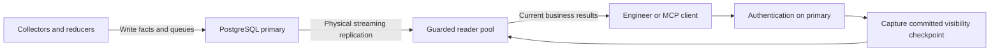

# PostgreSQL read routing

API and MCP use two logical PostgreSQL connections: a writer for authoritative
control and mutations, and a guarded reader for business queries. Collectors,
ingesters, and reducers keep their writer paths. Neo4j routing is unchanged.



## Connection settings

| Setting | Meaning |
| --- | --- |
| `ESHU_POSTGRES_DSN` | Writer DSN; `ESHU_CONTENT_STORE_DSN` is the legacy fallback. |
| `ESHU_POSTGRES_READ_DSN` | Optional reader DSN. Omitted means the exact writer DSN. |
| `ESHU_POSTGRES_READ_MEMBERS` | Optional nonempty credential-free JSON inventory of direct physical readers (`id`, `host`, `port`). One member has no reader redundancy. Omit for the legacy reader Service path. |
| `ESHU_POSTGRES_MAX_OPEN_CONNS` | Total open connections across both pools per API/MCP process; default 30, minimum 2. |
| `ESHU_POSTGRES_MAX_IDLE_CONNS` | Total idle connections across both pools; default 10. |
| `ESHU_POSTGRES_READ_MAX_OPEN_CONNS` | Reader allocation, default half the total; writer gets the remainder. |
| `ESHU_POSTGRES_READ_MAX_IDLE_CONNS` | Reader idle allocation, default half without an inventory; with direct members, at least four per member within the unchanged total budget. An explicit lower value fails startup. |
| `ESHU_POSTGRES_EXPECTED_SYSTEM_ID` | Optional independently supplied physical cluster identity. |

A single-instance install can set both DSNs to exactly the same string or omit
the reader DSN. The process creates a private read-only session pool alongside
the writer pool. This separates ownership and connection budgets; one database
still shares CPU, memory, and storage between reads and writes.

Without a member inventory, both DSNs accept native pgx host lists, for example:

```text
host=reader-a,reader-b port=5432,5432 dbname=eshu user=reader sslmode=verify-full
```

Reader host order is randomized for each new physical connection. Existing
pooled connections remain attached to their selected host; requests are not
round-robin balanced. Multiple hosts share one configured reader pool budget.
Writer candidates must reach the same accepted writable primary incarnation.
This is not independent multi-primary replication.

For request-scoped reader affinity, set `ESHU_POSTGRES_READ_MEMBERS` to a JSON
array such as:

```json
[
  {"id":"read-0","host":"reader-0.example","port":5432},
  {"id":"read-1","host":"reader-1.example","port":5432}
]
```

Each host must reach its physical standby directly, not a
load-balanced Service or proxy. The `host` field accepts a DNS name, IPv4
address, or bare IPv6 literal (including a zone when needed); do not include
IPv6 brackets or a port in `host`. The numeric `port` field is separate. The
single-host `ESHU_POSTGRES_READ_DSN` supplies shared
database, credentials, and TLS settings; configure its transport explicitly so
pgx has no alternate-host or TLS fallback. Prefer verified TLS when the reader
certificates support it. No credentials belong in the inventory. The total
reader connection allocation is divided across members, with at least four
open and four idle connections for each member's snapshot-set reads. With two
members and the default 10 idle connections, eight go to readers and two
remain for the writer. More members require a large enough
`ESHU_POSTGRES_MAX_IDLE_CONNS` total; startup rejects a smaller total or an
explicit reader idle allocation below four per member. Open limits do not rise.

Membership is fixed at startup. An unreachable member is ineligible; a role,
cluster, database, or direct-address mismatch fails startup. One qualified
member can continue serving reads if another is unavailable, but adding or
readmitting a member requires a reviewed API/MCP restart. A four-connection
snapshot set is pinned to one member from reservation through cleanup. A
one-member inventory has no reader redundancy: if its standby is lost,
guarded reads fail closed instead of switching to the writer. When a
qualified fleet connection is lost during an unscoped code-topic investigation,
Eshu retries that *whole* read once on a fresh snapshot while the request
deadline allows it. Selection uses shared round-robin ordering and available
capacity, so the retry may select the same member again. It does not retry
individual SQL statements or silently route reads to the writer. This is
reader availability and scale-out, not writer scaling,
automatic primary failover, or proof of a particular latency budget.

For request-time setup, Eshu divides the remaining reader replay window among
the eligible, untried members after it reserves a whole snapshot set. The last
member receives the remaining time. This protects a healthy reader whose four
connection fences take more than 100 ms, but a stalled first member can use
about half the window before failover. With the default two-second window and
two readers, degraded-path failover may exceed one second. The normal endpoint
latency target does not establish a subsecond failover guarantee.

## What reads and writes use

Business content, status, freshness, incident, infrastructure, supply-chain,
semantic-search, and admin inspection reads receive the reader port. Login,
revocation, permissions, token usage, provider configuration, governance audit
appends, mutations, recovery, and startup work remain authoritative on the
writer. Read-only audit inspection uses the reader. HTTP method alone does not
determine ownership: some POST routes only inspect data.

Authentication runs before the checkpoint. Each authorized business dispatch
captures a WAL insertion point after required committed writes. Each SQL read
checks the exact borrowed reader's role and identity, then waits for its replay
to reach that point. The writer connection is returned before this wait. A
read-only repeatable-read snapshot fences once and retains its connection until
commit, rollback, or cancellation.

Status full and filtered reads use one five-second bounded snapshot after the
request checkpoint. They release the reader transaction before collecting
live activity and serializing the response. Read and transaction failures
return an error rather than a partial status snapshot. Each status snapshot
transaction first runs `SET LOCAL jit = off`, so no statement in the status
snapshot transaction pays a PostgreSQL JIT compile; live activity runs after
the transaction with the server setting. The setting ends with that
transaction on commit and rollback, and other reader transactions keep the
server's `jit` setting. A failed `SET` fails the read and records
`stage="transaction_control"` with a non-`ok` outcome on
`eshu_dp_postgres_reader_stage_duration_seconds`. The
`postgres.status_snapshot` span carries `jit=off` when the setting applied. Readiness uses one guarded status query
without opening a snapshot transaction.

Streaming replication is asynchronous. The guard promises visibility through
the captured checkpoint or an explicit error; it cannot promise the reader
shows every write committed while the response is being assembled. Separate
ordinary reads are not one shared snapshot; code-topic snapshot-set workers
explicitly share one exported snapshot on one member. A future mixed
mutation/read path must capture again after its mutation commits before using
the reader.

## Failure and operations

A lagged, unreachable, or wrong-topology reader fails closed. Business reads
never silently switch to the writer. Writer acquisition and reader replay are
bounded; business SQL retains the caller's own deadline. The reader pool sets
`default_transaction_read_only=on` on every connection and reconnect.

For a sampled API or MCP request, the request trace records a
`postgres.reader_query_start` event before guarded business SQL. The backend
PID and TCP peer address come from the exact borrowed lease. A per-`Access`
query sequence separates its calls. The socket peer can be a Service address. Use the actual reader pod identity and
`pg_stat_activity.backend_start` to distinguish PID reuse and prove the
physical destination. A missing event or
`postgres.backend.identity=unavailable` cannot qualify a cancellation claim. Query text and credentials are excluded.

Use a database role with appropriate read permissions. Session read-only mode
is a guard, not a replacement for database privileges. The writer and reader
roles need `EXECUTE` on `pg_control_system()` for identity checks; grant that
specific function if the deployment revokes the default access.

A reader that has not replayed to the writer checkpoint within the replay
window, or whose connection acquisition (pool wait or dial) or identity check
times out, is a retryable condition. A reader
failure that is not a timeout (authentication or TLS failure, connection
refused, permission denied on `pg_control_system()`, a client disconnect) is not
retryable and stays HTTP `500` with a fixed message and no `Retry-After`. API and MCP
clients receive HTTP `503` with error code `backend_unavailable`, a fixed message,
and `Retry-After: 2` (also `error.details.retry_after_seconds` in the envelope);
the Go error text and driver detail never reach the response. The writer
checkpoint step failure (the writer checkpoint query erroring or timing out, or
the writer failing its topology check; replay lag appears later, in the reader
fence) answers the same `503` and `Retry-After`. Retry after the hinted delay. `Retry-After` is set only on
these transient verdicts and on the auth path's identity-store `503` (see
[HTTP API](../reference/http-api.md#postgresql-reader-fence-failures)); a permanent `503` such as a route that needs an
unconfigured graph backend, or a checkpoint source that was never configured
(unreachable in the API and MCP binaries, which fail startup first), carries none. The
reader fence context inherits the request's own deadline, so a parent or handler
budget that expires during a borrow, identity check, or replay now answers this
retryable `503` where it previously answered `500` (or `504` on a route that
classified the error with the bounded-read classifier). That is defensible (the request
did not fail on a bounded graph read, and a retry may land inside a fresh
budget); operators will see the `503` with `outcome="deadline"` on the
`reader_borrow`, `reader_identity`, or `reader_replay` stage. A burst of these `503` responses points at replica lag, for
example long snapshot reads on a replica with `hot_standby_feedback=off` and a
short `max_standby_streaming_delay` causing recovery conflicts; check replay lag
on the replica before widening any Eshu timeout. To tell the two causes apart,
read `eshu_dp_postgres_reader_stage_duration_seconds` with `role="reader"`:
`stage="reader_replay"` with `outcome="deadline"` is a replica that missed the
checkpoint, `stage="reader_borrow"` with `outcome="deadline"` is a pool-wait
or dial timeout, and a `reader_replay` `ok` tail near the replay window shows requests
that waited and then succeeded. A `reader_borrow`, `reader_identity`, or
`reader_replay` sample with `outcome="error"` is NOT a `503`: it is a permanent
reader failure (credentials, network, grants, a failing identity or replay
query) that answers `500`, so alert on it as a misconfiguration rather than
waiting for replica lag to clear. See [HTTP API](../reference/http-api.md#postgresql-reader-fence-failures).

`/readyz` checks both pools and the fenced status schema. `/healthz` remains
independent of dependencies. If status cannot be loaded, `/metrics` retains
valid independent OTEL samples and reports
`eshu_runtime_status_snapshot_available 0`; unavailable status families are
omitted. Reader stage durations and pool usage/wait signals identify lag and
pool pressure without exposing DSNs or SQL.
For fleet mode, `eshu_dp_postgres_reader_member_qualified` emits one
`member_ordinal` series per configured member. One series with value `1`
means one standby qualified at startup, not that a second standby is ready or
that the first remains healthy. Alert on a configured singleton as a lack of
read redundancy; `/readyz` and reader-stage failures report a later loss.

Startup records the primary's physical identity, postmaster incarnation, WAL
timeline, and flushed WAL position. A same-cluster primary restart (stop and
start, or a crash and recovery) recovers in place: the next connection that
sees the new incarnation checks that the system identifier, database, and
timeline are unchanged and that the primary's flushed WAL is at or past the
highest flushed position the API/MCP process has seen, then accepts it for
every pool. No API/MCP restart is needed, and `/readyz` turns ready again. This
was exercised with the default same-primary reader pool and with a reader pool
on a streaming standby, whose validator never compared the primary's
incarnation.

A promoted primary (new timeline) or a primary restored from an older
snapshot (flushed WAL behind what the process saw) is refused by design. The
process latches to the topology refusal until it restarts: the auth path
answers `503` and counts it as `failure_class=topology`, checkpoints fail, and `/readyz`
fails. Verify the intended database and replication lineage, then restart
the API/MCP deliberately. The log event `postgres.writer.lineage` reports
`outcome=accepted` or `outcome=latched` with its `reason`. A restarted
standby listed in `ESHU_POSTGRES_READ_MEMBERS` stays ineligible until the
process restarts; that is a known limitation.

## Aurora and scaling limits

The two-role configuration can represent Aurora's writer and reader endpoint
shape. It does not qualify Aurora identity behavior, failover, promotion,
proxy routing, or timeline lineage. Those need explicit backend validation
before an Aurora deployment is called supported. Aurora reader endpoints
balance new connections; they do not balance individual queries. Consult the
[Aurora reader endpoint documentation](https://docs.aws.amazon.com/AmazonRDS/latest/AuroraUserGuide/Aurora.Endpoints.Reader.html)
and [cluster endpoint documentation](https://docs.aws.amazon.com/AmazonRDS/latest/AuroraUserGuide/Aurora.Endpoints.Cluster.html).

A replica separates much of the read CPU and memory work from the primary,
but it still replays writes and needs its own storage capacity. Start with the
same resource size when proving a representative workload; reduce it only
when measured latency, replay lag, and pool wait remain acceptable. Small local
fixtures do not prove 100-engineer capacity, ops-qa response times, or reduced
memory requirements.
