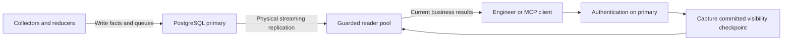

# PostgreSQL read routing

API and MCP use two logical PostgreSQL connections: a writer for authoritative
control and mutations, and a guarded reader for business queries. Collectors,
ingesters, and reducers keep their writer paths. Neo4j routing is unchanged.



## Connection settings

| Setting | Meaning |
| --- | --- |
| `ESHU_POSTGRES_DSN` | Writer DSN; `ESHU_CONTENT_STORE_DSN` is the legacy fallback. |
| `ESHU_POSTGRES_READ_DSN` | Optional reader DSN. Omitted means the exact writer DSN. |
| `ESHU_POSTGRES_MAX_OPEN_CONNS` | Total open connections across both pools per API/MCP process; default 30, minimum 2. |
| `ESHU_POSTGRES_MAX_IDLE_CONNS` | Total idle connections across both pools; default 10. |
| `ESHU_POSTGRES_READ_MAX_OPEN_CONNS` | Reader allocation, default half the total; writer gets the remainder. |
| `ESHU_POSTGRES_READ_MAX_IDLE_CONNS` | Reader idle allocation, default half subject to both pool limits. |
| `ESHU_POSTGRES_EXPECTED_SYSTEM_ID` | Optional independently supplied physical cluster identity. |

A single-instance install can set both DSNs to exactly the same string or omit
the reader DSN. The process creates a private read-only session pool alongside
the writer pool. This separates ownership and connection budgets; one database
still shares CPU, memory, and storage between reads and writes.

Both DSNs accept native pgx host lists, for example:

```text
host=reader-a,reader-b port=5432,5432 dbname=eshu user=reader sslmode=verify-full
```

Reader host order is randomized for each new physical connection. Existing
pooled connections remain attached to their selected host; requests are not
round-robin balanced. Multiple hosts share one configured reader pool budget.
Writer candidates must reach the same accepted writable primary incarnation.
This is not independent multi-primary replication.

## What reads and writes use

Business content, status, freshness, incident, infrastructure, supply-chain,
semantic-search, and admin inspection reads receive the reader port. Login,
revocation, permissions, token usage, provider configuration, governance audit
appends, mutations, recovery, and startup work remain authoritative on the
writer. Read-only audit inspection uses the reader. HTTP method alone does not
determine ownership: some POST routes only inspect data.

Authentication runs before the checkpoint. Each authorized business dispatch
captures a WAL insertion point after required committed writes. Each SQL read
checks the exact borrowed reader's role and identity, then waits for its replay
to reach that point. The writer connection is returned before this wait. A
read-only repeatable-read snapshot fences once and retains its connection until
commit, rollback, or cancellation.

Status full and filtered reads use one five-second bounded snapshot after the
request checkpoint. They release the reader transaction before collecting
live activity and serializing the response. Read and transaction failures
return an error rather than a partial status snapshot. Readiness uses one
guarded status query without opening a snapshot transaction.

Streaming replication is asynchronous. The guard promises visibility through
the captured checkpoint or an explicit error; it cannot promise the reader
shows every write committed while the response is being assembled. Separate
parallel reads are not one shared snapshot. A future mixed mutation/read path
must capture again after its mutation commits before using the reader.

## Failure and operations

A lagged, unreachable, or wrong-topology reader fails closed. Business reads
never silently switch to the writer. Writer acquisition and reader replay are
bounded; business SQL retains the caller's own deadline. The reader pool sets
`default_transaction_read_only=on` on every connection and reconnect.

Use a database role with appropriate read permissions. Session read-only mode
is a guard, not a replacement for database privileges. The writer and reader
roles need `EXECUTE` on `pg_control_system()` for identity checks; grant that
specific function if the deployment revokes the default access.

A reader that has not replayed to the writer checkpoint within the replay
window, or whose connection acquisition (pool wait or dial) or identity check
times out, is a retryable condition. A reader
failure that is not a timeout (authentication or TLS failure, connection
refused, permission denied on `pg_control_system()`, a client disconnect) is not
retryable and stays HTTP `500` with a fixed message and no `Retry-After`. API and MCP
clients receive HTTP `503` with error code `backend_unavailable`, a fixed message,
and `Retry-After: 2` (also `error.details.retry_after_seconds` in the envelope);
the Go error text and driver detail never reach the response. The writer
checkpoint failure answers the same `503` and `Retry-After`. Retry after the
hinted delay. A burst of these `503` responses points at replica lag, for
example long snapshot reads on a replica with `hot_standby_feedback=off` and a
short `max_standby_streaming_delay` causing recovery conflicts; check replay lag
on the replica before widening any Eshu timeout. To tell the two causes apart,
read `eshu_dp_postgres_reader_stage_duration_seconds` with `role="reader"`:
`stage="reader_replay"` with `outcome="deadline"` is a replica that missed the
checkpoint, `stage="reader_borrow"` with `outcome="deadline"` is a pool-wait
or dial timeout, and a `reader_replay` `ok` tail near the replay window shows requests
that waited and then succeeded. A `reader_borrow`, `reader_identity`, or
`reader_replay` sample with `outcome="error"` is NOT a `503`: it is a permanent
reader failure (credentials, network, grants, a failing identity or replay
query) that answers `500`, so alert on it as a misconfiguration rather than
waiting for replica lag to clear. See [HTTP API](../reference/http-api.md#postgresql-reader-fence-failures).

`/readyz` checks both pools and the fenced status schema. `/healthz` remains
independent of dependencies. If status cannot be loaded, `/metrics` retains
valid independent OTEL samples and reports
`eshu_runtime_status_snapshot_available 0`; unavailable status families are
omitted. Reader stage durations and pool usage/wait signals identify lag and
pool pressure without exposing DSNs or SQL.

Startup freezes the primary's physical identity and postmaster incarnation.
After a primary restart, old runtime access fails its checks. Recovery requires
independent verification of the intended database and replication lineage,
then a deliberate runtime restart/bootstrap and a fresh readiness check. Do
not automatically accept a new incarnation, replay writes, or promote readers
in response to a transient request failure.

## Aurora and scaling limits

The two-role configuration can represent Aurora's writer and reader endpoint
shape. It does not qualify Aurora identity behavior, failover, promotion,
proxy routing, or timeline lineage. Those need explicit backend validation
before an Aurora deployment is called supported. Aurora reader endpoints
balance new connections; they do not balance individual queries. Consult the
[Aurora reader endpoint documentation](https://docs.aws.amazon.com/AmazonRDS/latest/AuroraUserGuide/Aurora.Endpoints.Reader.html)
and [cluster endpoint documentation](https://docs.aws.amazon.com/AmazonRDS/latest/AuroraUserGuide/Aurora.Endpoints.Cluster.html).

A replica separates much of the read CPU and memory work from the primary,
but it still replays writes and needs its own storage capacity. Start with the
same resource size when proving a representative workload; reduce it only
when measured latency, replay lag, and pool wait remain acceptable. Small local
fixtures do not prove 100-engineer capacity, ops-qa response times, or reduced
memory requirements.
