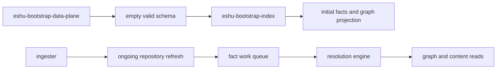

# Bootstrap Runtime Services

This page covers schema bootstrap and one-shot bootstrap indexing. Use
[Service Runtimes](service-runtimes.md) for the full runtime matrix.

## Schema Bootstrap

`eshu-bootstrap-data-plane` applies all Postgres and graph-backend schema DDL
then exits. It decouples schema migration from data population so API, MCP,
ingester, workflow coordinator, collectors, and resolution engine can start
against an empty-but-valid schema.

The binary owns DDL orchestration only:

1. Connect to Postgres and apply storage schema through the Postgres bootstrap
   path.
2. Connect to the configured graph backend and apply graph constraints and
   indexes through the strict graph schema path.
3. Record the graph backend and schema fingerprint in Postgres only after every
   graph statement succeeds.
4. Exit with code 0 on success.

It writes no application data.

## Compose Contract

In Compose, `db-migrate` runs schema bootstrap before the long-running services:

```yaml
db-migrate:
  command: ["/usr/local/bin/eshu-bootstrap-data-plane"]
  depends_on:
    nornicdb:
      condition: service_healthy
    postgres:
      condition: service_healthy
```

Other services depend on `db-migrate` with
`condition: service_completed_successfully`. Use the base Compose file for
NornicDB and `docker-compose.neo4j.yml` for the explicit Neo4j compatibility
stack.

## Kubernetes Contract

The public Helm chart renders schema bootstrap as
`deploy/helm/eshu/templates/job-schema-bootstrap.yaml`.

The job uses the same release image and runs:

```text
/usr/local/bin/eshu-bootstrap-data-plane
```

Helm hook annotations run it before install and upgrade workloads. Argo CD maps
those Helm hooks to its pre-sync flow, so GitOps installs also run schema
bootstrap before workload sync.

Do not attach graph schema bootstrap to every runtime pod. Repeating graph
schema verification from each workload can saturate a large existing graph
backend during rolling updates and make the deployment look hung.

## Schema Bootstrap Environment

| Variable | Required | Purpose |
| --- | --- | --- |
| `ESHU_POSTGRES_DSN` | yes | Postgres connection string |
| `ESHU_GRAPH_BACKEND` | no | Graph adapter, `nornicdb` or `neo4j`; default is `nornicdb` |
| `NEO4J_URI` | yes | Bolt URI for NornicDB or Neo4j |
| `NEO4J_USERNAME` | yes | Bolt auth username |
| `NEO4J_PASSWORD` | yes | Bolt auth password |
| `DEFAULT_DATABASE` | no | Bolt database name, default `nornic` |
| `ESHU_GRAPH_SCHEMA_STATEMENT_TIMEOUT` | no | Per graph DDL statement deadline, default `2m` |
| `ESHU_GRAPH_SCHEMA_ADOPT_EXISTING` | no | Adopt a complete existing graph schema by writing the fingerprint marker |

Invalid graph backend values fail startup. Invalid or non-positive schema
statement timeouts fail before any DDL runs.

## Operational Notes

- Postgres and graph DDL use `IF NOT EXISTS` where the backend supports it.
- The graph schema fingerprint prevents preserved-volume restarts from
  re-checking every graph constraint and index when the expected schema already
  applied.
- Existing-schema adoption is explicit opt-in. It inspects `SHOW CONSTRAINTS`
  and `SHOW INDEXES`, then fails closed if inspection errors.
- Graph DDL emits structured per-statement logs with backend, phase, ordinal,
  total, duration, failure class, and a bounded statement summary.
- Version probes run before opening Postgres or the graph backend.

## Bootstrap Index

`eshu-bootstrap-index` performs one-shot initial indexing. It is useful for:

- materializing an initial repository set
- reducing cold-start time on a brand-new environment
- validating end-to-end indexing against a known repository set
- recovering an environment after operator-controlled reset work

It is packaged in Docker Compose and can also run manually as a direct process.
It is not a steady-state Kubernetes workload in the public Helm chart.

`bootstrap-index` exports OpenTelemetry when configured, but it does not mount
the shared runtime `/healthz`, `/readyz`, `/metrics`, or `/admin/status` HTTP
surface.

Repeated restarts or long-running bootstrap activity are incidents. Use
incremental ingester, collector, workflow-coordinator, and resolution-engine
paths for normal freshness.

## Local Full-Stack Flow



## Related Pages

- [Docker Compose](../run-locally/docker-compose.md)
- [Helm Values](../deploy/kubernetes/helm-values.md)
- [Bootstrap Index Service](../services/bootstrap-index.md)
- [Telemetry Overview](../reference/telemetry/index.md)
