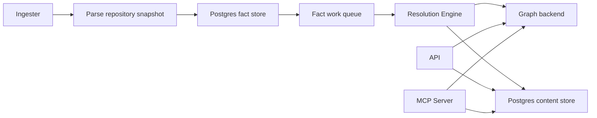

# Core Runtime Services

This page covers the long-running core services: API, MCP server, ingester,
workflow coordinator, webhook listener, and resolution engine. Use
[Service Runtimes](service-runtimes.md) as the high-level matrix.

## Deployed Flow

## Incremental Refresh

Eshu refreshes incrementally by default:

- `ingester` reconciles changed repository scopes and generations.
- `webhook-listener` persists provider refresh triggers; it does not clone,
  parse, emit facts, or write graph truth.
- `workflow-coordinator` reconciles configured collector instances, creates
  supported collector claims when active, and reaps expired claim leases.
- `resolution-engine` drains queued follow-up work and shared corrections from
  durable state.
- `bootstrap-index` remains the one-shot escape hatch for empty environments or
  operator recovery.

Use status, queue age, generation state, and collector completeness before
choosing to restart or reindex. Full re-indexing is a recovery tool, not the
normal freshness path.

## API

The API serves HTTP query and admin requests. It reads canonical graph state
from the configured graph backend and content/entity data from Postgres.

It does not own repository sync, parsing, fact emission, or queued projection
work.

Deployment truth:

- Compose service: `eshu`
- Helm template: `deploy/helm/eshu/templates/deployment.yaml`
- Helm command: `eshu api start --host 0.0.0.0 --port <service.port>`

Watch request latency, error rate, content read latency, and graph query
latency. Scale the API for request traffic. Do not scale it to fix queue
backlog.

## MCP Server

The MCP server exposes Eshu query workflows over MCP HTTP/SSE or stdio. The
Helm runtime uses HTTP transport and mounts the same query surface used by the
API.

It does not own repository sync, parsing, fact emission, or queued projection
work.

Deployment truth:

- Compose service: `mcp-server`
- Helm template: `deploy/helm/eshu/templates/deployment-mcp-server.yaml`
- Helm command: `eshu mcp start --transport http`
- Compose command: `/usr/local/bin/eshu-mcp-server`

Watch MCP session establishment, tool latency, backend graph query latency, and
content query latency. Stdio mode does not expose `/healthz`, `/readyz`,
`/metrics`, or `/admin/status`.

## Ingester

The ingester discovers and syncs repositories, owns the workspace in
Kubernetes, parses repository snapshots, emits facts into Postgres, and hands
durable projection work to the write plane.

The ingester is the only long-running runtime that should mount the workspace
PVC in Kubernetes.

Deployment truth:

- Compose service: `ingester`
- Helm template: `deploy/helm/eshu/templates/statefulset.yaml`
- Command: `/usr/local/bin/eshu-ingester`

Watch repository queue wait, parse duration, fact emission duration, fact-store
SQL latency, and workspace disk pressure. Tune `ESHU_SNAPSHOT_WORKERS` when
snapshot collection is the bottleneck. In Kubernetes, align CPU requests with
the worker count to avoid throttling under concurrent parsing.

## Resolution Engine

The resolution engine is the hosted reducer runtime. It claims fact work items,
loads facts from Postgres, projects graph and content state, records projection
decisions, and manages retry, replay, dead-letter, and recovery workflows.

Deployment truth:

- Compose service: `resolution-engine`
- Helm template: `deploy/helm/eshu/templates/deployment-resolution-engine.yaml`
- Command: `/usr/local/bin/eshu-reducer`

Watch queue depth, queue age, claim latency, per-stage projection duration,
stage output counts, retries, dead letters, and Postgres saturation. Scale the
resolution engine only when queue age rises and workers remain busy. If queue
age rises with Postgres contention, fix database pressure before adding workers.

Important knobs:

- `ESHU_REDUCER_WORKERS`
- `ESHU_SHARED_PROJECTION_WORKERS`
- `ESHU_SHARED_PROJECTION_PARTITION_COUNT`
- `ESHU_SHARED_PROJECTION_BATCH_LIMIT`
- `ESHU_SHARED_PROJECTION_POLL_INTERVAL`
- `ESHU_SHARED_PROJECTION_LEASE_TTL`
- `ESHU_CODE_CALL_PROJECTION_ACCEPTANCE_SCAN_LIMIT`
- `ESHU_CODE_CALL_EDGE_BATCH_SIZE`

Helm can deploy domain-specific reducer lanes with `resolutionEngine.lanes`.
When lanes are set, the chart renders one `Deployment` per lane and passes
`ESHU_REDUCER_CLAIM_DOMAINS` to restrict queue claims to that lane's allowlist.
Size replicas, workers, and Postgres pools per lane.

## Workflow Coordinator

The workflow coordinator reconciles collector instances, schedules supported
collector work, reaps expired claim leases, publishes run state, and exposes
shared status.

It does not parse repositories, parse state, read cloud resources, emit facts,
or write graph truth.

Deployment truth:

- Compose profile: `workflow-coordinator`
- Helm template: `deploy/helm/eshu/templates/deployment-workflow-coordinator.yaml`
- Metrics service: `deploy/helm/eshu/templates/service-workflow-coordinator.yaml`
- Command: `/usr/local/bin/eshu-workflow-coordinator`

The coordinator ships dark by default:

- `workflowCoordinator.enabled=false`
- `workflowCoordinator.deploymentMode=dark`
- `workflowCoordinator.claimsEnabled=false`
- `workflowCoordinator.collectorInstances=[]`

Claim-driven collector deployments require an active coordinator:
`workflowCoordinator.enabled=true`,
`workflowCoordinator.deploymentMode=active`,
`workflowCoordinator.claimsEnabled=true`, and at least one collector instance.

## Webhook Listener

The webhook listener accepts GitHub, GitLab, Bitbucket, and AWS freshness
deliveries, verifies the configured secret or token, normalizes the payload,
and persists durable triggers in Postgres.

It does not clone repositories, parse files, emit facts, connect to the graph
backend, or decide graph truth.

Deployment truth:

- Compose profile: `webhook-listener`
- Helm template: `deploy/helm/eshu/templates/deployment-webhook-listener.yaml`
- Command: `/usr/local/bin/eshu-webhook-listener`

Only provider webhook paths should be publicly routed. Admin and metrics paths
should stay internal unless the operator explicitly protects them.

## Local Verification

Use focused `go test` or direct command runs for one service boundary. Use
Compose when the proof needs the same topology operators run. The current gate
map lives in [Local Testing](../reference/local-testing.md) and
[Verification Gates](../reference/local-testing/verification-gates.md).
