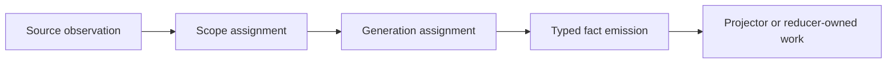

# Collector Authoring Guide

Use this guide when adding or expanding a collector family that feeds Eshu's
shared data plane. Collectors observe source truth and emit typed facts; they
do not own canonical graph correlation, API repair behavior, or cross-source
truth.

For the currently deployed collector lanes and readiness gaps, see
[Collector And Reducer Readiness](../reference/collector-reducer-readiness.md).

## Contract

Every collector must define one bounded work unit before implementation starts:



The collector owns source observation, scope identity, generation identity, and
fact emission. Source-local projection belongs to projector code. Cross-source
correlation, graph promotion, read-model truth, retries, and dead-letter
handling belong to reducers and shared storage contracts.

Lock these decisions first:

| Decision | Required answer |
| --- | --- |
| Source truth | Which system is authoritative: Git, cloud API, registry, state file, documentation source, or another source. |
| Scope model | The durable ingestion shard: repository, account, region, cluster, registry target, space, dataset, or equivalent. |
| Generation model | What replaces the previous authoritative snapshot for that scope. |
| Fact model | Which typed facts are emitted before downstream projection begins. |
| Confidence | Whether each fact is observed, reported, inferred, derived, or legacy unknown. |
| Failure model | Which errors are retryable, terminal, rate-limited, auth-related, or source-missing. |
| Operator model | Which health, backlog, duration, throttle, retry, pool, and status signals prove progress. |

If any row is still fuzzy, the collector is not ready for code.

## Fact Confidence

Every emitted fact must carry `collector_kind` and `source_confidence`.
`collector_kind` identifies the producing family. `source_confidence` tells
reducers how much trust to place in the claim when sources disagree.

Use the vocabulary in `go/internal/facts/source_confidence.go`:

| Value | Meaning |
| --- | --- |
| `observed` | Eshu read the source artifact directly, such as Git contents or Terraform state. |
| `reported` | An external API reported the value, such as AWS or registry metadata. |
| `inferred` | Eshu concluded the claim by comparing or correlating other facts. |
| `derived` | Eshu materialized the value from existing Eshu facts. |
| `unknown` | Legacy or system fallback. New collector work should not depend on it. |

Documentation sources are observed evidence about what a document says. They do
not prove that the documented claim is operationally true. Documentation facts
must feed reducer-owned findings before they affect graph, deployment, runtime,
source-code, or infrastructure truth.

## Runtime Shape

Hosted collectors should use the shared service shape:

- one CLI entrypoint for local replay and controlled runs
- `/healthz`, `/readyz`, `/metrics`, and shared status/admin wiring when the
  runtime mounts HTTP admin
- structured logs with trace and correlation fields
- source-stage counters, duration histograms, throttle/rate-limit counters when
  the source has that failure mode, and bounded failure counters
- configurable database pools, worker counts, queue depths, API budgets, and
  runtime limits

Claim-driven collectors must run through `collector.ClaimedService` and durable
workflow claims. The workflow coordinator plans bounded work rows; collector
runtimes claim the work, heartbeat the claim, emit facts through the normal
commit boundary, and complete, release, or fail the claim with fencing.

Do not add a Helm or deployment knob for a design-only collector. A chart value
is an operator promise that the binary, fact contract, configuration, status
path, and runtime proof exist.

## Evidence Gates

Collector packages must be concrete before they land. The current gates are:

| Gate | What it enforces |
| --- | --- |
| `scripts/verify-package-docs.sh` | Changed Go packages under `go/internal` or `go/cmd` have `doc.go`, `README.md`, and scoped `AGENTS.md`. |
| `scripts/verify-performance-evidence.sh` | Hot-path collector changes with Cypher, graph writes, workers, leases, batching, goroutines, channels, queues, or runtime stages carry tracked performance and observability evidence. |
| `scripts/verify-collector-authoring-gate.sh` | Changed collector source packages have package docs, tests, collector evidence, observability evidence, and a deployment or ServiceMonitor decision note. |

Use these markers in a changed reference doc or package README:

```text
Collector Performance Evidence: <baseline, after measurement, input shape,
fact count, wall time, remote/API budget, backend where relevant, and result>

Collector Observability Evidence: <source-stage metrics, spans, logs, status
fields, pprof, or queue/domain counters that let an operator diagnose this
collector>

Collector Deployment Evidence: <health, readiness, metrics, ServiceMonitor,
and admin/status proof, or a clear no-hosted-runtime decision>
```

For correctness-only work, use `No-Regression Evidence:` instead of
`Collector Performance Evidence:`. If existing telemetry already covers the
path, use `No-Observability-Change:` and name the exact existing metric, span,
log event, status field, or pprof path.

## Implementation Order

Follow this order so the collector lands on stable ownership boundaries:

1. Update published architecture, workflow, or runtime docs when the source
   changes ownership or deployment rules.
2. Define scope and generation identity.
3. Define fact payloads, validation, and confidence.
4. Implement source observation and normalization.
5. Emit facts into the durable store.
6. Reuse projector and reducer contracts for downstream work.
7. Add telemetry, logs, traces, status, and claim handling where relevant.
8. Add local replay, fixture, and cloud validation gates.
9. Update package and public docs before calling the slice complete.

Do not start with answer shaping, direct graph mutations, post-commit repair
hooks, or one-off API fixes. Those are downstream ownership problems, not
collector contracts.

For documentation collectors, start with source-neutral facts:
`documentation_source`, `documentation_document`, `documentation_section`,
`documentation_link`, `documentation_entity_mention`, and
`documentation_claim_candidate`. Keep source-specific fields in metadata until
the shape is stable across at least two documentation source families.

## Verification

At minimum, a collector slice needs:

- unit tests for normalization, identity, fact validation, and serialization
- replay or fixture-backed integration coverage for one full scope generation
- projector or reducer tests when downstream materialization changes
- telemetry/log/status assertions for the hosted runtime or a documented
  no-hosted-runtime decision
- local and cloud runbook updates that do not require live production
  credentials

Before promoting a collector lane, also prove the deployed shape in
[Collector And Reducer Readiness](../reference/collector-reducer-readiness.md):
runtime health, status, metrics, durable facts, claim behavior for
claim-driven collectors, reducer drain, dead-letter state, and API/MCP truth.

## Anti-Patterns

Avoid these patterns:

- writing canonical graph edges directly from collectors
- hiding source gaps behind optimistic status output
- encoding source-specific meaning in generic fallback fields
- using full re-indexing as the normal freshness path
- adding a second admin, metrics, or logging shape for one collector
- adding compatibility shims or alternate production runtimes outside the
  shared Go service contracts

Those choices make the next collector harder to add and move truth out of the
layer that owns it.

## Required Docs

When a collector lands, update the affected repo-hosted docs in the same
milestone:

- [System Architecture](../architecture.md)
- [Source Layout](../reference/source-layout.md)
- [Relationship Mapping](../reference/relationship-mapping.md) when traversal
  or canonical relationship meaning changes
- [Local Testing](../reference/local-testing.md)
- [Cloud Validation](../reference/cloud-validation.md)
- [Telemetry Overview](../reference/telemetry/index.md)
- deployment, workflow, or service-level references that explain how operators
  run or validate the collector today
