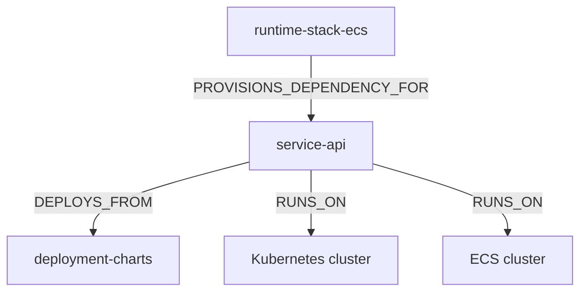
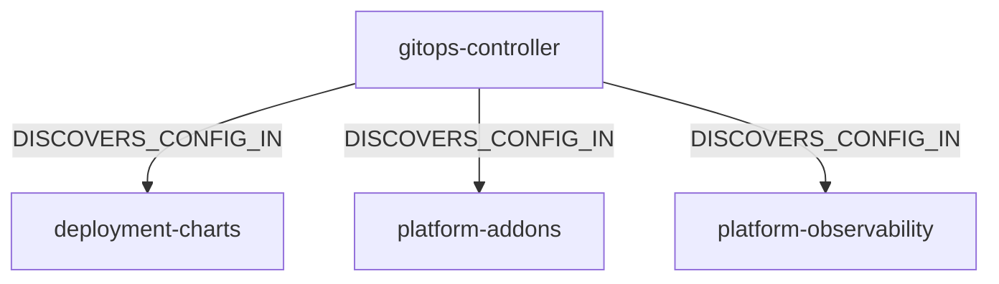
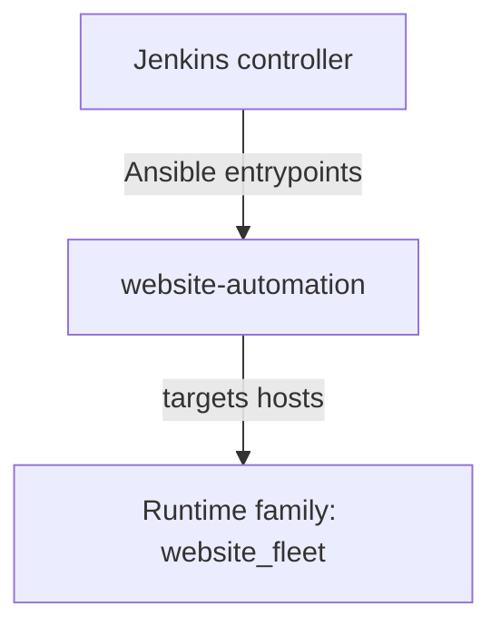
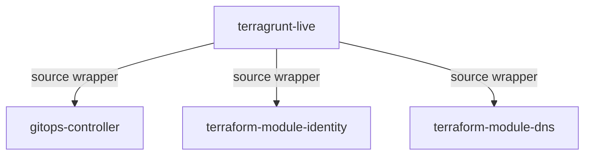

# Relationship Graph Examples

These examples show relationship shapes Eshu can explain after a repository
corpus is indexed. They are sanitized public examples, not the canonical
relationship contract.

For semantics, evidence fields, and runtime behavior, use
[Relationship Mapping](../reference/relationship-mapping.md).

## Service With More Than One Runtime Path

One service can have both Kubernetes and Terraform-driven ECS evidence. Eshu
keeps those paths separate instead of flattening them into a generic dependency.

## GitOps Control Plane

Control-plane repositories often discover config. That is different from owning
the application runtime.

## Automation Path

Eshu can model non-Kubernetes paths such as Jenkins invoking Ansible against a
runtime fleet when the indexed evidence supports the relationship.

## Terraform And Terragrunt Source Chains

Terragrunt source blocks can reveal upstream controller and module dependencies
even when the service repo never references those modules directly.

## Practical Query Order

1. Start with a story or investigation tool, such as `get_repo_story`,
   `get_service_story`, `trace_deployment_chain`, or `investigate_resource`.
2. Use the returned handles to inspect exact files, entities, or relationship
   evidence.
3. Ask for citation packets when the answer will drive a review, incident, or
   migration decision.

See [MCP Guide](mcp-guide.md) and
[MCP Tool Contract Matrix](../reference/mcp-tool-contract-matrix.md).
