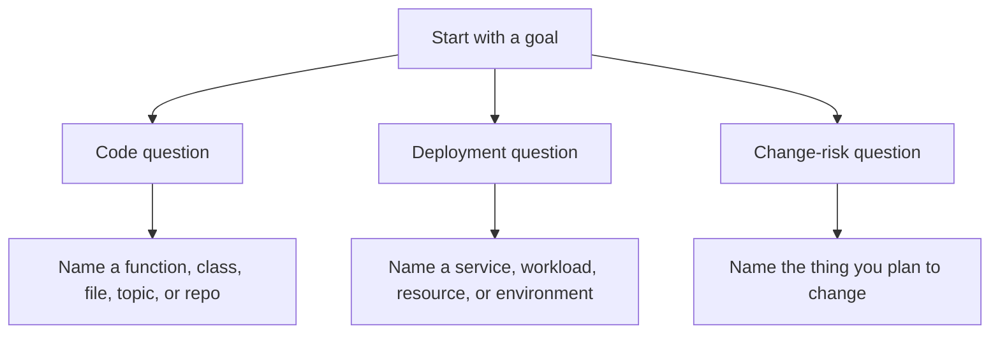

# Starter Prompts

Use these prompts when you want useful answers from Eshu through MCP, the API,
or a graph-aware assistant.

Start with the shortest prompt that matches your goal. Add the repository,
environment, workload, or resource name when you know it.

For setup and workflow steps, read:

- [Index repositories](../use/index-repositories.md)
- [Ask code questions](../use/code-questions.md)
- [Trace infrastructure](../use/trace-infrastructure.md)
- [Connect MCP](../mcp/index.md)

## Cross-Repo Framing

Use this framing when you want Eshu to work as a code-to-cloud system, not a
single-repo search tool:

- "Investigate `<service>` in `<environment>` across related repositories,
  deployment sources, and indexed documentation, then explain it."
- "Scan all linked repos and runtime context for `<service>`, then build the
  service story."
- "Across every repository that contributes to `<service>`, trace the GitOps
  and runtime path."
- "Create a `<runbook|explainer|onboarding guide>` for `<service>` after
  scanning related repos and deployment sources."

## Code Prompts

- "Who calls `process_payment` across indexed repos?"
- "Find the implementation of `PaymentProvider`."
- "Investigate repo sync authentication in `eshu`, then show the files,
  symbols, and code paths involved."
- "Which files import `shared-auth-lib`?"
- "Show the shortest call chain from `main` to this handler."
- "Show the most complex functions in `payments-service`."
- "What code looks dead in `api-gateway`?"
- "Find potential hardcoded passwords, API keys, or secrets in `api-gateway`."

Good additions:

- repository name or `repo_id`
- exact symbol name
- whether you want direct or transitive callers
- whether you need source citations

## Deployment And Infrastructure Prompts

- "Trace the deployment chain for `payments-api` in `prod`."
- "Which repos and manifests define this workload?"
- "Trace this RDS instance back to Terraform."
- "Which workloads use this database?"
- "Compare `prod` and `staging` for `checkout-service`."
- "What repositories influence the image tag and resource limits for this
  service?"

Good additions:

- environment name such as `prod`, `staging`, or `ops-qa`
- service or workload name
- resource name or canonical resource ID
- whether you want controller, runtime, or config evidence

## Change-Risk Prompts

- "What breaks if I change `payments-api`?"
- "What is the blast radius of modifying this Terraform module?"
- "What change surface is affected if I update these files?"
- "Explain why this service and this database are connected."
- "Show only direct impact first, then list transitive impact separately."

Good additions:

- exact target you plan to change
- changed file paths
- target environment
- whether you want direct or transitive impact

## Documentation And Support Prompts

- "Explain this service to a new engineer."
- "Generate an architecture and deployment explainer for `<service>`."
- "Create a support runbook for `<service>` in `<environment>`."
- "Show me the source and docs evidence behind this explanation."
- "Tell me the fastest places to investigate request, auth, config, and deploy
  issues for `<service>`."

Good additions:

- audience: support, onboarding, service owner, or platform engineer
- environment
- output shape: story, runbook, explainer, or investigation guide
- whether exact repos, files, manifests, docs, or runtime resources must be cited

## Better Answers Fast

- Ask for one thing first.
- Use exact names when you have them.
- Add the environment when the answer can differ by environment.
- Ask for evidence when the answer will drive a decision.
- Ask Eshu to scan related repositories when the question spans code,
  deployment, and runtime context.
- Follow up in layers: start with the service story, then ask for the exact file
  or relationship evidence behind one claim.

## Useful Follow-Ups

- "Now narrow that to `ops-qa`."
- "Show only the repos and files involved."
- "Explain the highest-confidence dependency path."
- "What is shared versus dedicated in that dependency set?"
- "Which part of that path is most likely to break first?"

## When To Use The MCP Cookbook

This page gives natural-language prompts. Use the
[MCP Cookbook](../reference/mcp-cookbook.md) when you need exact MCP tool names,
argument shapes, and JSON examples.
