# Jira Evidence Contract

Jira is a work-item source collector. It records what Jira reports about
issues, transitions, and remote links so reducers and query surfaces can later
join that evidence to incidents, pull requests, commits, deployments, runtime
artifacts, images, versions, and services.

Jira does not become the center of incident context. A PagerDuty incident can
be valid without a Jira ticket, and a Jira ticket can contain a PR URL without
proving which commit, deploy, image, or service caused an incident.

## Scope

This contract covers the completion boundary for the Jira collector line:

- bounded Jira Cloud issue search windows
- issue changelog and remote-link evidence
- project, status, workflow, and field metadata added in follow-up work
- webhook deliveries as freshness triggers
- redaction, fixture, retry, and stale-source expectations

Existing Jira collector, webhook freshness, and incident-context behavior from
#1026, #1031, and #1027 form the baseline. This page does not replace that
shape; it defines the contract that follow-up expansion work must preserve.

The current implemented fact kinds are:

| Fact kind | Current source | Truth boundary |
| --- | --- | --- |
| `work_item.record` | One Jira issue returned from a bounded search window. | Source-reported work-item state only; private summaries, users, project names, and source URLs are redacted or fingerprinted. |
| `work_item.transition` | One Jira changelog item for a collected issue. | Source-reported lifecycle evidence only; user authors and sensitive/custom field values are redacted. |
| `work_item.external_link` | One Jira remote issue link attached to a collected issue. | Source-reported external-link evidence only; URLs, titles, and summaries are redacted while URL fingerprints and provider support state remain. |

Project, status, workflow, and field metadata remain a follow-up contract for
#1122. Those expansions must stay under the `work_item.*` family, add fact kind
constants and schema-version helpers before emission, and include fixtures
before live collection behavior changes.

## Source Contracts

Jira collection follows Jira Cloud provider contracts rather than UI behavior:

| Source contract | Eshu use |
| --- | --- |
| Jira Cloud REST v3 issue search | Poll bounded JQL updated windows with an explicit result limit and deterministic ordering. |
| Jira issue changelogs | Collect transition and field-change evidence for issues found in the bounded window. |
| Jira remote issue links | Preserve source-reported external links without verifying the target provider identity. |
| Jira webhooks | Wake a configured Jira collector scope; webhook intake does not emit `work_item.*` facts. |
| Jira rate-limit headers | Classify throttling as retryable and keep provider limits out of metric labels. |

Official provider references:

- [Jira Cloud REST API v3](https://developer.atlassian.com/cloud/jira/platform/rest/v3/)
- [Issue search](https://developer.atlassian.com/cloud/jira/platform/rest/v3/api-group-issue-search/)
- [Issues and changelogs](https://developer.atlassian.com/cloud/jira/platform/rest/v3/api-group-issues/)
- [Issue remote links](https://developer.atlassian.com/cloud/jira/platform/rest/v3/api-group-issue-remote-links/)
- [Webhooks](https://developer.atlassian.com/cloud/jira/platform/webhooks/)
- [Rate limiting](https://developer.atlassian.com/cloud/jira/platform/rate-limiting/)

## Flow

```mermaid
flowchart LR
  coordinator["workflow coordinator"] --> claim["jira collector work"]
  claim --> collector["collector-jira"]
  collector --> search["bounded JQL search"]
  search --> details["changelog and remote-link reads"]
  details --> facts["work_item.* source facts"]
  facts --> postgres["Postgres fact store"]
  postgres --> reducer["reducers and read models"]
  webhook["signed Jira webhook"] --> trigger["freshness trigger"]
  trigger --> coordinator
```

Polling is authoritative for completeness and recovery. Webhooks improve
freshness by creating targeted work for a configured `scope_id`, but missed,
duplicate, stale, or unauthorized deliveries must not replace polling.

## Identity Contract

Every Jira fact must be idempotent inside its scope and generation. Retries,
duplicate polling windows, and duplicate remote links must converge on the same
stable key instead of creating conflicting evidence.

| Fact kind | Stable identity inputs |
| --- | --- |
| `work_item.record` | provider, `scope_id`, Jira issue ID, Jira issue key |
| `work_item.transition` | provider, `scope_id`, Jira issue ID, changelog ID, changed field |
| `work_item.external_link` | provider, `scope_id`, Jira issue ID, remote-link ID, global ID, or sanitized URL fallback |

The envelope carries `ScopeID`, `GenerationID`, `FactKind`, `StableFactKey`,
`SchemaVersion`, `CollectorKind`, `ObservedAt`, `SourceConfidence`, and
`SourceRef`. Jira facts use `SourceConfidence=reported` because the source is a
provider API response.

Minimum source fields:

| Field | Contract |
| --- | --- |
| Site scope | `ScopeID` names the configured Jira collector target, not a raw credential or token. |
| Project scope | Project ID/key is retained when Jira reports it and omitted when unknown. |
| Issue identity | Jira issue ID and key are retained on issue, transition, and remote-link facts when known. |
| Provider generation | `GenerationID` separates one Jira observation window from another. |
| Observation time | `ObservedAt` records when Eshu observed the provider response. |
| Freshness | Readers derive freshness from generation, observation time, workflow status, and webhook wake-up state. |
| Redaction marker | Jira payloads carry `redaction_policy_version=jira_work_item_v1`. |

The payload must preserve provider-native identifiers needed for replay and
joins, including issue ID/key, project ID/key when known, changelog ID, remote
link ID, remote global ID, and URL fingerprints. Payload shape changes must be
additive and must document the active redaction policy version before live
collection expands.

## Redaction Boundary

Jira data can contain private incident details, customer names, account IDs,
emails, private repository links, and token-bearing URLs. The collector and
fixtures follow these rules:

- Credential values, token environment names, and authorization headers never
  enter facts, logs, status errors, metric labels, or fixtures.
- Metric labels and status failure classes must stay low-cardinality. They may
  use provider, status class, and fact kind, but not site IDs, issue keys,
  summaries, user identities, emails, account IDs, URLs, or tokens.
- Public fixtures must use synthetic site scopes, issue keys, account IDs,
  names, summaries, emails, and URLs.
- Jira summaries, display names, account IDs, project names, remote-link titles,
  remote-link summaries, and raw source URLs are not retained as payload values.
  The payload keeps presence booleans, provider IDs, safe status fields, and URL
  fingerprints instead.
- Remote-link and Jira URLs must be sanitized before emission. User info,
  fragments, and sensitive query keys such as `token`, `api_key`, `sig`,
  `signature`, `authorization`, `password`, and `secret` are removed.
- Malformed private URLs must not be preserved as raw payload values. If no
  safe identity remains, emit a warning or skip the unsafe row according to the
  owning collector test.

Fixture names should describe the behavior, not the private source. Use values
such as `jira:site:example`, `OPS-123`, `acct-example`, and
`https://example.invalid/path` instead of real tenant, user, or service data.

## Freshness And Generation Semantics

Jira polling creates a source generation for the configured collector target.
An empty window is a successful generation with zero work-item facts. Consumers
must use generation and observation time to separate current evidence from
stale evidence.

| State | Expected behavior |
| --- | --- |
| Empty window | Commit a successful empty generation. |
| Duplicate polling window | Re-emit stable keys; storage converges rather than duplicating facts. |
| Webhook duplicate delivery | Coalesce to one authorized collector work item for the configured scope. |
| Polling recovery after webhook | Polling still backfills the source window when webhook delivery was missed or delayed. |
| Permission-hidden issue | Classify as `permission_hidden`; do not infer deletion or absence. |
| Deleted issue | Classify as `deleted`; do not synthesize a tombstone without source support. |
| Archived issue or project | Classify as `archived`; preserve the failure class for operator diagnosis. |
| Rate limited | Classify as `rate_limited`, honor retry guidance, and avoid logging private request data. |
| Partial failure | Fail the claim or classify the partial provider failure; do not silently publish incomplete truth as complete. |
| Stale source | Surface stale generation/window state to readers; do not hide stale evidence behind fresh-looking empty results. |

Freshness triggers are not facts. They are durable wake-ups that the workflow
coordinator authorizes against collector configuration before normal Jira
collection runs.

## Remote-Link Semantics

`work_item.external_link` proves only that Jira reported a remote link. It does
not verify the remote system or the relationship named in the URL.

| Link shape | Jira evidence | Required before Eshu truth |
| --- | --- | --- |
| GitHub pull request URL | Source-reported PR-looking link. | Provider PR evidence tied to a commit. |
| Git commit URL | Source-reported commit-looking link. | Git or provider commit evidence in the selected repository. |
| Deployment URL | Source-reported deployment-looking link. | CI/CD or deploy-system evidence tied to an artifact, image, or environment. |
| Runbook or postmortem URL | Source-reported documentation link. | Documentation source evidence and permission-aware reads. |
| Unknown provider URL | Opaque remote link. | A provider-specific collector or reducer rule before promotion. |
| Malformed or unsafe URL | Redacted, skipped, or warning evidence. | No truth promotion. |

An incident-context read may show the Jira link as enrichment, but missing Jira
links are a valid evidence state and must not block PagerDuty incident reads.

## Fixture Matrix

The Jira fixture suite must make each source state and expected result explicit
before implementation expands.

| Fixture ID | Source condition | Expected evidence |
| --- | --- | --- |
| `empty_window` | Bounded JQL returns no issues. | Successful empty generation; no facts. |
| `issue_created_updated` | One issue appears with created and updated timestamps. | One `work_item.record` with provider issue ID/key and project/status fields. |
| `issue_transitioned` | Changelog contains a status or field transition. | One `work_item.transition` per changelog item and changed field. |
| `issue_resolved_reopened` | Issue moves resolved and later reopened. | Distinct transition facts; record reflects latest reported state in the window. |
| `issue_deleted` | Jira returns not found for an issue or scope. | `deleted` failure classification; no fabricated record. |
| `issue_archived` | Jira returns archived issue/project behavior. | `archived` failure classification; no fabricated active record. |
| `permission_hidden` | Jira denies browse or issue-security access. | `permission_hidden` classification; absence is not treated as deletion. |
| `paged_search` | Search response spans more than one page. | All pages collected within configured bounds; stable keys across retries; `jira.search_pages` records page count on the fetch span. |
| `paged_changelog` | Changelog response spans more than one page. | All permitted pages collected within configured bounds; `jira.changelog_pages` records page count on the fetch span. |
| `duplicate_polling_window` | Same updated window is collected twice. | Same stable fact keys and generation-aware convergence. |
| `remote_link_github_pr` | Remote link points at a GitHub PR URL. | External-link fact only; PR truth remains missing until provider evidence verifies it. |
| `remote_link_commit` | Remote link points at a commit URL. | External-link fact only; commit truth remains missing until Git/provider evidence verifies it. |
| `remote_link_deployment` | Remote link points at a deployment or build URL. | External-link fact only; deployment truth remains missing until CI/CD/deploy evidence verifies it. |
| `remote_link_runbook` | Remote link points at a runbook. | External-link fact only; documentation truth requires documentation evidence. |
| `remote_link_postmortem` | Remote link points at a postmortem. | External-link fact only; documentation truth requires documentation evidence. |
| `remote_link_unknown_provider` | Remote link has no supported provider shape. | Opaque external-link evidence; no promotion. |
| `remote_link_malformed_url` | Remote link URL is malformed or unsafe. | Redacted or rejected evidence without raw unsafe URL; `jira.remote_links_rejected` records rejected rows on the fetch span. |
| `webhook_duplicate_delivery` | Same signed Jira webhook arrives more than once. | One authorized freshness work item after dedupe/coalescing. |
| `polling_recovery_after_webhook` | Webhook is missed, delayed, or unauthorized. | Scheduled polling still collects the bounded window. |
| `rate_limited_retry_after` | Jira returns `429` and retry guidance. | Retryable `rate_limited` classification, `Retry-After` capture, and no private request payload in logs. |
| `partial_failure` | Search succeeds but changelog or remote-link fetch fails. | Claim failure with bounded partial counters on `jira.fetch`; no complete-looking result. |
| `stale_source` | Last successful generation is older than the allowed freshness window. | Reader-facing stale state instead of silently fresh output. |
| `metadata_project_status_workflow_field_change` | Project/status/workflow/field metadata changes. | Follow-up `work_item.*` metadata facts after #1122 defines names and schema. |
| `redaction_required` | Source contains summaries, emails, account IDs, private URLs, or tokens. | Public fixtures redact or synthesize values; metrics/status never label with private values. |

## Read Semantics

Jira-backed read surfaces must distinguish these states:

| State | Meaning |
| --- | --- |
| Exact provider fact | Jira directly reported the issue, transition, remote link, or metadata row. |
| Derived cross-source link | A reducer joined Jira evidence to another provider fact with an explicit rule. |
| Unsupported link type | Jira reported a link Eshu does not know how to verify. |
| Missing evidence | No Jira evidence was found; this is valid for incidents without Jira. |
| Stale window | The latest Jira generation is older than the freshness target. |
| Permission-hidden | Jira denied access; the issue may exist but is not visible to the collector. |
| Rejected unsafe payload | Source data was malformed or unsafe to retain. |

Readers must not collapse these states into one "not found" result.

## Completion Gates

Before a Jira expansion PR is production-ready, it must prove:

1. The fact names and schema helpers exist before emission.
2. Identity keys converge under retries and duplicate delivery.
3. Public fixtures cover the matrix above without private tenant, user, URL, or
   credential values.
4. Rate-limit, permission-hidden, deleted, archived, partial-failure, and stale
   states are classified without leaking private source data.
5. Webhooks remain freshness triggers and polling remains the recovery path.
6. Query or MCP surfaces keep exact provider facts separate from derived
   incident, PR, commit, deployment, runtime, image, and service truth.

No-Regression Evidence: `go test ./internal/collector/jira -count=1` covers
bounded endpoint use, search and changelog pagination, duplicate-safe remote
link identity, duplicate-window stable keys, malformed remote-link rejection,
Retry-After classification, envelope redaction, empty-window handling, and
visibility, deletion, archive, and provider failure classification.

Observability Evidence: the Jira fetch span records bounded counts for
`jira.search_pages`, `jira.changelog_pages`, `jira.remote_link_pages`,
`jira.issues_emitted`, `jira.changelog_events_emitted`,
`jira.remote_links_emitted`, `jira.remote_links_rejected`,
`jira.unsupported_provider_links`, `jira.partial_failures`,
`jira.rate_limits`, `jira.retry_after_seconds`, and `jira.stale_windows`.
Existing Jira metrics continue to report provider request attempts, emitted fact
counts, rate limits, and fetch duration with bounded labels.

## Related

- [Collector And Reducer Readiness](collector-reducer-readiness.md)
- [Fact Envelope Reference](fact-envelope-reference.md)
- [MCP Tool Contract Matrix](mcp-tool-contract-matrix.md)
- [Collector Runtime Services](../deployment/service-runtimes-collectors.md)
