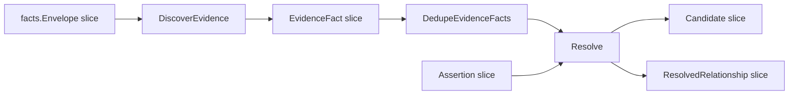

# Relationship Evidence And Resolution

This page documents the current evidence and resolver contract owned by
`go/internal/relationships`.

## Ownership Contract

`go/internal/relationships` owns evidence models, extraction, candidate
grouping, assertion handling, confidence filtering, and resolved relationship
output. Reducer-owned cross-repo resolution loads facts, catalog aliases, and
assertions, calls relationship discovery and resolution, and persists the rows.

`DiscoverEvidence` and `Resolve` do not write graph edges directly. They feed
reducer-owned persistence and materialization.

## Resolver Contract



`Resolve` groups evidence by:

```text
(source_entity_or_repo, target_entity_or_repo, relationship_type)
```

For each group, it keeps the maximum confidence, counts evidence rows, merges a
preview of evidence details, applies rejection/assertion overrides, filters
below `DefaultConfidenceThreshold` (`0.75`), then deduplicates and sorts the
resolved output.

Accuracy rule: the resolver does not globally suppress generic
`DEPENDS_ON` just because a typed edge also exists for the same pair. If both
types are emitted and both pass assertion/confidence rules, both can become
resolved relationships. Query and story surfaces should prefer the more
specific typed meaning when explaining the result, but they must not pretend the
resolver discarded a generic edge unless the code actually did.

## Assertions

Assertions are explicit control-plane or human overrides:

| Decision | Effect |
| --- | --- |
| `reject` | Removes the exact source, target, and relationship type from resolved output. |
| `assert` | Adds or overrides the exact source, target, and relationship type with confidence `1.0` and `resolution_source=assertion`. |

Any other decision string is ignored by `groupAssertions`.

## Evidence Families

Current extraction families:

| Family | Evidence examples | Common relationship types |
| --- | --- | --- |
| Terraform | `app_repo`, `app_name`, GitHub repository fields, IAM/SSM permissions, config paths, module sources, provider-schema resource identity | `PROVISIONS_DEPENDENCY_FOR`, `READS_CONFIG_FROM`, `USES_MODULE`, `RUNS_ON` |
| Terragrunt | dependency `config_path`, helper/local config asset paths, module sources | `DISCOVERS_CONFIG_IN`, `USES_MODULE`, `PROVISIONS_DEPENDENCY_FOR` |
| Helm | chart metadata and values references | `DEPLOYS_FROM` |
| Kustomize | resources, Helm chart refs, image refs | `DEPLOYS_FROM` |
| Argo CD | Application sources, ApplicationSet discovery and deploy sources, destination platform hints | `DEPLOYS_FROM`, `DISCOVERS_CONFIG_IN`, `RUNS_ON` |
| GitHub Actions | reusable workflows, checkout repositories, repo-bearing workflow inputs, action repositories, local reusable workflows | `DEPLOYS_FROM`, `DEPENDS_ON` |
| Jenkins / Groovy | shared-library refs and explicit GitHub repository URLs in controller automation | `DEPENDS_ON` and read-side controller context |
| Ansible | playbook role references and automation entrypoints | `DEPENDS_ON` and read-side controller context |
| Dockerfile | source labels | `DEPLOYS_FROM` |
| Docker Compose | build contexts, image refs, explicit `depends_on` services | `DEPLOYS_FROM`, `DEPENDS_ON` |

`EvidenceKind` constants live in `models.go` and are persisted. Renaming them
requires a storage compatibility plan.

## Matching Rules

Relationship extraction uses the catalog passed into `DiscoverEvidence`.
Catalog entries map repository IDs to known aliases. Extractors call
`matchCatalog`, which compares candidate strings against aliases with
case-insensitive substring matching.

Operational consequences:

- missing aliases cause sparse relationship evidence
- overly broad aliases can create unrelated candidates
- source files in nested Git checkouts must be indexed as independent
  repositories before cross-repo evidence can resolve truthfully

## Terraform And Terragrunt

Provider-schema support is runtime-owned by Go:

- schema loading and identity-key inference live under
  `go/internal/terraformschema`
- schema-driven extraction lives under `go/internal/relationships`
- packaged provider schemas live under
  `go/internal/terraformschema/schemas/*.json.gz`

Generic public registry module references such as `terraform-aws-modules/eks/aws`
do not create repo-bearing `USES_MODULE` edges. Private host-backed refs can
create repo-bearing module evidence when they resolve to a known local module
repository alias.

Terragrunt helper expressions are normalized only when they can be proven as
repo-local or repo-bearing paths. Unsupported helper expressions produce no
evidence rather than a guessed edge.

## Runtime Families

Terraform-managed runtime summaries stay provider-neutral at extraction time.
Portable module metadata such as `deployment_name`, `repo_name`,
`create_deploy`, `cluster_name`, `zone_id`, and `deploy_entry_point` should be
preserved first. Runtime-family interpretation belongs in shared runtime-family
logic and reducer/query layers, not in one-off parser rules.

ECS and EKS are current examples. Add new runtime families through the shared
registry before adding provider-specific story text.

## Mixed-Source Repositories

A repository can contain several evidence families at once:

- Argo CD Applications and ApplicationSets
- Kustomize overlays
- Helm values or chart references
- Terraform or Terragrunt modules
- Dockerfiles or Docker Compose files
- GitHub Actions workflows
- Jenkins or Ansible automation

Do not downcast a mixed repository to a single family if the indexed content
proves multiple families are present. The resolver can emit multiple typed
relationships for the same repository, and the read side can summarize multiple
families without changing canonical truth.

## Evidence Quality Rules

Every evidence fact should carry:

- stable `evidence_kind`
- chosen `relationship_type`
- confidence score
- plain-language rationale
- file path, graph source, or source details
- extractor/family-specific detail that lets a reviewer explain the edge

If a reviewer cannot understand why the edge exists from persisted evidence,
the extractor is too opaque.
