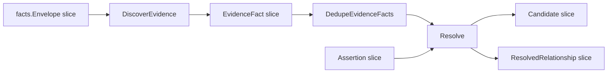

# Relationship Evidence And Resolution

This page documents the current evidence and resolver contract owned by
`go/internal/relationships`.

## Ownership Contract

`go/internal/relationships` owns evidence models, extraction, candidate
grouping, assertion handling, confidence filtering, and resolved relationship
output. Reducer-owned cross-repo resolution loads facts, catalog aliases, and
assertions, calls relationship discovery and resolution, and persists the rows.

`DiscoverEvidence` and `Resolve` do not write graph edges directly. They feed
reducer-owned persistence and materialization.

## Resolver Contract



`Resolve` groups evidence by:

```text
(source_entity_or_repo, target_entity_or_repo, relationship_type)
```

For each group, it keeps the maximum confidence, counts evidence rows, merges a
preview of evidence details, applies rejection/assertion overrides, filters
below `DefaultConfidenceThreshold` (`0.75`), then deduplicates and sorts the
resolved output.

## Confidence Semantics

Correlation relationships expose `confidence`, `resolution_source`,
`evidence_type`, `evidence_kinds`, and `confidence_basis` on repository
context, relationship overview, and relationship evidence drilldown reads.
`confidence_basis` is the comparison field for correlation edges:

| `confidence_basis` | Meaning |
| --- | --- |
| `evidence_constant` | A single evidence fact drove the score. The number is the extractor family's confidence weight, named by `evidence_type` or `evidence_kinds`. |
| `evidence_aggregate` | Multiple evidence facts were combined by the resolver's bounded corroboration formula. The score is derived from extractor weights and support count. |
| `assertion_override` | A control-plane assertion supplied the relationship. The score is a deliberate `1.0` override, not parser certainty. |

Code `CALLS` and `REFERENCES` edges use `resolution_method` instead. That
method names how the callee was resolved and determines the code-edge
confidence tier. Consumers may compare numeric confidence across code and
correlation edges only after checking the basis/method field; a `0.99` asserted
correlation edge and a `0.99` exact code edge do not mean the same provenance.
The answer-level truth envelope remains separate from per-edge confidence.

Accuracy rule: the resolver does not globally suppress generic
`DEPENDS_ON` just because a typed edge also exists for the same pair. If both
types are emitted and both pass assertion/confidence rules, both can become
resolved relationships. Query and story surfaces should prefer the more
specific typed meaning when explaining the result, but they must not pretend the
resolver discarded a generic edge unless the code actually did.

## Assertions

Assertions are explicit control-plane or human overrides:

| Decision | Effect |
| --- | --- |
| `reject` | Removes the exact source, target, and relationship type from resolved output. |
| `assert` | Adds or overrides the exact source, target, and relationship type with confidence `1.0` and `resolution_source=assertion`. |

Any other decision string is ignored by `groupAssertions`.

## Evidence Families

Current extraction families:

| Family | Evidence examples | Common relationship types |
| --- | --- | --- |
| Terraform | `app_repo`, `app_name`, GitHub repository fields, IAM/SSM permissions, config paths, module sources, provider-schema resource identity | `PROVISIONS_DEPENDENCY_FOR`, `READS_CONFIG_FROM`, `USES_MODULE`, `RUNS_ON` |
| Terragrunt | dependency `config_path`, helper/local config asset paths, module sources | `DISCOVERS_CONFIG_IN`, `USES_MODULE`, `PROVISIONS_DEPENDENCY_FOR` |
| Helm | chart metadata and values references | `DEPLOYS_FROM` |
| Kustomize | resources, Helm chart refs, image refs | `DEPLOYS_FROM` |
| Argo CD | Application sources, ApplicationSet discovery and deploy sources, destination platform hints | `DEPLOYS_FROM`, `DISCOVERS_CONFIG_IN`, `RUNS_ON` |
| Flux (cross-repo) | a `FluxGitRepository`'s `spec.url`, resolved by STRICT `repositoryidentity.NormalizeRemoteURL` equality against the target repository's catalog `RemoteURL` -- never the fuzzy alias/token matcher (issue #5483 C2) | `DEPLOYS_FROM` |
| GitHub Actions | reusable workflows, checkout repositories, repo-bearing workflow inputs, action repositories, local reusable workflows | `DEPLOYS_FROM`, `DEPENDS_ON` |
| Jenkins / Groovy | shared-library refs and explicit GitHub repository URLs in controller automation | `DEPENDS_ON` and read-side controller context |
| Ansible | playbook role references and automation entrypoints | `DEPENDS_ON` and read-side controller context |
| Dockerfile | source labels | `DEPLOYS_FROM` |
| Docker Compose | build contexts, image refs, explicit `depends_on` services | `DEPLOYS_FROM`, `DEPENDS_ON` |
| GCP cloud relationships | supported `gcp_cloud_relationship` facts whose source and target full resource names each match one distinct catalog repository | `DEPENDS_ON` |

`EvidenceKind` constants live in `models.go` and are persisted. Renaming them
requires a storage compatibility plan.

GitHub Actions evidence details additionally carry `first_party_ref_version`/
`action_ref_name`/`workflow_ref_name` sub-fields (the ref, tag, or SHA from
`owner/repo@ref`) computed in `go/internal/relationships/github_actions_evidence.go`
via the shared `go/internal/ghactionsref` package's `Parse`. These are
marshaled into the `Details` JSON persisted by `relationship_evidence_batch.go`
and, as of issue #5372, are also projected onto the deployment-evidence
artifact surface (graph `EvidenceArtifact` node properties and the equivalent
Postgres read-model row) as two normalized fields:

- `ref_value` (string): the raw `@ref` value (a branch name, a tag, or a
  commit SHA). Omitted entirely when the workflow declares no ref at all --
  a local `./` reusable workflow, a Docker action (`docker://...`), or an
  action step whose `uses:` has no `@` segment. `ref_value` is never
  defaulted or fabricated for these cases.
- `ref_pinned` (bool): present only when `ref_value` is present. `true` if
  and only if `ref_value` is a full-length commit SHA -- 40 hexadecimal
  characters (the SHA-1 object id GitHub uses today) or 64 hexadecimal
  characters (reserved for a future SHA-256 object id). Every other ref,
  including an abbreviated/short SHA, is `false`.

There is deliberately no `ref_kind` classification distinguishing a branch
from a tag. Both are just ref strings inside the workflow file -- resolving
which one a name actually refers to requires calling GitHub, which this
static extraction does not do -- and a tag is mutable regardless of which one
it is. Full-commit-SHA immutability is the only property of a ref string that
is statically provable without contacting GitHub, so it is the only claim
`ref_pinned` makes. This mirrors GitHub's own hardening guidance: "Pinning an
action to a full-length commit SHA is currently the only way to use an action
as an immutable release," while "specifying a tag ... can be moved or deleted
if a bad actor gains access to the repository storing the action" (GitHub,
[Secure use reference](https://docs.github.com/en/actions/reference/security/secure-use),
verified current as of this change).

`ref_value`/`ref_pinned` are scoped strictly to `GITHUB_ACTIONS_*` evidence
kinds -- `first_party_ref_version` is also populated by unrelated evidence
families (Terraform module versions, Ansible role refs, Chef cookbook
versions, and others via the shared `withFirstPartyRefDetails` helper), and
attaching a GitHub Actions pin-safety label to one of those would be
fabrication. The raw ref was already reaching the graph unstructured, inside
`matched_value` (`catalog_matcher.go`), before this change; the two new
fields make it structured and consistent instead of stripping it, since a
consistent strip is not honestly achievable without redacting
`matched_value` too.

The repository workflow-artifact rollup (`repository_workflow_artifacts.go`)
separately surfaces `unpinned_action_refs`: the raw `owner/repo@ref` string
for each action step whose ref is not a full-length commit SHA, using the
same `ghactionsref.Pinned` classifier. This list draws from the same
action-repository detection the rollup uses elsewhere, which excludes
`actions/checkout` specifically (only `actions/checkout`, not all `actions/*`
actions) because that step is modeled through its own checkout-repository
signal, not as a plain action dependency. A mutable `actions/checkout@<tag>`
therefore does not appear in `unpinned_action_refs`; the list is not an
exhaustive audit of every unpinned `uses:` in the file.

A `with: ref:` value passed to `actions/checkout` (checking out a specific
ref of the TARGET repository, distinct from the `uses:` ref pinning the
action/workflow ITSELF) is not captured by either signal today. This is a
known non-signal, tracked as future scope, not a partial implementation to
rely on.

**Slug-detector consolidation (issue #5526).** The owner/repo (or in-repo
path) slug detectors behind the `DEPLOYS_FROM`/`DEPENDS_ON` targets above --
remote reusable-workflow repo, third-party action repo, and local
reusable-workflow path -- used to be reimplemented once per package
(`go/internal/relationships/github_actions_evidence.go` and
`go/internal/query/content_relationships_github_actions.go` /
`repository_workflow_artifacts.go` each carried their own `@`-index parsing).
They now delegate to `go/internal/ghactionsref`'s `ReusableWorkflowRepo`,
`ActionRepo`, and `LocalReusableWorkflowPath`, the same package that already
supplied `Parse` and `Pinned` for the `ref_value`/`ref_pinned` fields
documented above. This is a behavior-preserving refactor -- differential
tests assert byte-identical slug output between the pre-#5526 per-package
implementations and the shared `ghactionsref` functions -- so no extraction
family, canonical relationship type, resolver behavior, or graph/query truth
in this document changed. See `go/internal/ghactionsref/README.md` for the
package's ownership boundary and the one preserved quirk
(`ActionRepo`'s non-stripped trailing `@ref` for a two-segment
`owner/repo@ref` value).

### Declared-Revision Edge Properties (issue #5441)

The `source_revision` and `first_party_ref_version` `Details` fields
described above are, as of issue #5441, also persisted directly as
properties on the resolved graph edge itself -- not only carried through
`Details` to the evidence-artifact surface -- for the five canonical
cross-repository relationship types: `DEPLOYS_FROM`,
`DISCOVERS_CONFIG_IN`, `PROVISIONS_DEPENDENCY_FOR`, `USES_MODULE`, and
`READS_CONFIG_FROM`. This lets a query answer "which git revision, or which
first-party module/workflow version, is this deployment/dependency edge
declared against" directly from the edge, without a second read through the
evidence-details layer this page documents.

See [Edge Source-Tool Provenance](edge-source-tool-provenance.md) for the
full edge-property contract: absent-value semantics on the pinned NornicDB
backend, the resolver's cross-fact winner rule when evidence disagrees, and
why a third candidate property (`destination_namespace`) was scoped,
implemented, and then deliberately removed before merge rather than shipped
as a property with no evidence producer on any of the five edge types.

## Matching Rules

Relationship extraction uses the catalog passed into `DiscoverEvidence`.
Catalog entries map repository IDs to known aliases. Extractors call
`matchCatalog`, which compares candidate strings against aliases with
case-insensitive substring matching.

Operational consequences:

- missing aliases cause sparse relationship evidence
- overly broad aliases can create unrelated candidates
- source files in nested Git checkouts must be indexed as independent
  repositories before cross-repo evidence can resolve truthfully
- GCP provider relationships require unique catalog matches for both endpoint
  full resource names; one-sided, ambiguous, self, partial, or unsupported
  matches produce no relationship evidence

## GCP Cloud Relationships

`gcp_cloud_relationship` facts are provider-resource evidence. They are not
repository files, so `DiscoverEvidence` routes them before the normal
file/content guard. The extractor emits `GCP_CLOUD_RELATIONSHIP` only when the
provider reports `support_state=supported`, the source full resource name
matches exactly one catalog repository, and the target full resource name
matches exactly one different catalog repository. The resulting relationship is
`DEPENDS_ON` with confidence above the default resolver threshold, preserving
the provider relationship type in evidence details for review.
Account- or region-scoped cloud collector commits do not persist this evidence
directly; deferred relationship backfill re-anchors admitted GCP relationship
evidence to the inferred source repository generation.

The extractor decodes each `gcp_cloud_relationship` payload through the Contract
System v1 typed seam (`factschema.DecodeGCPCloudRelationship`) rather than reading
raw payload keys. A payload missing a required identity field
(`source_full_resource_name`, `target_full_resource_name`, `relationship_type`) or
carrying an unsupported schema major now yields no relationship evidence instead of
a speculative empty-string match; the authoritative `input_invalid` dead letter is
still emitted when the reducer decodes the same fact for its own domain. A
version-less envelope (empty schema version, or the persist-layer `0.0.0` sentinel)
is normalized to the family's major-1 schema version before decode, so existing
persisted facts continue to resolve unchanged.

The cross-repo resolver does not consume raw `gcp_iam_policy_observation`,
`gcp_dns_record`, `gcp_collection_warning`, or `gcp_image_reference` facts.
Those families remain owned by secrets/IAM, DNS/audit, warning, and
container-image identity contracts unless a future design admits them here.

## Terraform And Terragrunt

Provider-schema support is runtime-owned by Go:

- schema loading and identity-key inference live under
  `go/internal/terraformschema`
- schema-driven extraction lives under `go/internal/relationships`
- packaged provider schemas live under
  `go/internal/terraformschema/schemas/*.json.gz`

Generic public registry module references such as `terraform-aws-modules/eks/aws`
do not create repo-bearing `USES_MODULE` edges. Private host-backed refs can
create repo-bearing module evidence when they resolve to a known local module
repository alias.

Terragrunt helper expressions are normalized only when they can be proven as
repo-local or repo-bearing paths. Unsupported helper expressions produce no
evidence rather than a guessed edge.

## Runtime Families

Terraform-managed runtime summaries stay provider-neutral at extraction time.
Portable module metadata such as `deployment_name`, `repo_name`,
`create_deploy`, `cluster_name`, `zone_id`, and `deploy_entry_point` should be
preserved first. Runtime-family interpretation belongs in shared runtime-family
logic and reducer/query layers, not in one-off parser rules.

ECS and EKS are current examples. Add new runtime families through the shared
registry before adding provider-specific story text.

## Mixed-Source Repositories

A repository can contain several evidence families at once:

- Argo CD Applications and ApplicationSets
- Kustomize overlays
- Helm values or chart references
- Terraform or Terragrunt modules
- Dockerfiles or Docker Compose files
- GitHub Actions workflows
- Jenkins or Ansible automation

Do not downcast a mixed repository to a single family if the indexed content
proves multiple families are present. The resolver can emit multiple typed
relationships for the same repository, and the read side can summarize multiple
families without changing canonical truth.

## Retraction And Empty Generations

An active relationship generation is authoritative even when it has no resolved
relationships. If a later generation for a repository scope has no evidence, or
if all current evidence is rejected or below the resolver confidence threshold,
the reducer must publish a repo-dependency retraction intent for the affected
source repository and activate the empty generation. Query surfaces should then
read no resolved rows for that scope, and the repo-dependency projection runner
must retract graph edges for the source repository before writing any surviving
current edges.

No-Regression Evidence: `go test ./internal/reducer -run
'TestCrossRepoResolution|TestBuildResolvedEdgeIntentRows|TestRepoDependencyProjectionRunner'
-count=1` covers empty-generation retractions, evidence that no longer
resolves, reject/low-confidence inputs, retract-only projection work, and the
retract-then-rewrite survivor path. `go test ./internal/storage/postgres -run
'TestRelationshipStore' -count=1` covers the active-generation read model,
including an empty active generation hiding prior resolved rows. Baseline
behavior left stale graph edges when source evidence disappeared; after this
change the reducer emits one bounded `DomainRepoDependency` retraction intent
per affected source repository and evidence source, reusing the existing
batched Cypher retraction and write paths without a new graph query shape.

Observability Evidence: cross-repo resolution logs include
`retract_intent_count`, and the existing repo-dependency projection runner logs
`active_intents`, `stale_intents`, `retract_duration_seconds`, and
`write_duration_seconds` for the same cycle. Graph writes still flow through the
existing canonical projection and retraction telemetry, so operators can
diagnose a stuck or slow retraction from reducer logs, shared projection stale
intent counts, and canonical graph write/retract duration metrics.

## Evidence Quality Rules

Every evidence fact should carry:

- stable `evidence_kind`
- chosen `relationship_type`
- confidence score
- plain-language rationale
- file path, graph source, or source details
- extractor/family-specific detail that lets a reviewer explain the edge

If a reviewer cannot understand why the edge exists from persisted evidence,
the extractor is too opaque.
