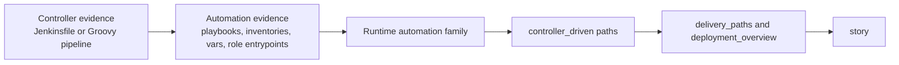

# Relationship Runtime And Stories

This page explains how resolved relationships become graph edges and how query
surfaces shape deployment and service stories.

## Runtime Topology

Resolver-owned relationship rows are only part of the graph. Runtime topology
also uses reducer/materializer edges:

```text
Repository -[:DEFINES]-> Workload
WorkloadInstance -[:INSTANCE_OF]-> Workload
WorkloadInstance -[:RUNS_ON]-> Platform
Repository -[:PROVISIONS_PLATFORM]-> Platform
WorkloadInstance -[:DEPLOYMENT_SOURCE]-> Repository
```

Repository-level platform counts and stories follow the workload-instance
runtime shape:

```text
Repository -[:DEFINES]-> Workload
Workload <-[:INSTANCE_OF]- WorkloadInstance
WorkloadInstance -[:RUNS_ON]-> Platform
```

New query work should not count platforms from a direct
`Repository -[:RUNS_ON]-> Platform` shortcut. That shortcut undercounts when
runtime ownership lives on workload instances.

## Graph Readiness

The Go write path uses explicit phase rows so shared edge writers do not run
before their required nodes exist.

Readiness flow:

1. projector writes canonical nodes for a bounded acceptance slice
2. projector publishes `canonical_nodes_committed`
3. semantic-entity materialization writes semantic nodes for the same slice
4. reducer publishes `semantic_nodes_committed`
5. shared edge domains proceed only when their required readiness phase exists

The durable rows live in Postgres `graph_projection_phase_state`.

Current shared readiness requirements:

| Domain | Required phase |
| --- | --- |
| `code_calls` | `canonical_nodes_committed` |
| `sql_relationships` | `semantic_nodes_committed` |
| `inheritance_edges` | `semantic_nodes_committed` |

See [Service Workflows](service-workflows.md) and
[Shared-Write Operations](telemetry/shared-write-operations.md) for operator
signals.

## Story Fields

Repository and service responses are story-first: read `story`, then
`deployment_overview`, then drill-down fields.

`deployment_overview` is assembled from materialized graph truth plus read-side
artifact extraction. Common fields include:

- `deployment_artifacts`
- `delivery_paths`
- `delivery_workflows`
- `delivery_family_paths`
- `delivery_family_story`
- `topology_story`
- `direct_story`
- `shared_config_paths`
- `workloads`
- `platforms`
- `infrastructure_families`

These fields summarize existing truth. They do not create canonical
relationships.

## Shared Config And Consumers

Two summaries are especially easy to overuse:

- `shared_config_paths`
- `consumer_repositories`

They answer:

- which repos appear to share config families with this service
- which repos reference or call this service without deploying it

They must not invent deployment or provisioning relationships by themselves.
Promotion to canonical truth still requires evidence extraction, resolution,
and graph materialization.

## Story Ordering

Repository story shaping keeps the short narrative focused:

1. codebase and language shape
2. workload and runtime platform signals
3. infrastructure families
4. relationship overview story, when present
5. delivery-family story lines
6. support and limitation notes

`deployment_overview.direct_story` intentionally focuses on direct deployment
evidence. Broader `topology_story` and `delivery_family_story` fields keep
supporting context available without forcing the first narrative to mention
every shared config path.

## Controller-Driven Automation

Controller-driven automation is read-side context unless the lower layers have
already proven a canonical relationship.



Rules:

- controller extraction should stay tool-semantic and portable
- automation extraction should focus on high-signal source surfaces
- runtime-family inference should stay centralized
- answer shaping should consume normalized paths, not repo-specific heuristics
- controller context should not become `DEPLOYS_FROM` or
  `PROVISIONS_DEPENDENCY_FOR` unless canonical evidence really exists

## Trace Deployment Chain

`POST /api/v0/impact/trace-deployment-chain` is the deployment-specific story
surface. It resolves a service/workload, fetches deployment sources, cloud
resources, Kubernetes evidence, image refs, OCI registry truth, controller
entities, and consumer evidence, then returns a story-first response with truth
metadata.

Use this route when a repository story is not enough and the user asks how a
service reaches runtime. Platform placement is represented by exact
relationship endpoints: top-level `topology_edges[]` preserves the repository
`DEFINES` workload and instance `INSTANCE_OF` workload backbone;
`instances[].platforms[].topology_edges[]` uses `RUNS_ON` only for direct
runtime placement; and separate `provisioned_platforms[]` rows preserve
`PROVISIONS_DEPENDENCY_FOR` plus `PROVISIONS_PLATFORM` without synthesizing or
copying instance placement. Runtime environment remains an instance attribute
unless the response supplies a canonical graph relationship. Deployment
sources are deterministically capped and disclose their coverage through
`deployment_source_limits`.

## Truthfulness Rules

- If evidence is incomplete, ambiguous, or corpus-specific, say so.
- Do not upgrade weak source hints into strong relationship edges.
- Do not hide graph/query disagreement with nicer prose.
- Validate positive, negative, and ambiguous repo families before accepting a
  relationship/story change.
