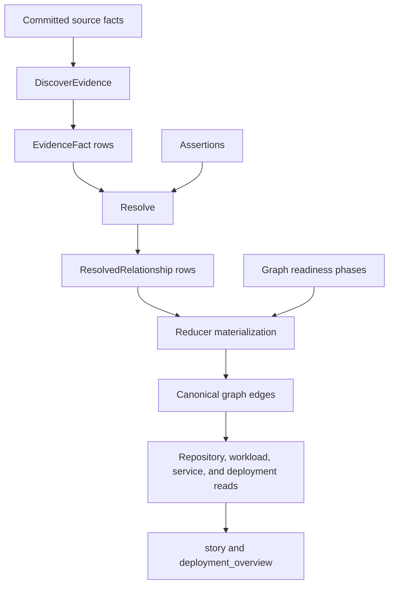

# Relationship Mapping

Eshu relationship mapping turns source evidence into typed cross-repository and
runtime relationships. The important contract is stage ownership: extraction
describes evidence, resolution admits canonical relationship rows, graph writers
materialize edges, and query surfaces shape stories from the materialized truth.

Use this page as the route map. The details are split by job:

- [Relationship Evidence And Resolution](relationship-mapping-evidence.md)
  explains evidence families, canonical relationship types, assertions,
  confidence, and resolver behavior.
- [Relationship Runtime And Stories](relationship-mapping-runtime-stories.md)
  explains graph readiness, runtime topology, deployment overview fields, and
  story shaping.
- [Relationship Mapping Observability](relationship-mapping-observability.md)
  explains logs, traces, metrics, and proof expectations.
- [Relationship Graph Examples](../guides/relationship-graphs.md) gives
  example-driven diagrams for public readers.

## Stage Ownership

| Stage | Owns | Emits | Must not do |
| --- | --- | --- | --- |
| Indexing | parsed files, graph entities, raw source properties | source-local graph and facts | infer cross-repo truth from partial data |
| Evidence extraction | explainable source signals from facts and files | `EvidenceFact` rows with kind, type, confidence, rationale, and details | collapse every signal into `DEPENDS_ON` for convenience |
| Resolution | candidate grouping, assertions, rejection, confidence filtering | `ResolvedRelationship` rows | write graph edges or shape user prose |
| Reducer materialization | canonical workload, platform, dependency, and shared graph writes | Neo4j/NornicDB edges and Postgres readiness rows | invent evidence that did not survive resolution |
| Query and story shaping | concise read-side summaries | `story`, `deployment_overview`, context fields, limitations | create new canonical truth |

If a change feels ambiguous, ask which stage owns the decision before editing.

## End-To-End Flow



### Two invocation paths, two payload shapes

`DiscoverEvidence` runs from two places, and they hand it `parsed_file_data`
in different Go shapes:

- **Streaming**, per commit, for every repository scope. The collector embeds
  the parser's in-memory map into the fact envelope verbatim, with no JSON
  round trip, so bucket values arrive as `[]map[string]any`.
- **Deferred backfill**, which reloads facts from Postgres. JSONB decoding
  produces `[]any` of `map[string]any`.

An extractor that reads a bucket must accept both. Asserting one shape
silently yields zero evidence on the other path — and because the streaming
path is the always-on one, that failure is invisible: no error, no log, just
an empty result that looks like a repository with nothing to find.

This is not hypothetical. Eight IaC buckets (Terraform modules, Terragrunt
dependencies and configs, Helm charts and values, ArgoCD applications and
applicationsets, Flux git repositories) asserted `.([]any)` and therefore
produced nothing on the streaming path until #5445. Their evidence appeared
only after a backfill pass. Every test for them used `[]any` fixtures — the
backfill shape — so the suite stayed green throughout.

Read buckets through the typed `DecodeParsedFileData*` accessors in
`sdk/go/factschema`, which handle both shapes. When adding a test for an
extractor, drive it from real parser output rather than a hand-built map, so
the fixture cannot encode a shape production never emits.

## Canonical Relationship Types

The resolver-owned typed relationship enum lives in
`go/internal/relationships/models.go`:

| Type | Meaning |
| --- | --- |
| `DEPLOYS_FROM` | The source deploys artifacts from the target. |
| `DISCOVERS_CONFIG_IN` | The source discovers configuration in the target. |
| `RUNS_ON` | The source runs on the target platform. |
| `PROVISIONS_DEPENDENCY_FOR` | The source provisions infrastructure or configuration for the target. |
| `DEPENDS_ON` | Generic dependency when no more specific relationship is truthful. |
| `USES_MODULE` | The source consumes a target module repository. |
| `READS_CONFIG_FROM` | The source is granted read access to target configuration. |

Related graph edges such as `PROVISIONS_PLATFORM`, `DEFINES`, `INSTANCE_OF`,
and `DEPLOYMENT_SOURCE` are real runtime topology edges, but they are not
resolver-owned relationship types. They are written by reducer/materializer
paths and read by repository, workload, service, and deployment trace surfaces.
Deployment trace responses preserve `DEPLOYMENT_SOURCE` separately from
`DEPLOYS_FROM` and return each row's canonical `source_id` and `target_id` so
clients do not invent a repository-to-repository edge from instance admission
evidence.

## Traversal Rule

Use the direct repository-file edge for flat file lookup:

```text
Repository -[:REPO_CONTAINS]-> File -[:CONTAINS*]-> entity
```

Use `CONTAINS*` from a repository only when the query is genuinely about tree
ancestry or arbitrary descendants. Flat repo-file queries should not walk the
whole directory tree just to locate files.

## Canonical Versus Derived

Canonical truth:

- evidence rows
- resolved relationship rows
- workload/platform/dependency graph edges
- graph readiness rows such as `graph_projection_phase_state`

Derived read-side summaries:

- `deployment_artifacts`
- `delivery_paths`
- `delivery_workflows`
- `delivery_family_paths`
- `delivery_family_story`
- `shared_config_paths`
- `consumer_repositories`
- `relationship_overview`
- `deployment_overview`
- `story`

Derived summaries help answer questions. They must not be used as proof that a
new canonical relationship exists.

## Direction Matters

Write the edge in the direction of the behavior being explained:

- `gitops-control-plane -[:DISCOVERS_CONFIG_IN]-> platform-observability`
- `payments-api -[:DEPLOYS_FROM]-> deployment-charts`
- `terraform-stack-search -[:PROVISIONS_DEPENDENCY_FOR]-> search-api`

If the source is a control plane, keep the control-plane source on the left. If
the source is the deployed workload or service, keep that workload on the left.

## Flux Cross-Repository Deployment Binding

Flux contributes a cross-repository `DEPLOYS_FROM` relationship only when a
`FluxGitRepository.spec.url` is a supported remote URL whose
`repositoryidentity.NormalizeRemoteURL` value equals the catalog `RemoteURL` of
exactly one *other* indexed repository. This is strict remote-URL identity, not
an alias or token match; self, missing, and ambiguous matches emit no
cross-repository evidence.

A deployment trace may attribute target-repository resources to a Flux
Kustomization or HelmRelease only when its `sourceRef.kind` is `GitRepository`,
its effective `(namespace, name)` exactly matches the evidence binding, and
that binding identifies exactly one target repository. An explicit
`sourceRef.namespace` wins; otherwise the controller namespace supplies the
effective namespace. Missing identity, no target, multiple targets, or a
saturated bounded binding read fail closed: the trace does not expand the
controller into a target repository.

Target-resource matching remains path-bounded. The normalized controller root
must contain the resource's safe relative path; `.` and `./` mean the target
repository root and match safe relative paths. Empty, unsafe, or otherwise
unusable roots do not become repository-wide matches.

## Safe Extension Checklist

Before adding a new mapping family or runtime interpretation:

1. Choose the semantic relationship first.
2. Choose the strongest explainable evidence source.
3. Keep parser output portable and provider-neutral where possible.
4. Emit evidence with stable kind, relationship type, confidence, rationale,
   and details.
5. Let `Resolve` apply assertions, rejections, and confidence filtering.
6. Add positive, negative, and ambiguous tests.
7. Prove graph truth and query/story truth agree.
8. Keep incomplete evidence explicit instead of hiding it behind confident
   prose.

Do not lower `DefaultConfidenceThreshold` or inflate confidence to force an
edge. If the signal is weak, keep it weak and let stronger evidence or an
explicit assertion admit it.

## Relationship Extractor Contribution Kit

Relationship extractors are evidence producers. They do not decide canonical
truth by themselves, and they do not write graph edges directly. A contribution
is ready only when extraction, resolution, graph materialization, and query or
story behavior agree.

Use this checklist:

1. Name the source evidence family and the intended canonical relationship type.
2. Add extractor tests with positive, negative, and ambiguous fixtures.
3. Keep provider-specific parsing in the extractor and relationship admission in
   `Resolve`.
4. Prove resolver behavior when confidence, assertions, rejections, or aliases
   affect the candidate.
5. Prove reducer/materializer behavior before claiming graph truth.
6. Prove the repository, workload, service, deployment, or story surface that
   will expose the relationship.
7. Update this page, the evidence/runtime/story subpage that owns the detail,
   and any affected language page when parser evidence feeds the relationship.
8. Run focused relationship tests, query or reducer tests for surfaced truth,
   `scripts/verify-parser-relationship-kit.sh`, the docs build, and
   `git diff --check`.

Fixture expectations:

| Fixture class | Required proof |
| --- | --- |
| Positive | Strong source evidence emits the intended `EvidenceFact`, survives resolution, and appears on the documented graph/query/story path. |
| Negative | Similar-looking source evidence that should not create a relationship stays absent or rejected with a clear reason. |
| Ambiguous | Multi-target, weak, duplicated, stale, or partial evidence remains unresolved, low confidence, or explicitly limited instead of inventing truth. |

Guardrails:

- Parse-only behavior is not supported query behavior. Parser evidence can feed
  relationships, but the relationship remains unsupported until resolver,
  materializer, and query/story proof exist.
- Dynamic imports, plugin loading, reflection, generated code, framework roots,
  and provider-specific conventions need exact fixtures before they can admit a
  relationship.
- Do not collapse domain-specific relationships into `DEPENDS_ON` just because
  it is easier to materialize.
- Do not use derived read-side summaries such as `story` or
  `deployment_overview` as canonical relationship proof.
- Keep unsupported or partial source states visible in evidence details,
  limitations, status rows, logs, or query responses.

### Shared repository-catalog derivation

Relationship extractors that match candidates by repository alias resolve those
aliases against a catalog derived from `repository` facts.
`relationships.RepositoryCatalogEntry` (`relationships/catalog.go`) is the single
source of truth for that derivation: it turns a decoded repository fact payload
into a `CatalogEntry` (RepoID plus its aliases). The Postgres streaming commit
path and Ifá's offline derived catalog (#4394) both call it, so a generation's
committed repository identity is computed identically to any catalog derived
offline from the same facts. Do not re-implement repository-alias derivation in
an extractor; use this helper so alias-drift detection compares consistently
shaped aliases.

### Boundary-aware repository reference keys

Deferred relationship backfill loads candidate `content`, `file`, and
`gcp_cloud_relationship` facts by comparing their payload text against the
repository catalog. That comparison must be a superset of the in-memory
relationship matcher without collapsing overlapping repository names such as
`github.com/org/app` and `github.com/org/app-config`.

`relationships.CatalogReferenceKey` and
`relationships.CatalogReferenceTokenStream` provide that contract. They reuse the
same tokenization as the catalog matcher, then wrap tokens with `|` delimiters so
SQL can test whole-token containment instead of using unbounded substring
matches. The Postgres `relationship_reference_candidate_keys` side table stores
those token streams for accepted relationship-candidate facts; the deferred load
query uses the side table first and falls back to the legacy payload predicate
for unkeyed rows.

Any migration or repair path that backfills reference keys must preserve the
same token-boundary behavior: split first, trim `.git` and supported config-file
suffixes only at token boundaries, and keep source-repository self-exclusion in
lockstep with the runtime helper. Add positive and negative proof for prefix
overlap, `.github` repositories, file-suffixed references, and empty `repo_id`
fallbacks before changing this matcher.

## Interpreting Code Relationship Truth In API And MCP Responses

Code relationship reads (`POST /api/v0/code/relationships/story` and the
`analyze_code_relationships` MCP tool) expose uncertainty per edge and per
answer so an agent never has to guess how much to trust a relationship. The
labels are descriptive: they never change the answer-level `TruthEnvelope` and
never upgrade a heuristic or unsupported edge into canonical truth.

### Per-edge provenance

Every relationship row carries a `provenance` block:

| Field | Meaning |
| --- | --- |
| `source_family` | `code_edge` (resolved by the parser/reducer call resolver), `correlation_edge` (correlation evidence), or `unsupported` (no recorded basis). |
| `method` | The resolution mechanism: a code `resolution_method` (ADR #2222: `scip`, `import_binding`, `type_inferred`, `repo_unique_name`, …), a correlation `confidence_basis`, or `unsupported`. |
| `confidence` | Numeric confidence (omitted for a legacy edge with no recorded provenance). |
| `confidence_tier` | Named band derived from `confidence`: `high` (>= 0.9), `medium` (>= 0.7), `low` (otherwise), or `unsupported` (no confidence). A presentation derivation only. |
| `truth_state` | `derived` (canonical code edge with confidence), `heuristic` (correlation or semantic edge — evidence, not canonical), or `unsupported` (no confidence or no basis). |

A `heuristic` or `unsupported` edge is **never** promoted to `derived`. The
`confidence_tier` is a convenience over `confidence`; it does not raise or lower
`truth_state`.

### Per-answer missing-edge reason and truncation

The response `coverage` block explains why a result is empty or short instead of
leaving the caller to guess:

| `missing_edge_reason` | Meaning |
| --- | --- |
| `complete` | All matching relationships were returned. |
| `target_unresolved` | The target did not resolve to a known entity. |
| `no_relationships_found` | The target resolved but has no edges of the requested type and direction. |
| `all_below_confidence_floor` | Edges exist but all fell below the requested `min_confidence`. |
| `truncated_by_limit` | More edges exist than `limit`; raise `limit` or page with `offset`. |
| `truncated_by_token_budget` | Rows were trimmed to fit `token_budget`. |

`truncation_state` reports the capping cause (`none`, `count`, `token_budget`,
or `count_and_token_budget`), and `evidence_explanation` is a bounded
human-readable form of the reason. The MCP `analyze_code_relationships` text
summary surfaces the same derived/heuristic/unsupported counts and the
missing-edge reason; its `structuredContent` is the unchanged HTTP answer, so
API and MCP agree on every label.

## What To Read Next

- Need to change extractors or relationship types:
  [Relationship Evidence And Resolution](relationship-mapping-evidence.md)
- Need to change deployment stories or read-side summaries:
  [Relationship Runtime And Stories](relationship-mapping-runtime-stories.md)
- Need to prove a relationship change:
  [Relationship Mapping Observability](relationship-mapping-observability.md)
