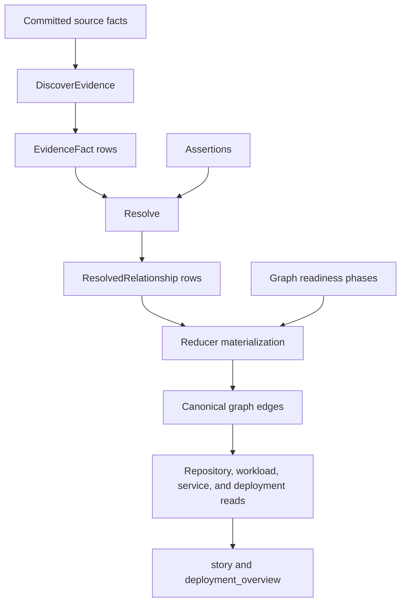

# Relationship Mapping

Eshu relationship mapping turns source evidence into typed cross-repository and
runtime relationships. The important contract is stage ownership: extraction
describes evidence, resolution admits canonical relationship rows, graph writers
materialize edges, and query surfaces shape stories from the materialized truth.

Use this page as the route map. The details are split by job:

- [Relationship Evidence And Resolution](relationship-mapping-evidence.md)
  explains evidence families, canonical relationship types, assertions,
  confidence, and resolver behavior.
- [Relationship Runtime And Stories](relationship-mapping-runtime-stories.md)
  explains graph readiness, runtime topology, deployment overview fields, and
  story shaping.
- [Relationship Mapping Observability](relationship-mapping-observability.md)
  explains logs, traces, metrics, and proof expectations.
- [Relationship Graph Examples](../guides/relationship-graphs.md) gives
  example-driven diagrams for public readers.

## Stage Ownership

| Stage | Owns | Emits | Must not do |
| --- | --- | --- | --- |
| Indexing | parsed files, graph entities, raw source properties | source-local graph and facts | infer cross-repo truth from partial data |
| Evidence extraction | explainable source signals from facts and files | `EvidenceFact` rows with kind, type, confidence, rationale, and details | collapse every signal into `DEPENDS_ON` for convenience |
| Resolution | candidate grouping, assertions, rejection, confidence filtering | `ResolvedRelationship` rows | write graph edges or shape user prose |
| Reducer materialization | canonical workload, platform, dependency, and shared graph writes | Neo4j/NornicDB edges and Postgres readiness rows | invent evidence that did not survive resolution |
| Query and story shaping | concise read-side summaries | `story`, `deployment_overview`, context fields, limitations | create new canonical truth |

If a change feels ambiguous, ask which stage owns the decision before editing.

## End-To-End Flow



## Canonical Relationship Types

The resolver-owned typed relationship enum lives in
`go/internal/relationships/models.go`:

| Type | Meaning |
| --- | --- |
| `DEPLOYS_FROM` | The source deploys artifacts from the target. |
| `DISCOVERS_CONFIG_IN` | The source discovers configuration in the target. |
| `RUNS_ON` | The source runs on the target platform. |
| `PROVISIONS_DEPENDENCY_FOR` | The source provisions infrastructure or configuration for the target. |
| `DEPENDS_ON` | Generic dependency when no more specific relationship is truthful. |
| `USES_MODULE` | The source consumes a target module repository. |
| `READS_CONFIG_FROM` | The source is granted read access to target configuration. |

Related graph edges such as `PROVISIONS_PLATFORM`, `DEFINES`, `INSTANCE_OF`,
and `DEPLOYMENT_SOURCE` are real runtime topology edges, but they are not
resolver-owned relationship types. They are written by reducer/materializer
paths and read by repository, workload, service, and deployment trace surfaces.

## Traversal Rule

Use the direct repository-file edge for flat file lookup:

```text
Repository -[:REPO_CONTAINS]-> File -[:CONTAINS*]-> entity
```

Use `CONTAINS*` from a repository only when the query is genuinely about tree
ancestry or arbitrary descendants. Flat repo-file queries should not walk the
whole directory tree just to locate files.

## Canonical Versus Derived

Canonical truth:

- evidence rows
- resolved relationship rows
- workload/platform/dependency graph edges
- graph readiness rows such as `graph_projection_phase_state`

Derived read-side summaries:

- `deployment_artifacts`
- `delivery_paths`
- `delivery_workflows`
- `delivery_family_paths`
- `delivery_family_story`
- `shared_config_paths`
- `consumer_repositories`
- `relationship_overview`
- `deployment_overview`
- `story`

Derived summaries help answer questions. They must not be used as proof that a
new canonical relationship exists.

## Direction Matters

Write the edge in the direction of the behavior being explained:

- `gitops-control-plane -[:DISCOVERS_CONFIG_IN]-> platform-observability`
- `payments-api -[:DEPLOYS_FROM]-> deployment-charts`
- `terraform-stack-search -[:PROVISIONS_DEPENDENCY_FOR]-> search-api`

If the source is a control plane, keep the control-plane source on the left. If
the source is the deployed workload or service, keep that workload on the left.

## Safe Extension Checklist

Before adding a new mapping family or runtime interpretation:

1. Choose the semantic relationship first.
2. Choose the strongest explainable evidence source.
3. Keep parser output portable and provider-neutral where possible.
4. Emit evidence with stable kind, relationship type, confidence, rationale,
   and details.
5. Let `Resolve` apply assertions, rejections, and confidence filtering.
6. Add positive, negative, and ambiguous tests.
7. Prove graph truth and query/story truth agree.
8. Keep incomplete evidence explicit instead of hiding it behind confident
   prose.

Do not lower `DefaultConfidenceThreshold` or inflate confidence to force an
edge. If the signal is weak, keep it weak and let stronger evidence or an
explicit assertion admit it.

## What To Read Next

- Need to change extractors or relationship types:
  [Relationship Evidence And Resolution](relationship-mapping-evidence.md)
- Need to change deployment stories or read-side summaries:
  [Relationship Runtime And Stories](relationship-mapping-runtime-stories.md)
- Need to prove a relationship change:
  [Relationship Mapping Observability](relationship-mapping-observability.md)
