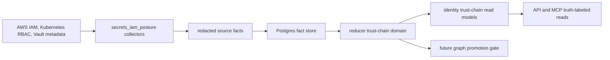

# Secrets And IAM Posture Collector Contract

This page defines the design contract for issue
[#25](https://github.com/eshu-hq/eshu/issues/25). It is a design baseline, not
a deployed runtime promise.

The collector family answers a narrow user question:

> Which repository, service, workload, service account, IAM role, Vault role,
> policy, and secret metadata path form the access path, and where is that path
> risky, stale, missing, or unsupported?

The answer must be explainable evidence, not a flattened access verdict.
Secrets and IAM metadata can reveal sensitive topology even when secret values
are never read, so this contract is stricter than ordinary metadata collectors.

## Status

`secrets_iam_posture` is moving from contract into narrow implementation
slices. Source fact schemas, envelope builders, redaction-safe IRSA/Vault join
anchors, and the first reducer-owned trust-chain read model are implemented.
This is still not a deployed hosted collector runtime or API/MCP authority
promise until the remaining source lanes, query surfaces, telemetry/status path,
fixtures, and chart path land through implementation PRs.

Do not add Helm values, service-runtime rows, environment variables, graph
labels, graph edges, or API/MCP authority claims for this family unless the
same implementation PR wires and proves that runtime surface. A chart option or
graph schema is an operator promise; neither exists yet for this family.

No-Regression Evidence: this page documents a gated contract only. It does not
add runtime code, durable fact schemas, queue behavior, chart templates, graph
DDL, or query handlers.

No-Observability-Change: this page defines required future telemetry, but emits
no new metrics, spans, logs, or status fields.

## Source Boundaries

Treat this as one collector family with four source lanes. The lanes share the
envelope, scope, generation, redaction, and reducer-truth contracts, but each
source keeps its own authorization semantics.

| Source lane | Source truth | Collector-owned evidence | Reducer-owned truth |
| --- | --- | --- | --- |
| AWS IAM | IAM and STS control-plane metadata. Baseline reads include role, trust-policy, managed-policy, inline-policy, permission-boundary, instance-profile, OIDC/SAML provider, and optional Access Analyzer evidence. | Redacted provider facts for principals, trust statements, permission policies, attachments, boundaries, instance profiles, federated providers, and Access Analyzer findings. | Cross-account trust posture, confused-deputy risk, role-to-workload joins, permission-boundary interpretation, and posture observations. |
| GCP IAM | Cloud Asset Inventory IAM bindings on GCP resources and ServiceAccount resources. | Redacted provider facts for service-account principals, service-account impersonation trust bindings, and permission grants. | GKE Workload Identity joins, service-account impersonation truth, Secret Manager grant posture, and workload-to-GCP-secret access paths. |
| Kubernetes RBAC | Kubernetes API objects for ServiceAccount, Role, ClusterRole, RoleBinding, ClusterRoleBinding, workload service-account usage, projected token posture, IRSA annotations, and EKS Pod Identity associations where present. | Redacted provider facts for service accounts, RBAC roles and bindings, workload identity usage, token posture, IRSA annotations, and EKS Pod Identity associations. | Namespace or cluster-wide effective binding interpretation, workload-to-service-account joins, and stale or missing workload evidence. |
| Vault | Vault auth method, auth role, identity entity/group/alias, ACL policy, secret engine mount, and KV v2 metadata APIs. | Redacted metadata facts for mounts, auth roles, ACL policies, identity entities and aliases, secret engine mounts, and KV metadata. | Kubernetes auth role joins, Vault policy capability interpretation, secret metadata path access, unsupported Enterprise policy layers, and posture observations. |

The following source APIs and behaviors shape the first contract:

- AWS IAM `ListRoles` and `ListPolicies` are paginated list APIs and return
  subset views, so implementation must perform bounded follow-up reads for
  details it needs rather than treating one list page as complete.
- AWS EKS IRSA trust policies identify Kubernetes service accounts through the
  `system:serviceaccount:<namespace>:<service-account>` subject and the
  `sts:AssumeRoleWithWebIdentity` action.
- GKE Workload Identity requires both the Kubernetes ServiceAccount annotation
  (`iam.gke.io/gcp-service-account`) and a GCP ServiceAccount IAM binding that
  grants `roles/iam.workloadIdentityUser` to the matching workload-pool subject.
- Kubernetes RBAC separates namespace-scoped `RoleBinding` evidence from
  cluster-wide `ClusterRoleBinding` evidence. A cluster binding can grant broad
  permissions and cannot be collapsed into a namespace-only fact.
- Vault KV v2 `LIST /metadata` returns key names and explicitly does not expose
  values through that command, but key names themselves are sensitive metadata
  and must be hashed or fingerprinted by default.

Official references:

- [AWS IAM ListRoles](https://docs.aws.amazon.com/IAM/latest/APIReference/API_ListRoles.html)
- [AWS IAM ListPolicies](https://docs.aws.amazon.com/IAM/latest/APIReference/API_ListPolicies.html)
- [AWS STS AssumeRole](https://docs.aws.amazon.com/STS/latest/APIReference/API_AssumeRole.html)
- [AWS confused deputy guidance](https://docs.aws.amazon.com/IAM/latest/UserGuide/confused-deputy.html)
- [EKS IAM roles for service accounts](https://docs.aws.amazon.com/eks/latest/userguide/associate-service-account-role.html)
- [EKS Pod Identity](https://docs.aws.amazon.com/eks/latest/userguide/pod-identities.html)
- [GKE Workload Identity Federation](https://cloud.google.com/kubernetes-engine/docs/how-to/workload-identity)
- [Kubernetes RBAC](https://kubernetes.io/docs/reference/access-authn-authz/rbac/)
- [Kubernetes ServiceAccounts](https://kubernetes.io/docs/concepts/security/service-accounts/)
- [Vault KV v2 API](https://developer.hashicorp.com/vault/api-docs/secret/kv/kv-v2)
- [Vault auth API](https://developer.hashicorp.com/vault/api-docs/system/auth)
- [Vault policies API](https://developer.hashicorp.com/vault/api-docs/system/policies)

## Flow And Ownership

Collectors own source observation, source-local normalization, redaction,
scope identity, generation identity, stable fact keys, and fact emission.

Reducers own all cross-source joins, freshness comparison, unsupported-policy
labels, posture observations, read-model truth, and any future graph promotion.
Collectors must not write canonical graph state or infer an end-to-end access
path.

## Scope And Generation

Every claim must have one durable source scope and one generation. Generation
identity is assigned by the workflow coordinator or collector claim path for one
bounded scan and is carried into every emitted fact.

| Source | Scope shape | Generation evidence |
| --- | --- | --- |
| AWS IAM | `aws_iam:<partition>:<account_id>` plus regional extension only for EKS Pod Identity or regional analyzer evidence. | Scan generation, page checkpoints, provider read time, policy version IDs, role update time, and Access Analyzer finding timestamp where present. |
| Kubernetes RBAC | `k8s:<cluster_uid>` or `k8s:<cluster_arn>`; fallback to an API-server fingerprint only when the cluster UID is unavailable. | Scan generation, object `resourceVersion`, namespace, workload UID fingerprint, and observed read time. |
| Vault | `vault:<cluster_id>:<namespace>:<mount_path>` with namespace omitted only for non-Enterprise or unsupported namespace evidence. | Scan generation, mount accessor fingerprint, policy hash, entity or alias ID fingerprint, KV metadata version, and observed read time. |

Empty scopes are successful generations when the source returns a complete empty
result. Permission-hidden, partial, rate-limited, stale, and unsupported source
states are not empty results; they must emit coverage or warning evidence.

Duplicate scans, duplicate pages, retries, and restarted collectors must
converge on the same `stable_fact_key` for the same source observation.

## Fact Families

Initial implementation should use these source facts. All payloads carry
`collector_kind=secrets_iam_posture`, `source_confidence=reported` for provider
API evidence, `scope_id`, `generation_id`, `observed_at`, `source_ref`,
`redaction_policy_version`, and a bounded source outcome.

| Fact kind | Source | Purpose |
| --- | --- | --- |
| `aws_iam_principal` | AWS IAM | Role, user, group, or federated provider metadata and safe identifiers. |
| `aws_iam_trust_policy` | AWS IAM | Normalized trust statement metadata, principals, actions, and redacted condition-key evidence. |
| `aws_iam_permission_policy` | AWS IAM | Managed or inline permission-policy metadata and normalized/redacted statement summaries. |
| `aws_iam_policy_attachment` | AWS IAM | Principal-to-policy attachment evidence. |
| `aws_iam_permission_boundary` | AWS IAM | Principal-to-boundary relationship evidence. |
| `aws_iam_instance_profile` | AWS IAM | Instance profile to IAM role relationship evidence. |
| `aws_iam_access_analyzer_finding` | AWS IAM | Access Analyzer finding evidence. Findings are signal, not final truth. |
| `gcp_iam_principal` | GCP IAM | Service-account principal metadata keyed by the same member fingerprint used by GCP permission grants. |
| `gcp_iam_trust_policy` | GCP IAM | ServiceAccount impersonation binding metadata for `serviceAccountTokenCreator`, `serviceAccountUser`, and `workloadIdentityUser` roles without raw member or target email identity. |
| `gcp_iam_permission_policy` | GCP IAM | Service-account role grants on GCP resources, including Secret Manager secret grants and broad primitive-role posture evidence. |
| `k8s_service_account` | Kubernetes | ServiceAccount identity, namespace, annotations, automount posture, and token posture summary. |
| `k8s_rbac_role` | Kubernetes | Role or ClusterRole rules summarized by bounded verbs, resources, and resource-name presence. |
| `k8s_rbac_binding` | Kubernetes | RoleBinding or ClusterRoleBinding subjects and target role reference. |
| `k8s_workload_identity_use` | Kubernetes | Workload-to-ServiceAccount usage evidence. |
| `k8s_gcp_workload_identity_binding` | Kubernetes/GKE | ServiceAccount annotation evidence joined to an operator-declared GKE workload pool through redaction-safe GCP email digests and subject fingerprints. |
| `k8s_service_account_token_posture` | Kubernetes | Automount and projected-token posture evidence without token values. |
| `eks_irsa_annotation` | Kubernetes/EKS | ServiceAccount annotation that names an IAM role ARN. |
| `eks_pod_identity_association` | AWS/EKS | EKS Pod Identity association metadata for service-account to role joins. |
| `vault_auth_mount` | Vault | Auth method mount metadata and accessor fingerprint. |
| `vault_auth_role` | Vault | Auth role metadata, bound service-account selectors, and policy references. |
| `vault_acl_policy` | Vault | Normalized and redacted ACL policy capability summaries. |
| `vault_identity_entity` | Vault | Identity entity metadata with identifiers fingerprinted. |
| `vault_identity_alias` | Vault | Alias-to-entity source evidence for auth method joins. |
| `vault_kv_metadata` | Vault | KV v2 metadata path fingerprint, version summary, and custom-metadata presence only. |
| `vault_secret_engine_mount` | Vault | Secret engine mount metadata and capability class. |
| `secrets_iam_coverage_warning` | all | Partial, permission-hidden, stale, unsupported, unsafe, malformed, rate-limited, or rejected source evidence. |

Reducer outputs are read models or reducer-owned facts, not source facts:

- `reducer_secrets_iam_identity_trust_chain`
- `reducer_secrets_iam_privilege_posture_observation`
- `reducer_secrets_iam_secret_access_path`
- `reducer_secrets_iam_posture_gap`

Do not add canonical graph labels or edges in the first implementation slice.
Graph promotion needs a separate ADR with fixture intent, reducer truth, graph
truth, API truth, and MCP truth agreement.

## Redaction Boundary

This collector family must fail closed at emission time. It should reuse the
shared `redact.RuleSet` pattern: known schema preserves only safe fields, known
sensitive keys redact scalar values, unknown scalar schema redacts, and unknown
composite schema drops.

Hard prohibitions:

- Do not read or persist secret values from Vault KV `/data`, AWS Secrets
  Manager `GetSecretValue`, SSM decrypted parameters, Kubernetes Secret `.data`,
  Terraform state sensitive values, or workload runtime environments.
- Do not persist AWS credentials, Vault tokens, Kubernetes projected tokens,
  JWTs, AppRole `secret_id`, OIDC client secrets, private keys, bearer tokens,
  authorization headers, or session tokens.
- Do not put raw policy documents, Vault paths, secret names, token claims,
  tenant IDs, URLs, account-specific subjects, or credential environment names
  in logs, metrics, status errors, or graph properties.
- Do not store cleartext Vault key paths, IAM condition values, RBAC subject
  names outside bounded synthetic fixtures, user identifiers, or private URLs by
  default.

Default representation:

| Field class | Default action |
| --- | --- |
| Vault KV path and key name | Keyed HMAC or fingerprint with path depth and value-count summary only. |
| Vault custom metadata | Presence flags and bounded key fingerprints; no raw values. |
| IAM trust and permission policy body | Canonical statement summary. Preserve effect, action class, resource class, condition-key names, and join anchors. Redact condition values unless a deterministic join requires a keyed marker. |
| Kubernetes subject or namespace names | Preserve only when synthetic, configured allowlist, or required for deterministic service-account joins; otherwise fingerprint. |
| URLs and issuers | Normalize to safe provider identity or fingerprint. Strip query, fragment, user info, and token-like keys. |
| Provider IDs | Preserve when needed for idempotency or joins; fingerprint when they identify tenants, users, or secret paths. |

Cleartext metadata is an explicit operator opt-in for a bounded source scope.
Facts must record the opt-in state and redaction policy version so query
surfaces can label the answer accordingly.

## Reducer Correlation

Reducers must preserve source semantics. IAM, Kubernetes RBAC, and Vault ACLs
are not one generic allow model.

Required reducer behavior:

- Join IRSA trust policy subjects to Kubernetes service accounts through the
  redacted OIDC `sub` fingerprint derived from
  `system:serviceaccount:<namespace>:<service-account>` and the role's
  web-identity trust evidence.
- Join GKE Workload Identity annotations to GCP ServiceAccount IAM trust facts
  through a redaction-safe service-account email digest and workload-pool subject
  fingerprint, then require a matching GCP service-account principal and
  Secret Manager `secretmanager.versions.access` grant before emitting an exact
  GCP secret access path.
- Join EKS Pod Identity associations to Kubernetes service accounts through
  cluster, namespace, service-account, role evidence, and the IAM
  `pods.eks.amazonaws.com` service-principal trust.
- Join Kubernetes workload evidence to service accounts only when workload and
  service-account generations are current enough for the configured scope.
- Join Vault Kubernetes auth roles to service accounts through
  exact `bound_service_account_join_keys` when the Vault source knows the
  Kubernetes cluster ID and the role selectors are not wildcarded.
- Join Vault policy capabilities to KV metadata path fingerprints without
  revealing cleartext paths.
- Treat Access Analyzer findings as source evidence that can strengthen or
  explain posture observations, not as the sole authority.
- Emit explicit `unresolved`, `stale`, `partial`, `permission_hidden`, or
  `unsupported` states when a hop is missing or uncollected.

Unsupported or out-of-scope policy layers include Vault Enterprise namespaces
when not collected, Sentinel/RGP/EGP policies, AWS Organizations SCPs when not
collected, IAM permission simulation, Kubernetes admission controller effects,
and provider-specific conditional semantics not represented in source facts.
API and MCP reads that need those layers must return `unsupported_capability` or
truth-labeled partial evidence, not a confident verdict.

Current reducer implementation details:

- The reducer evidence loader seeds from the trigger scope/generation and then
  expands across active generations only through redaction-safe join anchors.
- Name coincidence is not enough for exact trust. A ServiceAccount, Vault role,
  or IAM role with matching raw display names but no shared join key remains
  unresolved or partial.
- Broad web-identity subjects produce `privilege_posture_observation` evidence
  and do not admit exact identity chains.
- Broad Vault Kubernetes auth-role selectors produce posture evidence and do
  not admit exact identity chains, even when they include specific selectors
  alongside the wildcard.
- Missing workload, IAM principal, exact trust, Vault policy, or KV metadata
  evidence produces explicit `posture_gap` facts.

## Telemetry Contract

Future runtime signals must stay low-cardinality and source-safe:

| Metric | Required labels |
| --- | --- |
| `eshu_dp_secrets_iam_scan_total` | `source`, `scope_kind`, `result`, `failure_class` |
| `eshu_dp_secrets_iam_source_api_calls_total` | `source`, `operation`, `result` |
| `eshu_dp_secrets_iam_source_redactions_total` | `source`, `field_class` |
| `eshu_dp_secrets_iam_facts_emitted_total` | `fact_kind` |
| `eshu_dp_secrets_iam_source_scope_freshness_seconds` | `source`, `scope_kind` |
| `eshu_dp_secrets_iam_partial_scope_total` | `source`, `reason` |
| `eshu_dp_secrets_iam_reducer_trust_chains_total` | `result`, `confidence` |
| `eshu_dp_secrets_iam_posture_observations_total` | `risk_type`, `severity` |

Metric labels must never include raw policy bodies, Vault paths, secret names,
service-account names, namespaces, user identifiers, tenant IDs, account IDs,
cluster URLs, issuer URLs, role ARNs, token environment variable names, or
credential values.

Logs and spans may carry bounded enums, scope hashes, generation IDs, fact
counts, page counts, retry state, and redaction counts. They must not carry raw
provider payloads or secret-adjacent metadata.

## Fixture And Gate Matrix

Every implementation PR must be fixture-testable without live credentials.

| Scenario | Required proof |
| --- | --- |
| `aws_iam_paginated_roles` | Pagination resumes and stable keys converge. |
| `aws_irsa_exact_service_account` | Trust policy subject joins to one Kubernetes service account. |
| `aws_irsa_wildcard_subject` | Wildcard or broad subject remains posture evidence and does not create an exact workload path. |
| `aws_external_trust_without_external_id` | Confused-deputy posture observation is emitted without treating the risk as a secret path. |
| `k8s_namespaced_binding` | RoleBinding is namespace-scoped and does not grant cluster-wide evidence. |
| `k8s_cluster_binding` | ClusterRoleBinding is represented as cluster-wide evidence. |
| `k8s_permission_hidden` | Partial RBAC read emits a coverage warning instead of an empty successful generation. |
| `vault_kv_metadata_only` | KV metadata and list endpoints emit path fingerprints and version summaries without reading `/data`. |
| `vault_kv_key_name_redacted` | Cleartext key names, custom metadata values, and paths do not enter facts, logs, metrics, or graph properties. |
| `vault_kubernetes_auth_role` | Vault auth role selectors join to service-account evidence only when generations align and selectors are exact. |
| `vault_kubernetes_auth_role_wildcard_selector` | Wildcard Vault auth role selectors remain posture evidence and do not create an exact workload path. |
| `stale_cross_source_generation` | Reducer emits explicit non-correlation instead of silently dropping or fabricating a hop. |
| `unsupported_policy_layer` | Query response returns `unsupported_capability` or partial truth for uncollected SCP, Sentinel, RGP, EGP, or simulation-dependent layers. |
| `token_like_payload_rejected` | AWS credentials, Vault tokens, JWTs, AppRole secret IDs, private keys, and bearer tokens are rejected or redacted at the envelope boundary. |

Security tests must assert the negative boundary across facts, logs, metric
labels, status errors, and graph properties. A test that only checks fact
payloads is incomplete for this family.

## Phased Implementation

Recommended order:

1. Contract PR: this page plus readiness links. No runtime promise.
2. AWS IAM vertical slice: source facts, redaction policy, envelope builders,
   fixtures, security tests, and telemetry. No graph writes.
3. Kubernetes RBAC vertical slice: source facts, service-account/workload usage,
   token posture, IRSA annotation evidence, fixtures, and security tests.
4. Vault metadata vertical slice: auth mounts, auth roles, ACL policies,
   identity aliases, KV metadata fingerprints, fixtures, and security tests.
5. Reducer read-model slice: `identity_trust_chain`,
   `privilege_posture_observation`, `secret_access_path`, and `posture_gap`
   with stale, partial, permission-hidden, and unsupported states.
6. Principal-reviewed graph ADR: only after read-model truth is proven across
   fixture intent, reducer output, graph projection, API, and MCP.

## Related Docs

- [Collector Authoring](../guides/collector-authoring.md)
- [Fact Envelope Reference](fact-envelope-reference.md)
- [Fact Schema Versioning](fact-schema-versioning.md)
- [Truth Label Protocol](truth-label-protocol.md)
- [Collector Runtime Services](../deployment/service-runtimes-collectors.md)
- [Collector And Reducer Readiness](collector-reducer-readiness.md)
- [AWS Collector Security And Config](../services/collector-aws-cloud-security.md)
