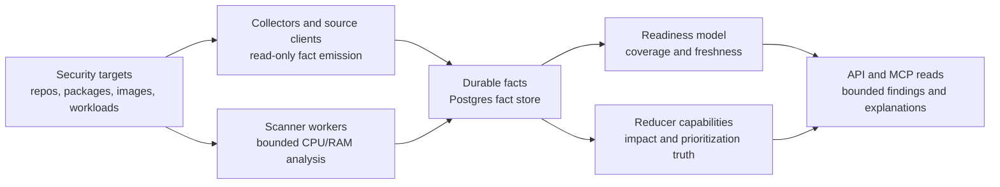
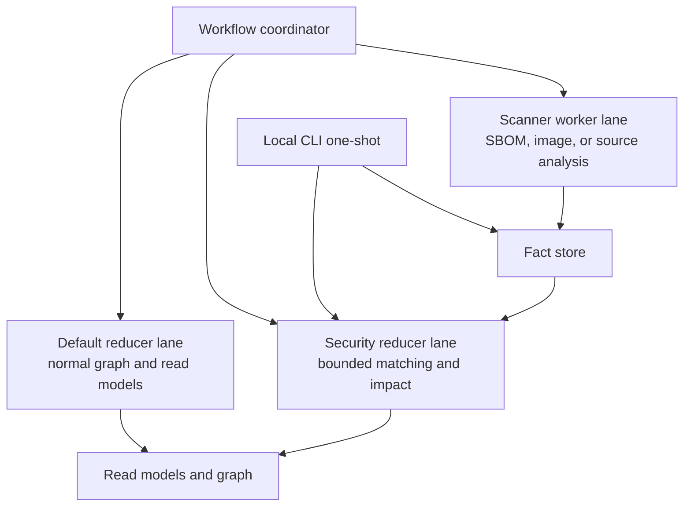
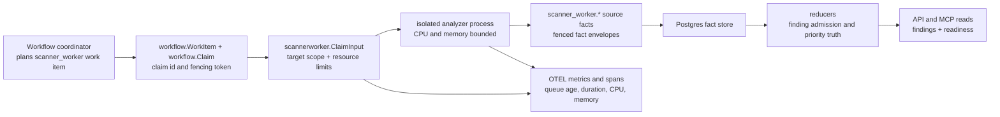

# Security Intelligence

Eshu security intelligence is a read-only evidence system. It collects facts
from code, package metadata, advisories, images, deployment state, and provider
signals, then reduces those facts into bounded findings that can explain why a
repository, package, image, service, or environment is affected.

The product goal is not "run a scanner and print whatever it says." The goal is
to prove the chain from source evidence to owned impact with enough context for
an operator or assistant to trust the answer.

## Decision

Security intelligence separates **targets** from **capabilities**.

- A target is something Eshu can observe, such as a repository dependency,
  package version, advisory, SBOM subject, container image digest, workload,
  environment, or provider-hosted alert.
- A capability is a reducer-owned question over collected evidence, such as
  vulnerability impact, readiness coverage, priority, remediation, or future
  secret/license/misconfiguration analysis.
- Collectors and scanner workers emit source facts only. They do not
  publish user-facing security truth by themselves.
- Reducers own admitted findings because reducers can see the cross-source
  evidence chain.
- A zero-finding result is meaningful only when the response also exposes
  coverage and readiness. "No finding" is not the same as "no target was
  collected."

This page is the public architecture contract for issue
[#599](https://github.com/eshu-hq/eshu/issues/599). Private validation inputs,
provider alert exports, repository names, package names, and URLs stay outside
the public repository.

For the current public claim boundary by ecosystem and target family, use the
[Vulnerability Scanner Confidence Matrix](vulnerability-scanner-confidence.md).
It distinguishes implemented, fixture-proven, remote-proven, EKS-proven,
partial, unsupported, and blocked work so this page does not overclaim scanner
readiness while the issue lanes are still closing.

For the standalone product boundary, use
[Standalone Vulnerability Scanner Boundary](standalone-vulnerability-scanner-boundary.md).
It defines what runs in the CLI process, local services, hosted collectors,
scanner workers, reducers, and read surfaces without forking a second
vulnerability engine.

## End-State Flow

The first security capability is `supply_chain_impact`, Eshu's existing
vulnerability impact finding surface. Future capabilities can reuse the same
target and readiness model without changing collector ownership.

## Execution Modes

Security intelligence must work in two modes:

| Mode | User job | Runtime shape |
| --- | --- | --- |
| Hosted evidence graph | Continuously collect repositories, package metadata, advisories, images, workloads, and provider signals for an organization or team. | Normal Eshu API, MCP, ingester, reducer, coordinator, collector, Postgres, and graph services. |
| Local one-shot scan | Let a developer point the Eshu CLI at one repository and get vulnerability impact results without standing up the hosted control plane. | The CLI starts or attaches to local Eshu services, collects only the requested repository scope, fetches bounded advisory/package evidence, runs the same reducer-owned matching contract, and returns a local evidence envelope. |

The local developer experience should feel like a direct vulnerability scan
command. The initial implemented Eshu CLI shape is
`eshu vuln-scan repo [path]`. It uses an explicitly configured API when
`--service-url`, config, or `ESHU_SERVICE_URL` names one. Without a configured
API, it starts or attaches to the workspace-local authoritative service, launches
a short-lived loopback API reader attached to the same owner, runs the same local
source indexing and readiness proof as `eshu scan`, resolves the scanned
repository id, and reads reducer-owned impact findings from the bounded supply
chain impact API. It must not claim a clean result unless the scan reaches a
ready state and the impact read succeeds.

The local mode cannot be a separate truth engine. It should reuse the same
facts, target model, readiness states, matching rules, severity enrichment, and
output envelope as hosted Eshu. The main difference is scope: local mode bounds
collection to one filesystem repository and an explicit set of advisory or
package sources.

## Target Families

Security targets are evidence sources, not findings:

| Target family | Evidence Eshu may collect | Finding ownership |
| --- | --- | --- |
| Repository dependency facts | manifests, lockfiles, normalized package ids, versions, dependency paths | Reducer joins to advisories and repository ownership using normalized identity. |
| Package registry metadata | package identity, PURL, BOMRef, package manager, version metadata, dependency metadata | Reducer treats registry data as source metadata unless owned evidence proves use. |
| Advisory sources | CVE, GHSA, OSV, GitLab Advisory Database (Gemnasium), CVSS v2/v3/v4, EPSS, KEV, CWE, affected ranges, fixed versions | Reducer joins advisories to owned packages, images, SBOMs, or workloads. Each source keeps its own fact provenance so reducers can detect cross-source disagreement on range, severity, or fixed version. |
| Provider-hosted alerts | alert state, alert ID/number, affected dependency, dependency scope/relationship, advisory identifiers, vulnerable range, patched version, severity, CVSS, EPSS, CWE, manifest path, timestamps, sanitized source URL | Reducer compares provider alerts to Eshu-owned dependency and impact evidence without treating provider state as canonical impact truth or copying private alert data into docs. |
| SBOM and attestations | document subject digest, component inventory, statement subject, verification status, and parse status | Reducer admits impact only when the subject digest is tied to an owned image, repository, or workload; parse validity and signature verification remain separate evidence. |
| Container images | digest, repository, tags, config, observed runtime references | Reducer keeps digest identity separate from weak or stale tag observations. |
| Workloads and cloud/runtime state | deployment targets, images in use, service and environment evidence | Reducer connects package/image impact to deployed context only through explicit evidence. |

## Capability Families

Capabilities run over targets:

- `supply_chain_impact`: determine affected, possibly affected, known-fixed,
  unknown, and missing-evidence states for vulnerability impact findings. This
  is the capability behind the current supply-chain impact API and MCP reads.
  Findings are emitted with a `detection_profile` tag so callers can ask for
  `precise` (default — exact installed-version anchor) or `comprehensive`
  (also returns range-only, SBOM/CPE-derived, malformed, and missing-version
  rows) without mixing truth tiers. Unsupported non-OS package ecosystems are
  reported through readiness `unsupported_targets[]`, not as impact findings.
  Comprehensive rows keep their truth labels and missing-evidence reasons
  explicit.
- `coverage_readiness`: explain which target families were collected,
  skipped, stale, unsupported, or incomplete.
- `priority`: combine severity, exploitability, known exploitation, runtime
  exposure, ownership, and deployment evidence.
- `reachability`: enrich impact findings with call/runtime reachability when
  evidence exists. The stable states are `reachable`, `not_called`, `unknown`,
  `unavailable`, and `missing_evidence`. Reachability is a prioritization
  signal, not proof that a vulnerable package is safe unless the
  ecosystem-specific scanner that produced the evidence defines stronger
  semantics.
- `remediation`: recommend fixed versions, dependency paths, image rebuild
  targets, or ownership handoffs when the evidence supports them.
- `export`: emit evidence-backed findings, VEX-style statements, or audit
  packets after the impact chain is proven.
- Future heavy capabilities, such as secret scanning, license scanning,
  misconfiguration analysis, and OS package scanning, must use the same target
  and readiness contract.

## Reducer And Worker Boundaries

The reducer is the truth owner, but not every security task belongs in the
default reducer process. Vulnerability matching over already-collected facts can
start as a reducer capability. CPU-heavy or memory-heavy extraction must move
behind claim-driven scanner workers so repository indexing and normal reducer
projection stay healthy.

Scaling rules:

- Add security-specific reducer lanes when matching work contends with normal
  graph projection.
- Add scanner workers when the work unpacks images, scans large source trees,
  creates SBOMs, or needs analyzer-specific CPU and memory limits.
- Do not hide non-idempotent writes by lowering worker counts. Fix the
  ownership or concurrency model first.
- Do not raise memory blindly. Use pprof, queue age, per-domain duration,
  retry counts, dead-letter counts, and target cardinality to decide where the
  bottleneck lives.

## Scanner-Worker Boundary

Scanner workers are a claim-driven isolation boundary for CPU-heavy or
memory-heavy security analysis. They do not replace reducers, and they do not
publish user-facing findings. They take one bounded claim, run an analyzer
inside explicit resource limits, and emit source facts back to the normal fact
store.

Current contract flow:

The claim input contains:

- `work_item_id`, `claim_id`, `fencing_token`, `owner_id`, `attempt`, and claim
  timestamps copied from workflow state;
- `analyzer`, which must route to the `scanner_worker` lane;
- target scope: `target_kind`, `scope_id`, `acceptance_unit_id`,
  `source_run_id`, `generation_id`, and a safe `locator_hash`;
- resource limits: CPU millicores, memory bytes, timeout, maximum input bytes,
  maximum file count, and maximum emitted fact count.

The fact output contains `target_count`, `result_count`, and a list of fenced
`facts.Envelope` source facts. A scanner worker must emit either a source fact
or an explicit warning fact for a completed claim. Silent "clean" output is not
accepted because callers could not distinguish a proven clean target from an
analyzer that produced no evidence. Reducer-owned fact kinds such as
`reducer_*_finding` are rejected at the scanner-worker boundary.

Retry and dead-letter payloads carry only bounded diagnostic fields:
`work_item_id`, `claim_id`, `fencing_token`, `analyzer`, `target_kind`,
`target_locator_hash`, `failure_class`, disposition, retryability, attempt,
CPU seconds, and peak memory bytes. They must not include raw repository paths,
image names, registry URLs, package coordinates, bucket keys, or source
locators.

Analyzer lane ownership:

| Analyzer profile | Lane | Reason |
| --- | --- | --- |
| SBOM generation | `scanner_worker` | Can read repository, image, or artifact inputs and produce many component facts. |
| Image unpacking | `scanner_worker` | CPU, disk, and memory pressure must be isolated. The current analyzer reads configured local rootfs metadata or ordered OCI layer tar streams and emits coverage facts, package facts only when apk/dpkg database proof exists, or unsupported warning evidence. |
| Source analysis | `scanner_worker` | Repository-size dependent CPU and memory cost. |
| OS package extraction | `scanner_worker` | Image/rootfs extraction belongs outside reducers. |
| Secret scanning | `scanner_worker` | High-cardinality file scanning with bounded output. |
| License scanning | `scanner_worker` | Repository-wide scan that should not block reducer drains. |
| Misconfiguration scanning | `scanner_worker` | Analyzer-specific CPU and memory limits are required. |
| Vulnerability matching | `reducer` | Reducers own joins across package, advisory, image, workload, and ownership evidence. |
| Vulnerability reachability enrichment | `reducer` | Reducers attach reachability state to impact findings while preserving impact truth. Go govulncheck-style call evidence is implemented; parser/SCIP-backed language evidence remains partial until ecosystem-specific joins prove stronger semantics. |
| Coverage readiness | `reducer` | Readiness is a truth model over collected evidence. |
| Security priority | `reducer` | Priority needs reducer-owned impact, exploitability, runtime, and ownership context. |

## Resource And Deployment Guidance

The hosted `eshu-scanner-worker` runtime isolates scanner-worker claims from
the default reducer lane. It is available in the remote Compose proof stack and
as an opt-in Helm `scannerWorker` Deployment, but it is not enabled by default
in normal Helm installs. The built-in analyzer emits an explicit
`scanner_worker.warning` source fact when no concrete analyzer is configured;
that is a proof of claimed scanner-worker execution, not a clean finding. The
`image_unpacking` analyzer preserves image reference, image digest,
rootfs/layer evidence source, distro, package manager, package name, installed
version, and extraction reason on source facts. Unsupported image shapes emit
bounded warning facts with `analysis_status=not_scanned` and
`coverage_status=unsupported`; they must not be interpreted as safe, affected,
or scanned.

Starting Kubernetes resource envelopes:

| Analyzer class | Request | Limit | Contract limits to start with |
| --- | --- | --- | --- |
| Repository source analysis, secret, license, or misconfiguration scan | `cpu=1`, `memory=2Gi` | `cpu=4`, `memory=4Gi` | `cpu_millis=4000`, `memory_bytes=4294967296`, `timeout=10m`, `max_files=250000`, `max_facts=50000` |
| SBOM generation or OS package extraction | `cpu=1`, `memory=2Gi` | `cpu=4`, `memory=8Gi` | `cpu_millis=4000`, `memory_bytes=8589934592`, `timeout=10m`, `max_input_bytes=2Gi`, `max_facts=50000` |
| Image unpacking | `cpu=2`, `memory=4Gi` | `cpu=6`, `memory=12Gi` | `cpu_millis=6000`, `memory_bytes=12884901888`, `timeout=15m`, `max_input_bytes=4Gi`, `max_files=250000`, `max_facts=50000` |

Use a separate worker pool per analyzer class when those envelopes diverge.
Do not co-locate scanner workers with reducers until pprof and metrics prove
the analyzer cannot contend with reducer queue drain. In Compose proofs, keep
pprof bound to host loopback. In Kubernetes, expose pprof only through a
temporary port-forward or a protected debug path, never through the public
service.

## Hosted SBOM And Attestation Runtime

The hosted `eshu-collector-sbom-attestation` runtime is for existing SBOMs and
attestations. It does not generate SBOMs and it does not make the OCI registry
collector parse referrer payloads. The OCI registry collector may discover
image and referrer identity; the SBOM-attestation runtime fetches configured
document URLs or OCI referrer blobs, parses CycloneDX, SPDX, and in-toto
documents, and emits typed source facts.

Workflow configuration uses `collector_kind=sbom_attestation` with explicit
`targets`. Each target must provide a stable `scope_id`, source type, artifact
kind, document format, and subject digest. Configured-source targets use a
bounded `document_url`; OCI-referrer targets use registry, repository, subject
digest, and referrer digest fields.

Reducer attachment remains separate from collection:

- `sbom.document`, `sbom.component`, `attestation.statement`, and
  `attestation.signature_verification` are source facts.
- `sbom.warning` records malformed or partially parsed input without pretending
  the document was clean.
- `reducer_sbom_attestation_attachment` decides subject match, mismatch,
  unknown subject, ambiguous subject, parse-only, unparseable, verified, and
  unverified outcomes.
- API and MCP readback use `list_sbom_attestation_attachments`; callers should
  rely on attachment status, not raw collector success, before treating SBOM
  evidence as impact-ready. Warning summaries are surfaced as a bounded preview
  plus count and truncation fields, so malformed-input signal remains visible
  without unbounded API or MCP payloads.

Remote Compose starts a dedicated `scanner-worker` service with separate
resource-limit env vars: `ESHU_SCANNER_WORKER_CPU_MILLIS`,
`ESHU_SCANNER_WORKER_MEMORY_BYTES`, `ESHU_SCANNER_WORKER_TIMEOUT`,
`ESHU_SCANNER_WORKER_MAX_INPUT_BYTES`, `ESHU_SCANNER_WORKER_MAX_FILES`, and
`ESHU_SCANNER_WORKER_MAX_FACTS`. Helm renders the same contract from
`scannerWorker` values and rejects a scanner-worker Deployment unless the
workflow coordinator is active with claims enabled.

The first concrete `sbom_generation` source in `eshu-scanner-worker` is a
repository-manifest source configured through the selected `scanner_worker`
collector instance's `configuration.sbom_targets[]`. Each target maps a
scanner-worker `scope_id` to a runtime-local `root_path` and optional
`subject_digest`. The source walks the repository under the claim's file and
byte budgets, skips common dependency/cache directories, reads
`package-lock.json`, `npm-shrinkwrap.json`, `go.mod`, Swift
`Package.resolved`, and Pub `pubspec.lock`, and emits
CycloneDX-compatible `sbom.document`, `sbom.component`, and `sbom.warning`
source facts. It does not match advisories or publish findings. Missing
components still produce a document plus `sbom.warning`, not a silent clean
claim. Runtime-local repository paths stay out of retry, dead-letter, metric,
log, and public read payloads.

OS package extraction supports parser-backed Alpine apk, Debian dpkg, and
RPM-family queryformat snapshots. RPM-family support expects the isolated
scanner source to emit `# eshu-rpm-queryformat-v1` rows after reading
`/etc/os-release` and repository configuration; raw rpmdb Berkeley DB, ndb,
and SQLite bytes remain unsupported warning evidence.

## Scanner Observability

The hosted scanner-worker service records these signals:

- counters: `eshu_dp_scanner_worker_claims_total`,
  `eshu_dp_scanner_worker_retries_total`,
  `eshu_dp_scanner_worker_dead_letters_total`,
  `eshu_dp_scanner_worker_facts_emitted_total`;
- histograms: queue wait, scan duration, target count, result count, CPU
  seconds, and memory bytes under the `eshu_dp_scanner_worker_*` prefix;
- spans: `scanner_worker.claim.process`, `scanner_worker.analyze`, and
  `scanner_worker.fact.emit_batch`;
- bounded dimensions: `analyzer`, `target_kind`, `limit_kind`,
  `failure_class`, `fact_kind`, `outcome`, and `result`.

Operators should be able to answer whether the bottleneck is waiting to claim,
running the analyzer, hitting a resource limit, producing too many facts,
retrying transiently, or dead-lettering terminally without reading raw target
names.

No-Regression Evidence: scanner-worker runtime behavior is covered by
`go test ./internal/collector/scannerworker ./internal/collector/scannerworker/sbomgenerator ./cmd/scanner-worker ./internal/runtime -run 'Test(Service|DefaultResourceLimits|WarningAnalyzer|Analyzer|LoadRuntimeConfig|RepositorySBOMSource|ScannerWorkerBinary|RemoteE2EComposeIncludesScannerWorker|HelmClaimDrivenCollectorDeployments)' -count=1`.
That proof covers source fact emission, retryable analyzer failure, terminal
dead-letter payloads, silent-clean rejection, resource-limit defaults, runtime
config, configured repository SBOM generation, binary packaging, Compose pprof
wiring, and Helm rendering. Remote Compose acceptance still records target and
fact counts, runtime, memory, CPU, queue state, retries, dead letters, and
pprof availability before enabling additional analyzers by default.

## Readiness Semantics

Every API or MCP security answer should carry enough readiness context for the
caller to tell "clean" from "not checked."

| State | Meaning |
| --- | --- |
| `not_configured` | No target source is enabled for the requested scope. |
| `target_incomplete` | Target collection started but did not reach terminal evidence state. |
| `evidence_incomplete` | Some target evidence exists, but a required join source is missing or stale. |
| `ready_zero_findings` | Required target evidence exists and the reducer found no matching impact. |
| `ready_with_findings` | Required target evidence exists and reducer-owned findings are available. |
| `ambiguous_scope` | A single explain scope matched multiple reducer-owned findings and must be narrowed before callers interpret it as clean or affected. |
| `readiness_unavailable` | Out-of-band signal returned when the readiness lookup itself fails; the findings page is still returned but coverage cannot be classified. |
| `unsupported` | Eshu observed real target evidence the matcher cannot resolve — an owned dependency in an unsupported ecosystem, a package-manager file with an unsupported lockfile feature, a malformed/unsupported SBOM document, or an image target without a supported analyzer. Callers MUST NOT interpret this as clean or affected. |

`unsupported` only fires when bounded unsupported-target evidence exists for the
requested scope. Missing evidence stays `evidence_incomplete`, with the gap in
`missing_evidence`; the two states never collapse together. Zero findings
without readiness are unsafe, so API and MCP responses return coverage,
freshness, unsupported target counts, and missing-evidence reasons alongside
findings.

### Vulnerability Impact Readiness Envelope

`GET /api/v0/supply-chain/impact/findings` and the MCP
`list_supply_chain_impact_findings` tool both attach a `readiness` envelope to
every response. The envelope is derived from existing source-fact and
reducer-fact counts so the answer never invents findings:

- `readiness_state` is one of the core states above, plus
  `readiness_unavailable` when the lookup itself fails, `unsupported` when
  bounded unsupported-target evidence exists, and `ambiguous_scope` on
  explain-route refusal envelopes.
- `target_scope` echoes the bounded scanner scope: `cve_id`, `advisory_id`,
  `package_id`, `repository_id`, `subject_digest`, `ecosystem`, `workload_id`,
  `service_id`, `environment`, `severity`, and `impact_status`.
  `advisory_id` narrows source-advisory evidence when another fact anchor is
  present; advisory-only readiness avoids a broad source-evidence scan.
  Reducer-derived fields such as `workload_id`, `service_id`, `environment`,
  `severity`, and `impact_status` do not open a source-fact scan by themselves;
  Eshu returns the scope in the envelope so callers can see when zero findings
  came from a derived-only or missing-evidence question.
- `evidence_sources[]` reports scoped counts, `latest_observed_at`, and
  freshness for `vulnerability.advisory`, `vulnerability.exploitability`,
  `package.consumption`, `package.registry`, `sbom.component`,
  `sbom.attestation`, `container_image.identity`, `vulnerability.os_package`,
  and `scanner_worker.analysis`. Zero-count families are omitted. Package
  registry evidence counts only for an explicit `package_id` or for package
  metadata joined to the requested repository through package-consumption
  evidence. `vulnerability.os_package` and `scanner_worker.analysis` are the
  OS-package scan tier, counted only for the scanned image a `subject_digest`
  or `image_ref` anchor resolves to; `scanner_worker.analysis` is present
  whenever a scan completed for that image regardless of whether it found
  installed packages, so its presence distinguishes "never scanned" from
  "scanned and clean".
- `source_snapshots[]` reports bounded vulnerability source cache metadata:
  source, ecosystem, cache artifact version, snapshot digest, cache update time,
  freshness, completion state, and bounded warning fields. Snapshot and durable
  source-state rows are scoped to the requested target by CVE, package,
  repository-owned ecosystem, or image component ecosystem before the readiness
  envelope computes aggregate freshness. Raw advisory bodies, package names,
  and source URLs are not returned.
- `missing_evidence[]` names absent required join families using the stable
  identifiers `advisory_sources`, `owned_packages`,
  `package_registry_metadata`, `sbom_or_image_evidence`,
  `target_collection_incomplete`, `readiness_unavailable`, and
  `unsupported_targets`. `package_registry_metadata` means the bounded package
  metadata needed for the package or repository scope is missing, stale, or
  freshness-unknown. The list is empty on `ready_*` states so callers cannot
  see contradictory "ready" + "missing" signals.
- `unsupported_targets[]` is bounded coverage-gap evidence: each entry names
  the unsupported `target_kind` (`ecosystem`, `package_manager_file`,
  `sbom_target`, `package_registry_metadata`, or `image_target`), a stable
  `reason` code, and a `count` for the bounded scope. Optional `ecosystem`,
  `lockfile_flavor`, and `feature_token` fields explain why the matcher cannot
  resolve the target. `package_registry_metadata` reasons are
  `unsupported_metadata_source`, `registry_not_found`, `metadata_too_large`,
  `malformed_metadata`, and `credentials_missing`. They mean bounded registry
  metadata was planned from observed owned package evidence, but the adapter,
  registry response, body size, parser, or private-registry credential state
  left missing evidence that must remain visible instead of clean scanner
  output. The list is surfaced whenever Eshu observes such evidence —
  additively when findings exist, or as the dominant signal alongside
  `readiness_state=unsupported` when no finding could be admitted.
- `incomplete_reasons[]` carries collector-emitted reasons explaining why
  source collection is still in flight; only populated when
  `readiness_state` is `target_incomplete`.
- `freshness` summarizes the worst per-family freshness as one label.
- `counts` reports page-local finding counts and total source-evidence facts.

Readiness reflects existing facts. It does not poll collectors, dispatch reducer
work, or change finding ownership. `target_incomplete` and `unsupported` depend
on collector or reducer source facts; absent signals become `missing_evidence`,
not inferred target state.

#### Proven States

The current implementation proves the following:

- `not_configured`: no advisory or owned-evidence facts exist for the scope.
- `evidence_incomplete`: advisory facts exist but a required join family is
  missing or stale for the requested anchor, including package-registry metadata
  required for package or repository vulnerability matching.
- `ready_zero_findings`: advisory and required owned evidence exist and the
  reducer returned no matching impact.
- `ready_with_findings`: at least one reducer finding was returned. Ready
  states clear `missing_evidence` so the envelope cannot report both ready and
  missing advisory sources.
- `ambiguous_scope`: one explain request matched multiple reducer findings. The
  response returns a refusal envelope and the caller must provide `finding_id`
  or a narrower advisory/package/repository/image/workload/service anchor.
- `target_incomplete`: a `vulnerability.source_snapshot` fact carries
  `"complete": false` and the requested scope has no advisory evidence yet.
  An in-flight snapshot for an unrelated source does not flip a scope whose
  advisory evidence is already collected, so cross-source ingestion noise
  cannot invalidate ready answers. Scope-relevant `incomplete_reasons` carry
  distinct collector warning messages.
- `readiness_unavailable`: the readiness lookup failed. The findings page is
  still returned, and `missing_evidence` carries `readiness_unavailable`.
- `unsupported`: the bounded scope has observed target evidence the matcher
  cannot resolve. Producers are `content_entity` unsupported package managers
  outside `npm`, `nuget`, `maven`, `cargo`, `pypi`, `swift`, `composer`, `go`,
  `rubygems`, and `hex`; `content_entity` lockfile unsupported-feature markers;
  `sbom.warning` reasons `unsupported_field` or `malformed_document` joined to
  the document subject digest; `package_registry.warning` codes
  `unsupported_metadata_source`, `registry_not_found`, `metadata_too_large`,
  `malformed_metadata`, and `credentials_missing`; and image-target
  `scanner_worker.warning` reasons
  `analyzer_not_configured` or `image_analyzer_unsupported_target` matched by
  `image_digest` or image scope id. `unsupported` outranks
  `evidence_incomplete` so callers can tell "we observed something we cannot
  match" from "we never collected this." When findings exist, the state stays
  `ready_with_findings` and `unsupported_targets[]` remains visible additively.

The package.consumption family is sourced from the real
`reducer_package_consumption_correlation` facts and `content_entity` manifest
dependency facts (the same `content_entity` + `entity_metadata.config_kind =
'dependency'` discriminators used by other supply-chain reducers).
`package.registry` is counted for explicit package anchors and for repository
scopes only after consumption evidence ties the same package id to the
requested repository. Repository-scoped requests cannot satisfy
`owned_packages` or package metadata freshness through unrelated global
registry metadata.

Follow-up: surface per-collector freshness windows when the collector contract
carries source-specific staleness thresholds.

## Vulnerability Reachability Maturity

Reachability maturity is ecosystem scoped and does not promote the whole
vulnerability scanner to a safe/not-safe oracle. Current support:

| Language / ecosystem | Current level | Evidence Eshu can use today | Boundary |
| --- | --- | --- | --- |
| Go modules | `implemented` | Go module facts plus govulncheck-compatible module, import, symbol, and `not_called` evidence. | `symbol_reachable` and package-import evidence prioritize a finding; `not_called` is explicit but does not hide or downgrade impact. Missing govulncheck evidence becomes `missing_evidence`. |
| JavaScript / TypeScript npm | `partial` | Dependency manifests/lockfiles plus parser or SCIP package API import, call, and re-export evidence when the npm package identity is proven exactly. | Matching package API evidence can mark a finding `reachable` for prioritization, but absence or ambiguity stays `unknown` or `missing_evidence`; JS/TS never emits `not_called` today. |
| Python PyPI | `partial` | Requirements/pyproject/Pipfile/Poetry evidence plus parser/SCIP import, call, decorator, and framework-root evidence. Parser/SCIP evidence can mark a finding `reachable` only when a valid PyPI package API identity, such as `requests`, joins to an observed import/call/decorator/SCIP symbol. | Dynamic imports, plugin loading, hyphenated or otherwise unresolved package APIs, and package-name-to-module gaps remain `unknown` or `missing_evidence`; Python never emits `not_called` safety claims from absent parser evidence. |
| JVM Maven / Gradle | `partial` | Maven/Gradle dependency evidence plus resolver-proven package API prefixes and Java/Kotlin/Scala parser or SCIP import/call evidence. | Matching API-prefix usage marks a finding `reachable` for prioritization only. Source-set, resolver, reflection, dependency-injection, generated-code, and dynamic dispatch gaps remain explicit missing evidence; JVM never emits `not_called` without a future ecosystem-specific analyzer. |
| PHP Composer | `partial` | Composer dependency paths and exact installed-version evidence can mark package-level reachability as `reachable` with partial confidence. PHP parser roots, interface/trait methods, controllers, literal routes, and hook callbacks remain supporting evidence. | Autoload, dynamic dispatch, broader framework routes, and missing parser/SCIP package API calls stay in `missing_evidence`; Composer never emits `not_called`. |
| Ruby / RubyGems | `partial` | Bundler dependency paths and exact installed-version evidence can mark package-level reachability as `reachable` with partial confidence. Ruby parser roots, Rails controller/callback evidence, literal method references, and method-missing guards remain supporting evidence. | Metaprogramming, autoload, and missing parser/SCIP package API calls stay in `missing_evidence`; RubyGems never emits `not_called`. |
| Rust Cargo | `partial` | Cargo dependency paths and exact installed-version evidence can mark package-level reachability as `reachable` with partial confidence. Rust parser roots, tests, public API items, trait implementations, benchmarks, and module-resolution evidence remain supporting evidence. | Macro expansion, cfg/feature solving, cross-crate semantic gaps, and missing parser/SCIP package API calls stay in `missing_evidence`; Cargo never emits `not_called`. |
| .NET / NuGet | `partial` | NuGet dependency paths and exact installed-version evidence can mark package-level reachability as `reachable` with partial confidence. C# parser roots, ASP.NET controller actions, hosted-service callbacks, interface/override evidence, tests, and serialization callbacks remain supporting evidence. | Reflection, dependency injection, generated code, unresolved project-reference gaps, and missing parser/SCIP package API calls stay in `missing_evidence`; NuGet never emits `not_called`. |
| Unsupported ecosystems | `unsupported` | Evidence may exist as dependency or advisory facts only. | Unsupported reachability is reported as unavailable or missing evidence, never as clean. |

No-Regression Evidence: `go test ./internal/reducer ./internal/query ./internal/mcp ./internal/storage/postgres ./internal/exports ./internal/vulnerabilityparity ./cmd/eshu -run 'Test.*Reachability|TestSupplyChainReachability|TestBuildVulnScanReportPreservesReachabilityEnvelope|TestBuildSupplyChainImpactFindingsUsesJSTSPackageAPIReachability|TestBuildSupplyChainImpactFindingsKeepsJSTSMissingAndAmbiguousEvidenceExplicit|TestListActiveSupplyChainImpactFactsQueryBoundsRepositoryFollowUp' -count=1`
proves the stable reachability states, Go govulncheck `reachable` and
`not_called` semantics, JS/TS parser/SCIP positive, negative, ambiguous, and
missing-evidence states, repository-bounded file evidence loading, priority
contributions that do not alter `impact_status`, package-level Composer,
RubyGems, Cargo, and NuGet reachability joins, API/MCP/CLI/export shaping, and
parity report preservation.
No-Regression Evidence: `go test ./internal/reducer -run 'TestBuildSupplyChainImpactFindingsMarksPyPIParserImportReachable|TestBuildSupplyChainImpactFindingsMarksPyPISCIPCallReachable|TestBuildSupplyChainImpactFindingsKeepsPyPIDynamicImportsAmbiguous|TestSupplyChainImpactHandlerLoadsPyPIParserEvidenceByRepository|TestSupplyChainImpactHandlerKeepsPyPIReachabilityMissingWithoutRepositoryScope|TestSupplyChainReachability|TestBuildSupplyChainImpactFindings.*PyPI|TestEvaluatePyPIMatch' -count=1`
proves PyPI parser/SCIP `reachable`, dynamic/plugin ambiguity, bounded
repository-scoped parser fact loading from the active Git scope/generation
instead of the vulnerability-intent scope, fail-closed missing evidence when no
repository scope is available, stable reachability states, and PyPI version
matching.
No-Regression Evidence: `go test ./internal/reducer -run 'TestBuildSupplyChainImpactFindings.*JVM|TestSupplyChainImpactHandlerLoadsActiveJVMReachabilityFacts' -count=1`
proves Maven and Gradle impact findings only become
`jvm_package_api_reachable` when resolver-proven API prefixes match parser or
SCIP usage in the same repository, while missing API identity, missing parser
usage, and absent not-called analyzer evidence stay explicit.

No-Observability-Change: reachability enrichment is serialized onto existing
`reducer_supply_chain_impact_finding` facts and read through the existing
`query.supply_chain_impact_findings` route, MCP tool dispatch, CLI report, and
SARIF exporter. The JS/TS, Python, and JVM joins add in-memory reducer
classification and use repository-bounded active fact reads; Python resolves
the impacted repository to its active Git scope/generation before loading
existing `file` facts by `repo_id`, while JVM bounds parser/SCIP reads by
canonical repository IDs and indexed JVM file facts before API-prefix matching.
They add no graph write, queue, worker, metric instrument, span name, log key,
runtime setting, or collector. Operators diagnose the path through the existing
impact finding payload, readiness envelope, reducer execution counters, query
spans, and Postgres query duration metrics.

Performance Evidence: focused query tests
`go test ./internal/query -run 'PackageMetadata|SupplyChainImpactReadiness'
-count=1` exercises the readiness states, scoped package-registry metadata
freshness, source-snapshot cache metadata, unsupported target kinds, the
missing-evidence versus unsupported boundary, and the Postgres query shape. The
readiness path runs one bounded CTE per response with seven anchored
evidence-family counts, source roll-ups, and unsupported-target aggregation over
existing `content_entity`, package-registry, `sbom.warning`, and
`scanner_worker.warning` facts; it adds no round trip beyond the readiness query
already issued with the impact-finding read.

No-Observability-Change: the readiness path reuses
`query.supply_chain_impact_findings`, `eshu_dp_postgres_query_duration_seconds`,
the impact-findings HTTP/MCP envelope, `vulnerability.source_snapshot` payloads,
`vulnerability_source_states`, scanner-worker metrics and spans, and
`source_snapshots[]` readiness metadata. The scoped source-freshness and
unsupported-target rollups add no metric, span, log key, queue, reducer lane,
graph write, or runtime worker; operators diagnose gaps through
`source_states[]`, `source_snapshots[]`, `scanner_worker.warning`,
`unsupported_targets[]`, and the aggregation family markers.

## Source Coverage And Read Contracts

Dependency coverage, advisory-source provenance, provider-alert parity, API/MCP
read contracts, CLI behavior, and acceptance gates live in
[Security Intelligence Source Coverage](security-intelligence-source-coverage.md).

Keep this page focused on architecture, runtime boundaries, scanner isolation,
and readiness semantics. Use the source-coverage page for parser evidence,
advisory source contracts, provider security-alert collection, and read surfaces.

User-facing references for individual supply-chain surfaces:

- [Supply-Chain Traceability](../supply-chain-traceability.md) — the CVE-to-impact chain entry point.
- [GitLab Gemnasium Integration](gitlab-gemnasium-integration.md) — GitLab Advisory Database normalization.
- [Vulnerability Scanner Read Contract](vulnerability-scanner-read-contract.md) — what is admitted, refused, or partial.
- [Hardcoded Secrets Investigation](hardcoded-secrets-investigation.md) — redacted secret findings.
- [SARIF Export](sarif-export.md) — SARIF v2.1.0 finding export.
- [Value-Flow Emission](value-flow-emission.md) — the `ESHU_EMIT_DATAFLOW` gate.
