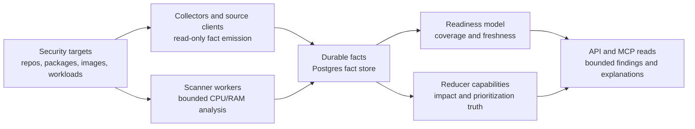
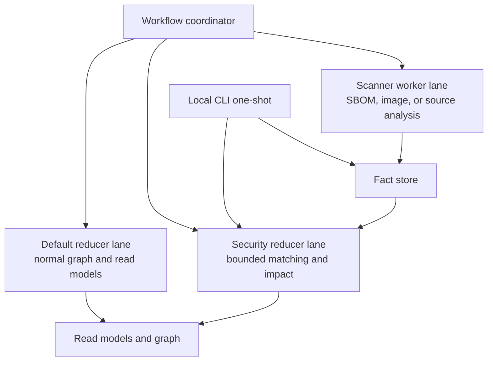

# Security Intelligence

Eshu security intelligence is a read-only evidence system. It collects facts
from code, package metadata, advisories, images, deployment state, and provider
signals, then reduces those facts into bounded findings that can explain why a
repository, package, image, service, or environment is affected.

The product goal is not "run a scanner and print whatever it says." The goal is
to prove the chain from source evidence to owned impact with enough context for
an operator or assistant to trust the answer.

## Decision

Security intelligence separates **targets** from **capabilities**.

- A target is something Eshu can observe, such as a repository dependency,
  package version, advisory, SBOM subject, container image digest, workload,
  environment, or provider-hosted alert.
- A capability is a reducer-owned question over collected evidence, such as
  vulnerability impact, readiness coverage, priority, remediation, or future
  secret/license/misconfiguration analysis.
- Collectors and future scanner workers emit source facts only. They do not
  publish user-facing security truth by themselves.
- Reducers own admitted findings because reducers can see the cross-source
  evidence chain.
- A zero-finding result is meaningful only when the response also exposes
  coverage and readiness. "No finding" is not the same as "no target was
  collected."

This page is the public architecture contract for issue
[#599](https://github.com/eshu-hq/eshu/issues/599). Private validation inputs,
provider alert exports, repository names, package names, and URLs stay outside
the public repository.

## End-State Flow

The first security capability is vulnerability impact. Future capabilities can
reuse the same target and readiness model without changing collector ownership.

## Execution Modes

Security intelligence must work in two modes:

| Mode | User job | Runtime shape |
| --- | --- | --- |
| Hosted evidence graph | Continuously collect repositories, package metadata, advisories, images, workloads, and provider signals for an organization or team. | Normal Eshu API, MCP, ingester, reducer, coordinator, collector, Postgres, and graph services. |
| Local one-shot scan | Let a developer point the Eshu CLI at one repository and get vulnerability impact results without standing up the hosted control plane. | The CLI starts or attaches to local Eshu services, collects only the requested repository scope, fetches bounded advisory/package evidence, runs the same reducer-owned matching contract, and returns a local evidence envelope. |

The local developer experience should feel like a direct vulnerability scan
command. The candidate user-facing shape is eshu vuln-scan repo, but docs must
not publish it as an implemented command until the Cobra command, tests, API
contract, and local runtime proof exist.

The local mode cannot be a separate truth engine. It should reuse the same
facts, target model, readiness states, matching rules, severity enrichment, and
output envelope as hosted Eshu. The main difference is scope: local mode bounds
collection to one filesystem repository and an explicit set of advisory or
package sources.

## Target Families

Security targets are evidence sources, not findings:

| Target family | Evidence Eshu may collect | Finding ownership |
| --- | --- | --- |
| Repository dependency facts | manifests, lockfiles, package ids, versions, dependency paths | Reducer joins to advisories and repository ownership. |
| Package registry metadata | package identity, version metadata, dependency metadata | Reducer treats registry data as source metadata unless owned evidence proves use. |
| Advisory sources | CVE, GHSA, OSV, CVSS, EPSS, KEV, CWE, affected ranges, fixed versions | Reducer joins advisories to owned packages, images, SBOMs, or workloads. |
| Provider-hosted alerts | alert state, affected dependency, advisory identifiers, manifest path | Reducer or verifier compares provider alerts to Eshu evidence without copying private alert data into docs. |
| SBOM and attestations | document subject, component inventory, verification and parse status | Reducer admits impact only when the subject is tied to an owned image, repository, or workload. |
| Container images | digest, repository, tags, config, observed runtime references | Reducer keeps digest identity separate from weak or stale tag observations. |
| Workloads and cloud/runtime state | deployment targets, images in use, service and environment evidence | Reducer connects package/image impact to deployed context only through explicit evidence. |

## Capability Families

Capabilities run over targets:

- `vulnerability_impact`: determine affected, possibly affected,
  known-fixed, unknown, and missing-evidence states.
- `coverage_readiness`: explain which target families were collected,
  skipped, stale, unsupported, or incomplete.
- `priority`: combine severity, exploitability, known exploitation, runtime
  exposure, ownership, and deployment evidence.
- `remediation`: recommend fixed versions, dependency paths, image rebuild
  targets, or ownership handoffs when the evidence supports them.
- `export`: emit evidence-backed findings, VEX-style statements, or audit
  packets after the impact chain is proven.
- Future heavy capabilities, such as secret scanning, license scanning,
  misconfiguration analysis, and OS package scanning, must use the same target
  and readiness contract.

## Reducer And Worker Boundaries

The reducer is the truth owner, but not every security task belongs in the
default reducer process. Vulnerability matching over already-collected facts can
start as a reducer capability. CPU-heavy or memory-heavy extraction must move
behind claim-driven scanner workers so repository indexing and normal reducer
projection stay healthy.

Scaling rules:

- Add security-specific reducer lanes when matching work contends with normal
  graph projection.
- Add scanner workers when the work unpacks images, scans large source trees,
  creates SBOMs, or needs analyzer-specific CPU and memory limits.
- Do not hide non-idempotent writes by lowering worker counts. Fix the
  ownership or concurrency model first.
- Do not raise memory blindly. Use pprof, queue age, per-domain duration,
  retry counts, dead-letter counts, and target cardinality to decide where the
  bottleneck lives.

## Readiness Semantics

Every API or MCP security answer should carry enough readiness context for the
caller to tell "clean" from "not checked."

| State | Meaning |
| --- | --- |
| `not_configured` | No target source is enabled for the requested scope. |
| `target_incomplete` | Target collection started but did not reach terminal evidence state. |
| `evidence_incomplete` | Some target evidence exists, but a required join source is missing or stale. |
| `unsupported` | Eshu observed a target shape it does not yet know how to match. |
| `ready_zero_findings` | Required target evidence exists and the reducer found no matching impact. |
| `ready_with_findings` | Required target evidence exists and reducer-owned findings are available. |

Zero findings without readiness are unsafe. The API and MCP surfaces should
return coverage, freshness, unsupported target counts, and missing-evidence
reasons alongside findings.

## Provider Alert Parity Gate

Provider-hosted alert parity is a validation gate, not a source of public test
data. For supported hosts, private validation may compare Eshu findings against
provider alerts for the same repositories and package ecosystems.

Eshu should match provider alert counts when it has equivalent owned target
evidence and advisory data. Eshu may exceed provider alert output when it can
add code-to-cloud context, image/runtime impact, or additional advisory sources.
Any mismatch must classify whether the cause is missing target collection,
missing advisory ingestion, version-range matching, unsupported ecosystem,
provider-only behavior, or an Eshu reducer bug.

Validation logs may record aggregate counts and mismatch classes. They must not
commit private repository names, package names, alert URLs, or copied provider
payloads to the public repo.

## API And MCP Contract

Security reads must be bounded, explainable, and scoped:

- require `limit`, timeout, deterministic ordering, and `truncated` signals for
  list responses;
- require at least one anchor such as repository, package, image digest,
  advisory id, service, workload, environment, or status;
- keep findings separate from readiness and source facts;
- return evidence handles and missing-evidence reasons instead of raw full
  source payloads;
- expose exact, derived, possible, known-fixed, unknown, and unsupported states
  without collapsing them into one severity bucket.

The current vulnerability impact route is documented in
[HTTP Evidence And Supply-Chain Routes](http-api/evidence-and-supply-chain.md).

## CLI Contract

The future local vulnerability scan command should be a thin orchestration
layer, not a second scanner product:

- resolve one repository or workspace root using the same local source rules as
  the existing scan workflow;
- collect manifest, lockfile, package, and repository evidence through normal
  fact emitters;
- fetch only bounded advisory and package metadata required by observed owned
  packages unless the user explicitly asks for broader coverage;
- run the same vulnerability impact reducer logic used by hosted Eshu;
- return the same finding, readiness, freshness, evidence-handle, and
  missing-evidence fields as API and MCP reads;
- provide machine-readable JSON and a concise terminal summary;
- cache advisory and package metadata locally with freshness markers so repeat
  developer runs are fast without silently using stale truth;
- fail closed when required evidence cannot be collected, and show whether the
  result is incomplete instead of printing a clean report.

This keeps the developer experience simple while preserving the accuracy rule:
the CLI can be convenient, but it must not produce a result that means
something different from the hosted graph.

## Acceptance Gates

Security intelligence work is ready only when all applicable gates pass:

- source facts are collected with provenance and freshness;
- reducer findings require owned evidence anchors;
- readiness distinguishes zero findings from missing coverage;
- API and MCP calls are scoped, bounded, and observable;
- private provider-alert comparison matches or explains mismatches without
  committing private data;
- remote Compose proves clean-volume and preserved-volume behavior;
- Kubernetes rollout proves resource settings, pprof access, logs, queue drain,
  retries, and no dead letters;
- performance evidence records target count, fact count, queue timing,
  reducer-domain timing, memory, CPU, and stop thresholds.
