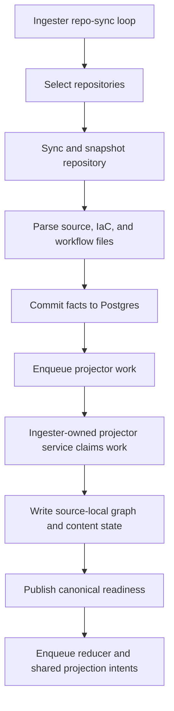
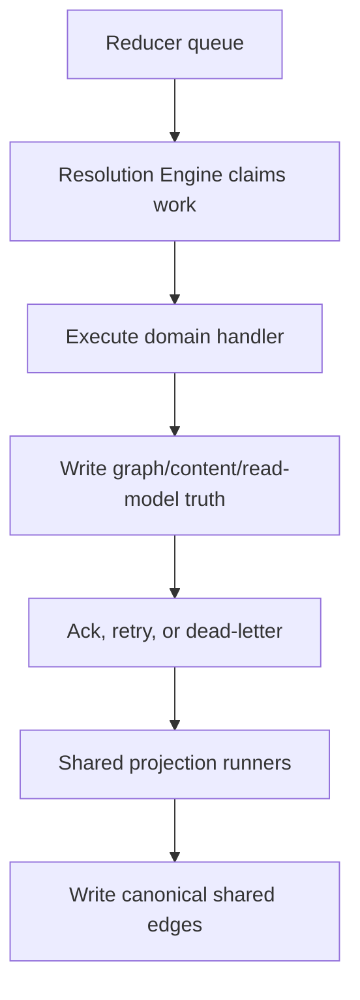
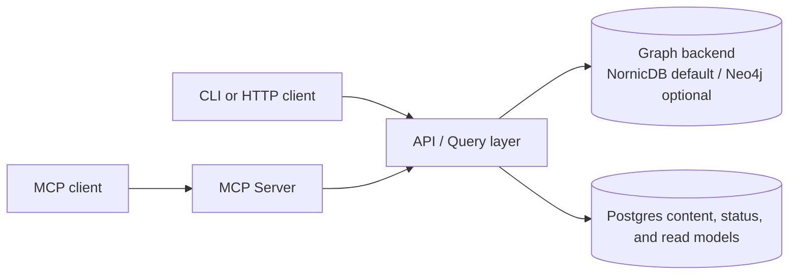
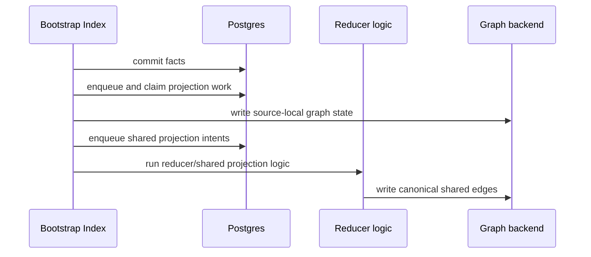
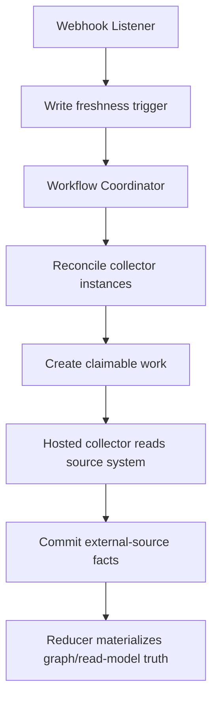

# Service Workflows

Use this page to understand how Eshu services cooperate after deployment. For
the complete runtime matrix, use [Service Runtimes](../deployment/service-runtimes.md).
For signals and proof gates, use [Telemetry Overview](telemetry/index.md) and
[Local Testing](local-testing.md).

## Workflow Index

| Workflow | What to check first |
| --- | --- |
| Continuous ingestion and source-local projection | ingester `/admin/status`, projector queue metrics, graph-write logs |
| Reducer and shared projection | reducer `/admin/status`, shared projection backlog, dead-letter counts |
| Query reads | API status, graph/content availability, reducer backlog |
| Bootstrap and recovery | bootstrap logs, queue state, replay/dead-letter rows |
| Collector workflow control | workflow coordinator claims, collector facts, webhook triggers |

## Continuous Ingestion

The ingester owns repository discovery, sync, snapshotting, parsing, fact
emission, and source-local projection. The ingester binary wires two services
and runs them concurrently:

The resolution engine does not own the source-local projector queue in the
steady-state ingester path. It owns reducer domains, semantic materialization,
shared projection, retries, replay, and repair after source-local projection has
published durable work.

Operator checkpoints:

- repository discovery and sync progress
- fact commits to Postgres
- projector queue depth and oldest age
- graph write errors or fallback logs
- reducer intents created after source-local projection

## Reducer And Shared Projection

The resolution engine consumes durable reducer work from Postgres and writes
cross-domain truth to the configured graph backend.

Reducer work is recoverable because claims, attempts, dead-letter state,
projection decisions, and shared projection intents are durable rows. Do not
diagnose missing graph truth from pod health alone; inspect reducer backlog,
failure-class logs, and the specific graph edge family that should have been
materialized.

## Query Reads

Read surfaces use canonical graph and content state. The API does not parse
repositories or drain queues. The MCP server serves MCP transport and delegates
tool-backed reads through the same query contracts.

When reads look wrong, check:

1. whether the data exists in the graph backend or content store
2. whether source-local projection finished
3. whether shared projection finished
4. whether the query was scoped to the intended repository, service, or
   environment

## Bootstrap And Recovery

Bootstrap indexing is the one-shot seeding path for empty or recovered
environments. It uses the same facts-first data plane as steady-state ingestion,
but executes the collection, projection, and reduction sequence inside the
bootstrap process.

Replay and recovery target durable queue rows, not in-memory state. Dead-letter
state is explicit. Repair and replay remain reducer/runtime ownership; the API
and CLI only expose admin entry points.

## Collector Workflow Control

Hosted collectors are controlled through durable workflow state:

The workflow coordinator creates and reaps claims. Hosted collectors read their
source systems and emit facts. The reducer decides canonical graph truth.

Current hosted collector families include Confluence, OCI registry,
Terraform-state, AWS cloud, and package registry collectors. Webhook listener
freshness triggers cover Git and AWS freshness events where enabled.

## Runtime And Deployment Shape

Use [Service Runtimes](../deployment/service-runtimes.md) as the only full
runtime matrix. The long-running platform includes API, MCP server, ingester,
workflow coordinator, webhook listener, resolution engine, and enabled hosted
collectors. Bootstrap data-plane and bootstrap-index are one-shot helper flows.

Compose, Helm, and local CLI reuse the same binaries but differ in command,
environment, process shape, volumes, ports, and health checks.

## Troubleshooting By Stage

| Symptom | Start here | Then check |
| --- | --- | --- |
| No new repository data | ingester `/admin/status` and ingester logs | repository selection, sync errors, parse failures |
| Facts written but graph state missing | projector queue metrics and ingester graph-write logs | source-local projection claims, graph backend writes, content writes |
| Shared infra or deployment traces missing | reducer shared projection backlog and logs | relationship evidence facts, reducer normalization, canonical edge writes |
| API answers stale or incomplete | API status plus reducer backlog | graph backend/content-store state, repository coverage/status |
| Replay did not recover work | recovery metrics and status | dead-letter rows, failure class, replay selector |

## Related Docs

- [System Architecture](../architecture.md)
- [Service Runtimes](../deployment/service-runtimes.md)
- [Runtime Admin API](runtime-admin-api.md)
- [Telemetry Overview](telemetry/index.md)
- [Local Testing](local-testing.md)
