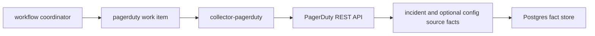

# PagerDuty Collector

`collector-pagerduty` is a claim-driven incident-context collector. It reads
bounded PagerDuty incident evidence and can optionally validate bounded live
PagerDuty service and integration configuration. It emits source facts only:

- `incident.record`
- `incident.lifecycle_event`
- `change.record`
- `incident_routing.observed_pagerduty_service`
- `incident_routing.observed_pagerduty_integration`
- `incident_routing.coverage_warning`

PagerDuty is the alerting source. This collector does not create Jira tickets,
infer deployment impact, write graph truth, or connect incidents to code by
itself. It provides the incident side of the evidence path so later collectors
and reducers can correlate runtime artifacts, image versions, commits, pull
requests, and work items.

## Runtime Contract

The runtime selects one enabled `pagerduty` collector instance from
`ESHU_COLLECTOR_INSTANCES_JSON`, claims work from the workflow control plane,
fetches incidents and any opted-in live configuration for the claimed target,
and commits facts through the shared ingestion store.



The coordinator plans one work item per configured target. A target is usually
a PagerDuty account scope, optionally narrowed by `allowed_service_ids`.
Signed PagerDuty webhooks can wake this same target through
`incident_freshness_triggers`, but they only create scoped collector work. The
collector still fetches PagerDuty through the normal claimed runtime before any
`incident.*` or `change.*` facts exist, and scheduled/polling collection remains
the backfill path for missed or dropped webhooks.

## Collector Instance Shape

```json
{
  "instance_id": "pagerduty-primary",
  "collector_kind": "pagerduty",
  "mode": "continuous",
  "enabled": true,
  "claims_enabled": true,
  "configuration": {
    "targets": [
      {
        "provider": "pagerduty",
        "scope_id": "pagerduty:account:example",
        "account_id": "example",
        "token_env": "PAGERDUTY_TOKEN",
        "api_base_url": "https://api.pagerduty.com",
        "source_uri": "https://example.pagerduty.com/incidents",
        "incident_lookback": "6h",
        "incident_limit": 25,
        "log_entry_limit": 25,
        "change_event_limit": 25,
        "allowed_service_ids": ["PABC123"],
        "config_validation_enabled": true,
        "config_resource_limit": 25
      }
    ]
  }
}
```

`token_env` names an environment variable available to
`collector-pagerduty`. The token value is resolved inside the process and must
not be copied into collector-instance JSON, chart values, facts, logs, metric
labels, or status errors.

`api_base_url` overrides must use HTTPS in workflow configuration. The direct
HTTP client still accepts an injected test server for unit tests.

`config_validation_enabled` is optional. When enabled, the collector reads
bounded PagerDuty service and service-integration metadata for no-IaC fallback,
freshness proof, and reducer-owned drift comparison. It does not overwrite
Terraform declared or applied evidence. `config_resource_limit` must be between
0 and 100; a zero value uses the default bounded page limit when validation is
enabled.

## Evidence Boundaries

PagerDuty evidence stays provider-reported:

- Incident title, status, urgency, priority, service, escalation policy, teams,
  assignments, and timestamps stay on `incident.record`.
- Incident log-entry actor, channel, type, summary, and timestamp stay on
  `incident.lifecycle_event`.
- Related change-event summary, source, services, links, and timestamp stay on
  `change.record`.
- Optional live service and service-integration status, provider IDs,
  escalation/team references, comparison state, and update timestamps stay on
  `incident_routing.observed_pagerduty_*` facts.
- Permission-hidden, missing, unsupported, and partial live-configuration reads
  stay on `incident_routing.coverage_warning`.

Live configuration facts redact or fingerprint service names, escalation-policy
names, team names, integration summaries, routing keys, integration keys, and
token-like URL parameters before persistence.

The incident-context read model can present this provider evidence with
explicit missing slots for intended routing, applied routing, live routing,
deployment, image, commit, pull request, and Jira work-item links. Live
configuration facts fill the live-routing slot; Terraform-source
PagerDutyDeclaration rows and Terraform-state incident-routing facts fill the
intended and applied routing slots. Runtime and image slots are promoted only
from explicit service-catalog operational links to the PagerDuty service URL
plus reducer-owned catalog, container-image, or Kubernetes evidence.
Build/deploy and commit slots are promoted only from reducer-owned CI/CD run
correlations tied to the selected image digest or reference; tag-only matches
stay derived. Pull-request slots are promoted only from provider merged-PR
evidence tied to the selected commit. Jira remote links or issue keys can
enrich work-item slots when they match provider-verified PR or incident
evidence, but Jira-only PR URLs do not verify PR identity. Missing Jira links
are normal for on-call incidents and must not block PagerDuty collection.

## Observability

The runtime exposes the shared hosted endpoints:

- `/healthz`
- `/readyz`
- `/metrics`
- `/admin/status`

PagerDuty-specific signals:

- `pagerduty.observe`
- `pagerduty.fetch`
- `eshu_dp_pagerduty_provider_requests_total`
- `eshu_dp_pagerduty_facts_emitted_total`
- `eshu_dp_pagerduty_rate_limited_total`
- `eshu_dp_pagerduty_config_resources_observed_total`
- `eshu_dp_pagerduty_config_drift_candidates_total`
- `eshu_dp_pagerduty_config_partial_failures_total`
- `eshu_dp_pagerduty_config_redactions_total`
- `eshu_dp_pagerduty_fetch_duration_seconds`
- `eshu_dp_pagerduty_generation_lag_seconds`

Metric labels use bounded provider, status-class, and fact-kind values only.
Incident titles, service names, integration names, PagerDuty URLs, routing
keys, token environment names, and token values stay out of labels.

## Deployment Status

This slice provides the Go fact contract, workflow planner, hosted binary,
configuration parsing, source client, and telemetry contract. The public Helm
Deployment, Service, ServiceMonitor, NetworkPolicy, and PDB are not part of
this slice, so production clusters should run the binary through a custom
hosted deployment until chart support lands.
