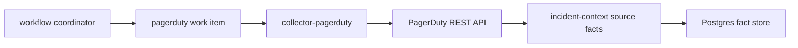

# PagerDuty Collector

`collector-pagerduty` is a claim-driven incident-context collector. It reads
bounded PagerDuty incident evidence and emits source facts only:

- `incident.record`
- `incident.lifecycle_event`
- `change.record`

PagerDuty is the alerting source. This collector does not create Jira tickets,
infer deployment impact, write graph truth, or connect incidents to code by
itself. It provides the incident side of the evidence path so later collectors
and reducers can correlate runtime artifacts, image versions, commits, pull
requests, and work items.

## Runtime Contract

The runtime selects one enabled `pagerduty` collector instance from
`ESHU_COLLECTOR_INSTANCES_JSON`, claims work from the workflow control plane,
fetches incidents for the claimed target, and commits facts through the shared
ingestion store.



The coordinator plans one work item per configured target. A target is usually
a PagerDuty account scope, optionally narrowed by `allowed_service_ids`.

## Collector Instance Shape

```json
{
  "instance_id": "pagerduty-primary",
  "collector_kind": "pagerduty",
  "mode": "continuous",
  "enabled": true,
  "claims_enabled": true,
  "configuration": {
    "targets": [
      {
        "provider": "pagerduty",
        "scope_id": "pagerduty:account:example",
        "account_id": "example",
        "token_env": "PAGERDUTY_TOKEN",
        "api_base_url": "https://api.pagerduty.com",
        "source_uri": "https://example.pagerduty.com/incidents",
        "incident_lookback": "6h",
        "incident_limit": 25,
        "log_entry_limit": 25,
        "change_event_limit": 25,
        "allowed_service_ids": ["PABC123"]
      }
    ]
  }
}
```

`token_env` names an environment variable available to
`collector-pagerduty`. The token value is resolved inside the process and must
not be copied into collector-instance JSON, chart values, facts, logs, metric
labels, or status errors.

`api_base_url` overrides must use HTTPS in workflow configuration. The direct
HTTP client still accepts an injected test server for unit tests.

## Evidence Boundaries

PagerDuty evidence stays provider-reported:

- Incident title, status, urgency, priority, service, escalation policy, teams,
  assignments, and timestamps stay on `incident.record`.
- Incident log-entry actor, channel, type, summary, and timestamp stay on
  `incident.lifecycle_event`.
- Related change-event summary, source, services, links, and timestamp stay on
  `change.record`.

Reducers and read models must later decide whether this evidence matches a
known deployment, image, commit, pull request, or Jira work item. Missing Jira
links are normal for on-call incidents and must not block PagerDuty collection.

## Observability

The runtime exposes the shared hosted endpoints:

- `/healthz`
- `/readyz`
- `/metrics`
- `/admin/status`

PagerDuty-specific signals:

- `pagerduty.observe`
- `pagerduty.fetch`
- `eshu_dp_pagerduty_provider_requests_total`
- `eshu_dp_pagerduty_facts_emitted_total`
- `eshu_dp_pagerduty_rate_limited_total`
- `eshu_dp_pagerduty_fetch_duration_seconds`
- `eshu_dp_pagerduty_generation_lag_seconds`

Metric labels use bounded provider, status-class, and fact-kind values only.
Incident titles, service names, PagerDuty URLs, token environment names, and
token values stay out of labels.

## Deployment Status

This slice provides the Go fact contract, workflow planner, hosted binary,
configuration parsing, source client, and telemetry contract. The public Helm
Deployment, Service, ServiceMonitor, NetworkPolicy, and PDB are not part of
this slice, so production clusters should run the binary through a custom
hosted deployment until chart support lands.
