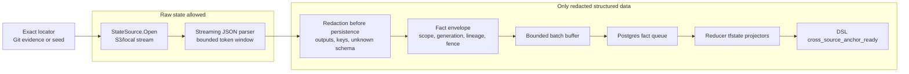

# Architecture Workflow Plan: Terraform State Collector

**Date:** 2026-04-20
**Status:** Draft - hard gate open for issue #49
**Authors:** eshu-platform
**Reviewers required:** Principal engineer, Principal SRE, Security
**Gate:** `eshu-hq/eshu#49`
**Blocked implementation issues:** #29, #47, #46, #45, #44, #43

**Related docs:** `docs/docs/adrs/2026-04-20-terraform-state-collector.md`, `docs/docs/guides/collector-authoring.md`, `docs/docs/adrs/2026-04-20-workflow-coordinator-and-multi-collector-runtime-contract.md`, `docs/docs/adrs/2026-04-20-workflow-coordinator-claiming-fencing-and-convergence.md`, `docs/docs/adrs/2026-04-20-multi-source-reducer-and-consumer-contract.md`

This plan is the issue #49 readiness artifact. It must close before any Terraform-state implementation issue merges. Older ADR text may still mention legacy gate and workstream issue IDs; for this branch, #49 and #47 through #43 are authoritative.

Numeric values below are launch defaults. Review sign-off means the reviewer accepts the value, or records a replacement before #49 closes.

---

## Purpose

The Terraform state collector observes Terraform state as source truth and emits typed, redacted facts. It does not write canonical graph rows, compute drift, crawl infrastructure, or persist raw state payloads.

This plan proves the collector architecture is ready under load, failure, concurrency, security review, and SRE operation before implementation starts.

Non-negotiable launch constraints:

- Parse with a streaming JSON decoder. Never unmarshal a full state file.
- Redact during parsing, before any Eshu persistence boundary.
- Persist only redacted typed facts and snapshot metadata. Never persist raw Terraform state in the content store, fact queue, logs, metrics, spans, admin status, traces, or crash dumps.
- S3 access is read-only. No state backend write API is allowed.
- Do not crawl S3 buckets, list unknown prefixes, or probe unknown accounts. Every locator must come from Git evidence or an explicit operator seed.
- Coordinator must gate graph-backed discovery on upstream Git evidence.
- Claim ownership, retries, and completion flow through coordinator fencing.

---

## 1. Architecture Skeleton

### 1.0 Pre-implementation gaps found in the current tree

This plan depends on several seams that are documented but not fully present
in the current code. These are blockers for #47 and #46, not reasons to weaken
the architecture:

- The Go fact envelope and `fact_records` table do not yet carry
  `schema_version`, `collector_kind`, `fence_token`, or `source_confidence`.
  #47 must add those fields or provide an equivalent durable contract before
  Terraform-state facts are emitted.
- The current claim flow completes claims after fact commit, but fact commit is
  not mechanically fenced. #47/#45 must add transaction-time stale-fence
  rejection or a coordinator-validity check inside fact commit before #46 can
  rely on stale emit rejection.
- `go/internal/redact` does not exist yet. #29 is a real prerequisite for #46
  unless #46 creates the shared redaction package before adding the parser.
- The Terraform parser does not yet emit backend facts for
  `terraform { backend ... }` blocks. #45 must add graph-backed discovery
  inputs before graph-backed state discovery can be the normal path.
- The Terraform-state ADR uses `ScopeKind.state_snapshot`, while one reducer
  consumer note still mentions a Terraform-state-shaped scope kind. Code
  currently follows `state_snapshot`; #47 should settle the docs/code contract
  and avoid adding a second scope kind.
- Repo-local `terraform.tfstate` files are excluded by default `.eshuignore`,
  which is good for secret safety. If local state support is added, #46 must
  read only explicit state sources and must not re-enable broad raw-state
  content persistence.

| Decision | Contract |
| --- | --- |
| Collector family | `terraform_state` |
| Runtime identity | `collector-terraform-state` |
| Source truth | Terraform state payload from local repo content or exact S3 object |
| Scope | `state_snapshot` keyed by `(backend_kind, locator_hash)` |
| Generation | Terraform state `serial`, scoped by `lineage_uuid` |
| Fact path | collector -> fact queue -> reducer/tfstate -> DSL |
| Completion path | coordinator collection ack -> reducer phases -> `cross_source_anchor_ready` |
| Raw payload policy | Raw bytes allowed only in source reader and streaming parser window |

Launch backends:

- `local`: reads repo-local `terraform.tfstate` from the Postgres content store after Git collector completion; emits `state_in_vcs`.
- `s3`: uses `GetObject` or `GetObjectVersion` on an exact bucket/key and optional DynamoDB `GetItem`/`Query` for lock metadata.
- `terragrunt`: resolves `remote_state` into `local` or `s3`; resolver shim only, not a persisted backend kind.

Launch non-goals: Terraform Cloud/TFE, GCS, Azure Blob, HTTP, Consul, Postgres backends, collector-owned drift, orphan, or unmanaged-resource calculation.

Discovery order:

1. Explicit operator seed in collector instance config.
2. Git-collector-observed Terraform backend facts.
3. Git-collector-observed Terragrunt `remote_state` facts.

Discovery guards:

- Graph-backed discovery waits for Git `canonical_nodes_committed` and related required phases for the bounded Git generation.
- Seeds must name an exact local path or exact S3 bucket/key. Prefix-only seeds are rejected.
- `ListBucket`, when configured, is scoped only to configured keys or prefixes required by known locators, and is not used to discover unknown state objects.
- Candidate locators are deduplicated by canonical locator hash before claims are opened.

---

## 2. Sequence Diagrams

### 2.1 Claim to completion

```mermaid
sequenceDiagram
  participant WC as Workflow Coordinator
  participant TF as Terraform State Collector
  participant PG as Postgres Content/Facts
  participant S3 as AWS S3
  participant DDB as DynamoDB Lock Table
  participant R as Reducer

  WC->>WC: Confirm upstream Git evidence for scope
  WC->>TF: claim(work_item_id, scope_batch, fence_token=N)
  TF->>WC: heartbeat(N) every 30s while claim active
  TF->>PG: discovery query for exact backend facts and seeds
  PG-->>TF: bounded StateKey list

  loop per StateKey
    TF->>TF: canonicalize locator; reject speculative crawl
    alt backend is s3
      TF->>S3: GetObject(bucket,key,If-None-Match=previous_etag)
      alt not modified
        S3-->>TF: 304
        TF->>PG: enqueue snapshot unchanged, fence=N
      else changed
        S3-->>TF: streaming body + metadata
        opt lock table configured
          TF->>DDB: GetItem/Query metadata read-only
          DDB-->>TF: digest/lock metadata or empty
        end
        TF->>TF: stream parse -> redact -> facts
        TF->>PG: enqueue redacted fact batches, fence=N
      end
    else backend is local
      TF->>PG: open exact repo content stream
      PG-->>TF: streaming body
      TF->>TF: stream parse -> redact -> state_in_vcs warning
      TF->>PG: enqueue redacted fact batches, fence=N
    else backend is terragrunt
      TF->>PG: load exact Terragrunt files from Git evidence
      TF->>TF: resolve include chain depth <= 10
      TF->>TF: dispatch resolved local or s3 source
    end
  end

  TF->>WC: complete(work_item_id, counts, warnings, fence=N)
  WC->>WC: accept only if active fence=N
  R->>PG: consume facts and publish reducer phases
  WC->>PG: wait for reducer phases and cross_source_anchor_ready
```

### 2.2 Lease expiry and stale emit rejection

```mermaid
sequenceDiagram
  participant W1 as Worker A
  participant WC as Workflow Coordinator
  participant W2 as Worker B
  participant PG as Fact Queue

  W1->>WC: claim token=42
  W1->>W1: parse slow state
  Note over W1: heartbeat stalls
  WC->>WC: lease expires; reap claim; advance token to 43
  W2->>WC: claim token=43
  W2->>PG: enqueue facts token=43 accepted
  W1->>PG: enqueue facts token=42 rejected stale
  W1->>WC: complete token=42 rejected
```

### 2.3 Serial and lineage safety

```mermaid
sequenceDiagram
  participant TF as Collector
  participant PG as Snapshot Index
  participant FQ as Fact Queue

  TF->>PG: read prior serial and lineage for locator_hash
  PG-->>TF: serial=12 lineage=L1
  TF->>TF: stream parse observed serial=10 lineage=L1
  TF->>FQ: warning serial_regression
  TF->>TF: reject replacement; preserve prior indexed facts
  TF->>TF: stream parse observed serial=1 lineage=L2
  TF->>FQ: warning lineage_rotation
  TF->>FQ: emit new generation series with lineage=L2
```

---

## 3. Data Flow



Raw payload rules:

- Raw bytes may exist only in the backend stream and parser token buffer.
- The parser emits redacted per-resource facts before enqueue.
- Logs, spans, metrics, facts, content rows, warning rows, and admin status may include counts, hashes, locator hashes, sizes, serials, lineage, and error classes only.

Fact envelope requirements:

- `scope_id`, `collector_kind=terraform_state`, `generation_id`
- `fence_token`, `lineage_uuid`, `serial`, `backend_kind`, `locator_hash`
- `source_confidence`
- `correlation_anchors[]`, excluding redactable values
- `provider_resolved_arn`, `module_source_path`, `module_source_kind` when deterministic

---

## 4. Concurrency Model

### 4.1 Worker pool

| Item | Default | Constraint |
| --- | --- | --- |
| Workers per pod | 8 | One active coordinator claim per worker |
| Claim lease | 90s | Reaped if no heartbeat before expiry |
| Heartbeat interval | 30s | Independent of parse and emit loops |
| State parse timeout | 5m | Claim becomes partial/resumable |
| Per-resource parse guard | 30s | Resource skipped/truncated with warning |
| Batch flush | 2,000 facts or 500ms | Commit transaction stays short |
| State size ceiling | 512 MiB | Configurable per instance; reject above ceiling |
| Resource attribute-map ceiling | 16 MiB | Truncate/hash-redact and warn |

Per claim bounded stages: claim/open, parser, redaction/batch, emit, heartbeat. Channels between stages are bounded. Queue pressure blocks emit, then redaction, then parsing, then source reads; this is the memory safety path.

### 4.2 Locking and fencing

Shared state: coordinator work item and claim rows, heartbeat row, fact queue rows, content-store rows read for local state, reducer phase state.

Rules:

- Claim issuance uses row-backed bounded selection with `FOR UPDATE SKIP LOCKED`-style semantics.
- Heartbeat, emit, failure, release, and completion carry the current fencing token.
- Queue insert rejects facts whose fence token is not current for the active work item.
- The collector never holds a coordinator row lock while performing S3 I/O or parsing.
- Fact batch transactions are short and never wait on heartbeat updates.
- Content-store reads use committed rows only and do not block Git/reducer writers under Postgres MVCC.

Deadlock review:

- Heartbeat and fact enqueue update separate rows in separate transactions.
- Stale token operations are rejected at coordinator and fact-queue boundaries.
- Retry and requeue are durable operations on expired or terminal claims, not process-local recovery.

### 4.3 Partial completion

Ack fields: `work_item_id`, `fence_token`, `state_keys_total`, `state_keys_done`, `warnings_summary`, `resumable`, `ack_reason`.

Allowed `ack_reason`: `complete`, `partial_timeout`, `partial_backend_pressure`, `partial_queue_pressure`, `stale_fence`.

Coordinator behavior: reject mismatched fence; requeue remaining `StateKey`s on next scheduled tick when `resumable=true`; apply 24h cooldown after repeated locator timeout; keep workflow incomplete until reducer phase readiness is true.

---

## 5. Memory Budget

| Layer | Steady | Peak | Hard ceiling | Notes |
| --- | --- | --- | --- | --- |
| Worker baseline | 12 MiB | 16 MiB | 24 MiB | AWS client, parser structs, queues |
| Source stream | 4 MiB | 16 MiB | 16 MiB | Reader window; no full payload buffer |
| Parser token state | 2 MiB | 4 MiB | 8 MiB | Decoder state and current object |
| Resource attributes | 4 MiB | 16 MiB | 16 MiB | Largest resource map bound |
| Fact batch | 4 MiB | 8 MiB | 12 MiB | About 2,000 facts per flush |
| Per-claim total | 24 MiB | 32 MiB | 48 MiB | Target for one active state |
| Pool total, 8 workers | 384 MiB | 512 MiB | 640 MiB | Includes runtime overhead |

Pod target: `GOMEMLIMIT=768MiB`; soft backoff at 85%; resume below 70%; publish `eshu_dp_gomemlimit_bytes`, `eshu_dp_tfstate_worker_memory_bytes`, and `eshu_dp_tfstate_memory_backoff_active`.

Acceptance evidence required: 100 MiB/10,000-resource fixture stays below 512 MiB peak for 8 workers; 512 MiB ceiling fixture rejects before full read or unbounded allocation; attribute-map overflow emits warning without panic or raw-value leak.

---

## 6. Throughput Math

Launch assumptions: 2,000 repos; 10% to 30% with Terraform state evidence; 200 to 600 StateKeys; 2 MiB average state; 100 MiB P99 state; 15m refresh interval; 85% conditional S3 hit ratio after warmup.

| Step | Math | Result |
| --- | --- | --- |
| Average cold bytes | 600 states * 2 MiB | 1.2 GiB |
| Read/decode throughput | 8 workers * 20 MiB/s | 160 MiB/s |
| Raw read time | 1.2 GiB / 160 MiB/s | about 8s |
| Commit and retry headroom | queue tx, backoff, outliers | target under 5m |
| Warm changed set | 90 states * 2 MiB | 180 MiB |
| Warm steady read time | 180 MiB / 160 MiB/s | about 2s plus overhead |

Backpressure rules:

- Fact queue depth above 50,000 pauses new claim pickup; resume below 20,000.
- S3 throttling uses max 3 attempts, exponential backoff capped at 20s, then yields `s3_throttle_yield`.
- Content-store read slower than 5s per chunk yields before partial emit unless serial and lineage were validated.
- Reducer backlog delays final workflow completion through coordinator phase gates; it does not cause duplicate collection.

---

## 7. Telemetry Specification

### 7.1 Metrics

| Metric | Type | Labels |
| --- | --- | --- |
| `eshu_dp_tfstate_snapshots_observed_total` | counter | `backend_kind`, `result` |
| `eshu_dp_tfstate_snapshot_bytes` | histogram | `backend_kind` |
| `eshu_dp_tfstate_resources_emitted_total` | counter | `backend_kind` |
| `eshu_dp_tfstate_outputs_emitted_total` | counter | `backend_kind` |
| `eshu_dp_tfstate_redactions_applied_total` | counter | `reason` |
| `eshu_dp_tfstate_warnings_emitted_total` | counter | `warning_kind` |
| `eshu_dp_tfstate_backend_errors_total` | counter | `backend_kind`, `error_class` |
| `eshu_dp_tfstate_discovery_candidates_total` | counter | `source` |
| `eshu_dp_tfstate_parse_duration_seconds` | histogram | `backend_kind` |
| `eshu_dp_tfstate_serial_regressions_total` | counter | none |
| `eshu_dp_tfstate_lineage_rotations_total` | counter | none |
| `eshu_dp_tfstate_unknown_provider_schema_total` | counter | `provider_bucket` |
| `eshu_dp_tfstate_s3_conditional_get_not_modified_total` | counter | none |
| `eshu_dp_tfstate_claim_wait_seconds` | histogram | `collector_instance_id` |
| `eshu_dp_tfstate_memory_backoff_active` | gauge | `collector_instance_id` |

Cardinality caps: `backend_kind={s3,local,terragrunt}`; `result={changed,unchanged,rejected,partial}`; `warning_kind` and `error_class` are frozen enums; `provider_bucket` is top 20 providers plus `other`.

### 7.2 Traces and logs

Required spans: `tfstate.collector.claim.process`, `tfstate.discovery.resolve`, `tfstate.source.open`, `tfstate.parser.stream`, `tfstate.fact.emit_batch`, `tfstate.coordinator.complete`.

Required span/log attributes: `scope_id`, `generation_id`, `lineage_uuid`, `collector_instance_id`, `work_item_id`, `fence_token`, `backend_kind`, `locator_hash`, `failure_class`.

Forbidden telemetry fields: raw state bytes, output values, attribute values, full S3 URLs, unredacted Terragrunt config values.

Operator questions telemetry must answer:

- Is the collector waiting on Git evidence, S3, parsing, queue, or reducer convergence?
- Which locator is failing, identified only by locator hash and configured source reference?
- Is memory pressure pausing claims?
- Are serial regressions or lineage rotations occurring?
- Did the run finish collection but wait on `cross_source_anchor_ready`?

---

## 8. Failure Mode Matrix

| Failure | Detection | Recovery | Operator action |
| --- | --- | --- | --- |
| Missing Git evidence | coordinator status `waiting_on_git_generation` | do not run graph discovery | inspect Git collector/reducer phases |
| Speculative locator requested | config validation error | reject seed or candidate | replace with exact bucket/key or repo path |
| S3 throttling | `backend_errors_total{error_class=throttle}` | retry 3x, yield claim | tune interval/concurrency or AWS quota |
| S3 access denied | `error_class=access_denied` | fail claim after retry classification | fix IAM role/trust/external ID |
| S3 not found | `error_class=not_found` | emit warning, do not crawl | verify backend fact or seed |
| DynamoDB denied | `error_class=ddb_denied` | continue without lock metadata | grant read-only lock table access if desired |
| State too large | `state_too_large` warning | skip without partial facts | split state or raise explicit ceiling |
| Parse timeout | `parse_timeout` warning | partial ack, cooldown after repeats | inspect state schema/size |
| Attribute map too large | `attr_map_truncated` warning | truncate/hash-redact resource | improve schema coverage or split resource |
| Unknown provider schema | provider bucket metric + warning | conservative redaction and partial facts | add schema pack |
| Serial regression | metric + warning fact | reject replacement | investigate backend rollback/split brain |
| Lineage rotation | metric + warning fact | start new lineage generation | confirm intentional state recreation |
| Queue pressure | queue-depth and claim-wait metrics | pause new claims, drain | scale reducer or reduce collector workers |
| Lease expiry | coordinator expired-claim metric | requeue with new fence | inspect worker stalls and memory pressure |
| Stale emit | queue rejected stale fence | discard old worker output | correlate with lease expiry incident |
| Raw-value telemetry attempt | redaction audit test failure | block merge | fix parser/logging before release |

---

## 9. Accuracy Checkpoints

Required evidence before #49 closes:

- [ ] S3 state with known AWS ARN emits `provider_resolved_arn`, `module_source_path`, and anchors.
- [ ] Local state from content store emits `state_in_vcs` warning and redacted facts.
- [ ] Terragrunt include depth 3 resolves to exact S3 locator.
- [ ] Terragrunt include depth 12 is rejected with warning.
- [ ] Prefix-only S3 seed is rejected; no bucket crawl occurs.
- [ ] Serial regression rejects replacement facts.
- [ ] State over 512 MiB rejects before full buffering.
- [ ] Lineage rotation emits warning and new lineage series.
- [ ] Sensitive outputs and known sensitive keys never appear in facts, logs, metrics, spans, or admin status.
- [ ] Unknown provider fixture hash-redacts scalar leaves, drops non-scalar unknowns, and emits warning.
- [ ] Conditional S3 ETag hit emits only unchanged snapshot metadata.
- [ ] Stale worker facts are rejected after fence advance.
- [ ] Coordinator fixture proves tfstate run waits for Git evidence and reducer phase readiness.
- [ ] 600 StateKeys with 8 workers completes cold drain under 5m in test environment.

TDD requirement for implementation issues: each slice lands failing tests before code, with positive, negative, and ambiguous cases when parsing, discovery, redaction, or concurrency changes.

---

## 10. Concurrency Review Checklist

- [ ] Shared state enumerated: claims, heartbeats, fact queue, content store, reducer phase state.
- [ ] Claim issuance uses durable row-backed ownership and bounded selection.
- [ ] Fencing token is required on heartbeat, emit, failure, release, and ack.
- [ ] Stale fact insert is rejected mechanically, not by convention.
- [ ] Heartbeat cannot deadlock with emit transactions.
- [ ] S3 and parser work never run while holding coordinator row locks.
- [ ] Backpressure path is bounded from queue -> emit -> parser -> source read.
- [ ] Retry rules are bounded and classified.
- [ ] Partial completion is explicit and resumable.
- [ ] Workflow completion waits for reducer-published downstream truth.

Sign-offs:

- [ ] Principal engineer: _name_, _date_
- [ ] Principal SRE: _name_, _date_

---

## 11. Security Review Checklist

- [ ] IAM template grants only required reads: `s3:GetObject`, optional `s3:GetObjectVersion`, tightly scoped `s3:ListBucket`, and optional `dynamodb:GetItem`/`dynamodb:Query`.
- [ ] IAM template denies or omits all S3/DynamoDB write APIs.
- [ ] External ID or workload identity trust boundary is required for cross-account AWS access.
- [ ] Runtime startup validates configured sources are exact locators, not crawl instructions.
- [ ] Runtime guard rejects backend configs that request write capability.
- [ ] Redaction happens before persistence and before structured logging.
- [ ] Unknown provider schemas default to conservative redaction.
- [ ] Raw state payload is not written to content store, facts, logs, metrics, spans, traces, crash dumps, or admin status.
- [ ] Locator hashes, not full S3 URLs, are used in telemetry.
- [ ] Local state produces operator-visible `state_in_vcs` warning.

Sign-off:

- [ ] Security: _name_, _date_

---

## 12. PE/SRE Review Checklist

Principal engineer:

- [ ] Scope and generation identity are deterministic.
- [ ] Fact fields satisfy reducer/consumer ADR requirements.
- [ ] Discovery policy cannot invent unsupported locators.
- [ ] Parser and redaction boundaries are enforceable in tests.
- [ ] The collector remains facts-first and does not own drift/correlation.
- [ ] The plan preserves accuracy before performance and reliability tuning.

Principal SRE:

- [ ] Memory budget has headroom and observable backoff.
- [ ] Throughput math is credible for 600 states per 15m interval.
- [ ] Retry behavior cannot create scan storms.
- [ ] Queue pressure and reducer convergence are visible separately.
- [ ] Failure classes map to clear operator actions.
- [ ] 3 AM diagnosis path is covered by metrics, traces, logs, and status.

---

## 13. Gate Closure Checklist

#49 may close only when every item below is complete:

- [x] Plan skeleton names scope, generation, backend, fact, and completion contracts.
- [x] Sequence diagrams cover claim, discovery, open, parse, emit, complete, lease expiry, serial regression, and lineage rotation.
- [x] Data-flow diagram marks the raw-payload boundary.
- [x] Concurrency model covers bounded workers, fencing, lock ordering, partial ack, and backpressure.
- [x] Memory budget is documented with acceptance evidence required.
- [x] Throughput math is documented with cold and warm assumptions.
- [x] Telemetry spec defines metrics, spans, log keys, cardinality caps, and forbidden fields.
- [x] Failure matrix maps detection, recovery, and operator action.
- [x] Accuracy checkpoints are enumerated for implementation TDD.
- [x] Security checklist covers read-only S3, no crawl, no raw persistence, and redaction before persistence.
- [ ] Concurrency review signed off.
- [ ] Security review signed off.
- [ ] Principal engineer review signed off.
- [ ] Principal SRE review signed off.
- [ ] Any reviewer-changed numeric defaults are recorded in this plan.

Only after #49 closes may implementation issues #47, #46, #45, #44, and #43 merge.

---

## 14. Reference Notes

Local sources read: `README.md`, `AGENTS.md`, the Terraform-state ADR, collector authoring guide, coordinator runtime ADR, coordinator claiming ADR, and multi-source reducer/consumer ADR.

Official behavior references used for architecture assumptions: AWS S3 `GetObject`, AWS S3 consistency model, AWS IAM S3 actions, DynamoDB `GetItem`, PostgreSQL transaction isolation, and PostgreSQL `SELECT` locking.
