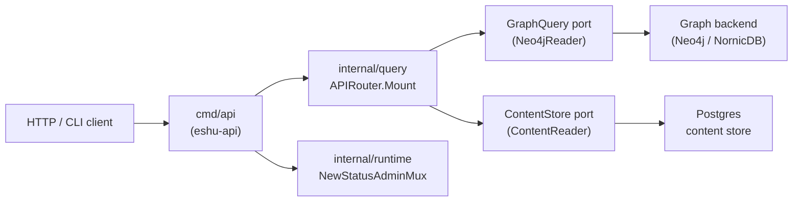
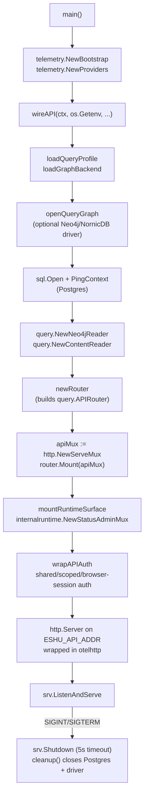

# cmd/api

## Purpose

`cmd/api` is the entry point for the `eshu-api` binary. It boots OTEL telemetry,
opens a Postgres connection and an optional graph driver, wires all query handlers
through `internal/query`, mounts the shared runtime admin surface, wraps the
combined mux with shared bearer-token, scoped-token, and dashboard
browser-session authentication, and listens for HTTP traffic until `SIGINT` or
`SIGTERM`.

## Where this fits in the pipeline

## Internal flow

## Lifecycle / workflow

`main` initializes OTEL via `telemetry.NewBootstrap` and `telemetry.NewProviders`,
then calls `wireAPI`. Failure at any wiring step releases already-acquired
connections and exits; the `cleanup` closure returned by `wireAPI` closes Postgres
and the graph driver on normal shutdown.

`wireAPI` resolves `ESHU_QUERY_PROFILE`, `ESHU_GRAPH_BACKEND`, optional semantic
provider profile metadata, optional semantic extraction policy, and the
semantic-search embedder selector, opens the
graph driver via `openQueryGraph` (skipped when
`ESHU_QUERY_PROFILE=local_lightweight`), opens and pings Postgres, then calls
`newRouter` to build the `query.APIRouter` with all handler structs wired to the
concrete `query.Neo4jReader` and `query.ContentReader` adapters. The API and
runtime admin surfaces share the same decorated status reader so semantic
provider profile status stays redacted and policy-gated consistently. The
supply-chain handler also wires
`AdvisoryEvidence` to `query.NewPostgresAdvisoryEvidenceStore` so source-only
advisory evidence is available through the API without requiring graph access.
`EvidenceHandler.AdmissionDecisions` is wired to
`query.NewPostgresAdmissionDecisionReadStore` so correlation admission outcomes
can be read back without graph traversal.
`IncidentHandler` and `WorkItemHandler` wire Postgres-backed incident context
and Jira/work-item source evidence reads so on-call and ticket-first surfaces
can answer from active facts without provider API calls.
When `ESHU_COMPONENT_HOME` is configured, `wireAPI` also wires sanitized
component-extension registry readback and trust-policy diagnostics through the
query router. If it is unset, the component-extension routes return a canonical
unavailable envelope rather than guessing at local CLI state.

`mountRuntimeSurface` calls `internalruntime.NewStatusAdminMux` to compose
`/healthz`, `/readyz`, `/admin/status`, and `/metrics` alongside the API routes.
The combined mux is then wrapped with `wrapAPIAuth`, which preserves the shared
API key path, enables the optional scoped-token registry, and resolves
server-managed dashboard browser sessions from hash-only Postgres state.
`BrowserSessionHandler` exchanges an explicit scoped credential with
tenant/workspace context for HttpOnly session and readable CSRF cookies; shared
API keys stay on the bearer path because they do not carry a tenant/workspace
boundary.

The HTTP server listens on `ESHU_API_ADDR` (default `:8080`) with a
10 s read-header timeout, 60 s write timeout, and 120 s idle timeout. On
shutdown it waits up to 5 s for in-flight requests before exiting.

## Exported surface

`cmd/api` is a `package main` binary; it exports no Go identifiers. All handler
and contract types are owned by `internal/query`.

The direct process contract includes `eshu-api --version` and `eshu-api -v`.
Both flags print the build-time version through `printAPIVersionFlag`, which
wraps `buildinfo.PrintVersionFlag`, before telemetry, Postgres, or graph setup
begins.

Two compile-time interface checks in `wiring.go:23–24` assert that
`*query.Neo4jReader` satisfies `query.GraphQuery` and `*query.ContentReader`
satisfies `query.ContentStore`. These checks fail the build if either concrete
type drifts from the port it implements.

See `doc.go` for the full godoc contract.

## Dependencies

- `internal/query` — `APIRouter`, `RepositoryHandler`, `EntityHandler`,
  `CodeHandler`, `ContentHandler`, `InfraHandler`, `IaCHandler`, `ImpactHandler`,
  `EvidenceHandler`, `SupplyChainHandler`, `IncidentHandler`, `WorkItemHandler`,
  `FreshnessHandler`, `StatusHandler`, `CompareHandler`, `AdminHandler`, `Neo4jReader`,
  `ContentReader`, `BrowserSessionHandler`,
  `AuthMiddlewareWithBrowserSessionsScopedTokensAndGovernanceAudit`,
  `ParseQueryProfile`, `ParseGraphBackend`
- `internal/runtime` — `OpenNeo4jDriver`, `ResolveAPIKey`, `NewStatusAdminMux`,
  `NewStatusRequestHandler`
- `internal/recovery` — `NewHandler` for refinalize/replay routes
- `internal/scopedtoken` — optional `ESHU_SCOPED_TOKENS_FILE` resolver for
  hosted tenant/workspace-scoped bearer credentials
- `internal/status` — `Reader` port consumed by `internalruntime.NewStatusAdminMux`
- `internal/storage/postgres` — `NewStatusStore`, `NewRecoveryStore`,
  `NewStatusRequestStore`, `NewBrowserSessionStore`
- `internal/telemetry` — `NewBootstrap`, `NewProviders`, `EventAttr`,
  `NewLoggerWithWriter`

## Configuration

- `ESHU_API_ADDR` — listen address, default `:8080`
- `ESHU_POSTGRES_DSN` (or legacy `ESHU_CONTENT_STORE_DSN`) — required
- `ESHU_QUERY_PROFILE` — default `production`
- `ESHU_GRAPH_BACKEND` — `neo4j` or `nornicdb`
- `ESHU_DISABLE_NEO4J` — with the local-lightweight profile, skips the
  graph driver
- `ESHU_SEMANTIC_PROVIDER_PROFILES_JSON` — optional provider profile registry
  for semantic extraction status and semantic-search query embeddings. It
  accepts profile metadata, `embedding_dimensions`, endpoint profile ids, and
  credential handles only; status output omits credential handles.
- `ESHU_SEMANTIC_EXTRACTION_POLICY_JSON` — optional hosted semantic extraction
  allowlist. It names provider profile ids, source classes, scopes, source
  selectors, limits, redaction mode, and retention posture. Without it, provider
  profiles remain visible in status but source policy stays disabled.
- `ESHU_SEMANTIC_SEARCH_LOCAL_EMBEDDER` — optional deterministic no-network or
  auto-local semantic-search selector. `hash` and `local_hash` force ready
  persisted local vector rows. `auto_hash` selects one governed
  `search_documents` provider profile when configured and otherwise falls back
  to local hash query embeddings. Unset allows provider-only auto-selection.
- `ESHU_SEMANTIC_SEARCH_PROVIDER_PROFILE_ID` — optional selector when more than
  one governed `search_documents` provider profile is configured.
- `ESHU_GOVERNANCE_MODE`, `ESHU_GOVERNANCE_STATE`,
  `ESHU_GOVERNANCE_SOURCE_KIND`, `ESHU_GOVERNANCE_POLICY_REVISION_HASH`,
  `ESHU_GOVERNANCE_AUTH_MODE`, `ESHU_GOVERNANCE_TENANT_MODE`,
  `ESHU_GOVERNANCE_WORKSPACE_MODE`, `ESHU_GOVERNANCE_EGRESS_MODE`,
  `ESHU_GOVERNANCE_REDACTION_STATE`, `ESHU_GOVERNANCE_RETENTION_MODE`,
  `ESHU_GOVERNANCE_AUDIT_STATE`, `ESHU_GOVERNANCE_EXTENSION_MODE`,
  `ESHU_GOVERNANCE_DENIED_DECISION_COUNT`,
  `ESHU_GOVERNANCE_POLICY_SECTION_COUNT`,
  `ESHU_GOVERNANCE_STALE_SECTION_COUNT`, and `ESHU_GOVERNANCE_REASONS` —
  optional safe metadata for `/api/v0/status/governance`. These values must be
  mode names, hashes, counts, or reason codes only; do not put raw policy,
  tenant, workspace, source, credential, endpoint, prompt, response, path, or
  token values in them.
- `ESHU_SCOPED_TOKENS_FILE` — optional secret-mounted scoped-token registry.
  When set, the API resolves hashed scoped tokens into tenant/workspace auth
  context before falling back to the shared API key. Malformed registries fail
  startup closed. Dashboard browser-session creation requires this scoped
  context and never stores raw credentials or raw cookie values.
- `ESHU_COMPONENT_HOME` plus `ESHU_COMPONENT_TRUST_MODE`,
  `ESHU_COMPONENT_ALLOW_IDS`, `ESHU_COMPONENT_ALLOW_PUBLISHERS`,
  `ESHU_COMPONENT_REVOKE_IDS`, `ESHU_COMPONENT_REVOKE_PUBLISHERS`,
  `ESHU_COMPONENT_CORE_VERSION`,
  `ESHU_COMPONENT_PROVENANCE_CERTIFICATE_IDENTITY`,
  `ESHU_COMPONENT_PROVENANCE_OIDC_ISSUER`,
  `ESHU_COMPONENT_PROVENANCE_PREDICATE_TYPE`, and
  `ESHU_COMPONENT_COSIGN_BINARY` — optional read-only component-extension
  inventory and policy diagnostic source for `/api/v0/component-extensions`.
  Strict mode uses the provenance and Cosign settings to verify signed
  digest-pinned artifacts. Responses use activation config handles and never
  expose local manifest or config paths.
- `DEFAULT_DATABASE` — graph database name, default `nornic`
- `ESHU_PPROF_ADDR` — opt-in `net/http/pprof` endpoint via
  `runtime.NewPprofServer`; unset disables the profiler; port-only inputs
  (`:6060`) bind to `127.0.0.1`
- `ESHU_COLLECTOR_INSTANCES_JSON` plus
  `ESHU_PROMETHEUS_MIMIR_COLLECTOR_INSTANCE_ID` — optional
  `prometheus_mimir` collector config used to back
  `/api/v0/metrics/timeseries`. Enabled targets may reference `token_env` and
  `tenant_id_env`; those env vars must resolve in the API process when present.
- API key resolved via `runtime.ResolveAPIKey`; Bolt details via
  `runtime.OpenNeo4jDriver`

## Telemetry

- Bootstrap: `telemetry.NewBootstrap("eshu-api")` with service
  name `api`, logger component `api`.
- HTTP middleware: `otelhttp.NewHandler(mux, "eshu-api")` instruments every request
  with OTEL spans and read/write message events.
- Metrics: `/metrics` exposed via `internalruntime.WithPrometheusHandler`.
- Log events (via `telemetry.EventAttr`): `runtime.startup.failed`,
  `runtime.postgres.connected`, `runtime.neo4j.connected`,
  `runtime.server.listening`, `runtime.server.stopped`, `runtime.server.failed`,
  `runtime.shutdown.failed`.

## Operational notes

- If `/healthz` returns unhealthy, check that both Postgres (`PingContext`) and
  the graph driver were reachable at startup; wiring failures cause `os.Exit(1)`.
- High request latency: check `eshu_dp_neo4j_query_duration_seconds` and
  `eshu_dp_postgres_query_duration_seconds` at `/metrics` before scaling the API.
  Query latency is owned by `internal/query` handlers, not the transport layer.
- 5xx spikes: look at the `otelhttp` span error attributes and the structured
  log stream; per-handler errors surface as JSON error responses, not panics.
- `/admin/status` reports the live runtime stage and backlog from `internal/status`.
  A healthy API with empty or stale `admin/status` data means the ingester or
  reducer has not yet populated status rows.
- `/api/v0/metrics/timeseries` returns empty points with unavailable freshness
  when no Prometheus/Mimir source is configured. When configured, API startup
  fails fast on malformed collector JSON or unresolved referenced secret envs.
- `ESHU_DISABLE_NEO4J=true` with `ESHU_QUERY_PROFILE=local_lightweight` skips graph
  driver initialization; the API then serves Postgres-only content queries.
- Graceful shutdown waits at most 5 s; in-flight graph or content reads that
  exceed this window are interrupted. Check write-timeout settings if clients
  report disconnects under load.

## Extension points

- Graph backend: implement `query.GraphQuery` and wire the new adapter in
  `openQueryGraph`. The rest of the binary does not branch on backend brand.
- Auth: replace `wrapAPIAuth` with a different policy by swapping the
  middleware call in `wireAPI`. The shared token is resolved via
  `internalruntime.ResolveAPIKey`; scoped tokens come from
  `internal/scopedtoken`, and browser sessions are mediated by
  `BrowserSessionHandler` plus the Postgres browser-session store.
- Admin surface: `internalruntime.NewStatusAdminMux` accepts
  `internalruntime.WithPrometheusHandler` and other options; add new admin routes
  through `internal/runtime`, not directly in this binary.

## Gotchas / invariants

- Reads only. This binary does not write facts, enqueue projection work, or touch
  the reducer queue. Writes belong to `ingester`, `projector`, or `reducer`.

- Version probes are pre-startup checks. Keep `printAPIVersionFlag` at the top
  of `main` so `eshu-api --version` works without database credentials.

- `ESHU_POSTGRES_DSN` is required; after `ResolveAPIKey` succeeds, startup fails
  with an explicit error if both `ESHU_POSTGRES_DSN` and the legacy
  `ESHU_CONTENT_STORE_DSN` are empty (`wiring.go:42`).

- Invalid `ESHU_QUERY_PROFILE`, `ESHU_GRAPH_BACKEND`,
  `ESHU_SEMANTIC_PROVIDER_PROFILES_JSON`,
  `ESHU_SEMANTIC_EXTRACTION_POLICY_JSON`, or
  `ESHU_SEMANTIC_SEARCH_LOCAL_EMBEDDER` values fail at startup before datastore
  connections; multiple governed search profiles without
  `ESHU_SEMANTIC_SEARCH_PROVIDER_PROFILE_ID` also fail closed. There is no
  silent default for unrecognized provider kinds, credential source kinds,
  source classes, source selectors, scopes, retention postures, or pasted
  environment-variable keys.

- `wireAPI` returns a cleanup closure. `PrometheusHandler` and all acquired
  connections are freed when the closure runs; partial wiring failures still
  free already-acquired connections (`main.go:67`).

- The API mux is wrapped with `wrapAPIAuth` before it is handed to the HTTP
  server; do not add unprotected data routes after this wrap point.

## Related docs

- `docs/public/deployment/service-runtimes.md` — API runtime lane and scaling notes
- `docs/public/reference/http-api.md` — canonical HTTP API contract
- `docs/public/reference/cli-reference.md` — `eshu api start` flags
- `docs/public/run-locally/docker-compose.md` — Compose service `eshu`
- `docs/public/reference/backend-conformance.md` — backend selection
