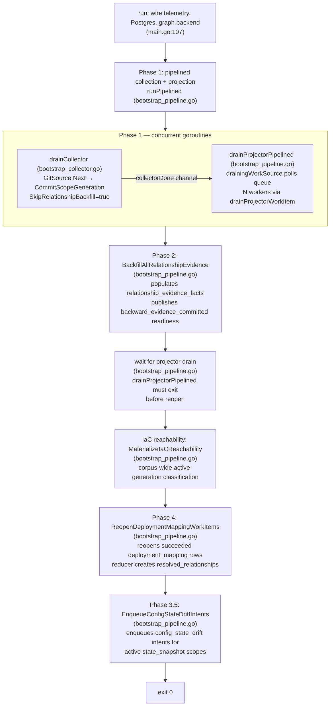

# bootstrap-index

`eshu-bootstrap-index` is the one-shot operator helper for seeding an empty or
recovered Eshu environment. It runs the multi-pass facts-first pipeline: pipelined
collection with source-local projection, deferred relationship-evidence backfill,
IaC reachability materialization, and deployment-mapping reopen. It exits when
all phases complete; it is not a steady-state runtime.

## Purpose

The binary exists because the normal steady-state services (`eshu-ingester` and
`eshu-reducer`) are designed for incremental, continuous operation. Bootstrap
fills the gap for cold-start and recovery scenarios where an operator needs a
full facts-first pass over a known repository set before the incremental cycle
takes over. The same write contracts — `projector.CanonicalWriter`,
`postgres.IngestionStore`, the projector queue — apply here, so the output is
identical to what the ingester and reducer would eventually produce.

## Where this fits in the pipeline

```
sync -> discover -> parse -> emit facts -> enqueue projector work
  -> source-local projection (graph writes, content writes, reducer intents)
     -> backfill relationship evidence
     -> IaC reachability materialization
     -> reopen deployment_mapping for reducer second pass
```

`eshu-bootstrap-index` owns steps 1–7. After it exits, `eshu-reducer` drains the
reducer intents that were enqueued during source-local projection.

## Internal flow — the pipeline phases

The orchestrator in `runPipelined` (`bootstrap_pipeline.go`) drives six sequential
steps: collection + projection (Phase 1), relationship-evidence backfill
(Phase 2), IaC reachability materialization, deployment-mapping reopen
(Phase 3), drift-intent enqueue (Phase 3.5), and the final shutdown
path.



### Phase 1 — collection and first-pass reduction

`drainCollector` runs `collector.GitSource.Next` in a loop, committing each
scope generation via `committer.CommitScopeGeneration`. The committer is wired
with `SkipRelationshipBackfill=true`, which suppresses the per-commit backfill
path that would be quadratically expensive across all repos.

Concurrently, `drainProjectorPipelined` claims work from the Postgres projector
queue using `FOR UPDATE SKIP LOCKED`. `N` goroutines (default `min(NumCPU, 8)`,
overridden by `ESHU_PROJECTION_WORKERS`) each call `drainProjectorWorkItem` in
a loop. The queue claim is scoped to git source systems because this one-shot
runtime owns the finite repository corpus; continuous collectors publish their
own source-local work for steady-state services to drain. Each work item:
claim → `factStore.LoadFacts` → `runner.Project`
(canonical graph write + content write + reducer intent enqueue) → `workSink.Ack`.
If the shared `ProjectorWorkHeartbeater` reports `projector.ErrWorkSuperseded`,
the worker records `status=superseded` and returns to the claim loop without
acking or failing the stale generation.

The `drainingWorkSource` wrapper converts between two modes: while the
collector goroutine is running, an empty queue triggers a 500ms poll-wait and
retry; once `collectorDone` is closed, `maxEmptyPolls` (5) consecutive empty
claims trigger a clean exit via the `errProjectorDrained` sentinel.

Bootstrap uses the same canonical writer policy as the steady-state ingester.
That keeps graph-property filtering, NornicDB phase-group behavior, and
row-scoped batched entity containment aligned between one-shot seeding and
local-authoritative watch runs.

`deployment_mapping` work items may project and succeed, or remain pending,
during this phase. Both outcomes are valid because `backward_evidence` is not
committed yet.

### Phase 2 — relationship-evidence backfill

After `drainCollector` returns (collector goroutine done, before projector
drains), `runPipelined` calls `cd.committer.BackfillAllRelationshipEvidence`.
This is defined on `postgres.IngestionStore` and satisfies
`bootstrapCommitter.BackfillAllRelationshipEvidence`. It populates
`relationship_evidence_facts` across all committed scope generations and
publishes `backward_evidence_committed` readiness rows in
`graph_projection_phase_state`. A failure here is fatal; the projector is
cancelled and errors are joined.

### Wait for projector drain

`runPipelined` blocks on `projectorErr := <-errc` (`bootstrap_pipeline.go`) before
issuing the reopen call. This ordering invariant prevents `deployment_mapping`
items emitted after the reopen pass from missing reopening.

### IaC reachability materialization

`cd.committer.MaterializeIaCReachability` classifies active-generation IaC
usage corpus-wide and writes reachability rows to Postgres. Fatal on error.

### Phase 4 — deployment-mapping reopen

`cd.committer.ReopenDeploymentMappingWorkItems` reopens only the
`deployment_mapping` work items that already **succeeded** with the
cross-repo readiness gate closed. Items still pending or claimed at reopen
time will see the now-open gate when they run next and do not need reopening.
A small window exists where an in-flight item succeeds between Phase 2 and
Phase 4; those stragglers require manual admin replay or a future automated
straggler-replay mechanism.

After Phase 4 exits successfully, `eshu-reducer` can drain the
`deployment_mapping` and `resolved_relationships` reducer intents normally.

## Lifecycle

```
main -> run
  telemetry.NewBootstrap("bootstrap-index")
  telemetry.NewProviders
  telemetry.NewInstruments
  runtimecfg.ConfigureMemoryLimit -> telemetry.RecordGOMEMLIMIT
  openBootstrapDB (runtimecfg.OpenPostgres)
  applySchema (postgres.ApplyBootstrap — idempotent DDL)
  ensureBootstrapGraphSchema (verify marker; apply strict graph schema only
    when a direct bootstrap-index run finds the marker missing)
  openBootstrapGraph (openBootstrapCanonicalWriter)
  buildBootstrapCollector (GitSource + IngestionStore)
  buildBootstrapProjector (projector.Runtime + queue deps)
  projectionWorkerCount (ESHU_PROJECTION_WORKERS or min(NumCPU,8))
  runPipelined → phases 1–4
  exit 0 on success, exit 1 on any error
```

Signal handling: none. The binary is designed to run to completion; it does not
register `SIGINT`/`SIGTERM` handlers. Operator interruption kills the process
without cleanup.

## Exported surface

`package main` — no exported identifiers intended for import by other packages.
The public contract is the binary's exit code and its side effects on Postgres
and the graph backend. `eshu-bootstrap-index --version` and
`eshu-bootstrap-index -v` print the build-time version through
`printBootstrapIndexVersionFlag`, which wraps `buildinfo.PrintVersionFlag`,
before opening either store.

Key unexported interfaces and types used to make the binary testable via
dependency injection:

- `bootstrapCommitter` (`main.go:43`) — extends `collector.Committer` with
  `BackfillAllRelationshipEvidence`, `MaterializeIaCReachability`, and
  `ReopenDeploymentMappingWorkItems`
- `collectorDeps`, `projectorDeps`, `graphDeps` — wiring structs passed through
  `run` and `runPipelined`
- `drainingWorkSource` (`bootstrap_pipeline.go`) — wraps `ProjectorWorkSource`
  to add drain-then-exit behavior
- `bootstrapNeo4jExecutor` (`wiring.go:231`) — `DriverWithContext`-based Bolt
  session executor for canonical writes
- `bootstrapNornicDBPhaseGroupExecutor` (`nornicdb_wiring.go:109`) — NornicDB
  phase-group chunking `Executor` wrapper

Function-type aliases (`openBootstrapDBFn`, `applyBootstrapFn`,
`ensureBootstrapGraphSchemaFn`, `openGraphFn`, `buildCollectorFn`,
`buildProjectorFn`) are injected into `run` so tests can replace any wiring
layer without starting Postgres or a graph backend.

See `doc.go` for the package-level contract.

## Dependencies

Internal packages:

| Package | Role |
| --- | --- |
| `internal/collector` | `collector.GitSource`, `collector.Committer`, `collector.DiscoveryAdvisoryReport` |
| `internal/graph` | Strict graph schema DDL and schema fingerprint metadata |
| `internal/graphschemacompat` | Postgres marker compatibility check and marker write helper |
| `internal/projector` | `projector.Runtime`, `projector.CanonicalWriter`, work source/sink/heartbeater interfaces |
| `internal/runtime` (alias `runtimecfg`) | `OpenPostgres`, `LoadGraphBackend`, `OpenNeo4jDriver`, `ConfigureMemoryLimit` |
| `internal/storage/postgres` | `postgres.IngestionStore`, `postgres.NewProjectorQueue`, `postgres.NewReducerQueue`, `postgres.NewFactStore`, `postgres.NewContentWriter`, `postgres.ApplyBootstrap`, `postgres.InstrumentedDB`, `postgres.NewGraphProjectionPhaseStateStore`, `postgres.NewGraphProjectionPhaseRepairQueueStore` |
| `internal/storage/cypher` (alias `sourcecypher`) | `sourcecypher.NewCanonicalNodeWriter`, `sourcecypher.InstrumentedExecutor`, `sourcecypher.RetryingExecutor`, `sourcecypher.TimeoutExecutor`, `sourcecypher.Statement`, phase-group constants |
| `internal/content` | `content.LoadWriterConfig` |
| `internal/telemetry` | `telemetry.NewBootstrap`, `telemetry.NewProviders`, `telemetry.NewInstruments`, span/phase/failure-class attributes |

The `projector.CanonicalWriter` interface is the write-side abstraction. The
concrete writer is `sourcecypher.NewCanonicalNodeWriter`, which sits in front of
`bootstrapNeo4jExecutor`. Both Neo4j and NornicDB run through the same writer;
backend differences are confined to the executor layer in `nornicdb_wiring.go`.

## Telemetry

`bootstrap-index` exports OTEL only. It does **not** mount a `/metrics` HTTP
endpoint.

| Signal | Name or key | Where |
| --- | --- | --- |
| Span | `telemetry.SpanCollectorObserve` | `main.go` — one collect + commit cycle |
| Span | `telemetry.SpanProjectorRun` | `main.go` — one claim + project + ack cycle |
| Metric | `eshu_dp_facts_emitted_total` | `instruments.FactsEmitted`, `collector_kind=bootstrap-index` |
| Metric | `eshu_dp_facts_committed_total` | `instruments.FactsCommitted` |
| Metric | `eshu_dp_collector_observe_duration_seconds` | `instruments.CollectorObserveDuration`, `collector_kind=bootstrap-index` |
| Metric | `eshu_dp_content_entity_emitted_total` | `instruments.ContentEntityEmitted`, `source_file_kind` × `collector_kind=bootstrap-index` — per-file-kind content-entity volume (#3678) |
| Metric | `eshu_dp_bootstrap_pipeline_phase_seconds` | `instruments.BootstrapPipelinePhaseDuration`, `bootstrap_phase` × `collector_kind=bootstrap-index` — per-phase wall time (#3678) |
| Metric | `eshu_dp_queue_claim_duration_seconds` | `instruments.QueueClaimDuration`, `queue=projector` |
| Metric | `eshu_dp_projector_run_duration_seconds` | `instruments.ProjectorRunDuration` |
| Metric | `eshu_dp_projections_completed_total` | `instruments.ProjectionsCompleted` |
| Metric | `eshu_dp_gomemlimit_bytes` | `telemetry.RecordGOMEMLIMIT` |

`source_file_kind` is one of the bounded values `code`, `package_manifest`,
`config`, `other`, produced by `telemetry.ContentEntitySourceFileKind`. The
classifier mirrors the real parser/reducer data path: `package_manifest` is
detected from a dependency entity's metadata (`entity_type` `Variable` plus
`config_kind` `dependency`) — the same signal the reducer's
`extractPackageManifestDependencies` admits — because the git parser leaves
`artifact_type` empty for dependency manifests. `config` is detected from the
`artifact_type` tokens the parser actually emits via `inferArtifactType` /
`persistedArtifactType` (`terraform_hcl`, `dockerfile`, `docker_compose`,
`github_actions_workflow`, `helm_helper_tpl`, `go_template_yaml`, `jinja_yaml`,
the `ansible_*` family, nginx/apache/generic config, and Jinja/text templates);
`code` is the no-artifact-type, no-manifest-metadata default. Dependency
*checksum* rows (go.sum, `config_kind` `dependency_checksum`) and the
vcs/path/url/unsupported dependency variants route to `code`/`other` by design —
mirroring the reducer, which admits consumption on `config_kind` `dependency`
only — so a high-volume go.sum content_entity explosion surfaces under `code`,
not `package_manifest`. `bootstrap_phase`
is one of `collection`, `relationship_backfill`, `projection`,
`iac_reachability`, `deployment_reopen`, `config_state_drift`, and is recorded
even when a phase fails so the long pole is visible on the error path. The
`projection` phase is measured from the projector goroutine's start to its own
captured completion time (it runs concurrently with collection and backfill), so
its duration reflects only projector wall time and never folds in the backfill
wait. The `deployment_reopen` phase wraps `ReopenDeploymentMappingWorkItems` so
that ordered step is independently identifiable rather than an unaccounted gap.
The `collector_kind=bootstrap-index` label is shared with the per-collector layer
so per-stage and per-collector metrics join cleanly. Both the metric label space
and the per-repo `entity_kind_<kind>` log fields iterate the bounded
`telemetry.SourceFileKinds()` set, so the dimension space is statically bounded.

During collection, `drainCollector` also logs a `bootstrap collection progress`
line every 10 repos (`scopes_done`, `total_facts_emitted`,
`total_entities_emitted`, `elapsed_seconds`) and a per-repo `bootstrap scope
collected` line carrying `content_entity_count` plus `entity_kind_<kind>`
breakdown, so a long full-corpus run shows continuous progress in logs without
strace or SQL forensics. Each post-collection phase emits a `bootstrap phase
complete` log line with `bootstrap_phase` and `phase_duration_seconds`. The
`relationship_backfill` phase additionally emits a `bootstrap phase start` log
line (same `bootstrap_phase` label, no attributes beyond that and the shared
`pipeline_phase`) immediately before `BackfillAllRelationshipEvidence` is
called (#4271), so an operator watching logs during a full-corpus run sees an
explicit signal that the deferred backfill has begun instead of a silent gap
between `bootstrap projection succeeded` and the (potentially very long)
completion log for that phase.

Enable OTEL export by setting OTEL_EXPORTER_OTLP_ENDPOINT. When unset, a
noop exporter is used and only local structured logs flow.

Failure-class log keys emitted via `telemetry.FailureClassAttr`:

| Key | Phase |
| --- | --- |
| `commit_failure` | Phase 1 — per-scope commit |
| `backfill_deferred_failure` | Phase 2 — `BackfillAllRelationshipEvidence` |
| `iac_reachability_materialization_failure` | IaC materialization |
| `reopen_deployment_mapping_failure` | Phase 4 — `ReopenDeploymentMappingWorkItems` |
| `projection_failure` | Phase 1 — projection worker |
| `lease_heartbeat_failure` | Phase 1 — heartbeat goroutine |
| `status=superseded` | Phase 1 — stale projector generation replaced by newer same-scope work |

### Evidence (#3678 per-stage timing + per-file-kind content volume)

- Observability Evidence: Added `eshu_dp_content_entity_emitted_total`
  (`source_file_kind` × `collector_kind`) and
  `eshu_dp_bootstrap_pipeline_phase_seconds` (`bootstrap_phase` ×
  `collector_kind`) instruments, plus per-repo `content_entity_count` /
  `entity_kind_<kind>` log attributes, a `bootstrap collection progress` log
  every 10 repos, and a `bootstrap phase complete` log per post-collection
  phase (recorded on the error path too). Coverage, by layer:
  - Classification correctness against REAL fixtures:
    `TestDiscoveryAdvisoryClassifiesRealManifestAndConfigFixtures`
    (`internal/collector`) writes a real `go.mod` and runs it through the actual
    `gomod` parser + `entityBucketsFromParsed` + `snapshotEntityMetadata` path,
    then `buildDiscoveryAdvisoryReport`, and asserts the dependencies classify as
    `package_manifest` (≥2) and a `terraform_hcl` file as `config`. This guards
    the #3678 P1 regression: a real dependency manifest carries an empty
    `artifact_type`, so the prior `artifact_type`-only classifier returned `code`
    and `package_manifest` was permanently 0. The metadata-based classifier
    returns `package_manifest`; the old behavior was confirmed failing for the
    same input before the fix.
  - Classifier unit coverage:
    `TestContentEntitySourceFileKindClassifier` (`internal/telemetry`) covers the
    `Variable`+`config_kind=dependency` manifest signal, the real config
    `artifact_type` tokens, and that dead tokens (`terraform`, `helm_chart`,
    `argocd`, `kustomize`, `cloudformation`) the parser never emits fall through
    to `other` rather than masquerading as `config`.
  - Advisory→metric wiring:
    `TestDrainCollectorEmitsContentEntityCounterByFileKind` drives the real
    `drainCollector` loop against an in-memory OTEL `ManualReader` and asserts the
    counter emits per bounded `source_file_kind` faithfully to the advisory it is
    handed (it does not re-derive classification — that is covered above).
  - Phase timing: `TestRunPipelinedEmitsBootstrapPhaseTimings` drives the real
    `runPipelined` and asserts each of the six `bootstrap_phase` values records
    its histogram point.
  - Phase-timing accuracy:
    `TestRunPipelinedProjectionPhaseExcludesBackfillWait` injects a slow backfill
    and asserts the `projection` duration reflects only projector wall time, not
    the backfill wait (confirmed failing under the prior `time.Since`-after-
    backfill code, which recorded ~4s instead of ~2.5s).
    `TestRunPipelinedRecordsDeploymentReopenPhaseOnError` asserts the new
    `deployment_reopen` phase records even when reopen fails, and that the later
    `config_state_drift` phase does not record on that error path.

  Full gate: `go test ./internal/telemetry ./internal/collector ./internal/parser
  ./cmd/bootstrap-index -count=1`.
  The `collector_kind=bootstrap-index` label is shared with the per-collector
  layer so the two telemetry layers join without relabeling.
- No-Regression Evidence: The new counter adds, per repo, four bounded map reads
  over the already-built `DiscoveryAdvisory.EntityCounts.BySourceFileKind` plus a
  single-map-read `config_kind` lookup per entity during advisory construction;
  the histogram adds five `Record` calls per run. No new graph reads, Cypher,
  locks, queue claims, or per-fact scans are introduced; the package-manifest
  signal reuses the `config_kind` metadata the advisory already iterates. Both
  the metric label space and the `entity_kind_<kind>` log fields iterate the
  bounded `telemetry.SourceFileKinds()` set, so dimension cardinality is static.
  Collection, projection, and commit paths are unchanged except for the added
  emission; the progress log is rate-limited to one line per 10 repos. Baseline
  behavior (facts emitted, projections completed, queue drain) is unchanged and
  covered by the existing `cmd/bootstrap-index` pipeline tests, which continue to
  pass.

### Evidence (#4271 relationship_backfill phase-start signal)

- Observability Evidence: `runPipelined` now logs a `bootstrap phase start`
  line (with `bootstrap_phase=relationship_backfill`) immediately before
  calling `BackfillAllRelationshipEvidence`, closing the previously silent gap
  between `bootstrap projection succeeded` and the phase's own completion log.
  This is a log-only signal; no new metric is added because
  `eshu_dp_bootstrap_pipeline_phase_seconds` already covers the phase's
  duration once it completes (`No-Observability-Change` for the metric layer).
  - Regression coverage:
    `TestRunPipelinedLogsRelationshipBackfillPhaseStartBeforeCompletion`
    (`bootstrap_telemetry_test.go`) drives the real `runPipelined` with a fake
    committer whose `BackfillAllRelationshipEvidence` blocks for a fixed delay,
    captures logs into an in-memory buffer, and asserts the
    `relationship_backfill` phase's `bootstrap phase start` log line's byte
    offset precedes its `bootstrap phase complete` log line's offset — proving
    the start signal fires before the call returns, not only after. Confirmed
    failing against the pre-fix code (no `bootstrap phase start` line existed
    at all).
  - Full gate: `go test ./cmd/bootstrap-index -count=1`.
- No-Regression Evidence: The added call is a single conditional `logger`
  call with no I/O, no lock, and no new goroutine; it cannot change phase
  ordering, the one-shot exit contract, or the pipelined collector/projector
  concurrency model. `TestPipelinedBootstrapRunsDeferredBackfillWorkflow` and
  the other 70 tests in `cmd/bootstrap-index` continue to pass unchanged.

## Configuration

| Variable | Default | Effect |
| --- | --- | --- |
| ESHU_POSTGRES_DSN | required | Postgres connection string |
| ESHU_GRAPH_BACKEND | `nornicdb` | Graph backend; `neo4j` or `nornicdb`; invalid value fails at startup |
| ESHU_GRAPH_SCHEMA_STATEMENT_TIMEOUT | `2m` | Per graph DDL statement deadline when a direct bootstrap-index run must initialize a marker-missing graph schema |
| NEO4J_URI | required | Bolt URI |
| NEO4J_USERNAME | required | Bolt auth username |
| NEO4J_PASSWORD | required | Bolt auth password |
| DEFAULT_DATABASE | `nornic` | Bolt database name |
| `ESHU_NEO4J_BATCH_SIZE` | backend default | Canonical node batch size |
| `ESHU_PROJECTION_WORKERS` | `min(NumCPU, 8)` | Concurrent projection goroutines |
| `ESHU_DEFERRED_BACKFILL_CONCURRENCY` | `min(NumCPU, 8)`, hard cap `8` | Concurrent per-repository batch transactions in the deferred relationship-evidence backfill; one pooled connection per batch, so set `1` at `ESHU_POSTGRES_MAX_OPEN_CONNS=1` |
| `ESHU_DISCOVERY_REPORT` | `""` | File path to write discovery advisory JSON; empty disables |
| `ESHU_CANONICAL_WRITE_TIMEOUT` | `30s` (NornicDB) | Graph write transaction timeout |
| `ESHU_NEO4J_PROFILE_GROUP_STATEMENTS` | `false` | Opt-in Neo4j grouped-write statement attempt logs for performance diagnostics |
| `ESHU_NORNICDB_CANONICAL_GROUPED_WRITES` | `false` | Conformance toggle; on NornicDB it commits per dependency phase — whole-materialization atomic is unsupported (#4027) |
| `ESHU_NORNICDB_PHASE_GROUP_STATEMENTS` | `500` | NornicDB phase group statement cap |
| `ESHU_NORNICDB_FILE_BATCH_SIZE` | `100` | NornicDB file upsert row cap |
| `ESHU_NORNICDB_ENTITY_BATCH_SIZE` | `100` | NornicDB entity upsert row cap |
| `ESHU_NORNICDB_ENTITY_LABEL_BATCH_SIZES` | per-label defaults | Per-label batch size overrides (`Label=size,...`) |
| `ESHU_NORNICDB_ENTITY_PHASE_CONCURRENCY` | `NumCPU`, clamped to `16` | Parallel canonical `entities` and `entity_containment` phase chunk dispatch on NornicDB |
| `ESHU_NORNICDB_BATCHED_ENTITY_CONTAINMENT` | `true` | Fold entity containment into row-scoped entity upserts; set `false` only for measured fallback comparisons |
| `ESHU_PPROF_ADDR` | unset (disabled) | Opt-in `net/http/pprof` endpoint via `runtime.NewPprofServer`; port-only inputs bind to `127.0.0.1` |

Full NornicDB tuning reference: `docs/public/reference/nornicdb-tuning.md`.

### Evidence (#4454 bootstrap canonical entity dispatch)

Performance Evidence: bounded current-main diagnostics for the #3586/#3624
performance epic showed pre-reducer bootstrap source-local `canonical_write`
dominating the sampled run: 531.535s aggregate canonical-write time, with slow
entity-phase NornicDB grouped executions reaching 20.933s across 1,960 entity
statements in a single large scope. The steady-state ingester already honored
`ESHU_NORNICDB_ENTITY_PHASE_CONCURRENCY`, but bootstrap-index did not read that
env var, so setting it in bootstrap performance runs left canonical entity
chunks serial. This fix wires the same `NumCPU` clamped-to-16 default and env
override into bootstrap-index and dispatches canonical `entities` /
`entity_containment` phase chunks in parallel per entity label. Focused proof:
`go test ./cmd/bootstrap-index -run
'TestBootstrapNornicDB(DefaultEntityPhaseConcurrencyTracksNumCPU|EntityPhaseConcurrencyRejectsInvalidEnv|PhaseGroupExecutorDispatchesEntityChunksConcurrently)|TestBootstrapCanonicalExecutorUsesConfiguredEntityPhaseConcurrency'
-count=1` proves the default, env override, invalid-env failure, and concurrent
chunk dispatch.

Observability Evidence: existing canonical writer telemetry still records
`eshu_dp_canonical_write_duration_seconds`,
`eshu_dp_canonical_phase_duration_seconds`, `eshu_dp_neo4j_query_duration_seconds`,
and retry/backpressure counters for the graph-write path. The concurrent
bootstrap dispatcher adds structured `bootstrap nornicdb phase-group chunk
completed` logs with phase, entity label, chunk index/count, statement count,
duration, configured concurrency, and sanitized first-statement summary, so a
bounded run can split bootstrap canonical-write cost by phase and label without
exposing repository paths or raw parameters.

## Operational notes

- **One-shot only.** The binary exits after Phase 4. Running it repeatedly on
  an already-seeded environment re-indexes all repos and replays all
  deployment-mapping work items. Use the ingester's incremental path instead.
- **Version probes do not touch stores.** Keep `printBootstrapIndexVersionFlag`
  at the top of `main` so install checks can inspect the binary without a
  running graph or Postgres instance.
- **No admin surface.** `/healthz`, `/readyz`, `/metrics`, and `/admin/status`
  are not mounted. Monitor via OTEL traces and structured logs.
- **Graph schema marker.** Deployment flows should run
  `eshu-bootstrap-data-plane` first. Bootstrap-index still checks the latest
  marker before opening its projection writer. A missing marker triggers one
  strict graph schema apply and marker write; an incompatible marker stops
  startup before graph writes.
- **Projector lease heartbeat.** Long canonical graph writes can outlast the
  default projector lease. `startBootstrapProjectorHeartbeat` renews the lease
  at `leaseDuration/3`, capped at 1 minute. A heartbeat can also return
  `projector.ErrWorkSuperseded` when a newer same-scope generation exists; this
  is an expected stale-work cancellation, not a bootstrap failure.
- **NornicDB grouped writes.** `ESHU_NORNICDB_CANONICAL_GROUPED_WRITES=false`
  by default. The toggle is conformance-only; on NornicDB both states commit per
  dependency phase, because whole-materialization atomic canonical writes silently
  drop files nested under a directory — an UNWIND-driven MATCH cannot see a
  same-transaction MERGE (#4027). Whole-materialization atomic applies only to a
  same-transaction read-your-writes backend (Neo4j), via the ingester path's
  GroupExecutor.
- **NornicDB entity containment.** Bootstrap enables row-scoped batched entity
  containment for NornicDB (`configureBootstrapCanonicalWriter`) so cold-start
  indexing and the steady-state ingester use the same high-cardinality entity
  write shape. Set `ESHU_NORNICDB_BATCHED_ENTITY_CONTAINMENT=false` only for a
  measured comparison against the older file-scoped shape; do not use one slow
  run as a reason to disable the default without statement counts, phase
  timings, retry state, and terminal queue state.
- **Discovery advisory reports.** Set `ESHU_DISCOVERY_REPORT=<path>` to write a
  per-repo advisory JSON. Useful for diagnosing oversized repositories before
  committing to a full bootstrap run.

## Extension points

Adding a new post-collection pass (analogous to Phase 2 or Phase 4) requires:

1. Add the method to `bootstrapCommitter` (`main.go:41`).
2. Implement it on `postgres.IngestionStore` (or the relevant concrete type).
3. Add a call in `runPipelined` after the projector drain (`bootstrap_pipeline.go`),
   following the existing fatal-error pattern.
4. Add a failure-class log key constant in `go/internal/telemetry/contract.go`.
5. Add a test in `main_test.go` proving the ordering invariant.

Any domain that consumes `resolved_relationships` must have a reopen or
re-trigger mechanism after Phase 4. See `CLAUDE.md` — "Facts-First Bootstrap
Ordering".

## Gotchas / invariants

- `SkipRelationshipBackfill=true` on the `postgres.IngestionStore` committer is
  not optional. Without it, every `CommitScopeGeneration` call would run a full
  relationship backfill, making the total cost quadratic across the repo set.
- Phase ordering is a correctness invariant, not a performance choice. Phase 2
  must run before the projector drains; Phase 4 must run after the projector
  drains. Swapping these creates E2E-only bugs (deployment-mapping items that
  succeed before relationship evidence exists produce incomplete graph truth).
- The straggler window between Phase 2 and Phase 4 is a known limitation. Items
  that succeed in that window are not automatically replayed. Operators must use
  `/admin/replay` or wait for the ingester's incremental refresh.
- `errProjectorDrained` is a sentinel value (`bootstrap_collector.go`). It signals clean
  exit from `drainProjectorWorkItem` after the `PhaseProjection` drain loop
  exhausts the queue; it is not an error. Worker goroutines return on
  this value; they do not propagate it as an error.
- `drainingWorkSource.Claim` counts consecutive empty polls using `atomic.Int32`.
  The count resets to zero each time a work item is claimed successfully, so a
  burst of real work after a quiet period does not trigger spurious exit.

## Per-item projection failure isolation (#4464)

`drainProjectorWorkItem` isolates a per-item projection failure to the queue
Fail path (`isolateBootstrapProjectorFailure`) instead of canceling the shared
worker context. Previously one slow/timed-out canonical write aborted the whole
run and orphaned claimed work.

Performance Evidence: reproduced on a full local compose run of 909 repositories
against the NornicDB branch build (arm64-metal-bge, orneryd/NornicDB#230),
runtime `v0.0.3-pre-release-17`, filesystem repo source. Baseline (pre-fix): a
single `structural_edges` Helm `REFERENCES` MERGE hit the 30s
`ESHU_CANONICAL_WRITE_TIMEOUT`, canceled the shared context, failed all 8
projector workers, and crashed bootstrap-index at ~repo 87; projection
throughput fell from ~3 items/min to 0 and stayed there, with 155 `source_local`
work items stuck in-flight (leases expired, never reclaimed) and 0 dead-letters
(`get_ingester_status` `work_item_status_counts`; `oldest_inflight` grew
620s→2451s). After: per-item failures route to `WorkSink.Fail`, the run drains
to completion, and failed items land in retry/dead-letter instead of wedging.

No-Regression Evidence: the happy path is unchanged —
`isolateBootstrapProjectorFailure` runs only on a work-item error; a
fully-succeeding drain calls `Ack` on every item exactly as before.
`go test ./cmd/bootstrap-index -race` green; `make pre-pr` all gates pass.

Observability Evidence: failed items are now visible as `retrying`/`dead_letter`
rows in `fact_work_items` (and via `get_ingester_status` `domain_backlogs`) plus
the existing `bootstrap projection failed` structured log
(`failure_class=projection_failure`), replacing a bootstrap-index process crash
that produced no queue signal. No new metric is introduced.

Why safe: mirrors the continuous projector (`internal/projector`
`Service.processWork`) failure-isolation pattern; only a Claim failure or a
`Fail`-path write failure remains fatal; genuine shutdown cancellation is not
dead-lettered. Backend: NornicDB (default). Terminal state after fix: queue
drains; failures bounded to retry/dead-letter.

Two residual gaps in the same issue — the intra-materialization entity-phase
chunk fan-out sharing a cancelable context one level below this fix, and
orphaned expired-lease projector claims never reclaimed when the one-shot
process itself dies — are fixed in the same issue's follow-up; see
`docs/internal/design/4464-pipeline-wedge-percall-timeout-lease-reclaim.md`
for the full evidence (performance, no-regression, and observability notes).

## Related docs

- [Service Runtimes — Bootstrap Index](../../../docs/public/deployment/service-runtimes.md#bootstrap-index)
- [Docker Compose deployment](../../../docs/public/run-locally/docker-compose.md)
- [Architecture — Bootstrap Index](../../../docs/public/architecture.md)
- [Local Testing](../../../docs/public/reference/local-testing.md)
- [NornicDB tuning](../../../docs/public/reference/nornicdb-tuning.md)
- [ADR: Bootstrap Relationship Backfill Quadratic Cost](../../../docs/public/services/bootstrap-index.md)
