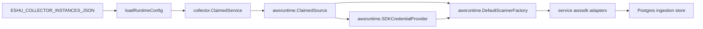

# AWS Cloud Collector Command

## Purpose

`cmd/collector-aws-cloud` runs the claim-aware AWS cloud collector process. It
loads an AWS collector instance from `ESHU_COLLECTOR_INSTANCES_JSON`, claims
bounded `(account_id, region, service_kind)` work items, obtains claim-scoped
AWS credentials, scans the requested AWS service, records scanner-side status,
and commits reported facts through the shared ingestion store. A commit wrapper
records whether the fenced fact transaction reached durable storage.

## Ownership boundary

This command owns process startup, environment parsing, telemetry registration,
and claim-aware runner wiring. It does not own AWS
credential acquisition, service scanner selection, SDK pagination, workflow row
persistence, graph writes, reducer admission, or workload ownership inference.



## Exported surface

This is a command package. The public contract is the process entrypoint and
the environment/configuration it accepts:

- `ESHU_COLLECTOR_INSTANCES_JSON` - declarative collector instance list.
- `ESHU_AWS_COLLECTOR_INSTANCE_ID` - required when more than one AWS collector
  instance is configured.
- `ESHU_AWS_COLLECTOR_POLL_INTERVAL` - idle poll interval.
- `ESHU_AWS_COLLECTOR_CLAIM_LEASE_TTL` - workflow claim lease duration.
- `ESHU_AWS_COLLECTOR_HEARTBEAT_INTERVAL` - heartbeat cadence; must be less
  than the lease TTL.
- `ESHU_AWS_COLLECTOR_OWNER_ID` - optional owner ID override; defaults to
  `HOSTNAME`, then `collector-aws-cloud`.
- `ESHU_AWS_REDACTION_KEY` - required when any target scope enables `ecs` or
  `lambda`. The ECS and Lambda scanners use it to produce deterministic
  HMAC-SHA256 markers for environment values before persistence.

Instance configuration uses:

```json
{
  "target_scopes": [
    {
      "account_id": "123456789012",
      "allowed_regions": ["us-east-1", "aws-global"],
      "allowed_services": ["iam", "ecr", "ecs", "ec2", "elbv2", "lambda", "eks", "route53", "sqs", "sns", "eventbridge", "s3", "rds", "dynamodb", "cloudwatchlogs"],
      "max_concurrent_claims": 1,
      "credentials": {
        "mode": "central_assume_role",
        "role_arn": "arn:aws:iam::123456789012:role/eshu-readonly",
        "external_id": "external-1"
      }
    }
  ]
}
```

`local_workload_identity` is also valid and uses the local AWS SDK credential
chain. Static credential fields are rejected during config parsing.

## Dependencies

- `internal/collector` for the claim-aware collector runner.
- `internal/collector/awscloud/awsruntime` for claim parsing, credentials,
  scanner registry, and collected generation construction.
- `internal/storage/postgres` for workflow claims, ingestion commits, AWS scan
  status rows, and status reports.

## Telemetry

The command registers the shared data-plane telemetry instruments and emits:

- `eshu_dp_aws_api_calls_total`
- `eshu_dp_aws_throttle_total`
- `eshu_dp_aws_assumerole_failed_total`
- `eshu_dp_aws_budget_exhausted_total`
- `eshu_dp_aws_claim_concurrency`
- `eshu_dp_aws_resources_emitted_total`
- `eshu_dp_aws_relationships_emitted_total`
- `eshu_dp_aws_tag_observations_emitted_total`
- `eshu_dp_aws_scan_duration_seconds`
- `aws.collector.claim.process`
- `aws.credentials.assume_role`
- `aws.service.scan`
- `aws.service.pagination.page`

The claim concurrency gauge is backed by the runtime's per-account limiter.

## Gotchas / invariants

- The command never accepts static access-key fields in collector instance
  configuration.
- `central_assume_role` must include `role_arn`; `external_id` is passed to STS
  when configured.
- AWS SDK configuration and service pagination live under `awsruntime` and
  service `awssdk` adapters; command tests should not mock the full AWS SDK
  surface.
- Credential leases are released after scanner construction and service scan.
- ECS and Lambda targets require `ESHU_AWS_REDACTION_KEY`; IAM and ECR targets
  do not.
- ELBv2 targets emit stable routing topology and intentionally exclude target
  health status.
- Route 53 targets emit hosted-zone resources and A/AAAA/CNAME/ALIAS DNS record
  facts. Use a global region label such as `aws-global` when scheduling Route
  53 claims.
- EC2 targets emit VPC, subnet, security-group, security-group-rule, and ENI
  network-topology facts. They intentionally do not emit EC2 instance
  inventory.
- Lambda targets emit function, alias, event-source mapping, image URI,
  execution-role, subnet, and security-group evidence. They intentionally do
  not fetch function code or persist presigned package download URLs.
- SQS targets emit queue metadata and reported dead-letter queue relationships.
  They intentionally do not read messages, mutate queues, or persist queue
  policy JSON.
- SNS targets emit topic metadata and ARN-addressable subscription
  relationships. They intentionally do not publish messages, mutate
  subscriptions, persist topic policy JSON, persist data-protection-policy JSON,
  or persist raw email, SMS, HTTP, or HTTPS subscription endpoints.
- EventBridge targets emit event bus metadata, rule metadata, rule-to-bus
  relationships, and ARN-addressable target relationships. They intentionally do
  not put events, mutate rules or targets, persist event bus policy JSON,
  persist target input payload fields, persist input transformers, persist HTTP
  target parameters, or persist raw non-ARN target identities.
- S3 targets emit bucket metadata and reported server-access-log target bucket
  relationships. They intentionally do not read objects, list object keys,
  mutate buckets, persist bucket policy JSON, persist ACL grants, persist
  replication rules, persist lifecycle rules, persist notification
  configuration, or persist inventory, analytics, or metrics configuration.
- RDS targets emit DB instance, DB cluster, and DB subnet group metadata plus
  reported cluster membership, subnet group, security group, KMS key, monitoring
  role, IAM role, parameter group, and option group relationships. They
  intentionally do not connect to databases, read snapshots, read log contents,
  read Performance Insights samples, discover schemas or tables, or mutate RDS
  resources.
- DynamoDB targets emit table metadata plus directly reported KMS key
  relationships. They intentionally do not read items, scan or query tables,
  read stream records, fetch backup/export payloads, fetch resource policies,
  run PartiQL, or mutate DynamoDB resources.
- CloudWatch Logs targets emit log group metadata plus directly reported KMS
  key relationships. They intentionally do not read log events, log stream
  payloads, run Insights queries, fetch export payloads, persist resource
  policies or subscription payloads, or mutate CloudWatch Logs resources.
- The acceptance unit ID must be JSON with `account_id`, `region`, and
  `service_kind`.
- `/admin/status` includes per `(account_id, region, service_kind)` AWS scan
  status, commit status, API call count, throttle count, and outstanding
  warning class when the data-plane schema includes `aws_scan_status`.

## Related docs

- `docs/docs/adrs/2026-04-20-aws-cloud-scanner-collector.md`
- `docs/docs/guides/collector-authoring.md`
- `docs/docs/reference/telemetry/index.md`
