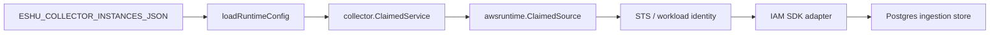

# AWS Cloud Collector Command

## Purpose

`cmd/collector-aws-cloud` runs the claim-aware AWS cloud collector process. It
loads an AWS collector instance from `ESHU_COLLECTOR_INSTANCES_JSON`, claims
bounded `(account_id, region, service_kind)` work items, obtains claim-scoped
AWS credentials, scans the requested AWS service, and commits reported facts
through the shared ingestion store.

## Ownership boundary

This command owns process startup, environment parsing, AWS SDK wiring,
credential acquisition, and service scanner selection. It does not plan AWS
work items, persist workflow rows directly, materialize graph truth, or infer
workload ownership.



## Exported surface

This is a command package. The public contract is the process entrypoint and
the environment/configuration it accepts:

- `ESHU_COLLECTOR_INSTANCES_JSON` - declarative collector instance list.
- `ESHU_AWS_COLLECTOR_INSTANCE_ID` - required when more than one AWS collector
  instance is configured.
- `ESHU_AWS_COLLECTOR_POLL_INTERVAL` - idle poll interval.
- `ESHU_AWS_COLLECTOR_CLAIM_LEASE_TTL` - workflow claim lease duration.
- `ESHU_AWS_COLLECTOR_HEARTBEAT_INTERVAL` - heartbeat cadence; must be less
  than the lease TTL.
- `ESHU_AWS_COLLECTOR_OWNER_ID` - optional owner ID override; defaults to
  `HOSTNAME`, then `collector-aws-cloud`.

Instance configuration uses:

```json
{
  "target_scopes": [
    {
      "account_id": "123456789012",
      "allowed_regions": ["us-east-1"],
      "allowed_services": ["iam"],
      "max_concurrent_claims": 1,
      "credentials": {
        "mode": "central_assume_role",
        "role_arn": "arn:aws:iam::123456789012:role/eshu-readonly",
        "external_id": "external-1"
      }
    }
  ]
}
```

`local_workload_identity` is also valid and uses the local AWS SDK credential
chain. Static credential fields are rejected during config parsing.

## Dependencies

- `internal/collector` for the claim-aware collector runner.
- `internal/collector/awscloud/awsruntime` for claim parsing and collected
  generation construction.
- `internal/collector/awscloud/services/iam` for IAM scanner contracts.
- `internal/storage/postgres` for workflow claims, ingestion commits, and
  status.
- AWS SDK for Go v2 `config`, `sts`, and `iam` packages.

## Telemetry

The command registers the shared data-plane telemetry instruments and emits:

- `eshu_dp_aws_api_calls_total`
- `eshu_dp_aws_throttle_total`
- `eshu_dp_aws_assumerole_failed_total`
- `eshu_dp_aws_claim_concurrency`
- `eshu_dp_aws_scan_duration_seconds`
- `aws.collector.claim.process`
- `aws.credentials.assume_role`
- `aws.service.scan`
- `aws.service.pagination.page`

The claim concurrency gauge is backed by the runtime's per-account limiter.

## Gotchas / invariants

- The command never accepts static access-key fields in collector instance
  configuration.
- `central_assume_role` must include `role_arn`; `external_id` is passed to STS
  when configured.
- `awsconfig.LoadDefaultConfig` always receives `aws.RetryModeAdaptive`.
- IAM service mapping stays behind `services/iam.Client`; tests should not mock
  the full AWS SDK surface.
- Credential leases are released after scanner construction and service scan.
- The acceptance unit ID must be JSON with `account_id`, `region`, and
  `service_kind`.

## Related docs

- `docs/docs/adrs/2026-04-20-aws-cloud-scanner-collector.md`
- `docs/docs/guides/collector-authoring.md`
- `docs/docs/reference/telemetry/index.md`
