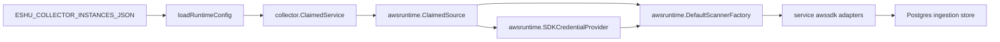

# AWS Cloud Collector Command

## Purpose

`cmd/collector-aws-cloud` runs the AWS cloud collector process in one of two
modes selected by `-mode` (default `claimed-live`):

- **`claimed-live`** (default) runs the claim-aware collector. It loads an AWS
  collector instance from `ESHU_COLLECTOR_INSTANCES_JSON`, claims bounded
  `(account_id, region, service_kind)` work items, obtains claim-scoped AWS
  credentials, scans the requested AWS service, records scanner-side status, and
  commits reported facts through the shared ingestion store. A commit wrapper
  records whether the fenced fact transaction reached durable storage.
- **`fixture`** runs a fully offline replay. It loads a declarative fixture
  estate from `-config` and constructs an `awsruntime.FixtureSource` that emits
  the same `aws_resource` / `aws_relationship` facts as the live scanners, with
  **no AWS credentials and no network calls**, committed through the shared
  ingestion store. Used for demos and CI (see
  `scripts/verify_aws_runtime_drift_compose.sh`).

```bash
# Offline replay (no credentials); the installed binary is eshu-collector-aws-cloud:
eshu-collector-aws-cloud -mode fixture \
  -config go/cmd/collector-aws-cloud/testdata/fixture-estate.json
```

`-config` is required in fixture mode and rejected in claimed-live mode. Fixture
mode needs no redaction key.

## Ownership boundary

This command owns process startup, environment parsing, telemetry registration,
and claim-aware runner wiring. It does not own AWS
credential acquisition, service scanner selection, SDK pagination, workflow row
persistence, graph writes, reducer admission, or workload ownership inference.



## Exported surface

This is a command package. The public contract is the process entrypoint and
the environment/configuration it accepts:

- `ESHU_COLLECTOR_INSTANCES_JSON` - declarative collector instance list.
- `ESHU_AWS_COLLECTOR_INSTANCE_ID` - required when more than one AWS collector
  instance is configured.
- `ESHU_AWS_COLLECTOR_POLL_INTERVAL` - idle poll interval.
- `ESHU_AWS_COLLECTOR_CLAIM_LEASE_TTL` - workflow claim lease duration.
- `ESHU_AWS_COLLECTOR_HEARTBEAT_INTERVAL` - heartbeat cadence; must be less
  than the lease TTL.
- `ESHU_AWS_COLLECTOR_OWNER_ID` - optional owner ID override; defaults to
  `HOSTNAME`, then `collector-aws-cloud`.
- `ESHU_AWS_REDACTION_KEY` - required when any target scope enables a scanner
  that declared `RequiresRedactionKey: true` in its `runtimebind` registration.
  The command derives this set from `awsruntime.ServiceKindsRequiringRedactionKey()`
  rather than a hardcoded list, and the missing-key error names the current
  set. Those scanners use the key to produce deterministic HMAC-SHA256 markers
  for sensitive-derived fields before persistence (for example, CloudWatch alarm
  metric dimension values whose names look like customer tags route through the
  shared redact library).

Instance configuration uses:

```json
{
  "target_scopes": [
    {
      "account_id": "123456789012",
      "allowed_regions": ["us-east-1", "aws-global"],
      "allowed_services": ["iam", "ecr", "ecs", "ec2", "elbv2", "lambda", "eks", "route53", "sqs", "sns", "eventbridge", "guardduty", "s3", "rds", "redshift", "dynamodb", "cloudwatch", "cloudwatchlogs", "cloudfront", "apigateway", "secretsmanager", "ssm", "athena", "securityhub", "glue", "elasticache", "msk", "stepfunctions", "accessanalyzer", "organizations"],
      "max_concurrent_claims": 1,
      "credentials": {
        "mode": "central_assume_role",
        "role_arn": "arn:aws:iam::123456789012:role/eshu-readonly",
        "external_id": "external-1"
      }
    }
  ]
}
```

`local_workload_identity` is also valid and uses the local AWS SDK credential
chain. Static credential fields are rejected during config parsing.
`central_assume_role` requires an external ID, and the role ARN's account must
match the target `account_id`. `local_workload_identity` must not set
`role_arn` or `external_id`.

## Dependencies

- `internal/collector` for the claim-aware collector runner.
- `internal/collector/awscloud/awsruntime` for claim parsing, credentials,
  scanner registry, and collected generation construction.
- `internal/storage/postgres` for workflow claims, ingestion commits, AWS scan
  status rows, and status reports.

## Telemetry

The command registers the shared data-plane telemetry instruments and emits:

- `eshu_dp_aws_api_calls_total`
- `eshu_dp_aws_throttle_total`
- `eshu_dp_aws_assumerole_failed_total`
- `eshu_dp_aws_budget_exhausted_total`
- `eshu_dp_aws_pagination_checkpoint_events_total`
- `eshu_dp_aws_claim_concurrency`
- `eshu_dp_aws_resources_emitted_total`
- `eshu_dp_aws_relationships_emitted_total`
- `eshu_dp_aws_tag_observations_emitted_total`
- `eshu_dp_aws_org_access_skipped_total`
- `eshu_dp_aws_scan_duration_seconds`
- `aws.collector.claim.process`
- `aws.credentials.assume_role`
- `aws.service.scan`
- `aws.service.pagination.page`

The claim concurrency gauge is backed by the runtime's per-account limiter.

## Gotchas / invariants

- The command never accepts static access-key fields in collector instance
  configuration.
- `central_assume_role` must include `role_arn` and `external_id`; the role ARN
  account must match the target `account_id`.
- `local_workload_identity` rejects `role_arn` and `external_id` so local and
  central credential routing cannot be mixed.
- Wildcard regions or services are rejected; `allowed_services` must name a
  shipped AWS scanner family.
- AWS SDK configuration and service pagination live under `awsruntime` and
  service `awssdk` adapters; command tests should not mock the full AWS SDK
  surface.
- Credential leases are released after scanner construction and service scan.
- A target requires `ESHU_AWS_REDACTION_KEY` when any of its allowed scanners
  declared `RequiresRedactionKey: true` in its `runtimebind` registration; the
  command derives the set from `awsruntime.ServiceKindsRequiringRedactionKey()`.
  Metadata-only targets such as IAM and ECR leave the flag unset and do not need
  the key. CloudWatch, for example, needs it because alarm metric dimension
  values can be customer-tag-named and are redacted before persistence.
- ELBv2 targets emit stable routing topology and intentionally exclude target
  health status.
- Route 53 targets emit hosted-zone resources and A/AAAA/CNAME/ALIAS DNS record
  facts. Use a global region label such as `aws-global` when scheduling Route
  53 claims.
- EC2 targets emit VPC, subnet, security-group, security-group-rule, and ENI
  network-topology facts. They intentionally do not emit EC2 instance
  inventory.
- Lambda targets emit function, alias, event-source mapping, image URI,
  execution-role, subnet, and security-group evidence. They intentionally do
  not fetch function code or persist presigned package download URLs.
- SQS targets emit queue metadata and reported dead-letter queue relationships.
  They intentionally do not read messages, mutate queues, or persist queue
  policy JSON.
- SNS targets emit topic metadata and ARN-addressable subscription
  relationships. They intentionally do not publish messages, mutate
  subscriptions, persist topic policy JSON, persist data-protection-policy JSON,
  or persist raw email, SMS, HTTP, or HTTPS subscription endpoints.
- EventBridge targets emit event bus metadata, rule metadata, rule-to-bus
  relationships, and ARN-addressable target relationships. They intentionally do
  not put events, mutate rules or targets, persist event bus policy JSON,
  persist target input payload fields, persist input transformers, persist HTTP
  target parameters, or persist raw non-ARN target identities.
- GuardDuty targets emit detector, member account, filter-name, publishing
  destination, threat intel set, IP set, and aggregate finding-count metadata.
  They intentionally do not read finding bodies, filter criteria expressions,
  threat intel set list contents, IP set list contents, or call GuardDuty
  mutation APIs.
- S3 targets emit bucket metadata and reported server-access-log target bucket
  relationships. They intentionally do not read objects, list object keys,
  mutate buckets, persist bucket policy JSON, persist ACL grants, persist
  replication rules, persist lifecycle rules, persist notification
  configuration, or persist inventory, analytics, or metrics configuration.
- RDS targets emit DB instance, DB cluster, and DB subnet group metadata plus
  reported cluster membership, subnet group, security group, KMS key, monitoring
  role, IAM role, parameter group, and option group relationships. They
  intentionally do not connect to databases, read snapshots, read log contents,
  read Performance Insights samples, discover schemas or tables, or mutate RDS
  resources.
- Redshift targets emit provisioned cluster, cluster parameter group, cluster
  subnet group, cluster snapshot, scheduled action, Serverless namespace, and
  Serverless workgroup metadata plus reported VPC, subnet group, security
  group, KMS key, IAM role, parameter group, snapshot source cluster,
  scheduled action target cluster, and namespace-to-workgroup relationships.
  They intentionally do not open warehouse connections, run queries, read
  table or row data, read snapshot contents, persist master user passwords,
  master user names, admin passwords, admin user names, master password
  secret ARNs, target-action JSON payloads, or mutate Redshift / Redshift
  Serverless resources.
- DynamoDB targets emit table metadata plus directly reported KMS key
  relationships. They intentionally do not read items, scan or query tables,
  read stream records, fetch backup/export payloads, fetch resource policies,
  run PartiQL, or mutate DynamoDB resources.
- CloudWatch Logs targets emit log group metadata plus directly reported KMS
  key relationships. They intentionally do not read log events, log stream
  payloads, run Insights queries, fetch export payloads, persist resource
  policies or subscription payloads, or mutate CloudWatch Logs resources.
- CloudFront targets emit distribution metadata plus directly reported ACM
  certificate and WAF web ACL relationships. They intentionally do not read
  objects, origin payloads, distribution config payloads, policy documents,
  certificate bodies, private keys, origin custom header values, or mutate
  CloudFront resources.
- API Gateway targets emit REST, HTTP, WebSocket, stage, custom-domain,
  mapping, access-log destination, ACM certificate, and ARN-addressable
  integration metadata. They intentionally do not execute APIs, export APIs,
  read API keys, read authorizer secrets, persist policy JSON, persist
  integration credentials, persist stage variable values, persist template
  bodies, read payloads, or mutate API Gateway resources.
- Secrets Manager targets emit secret metadata plus directly reported KMS key
  and rotation Lambda relationships. They intentionally do not read secret
  values, read version payloads, persist resource policy JSON, persist external
  rotation partner metadata, persist external rotation role ARNs, or mutate
  Secrets Manager resources.
- SSM targets emit Parameter Store metadata plus directly reported KMS key
  relationships. They intentionally do not read parameter values, read history
  values, persist raw descriptions, persist raw allowed patterns, persist raw
  policy JSON, decrypt SecureString content, or mutate SSM resources.
- Athena targets emit workgroup, data catalog, prepared-statement, and
  named-query metadata plus workgroup-to-S3-result-bucket,
  workgroup-to-KMS-key, prepared-statement-to-workgroup, and
  named-query-to-workgroup relationships when AWS reports the matching
  identities. They intentionally do not start, stop, or mutate queries, do not
  read query result rows, do not read query result location object contents,
  do not persist named-query SQL bodies, do not persist prepared-statement
  query bodies, and do not persist query history strings.
- Security Hub targets emit hub configuration, enabled standards, controls,
  member accounts, custom action targets, insight summaries, and aggregate
  finding-count facts. They intentionally do not persist finding bodies,
  resource details, remediation text, notes, product fields, user-defined
  fields, network/process details, insight filters, or mutate Security Hub
  resources.
- Glue targets emit Data Catalog database, table, crawler, job, trigger,
  workflow, and connection metadata plus reported table-in-database,
  table-to-S3-location, crawler-to-database, crawler-to-IAM-role,
  job-to-IAM-role, and trigger-to-job relationships. They intentionally do
  not run jobs, start crawlers, mutate Data Catalog state, read job script
  bodies, persist job default-argument values, persist secret-shaped
  argument keys, persist connection passwords (the adapter calls
  GetConnections with HidePassword=true), persist connection property
  values, persist JDBC credential URLs, persist workflow graph payloads (the
  adapter calls GetWorkflow with IncludeGraph=false), persist table
  column statistics with sample values, or persist classifier custom
  patterns.
- ElastiCache targets emit cache cluster, replication group, parameter group,
  subnet group, user, and user group metadata, snapshot metadata
  (name/source/status only), and directly reported cluster-to-VPC,
  cluster-to-subnet, cluster-to-KMS, replication-group-to-cluster, and
  user-group-to-user relationships. They intentionally do not read cache keys
  or values, persist AUTH token values, persist user passwords, persist user
  access strings, persist snapshot data, or mutate ElastiCache resources.
- Step Functions targets emit state machine metadata, activity metadata,
  state-machine-to-IAM-role relationships, and state-machine-to-referenced-resource
  relationships for ARN-shaped Task targets. They intentionally do not start,
  stop, send to, create, update, or delete Step Functions resources, and they
  intentionally do not persist execution input, execution output, execution
  history events, activity task tokens, or literal
  Parameters/ResultPath/ResultSelector/InputPath/OutputPath/Result contents from
  the state machine definition; only state names, state types, transitions, and
  Task Resource ARNs are persisted.
- Access Analyzer targets emit analyzer metadata, archive-rule names,
  aggregate finding counts, analyzer relationships, and per-resource
  unused-access last-accessed summaries. They intentionally do not persist
  external finding bodies, archive-rule filter criteria, policy-generation
  output, per-action unused-access details, or mutate Access Analyzer
  resources.
- Organizations targets emit organization root, OU, account, policy-summary,
  policy-target, and delegated-administrator metadata. They intentionally do not
  read policy document bodies, mutate accounts, mutate policies, mutate
  delegated administrators, or change service access. Organizations API calls
  use the `us-east-1` control-plane endpoint, and non-org-aware credentials emit
  an org-access-skipped warning/status/metric instead of partial facts.
- The acceptance unit ID must be JSON with `account_id`, `region`, and
  `service_kind`.
- `/admin/status` includes per `(account_id, region, service_kind)` AWS scan
  status, commit status, API call count, throttle count, and outstanding
  warning class when the data-plane schema includes `aws_scan_status`.

## Related docs

- `docs/public/services/collector-aws-cloud.md`
- `docs/public/guides/collector-authoring.md`
- `docs/public/reference/telemetry/index.md`

## No-Regression Evidence:

No-Regression Evidence: the only change to this package in this PR is an
import-order reordering (cassette import moved after awscloud import to
satisfy gofumpt alphabetical order). No runtime logic, no new code paths,
no query or concurrency changes. The import order does not affect binary
behaviour.

## No-Observability-Change:

No-Observability-Change: import-order fix only; no new metrics, spans,
or log lines introduced.
