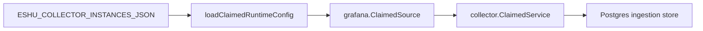

# collector-grafana

`collector-grafana` is the hosted live Grafana metadata collector. It selects an
enabled, claim-capable `grafana` collector instance from
`ESHU_COLLECTOR_INSTANCES_JSON`, claims Grafana target work, reads bounded
folder, dashboard, datasource, and alert-rule metadata, and commits
`observability.*` source facts.



Grafana tokens are referenced by `token_env`. The runtime resolves the token in
process memory and never persists the value in facts, status, logs, or metric
labels. Source-controlled IaC/GitOps evidence remains preferred when current;
live Grafana facts are fallback and validation evidence.

## Environment

| Variable | Purpose |
| --- | --- |
| `ESHU_COLLECTOR_INSTANCES_JSON` | Desired collector instances with one enabled `grafana` instance. |
| `ESHU_GRAFANA_COLLECTOR_INSTANCE_ID` | Required when more than one enabled Grafana instance exists. |
| `ESHU_GRAFANA_COLLECTOR_POLL_INTERVAL` | Delay between empty claim polls. Defaults to `1s`. |
| `ESHU_GRAFANA_COLLECTOR_CLAIM_LEASE_TTL` | Lease TTL for workflow claims. |
| `ESHU_GRAFANA_COLLECTOR_HEARTBEAT_INTERVAL` | Heartbeat interval; must be less than the lease TTL. |
| `ESHU_GRAFANA_COLLECTOR_OWNER_ID` | Optional claim owner label. |

Target shape:

```json
{
  "provider": "grafana",
  "scope_id": "grafana:prod",
  "instance_id": "prod",
  "base_url": "https://grafana.example.test",
  "token_env": "GRAFANA_TOKEN",
  "resource_limit": 100,
  "stale_after": "24h",
  "declared_uids": ["dashboard-uid"],
  "observed_only_hint": true,
  "enabled": true
}
```

## Telemetry

The binary exposes `/healthz`, `/readyz`, `/metrics`, and `/admin/status`
through the shared hosted runtime. Provider request counters, emitted fact
counters, rate-limit counters, retries, redactions, and fetch duration use the
shared collector instruments.

## Related Docs

- `go/internal/collector/grafana/README.md`
- `docs/public/reference/environment-collectors.md`
- `docs/public/deployment/service-runtimes-collectors.md`
