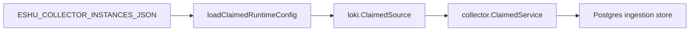

# collector-loki

`collector-loki` is the hosted live Loki log-signal metadata collector. It
selects an enabled, claim-capable `loki` collector instance from
`ESHU_COLLECTOR_INSTANCES_JSON`, claims Loki target work, reads bounded label,
allowlisted label-value, series, and ruler-rule metadata, and commits
`observability.*` source facts.



`token_env` is optional because some Loki endpoints are unauthenticated. When
configured, it must resolve to a non-empty secret. `tenant_id_env` is also
optional and overrides `tenant_id` when set. Source-controlled IaC/GitOps
evidence remains preferred when current; live Loki facts are fallback and
validation evidence.

## Environment

| Variable | Purpose |
| --- | --- |
| `ESHU_COLLECTOR_INSTANCES_JSON` | Desired collector instances with one enabled `loki` instance. |
| `ESHU_LOKI_COLLECTOR_INSTANCE_ID` | Required when more than one enabled Loki instance exists. |
| `ESHU_LOKI_COLLECTOR_POLL_INTERVAL` | Delay between empty claim polls. Defaults to `1s`. |
| `ESHU_LOKI_COLLECTOR_CLAIM_LEASE_TTL` | Lease TTL for workflow claims. |
| `ESHU_LOKI_COLLECTOR_HEARTBEAT_INTERVAL` | Heartbeat interval; must be less than the lease TTL. |
| `ESHU_LOKI_COLLECTOR_OWNER_ID` | Optional claim owner label. |

Target shape:

```json
{
  "scope_id": "loki:tenant:prod",
  "instance_id": "prod",
  "base_url": "https://loki.example.test",
  "path_prefix": "/loki",
  "token_env": "LOKI_TOKEN",
  "tenant_id_env": "LOKI_TENANT",
  "label_value_names": ["app"],
  "series_matchers": ["{app=~\".+\"}"],
  "resource_limit": 100,
  "stale_after": "24h",
  "declared_ids": ["rule/HighErrors"],
  "observed_only_hint": true,
  "enabled": true
}
```

## Telemetry

The binary exposes `/healthz`, `/readyz`, `/metrics`, and `/admin/status`
through the shared hosted runtime. Provider request counters, emitted fact
counters, rate-limit counters, retries, redactions, stale counters, rejected
high-cardinality counters, and fetch duration use the shared collector
instruments.

## Related Docs

- `go/internal/collector/loki/README.md`
- `docs/public/reference/environment-collectors.md`
- `docs/public/deployment/service-runtimes-collectors.md`
