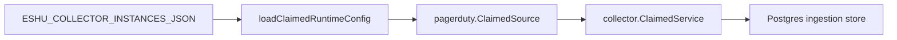

# collector-pagerduty

`collector-pagerduty` runs hosted PagerDuty incident-context collection. It
selects a `pagerduty` collector instance from `ESHU_COLLECTOR_INSTANCES_JSON`,
resolves explicit credential environment references, and hands claimed work to
`pagerduty.ClaimedSource`.

Configuration requires one or more targets with `provider="pagerduty"`,
`scope_id`, `account_id`, and `token_env`. Optional target fields bound request
work with `incident_lookback`, `incident_limit`, `log_entry_limit`,
`change_event_limit`, and `allowed_service_ids`.

The token value is read only inside this process and is never copied into
workflow run metadata, facts, metric labels, logs, or status errors.

Observability Evidence: the binary exposes the shared hosted status/admin
server plus Prometheus metrics for provider requests, emitted facts,
rate-limit events, fetch duration, and generation lag through
`telemetry.Instruments`.
