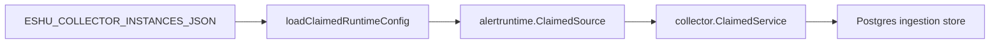

# collector-security-alerts

`collector-security-alerts` runs hosted provider security-alert collection. It
selects a `security_alert` collector instance from `ESHU_COLLECTOR_INSTANCES_JSON`,
resolves explicit credential environment references, and hands claimed work to
`alertruntime.ClaimedSource`.

Configuration requires a repository allowlist and a token env reference per
target. The token value is read only inside this process and is never copied
into workflow run metadata.

`--preflight-provider-access` runs a one-shot provider access check using the
same collector instance JSON, token env resolution, allowlist validation, and
provider client as the hosted runtime. The preflight makes at most one bounded
request per configured target, prints only a generic success line, and returns
sanitized failure classes such as `auth_denied` without opening Postgres or
claiming workflow work.

Observability Evidence: the binary exposes the shared hosted status/admin
server plus Prometheus metrics for provider requests, emitted facts, rate-limit
events, and fetch duration through `telemetry.Instruments`.

No-Regression Evidence: `TestRunProviderAccessPreflightReportsSanitizedAuthDenied`
proves the binary preflight resolves the same private token env, asks the
runtime for one provider page, and returns an `auth_denied` failure without
leaking token or repository values.
