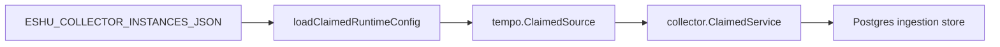

# collector-tempo

`collector-tempo` is the hosted live Tempo trace-signal metadata collector. It
selects an enabled, claim-capable `tempo` collector instance from
`ESHU_COLLECTOR_INSTANCES_JSON`, claims Tempo target work, reads bounded tag and
freshness metadata, and commits `observability.*` source facts.



`token_env` is optional because some Tempo endpoints are unauthenticated. When
configured, it must resolve to a non-empty secret. `tenant_id_env` is also
optional and overrides `tenant_id` when set. Source-controlled IaC/GitOps
evidence remains preferred when current; live Tempo facts are fallback and
validation evidence.

## Environment

| Variable | Purpose |
| --- | --- |
| `ESHU_COLLECTOR_INSTANCES_JSON` | Desired collector instances with one enabled `tempo` instance. |
| `ESHU_TEMPO_COLLECTOR_INSTANCE_ID` | Required when more than one enabled Tempo instance exists. |
| `ESHU_TEMPO_COLLECTOR_POLL_INTERVAL` | Delay between empty claim polls. Defaults to `1s`. |
| `ESHU_TEMPO_COLLECTOR_CLAIM_LEASE_TTL` | Lease TTL for workflow claims. |
| `ESHU_TEMPO_COLLECTOR_HEARTBEAT_INTERVAL` | Heartbeat interval; must be less than the lease TTL. |
| `ESHU_TEMPO_COLLECTOR_OWNER_ID` | Optional claim owner label. |

Target shape:

```json
{
  "scope_id": "tempo:tenant:prod",
  "instance_id": "prod",
  "base_url": "https://tempo.example.test",
  "path_prefix": "/tempo",
  "token_env": "TEMPO_TOKEN",
  "tenant_id_env": "TEMPO_TENANT",
  "tag_value_names": ["resource.service.name"],
  "max_tag_values_per_tag": 20,
  "resource_limit": 100,
  "lookback": "1h",
  "freshness_probe_enabled": true,
  "declared_ids": ["tag/resource.service.name"],
  "observed_only_hint": true,
  "enabled": true
}
```

## Telemetry

The binary exposes `/healthz`, `/readyz`, `/metrics`, and `/admin/status`
through the shared hosted runtime. Provider request counters, emitted fact
counters, rate-limit counters, retries, redactions, stale counters, rejected
high-cardinality counters, and fetch duration use the shared collector
instruments.

## Related Docs

- `go/internal/collector/tempo/README.md`
- `docs/public/reference/environment-collectors.md`
- `docs/public/deployment/service-runtimes-collectors.md`
