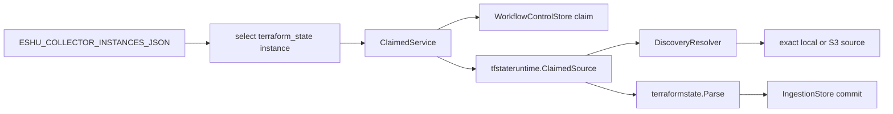

# Terraform State Collector Runtime

`collector-terraform-state` is the long-running Terraform-state worker. It does
not decide what work exists. The workflow coordinator reconciles collector
instances and creates claimable work items; this runtime claims only
`terraform_state` items for one configured instance, reads the exact state
source, parses evidence, and commits facts through the normal ingestion
boundary.

## Runtime Flow



## Required Configuration

- `ESHU_POSTGRES_DSN`, or the split `ESHU_FACT_STORE_DSN` /
  `ESHU_CONTENT_STORE_DSN` settings used by the shared Postgres runtime loader.
- `ESHU_COLLECTOR_INSTANCES_JSON` with one enabled `terraform_state` instance
  where `claims_enabled` is `true`.
- `ESHU_TFSTATE_REDACTION_KEY`, a deployment-scoped secret used to produce
  deterministic redaction markers.

Set `ESHU_TFSTATE_COLLECTOR_INSTANCE_ID` when more than one enabled
Terraform-state collector instance exists. Set `ESHU_TFSTATE_COLLECTOR_OWNER_ID`
when a stable operator-readable owner name is useful in claim rows; otherwise
the runtime uses host and process identity.

## Optional Controls

- `ESHU_TFSTATE_COLLECTOR_POLL_INTERVAL` defaults to `1s`.
- `ESHU_TFSTATE_COLLECTOR_CLAIM_LEASE_TTL` defaults to the workflow claim lease.
- `ESHU_TFSTATE_COLLECTOR_HEARTBEAT_INTERVAL` controls claim heartbeats. The
  older `ESHU_TFSTATE_COLLECTOR_HEARTBEAT` alias is still accepted.
- `ESHU_TFSTATE_SOURCE_MAX_BYTES` sets the max bytes per state object. The
  reader default is used when this is unset or zero.

S3 reads use the default AWS credential chain unless the collector instance
configuration includes `aws.role_arn`, in which case the runtime assumes that
role before issuing read-only `GetObject` requests.

For S3 backends that use Terraform's DynamoDB lock table, set
`dynamodb_table` on the exact S3 seed or let graph discovery read the literal
`dynamodb_table` from the committed backend block. A top-level
`aws.dynamodb_table` is accepted as a fallback for older seed config, but
backend-specific values win.

Graph-backed discovery is repo-scoped in this slice. When `discovery.graph` is
`true`, include at least one `discovery.local_repos` entry so the resolver knows
which committed Git backend facts it is allowed to read.

## Operator Signals

Use `eshu_dp_tfstate_claim_wait_seconds` to see whether work is backing up
before the collector starts a claim. Once a claim starts, the runtime emits
Terraform-state source, parse, resource, redaction, and S3 not-modified metrics
with bounded labels only. Do not log or trace raw state locators, bucket names,
keys, local paths, or work item IDs. Use backend kind, result, claim/run
correlation, and the locator hash emitted in Terraform-state facts when you
need to investigate a specific source.

The main trace spans are `tfstate.source.open`, `tfstate.parser.stream`, and
`tfstate.fact.emit_batch`.

## Example Instance

```json
[
  {
    "instance_id": "terraform-state-prod",
    "collector_kind": "terraform_state",
    "mode": "continuous",
    "enabled": true,
    "claims_enabled": true,
    "display_name": "Terraform State Prod",
    "configuration": {
      "aws": {
        "role_arn": "arn:aws:iam::123456789012:role/eshu-tfstate-read"
      },
      "discovery": {
        "graph": true,
        "local_repos": ["platform-infra"],
        "seeds": [
          {
            "kind": "s3",
            "bucket": "company-terraform-state",
            "key": "prod/app/terraform.tfstate",
            "region": "us-east-1",
            "dynamodb_table": "company-terraform-locks"
          }
        ]
      }
    }
  }
]
```

The runtime opens only exact sources from config or Git-observed backend facts.
It does not scan buckets, infer local state files, or write Terraform state.
