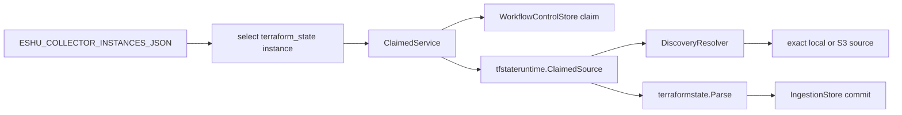

# Terraform State Collector Runtime

`collector-terraform-state` is the long-running Terraform-state worker. It does
not decide what work exists. The workflow coordinator reconciles collector
instances and creates claimable work items; this runtime claims only
`terraform_state` items for one configured instance, reads the exact state
source, parses evidence, and commits facts through the normal ingestion
boundary.

## Runtime Flow



## Required Configuration

- `ESHU_POSTGRES_DSN`, or the split `ESHU_FACT_STORE_DSN` /
  `ESHU_CONTENT_STORE_DSN` settings used by the shared Postgres runtime loader.
- `ESHU_COLLECTOR_INSTANCES_JSON` with one enabled `terraform_state` instance
  where `claims_enabled` is `true`.
- `ESHU_TFSTATE_REDACTION_KEY`, a deployment-scoped secret used to produce
  deterministic redaction markers.
- `ESHU_TFSTATE_REDACTION_RULESET_VERSION`, a non-empty version string for the
  redaction rule set the collector applies to every parsed attribute. The
  binary refuses to start when this is blank because `redact.RuleSet` fails
  closed on an empty version (scalar attributes get redacted, composites get
  dropped). Audit evidence references this string to prove which policy
  version produced each decision. When the version is non-empty AND a
  provider-schema resolver covers a composite, the parser's streaming
  nested walker captures the value so drift detection can compare config
  and state side-by-side; uncovered composites still drop and increment
  `eshu_dp_drift_schema_unknown_composite_total`.

Set `ESHU_TFSTATE_COLLECTOR_INSTANCE_ID` when more than one enabled
Terraform-state collector instance exists. Set `ESHU_TFSTATE_COLLECTOR_OWNER_ID`
when a stable operator-readable owner name is useful in claim rows; otherwise
the runtime uses host and process identity.

## Optional Controls

- `ESHU_TFSTATE_COLLECTOR_POLL_INTERVAL` defaults to `1s`.
- `ESHU_TFSTATE_COLLECTOR_CLAIM_LEASE_TTL` defaults to the workflow claim lease.
- `ESHU_TFSTATE_COLLECTOR_HEARTBEAT_INTERVAL` controls claim heartbeats. The
  older `ESHU_TFSTATE_COLLECTOR_HEARTBEAT` alias is still accepted.
- `ESHU_TFSTATE_SOURCE_MAX_BYTES` sets the max bytes per state object. The
  reader default is used when this is unset or zero.
- `ESHU_TFSTATE_REDACTION_SENSITIVE_KEYS` is a comma-separated list of leaf
  attribute keys the redactor treats as secrets. When unset the collector
  uses `defaultRedactionSensitiveKeys` in `config.go` (`password`, `secret`,
  `token`, `access_key`, `private_key`, `certificate`, `key_pair`).

S3 reads use the default AWS credential chain unless the collector instance
configuration includes `aws.role_arn`, in which case the runtime assumes that
role before issuing read-only `GetObject` requests. New deployments should use
`target_scopes` instead. A central AWS scope uses `central_assume_role` with an
optional `external_id`; an account-local scope uses the default workload
identity in that account. The runtime can route different state candidates to
different target-scope credentials. Explicit seeds carry `target_scope_id`;
graph-discovered S3 candidates are routed by the configured backend and region
allowlists, and ambiguous matches fail before the object is opened. The legacy
`aws.role_arn` field still works, but it cannot be mixed with `target_scopes`.

For S3 backends that use Terraform's DynamoDB lock table, set
`dynamodb_table` on the exact S3 seed or let graph discovery read the literal
`dynamodb_table` from the committed backend block. A top-level
`aws.dynamodb_table` is accepted as a fallback for older seed config, but
backend-specific values win.

Graph-backed discovery is repo-scoped in this slice. When `discovery.graph` is
`true`, include at least one `discovery.local_repos` entry so the resolver knows
which committed Git backend facts it is allowed to read.

The Git collector records repo-local `.tfstate` files as safe
`terraform_state_candidate` metadata. That does not make them readable by the
Terraform-state runtime. Local candidates stay discover-only unless the
instance config sets `discovery.local_state_candidates.mode` to
`approved_candidates` and lists the exact `repo_id` plus repo-relative `path`.
An approved entry may also include `target_scope_id` when the operator wants
that local state tied to a target scope for policy and routing context. If it
does not, the runtime treats the local file as a local read and does not require
AWS credential routing. Approved Git-local state emits a
`terraform_state_warning` with `warning_kind=state_in_vcs`.

## Operator Signals

Use `eshu_dp_tfstate_claim_wait_seconds` to see whether work is backing up
before the collector starts a claim. Once a claim starts, the runtime emits
Terraform-state source, parse, resource, redaction, and S3 not-modified metrics
with bounded labels only. Do not log or trace raw state locators, bucket names,
keys, local paths, or work item IDs. Use backend kind, result, claim/run
correlation, and the locator hash emitted in Terraform-state facts when you
need to investigate a specific source.

`eshu_dp_tfstate_schema_resolver_entries` reports the number of Terraform
resource types the loaded provider-schema bundle covers. The bundle is loaded
once at startup and held for the lifetime of the process — operators size the
collector pod's memory request against this value plus the steady-state parse
footprint. The gauge registers only when the configured resolver implements
the optional `SchemaResolverEntryCounter` capability; the production resolver
loaded from `terraformschema.EmbeddedSchemasFS` always does.

The main trace spans are `tfstate.source.open`, `tfstate.parser.stream`, and
`tfstate.fact.emit_batch`.

## Example Instance

```json
[
  {
    "instance_id": "terraform-state-prod",
    "collector_kind": "terraform_state",
    "mode": "continuous",
    "enabled": true,
    "claims_enabled": true,
    "display_name": "Terraform State Prod",
    "configuration": {
      "target_scopes": [
        {
          "target_scope_id": "aws-prod",
          "provider": "aws",
          "deployment_mode": "central",
          "credential_mode": "central_assume_role",
          "role_arn": "arn:aws:iam::123456789012:role/eshu-tfstate-read",
          "external_id": "external-123",
          "allowed_regions": ["us-east-1"],
          "allowed_backends": ["s3", "local"]
        }
      ],
      "discovery": {
        "graph": true,
        "local_repos": ["platform-infra"],
        "local_state_candidates": {
          "mode": "approved_candidates",
          "approved": [
            {
              "repo_id": "platform-infra",
              "path": "env/prod/terraform.tfstate",
              "target_scope_id": "aws-prod"
            }
          ]
        },
        "seeds": [
          {
            "kind": "s3",
            "target_scope_id": "aws-prod",
            "bucket": "company-terraform-state",
            "key": "prod/app/terraform.tfstate",
            "region": "us-east-1",
            "dynamodb_table": "company-terraform-locks"
          }
        ]
      }
    }
  }
]
```

The runtime opens only exact sources from config, Git-observed backend facts, or
approved Git-local candidate metadata. It does not scan buckets, read
unapproved local state, or write Terraform state.
