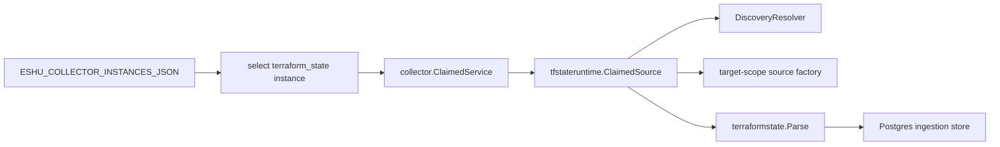

# Terraform State Collector Command

## Purpose

`cmd/collector-terraform-state` builds the
`eshu-collector-terraform-state` process. The command loads one claim-capable
Terraform-state collector instance, opens the shared Postgres runtime, wires
discovery and source readers, starts the hosted admin/status server, and exits
on `SIGINT` or `SIGTERM`.

## Ownership boundary

This command owns process startup, environment parsing, target-scope credential
routing, S3 and DynamoDB adapter wiring, provider-schema resolver loading,
telemetry registration, and claim runner construction. It does not own
Terraform JSON parsing rules, workflow claim storage, graph writes, reducer
admission, or drift truth.



## Exported surface

This is a `package main` binary. Its public contract is the process entrypoint,
`--version` / `-v`, and accepted environment:

- `ESHU_COLLECTOR_INSTANCES_JSON`
- `ESHU_TFSTATE_COLLECTOR_INSTANCE_ID`
- `ESHU_TFSTATE_COLLECTOR_OWNER_ID`
- `ESHU_TFSTATE_COLLECTOR_POLL_INTERVAL`
- `ESHU_TFSTATE_COLLECTOR_CLAIM_LEASE_TTL`
- `ESHU_TFSTATE_COLLECTOR_HEARTBEAT_INTERVAL`
- `ESHU_TFSTATE_COLLECTOR_HEARTBEAT`
- `ESHU_TFSTATE_REDACTION_KEY`
- `ESHU_TFSTATE_REDACTION_RULESET_VERSION`
- `ESHU_TFSTATE_REDACTION_SENSITIVE_KEYS`
- `ESHU_TFSTATE_SOURCE_MAX_BYTES`
- `ESHU_TERRAFORM_SCHEMA_DIR`
- shared Postgres, OTEL, metrics, and `ESHU_PPROF_ADDR` runtime env

The selected instance must be enabled, use `collector_kind="terraform_state"`,
and set `claims_enabled=true`.

## Dependencies

- `internal/app` for the hosted service and status server.
- `internal/collector` for the claim-aware runner.
- `internal/collector/terraformstate` for discovery config, provider-schema
  resolver loading, parsing, redaction, and fact envelopes.
- `internal/collector/tfstateruntime` for claim-to-candidate matching, source
  opening, snapshot identity, and parser handoff.
- `internal/storage/postgres` for workflow claims, ingestion commits, discovery
  reads, prior snapshot reads, and status reports.
- `internal/telemetry` for metrics, traces, logs, and Prometheus wiring.

## Telemetry

The command registers the shared data-plane instruments plus Terraform-state
collector signals, including:

- `eshu_dp_tfstate_claim_wait_seconds`
- `eshu_dp_tfstate_discovery_candidates_total`
- `eshu_dp_tfstate_snapshots_observed_total`
- `eshu_dp_tfstate_snapshot_bytes`
- `eshu_dp_tfstate_parse_duration_seconds`
- `eshu_dp_tfstate_resources_emitted_total`
- `eshu_dp_tfstate_outputs_emitted_total`
- `eshu_dp_tfstate_modules_emitted_total`
- `eshu_dp_tfstate_warnings_emitted_total`
- `eshu_dp_tfstate_redactions_applied_total`
- `eshu_dp_tfstate_s3_conditional_get_not_modified_total`
- `eshu_dp_tfstate_schema_resolver_entries`
- `tfstate.collector.claim.process`
- `tfstate.discovery.resolve`
- `tfstate.source.open`
- `tfstate.parser.stream`
- `tfstate.fact.emit_batch`

The hosted runtime also mounts `/healthz`, `/readyz`, `/metrics`, and
`/admin/status`.

## Gotchas / invariants

- The command selects exactly one enabled claim-capable `terraform_state`
  instance. Set `ESHU_TFSTATE_COLLECTOR_INSTANCE_ID` when more than one exists.
- `ESHU_TFSTATE_REDACTION_KEY` and
  `ESHU_TFSTATE_REDACTION_RULESET_VERSION` are mandatory. Blank rule-set
  versions fail startup.
- `ESHU_TFSTATE_COLLECTOR_HEARTBEAT_INTERVAL` wins over the legacy
  `ESHU_TFSTATE_COLLECTOR_HEARTBEAT` alias when both are set.
- The heartbeat interval must be less than the claim lease TTL.
- Negative `ESHU_TFSTATE_SOURCE_MAX_BYTES` values fail startup.
- Provider schemas load once at startup. `ESHU_TERRAFORM_SCHEMA_DIR` overrides
  the packaged schema directory.
- The runtime opens only exact sources from config, indexed backend facts, or
  approved Git-local candidate metadata. It does not scan buckets or read
  unapproved repo-local `.tfstate` files.
- The legacy top-level `aws.role_arn` path still works for one AWS identity but
  cannot be mixed with `target_scopes`.

## Focused tests

```bash
cd go
go test ./cmd/collector-terraform-state -count=1
go test ./internal/collector/terraformstate ./internal/collector/tfstateruntime -count=1
```

## Related docs

- `docs/public/services/collector-terraform-state.md`
- `docs/public/services/collector-terraform-state-config.md`
- `docs/public/services/collector-terraform-state-operations.md`
- `docs/public/reference/telemetry/index.md`
